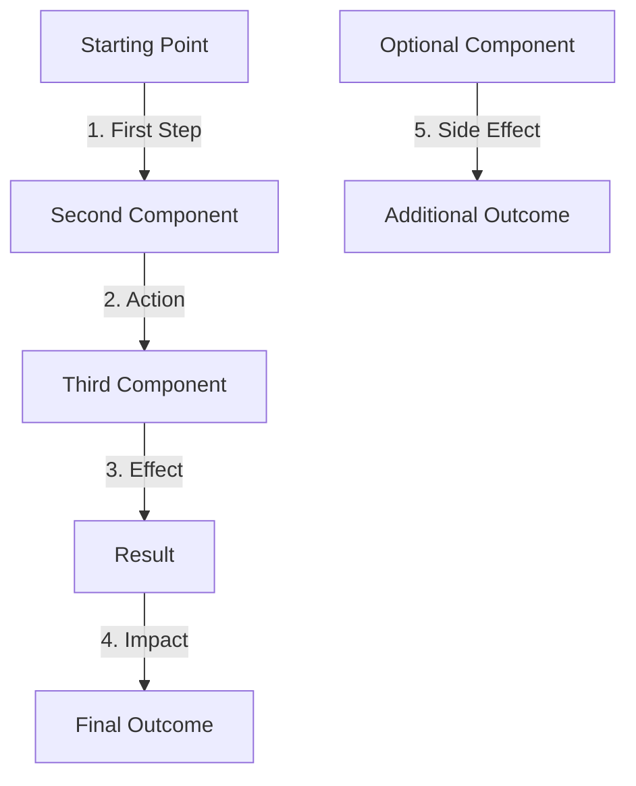

# Post Title: Descriptive Subtitle

**Wut**

Brief description of the exploit technique. This should explain what the technique does and its impact in 2-3 sentences. Make it technical but accessible.



**Why**

Because eBPF + misconfiguration => broken isolation. Expand on why this technique is significant, what security controls it bypasses, and why it matters in real-world environments.

**POC**

_Coming soon._

The proof of concept will demonstrate:
- Key capability #1
- Key capability #2
- Key capability #3
- Key capability #4
- Key capability #5

**Attacker hat on**

1. Step 1 of the attack process
2. Step 2 of the attack process
3. Step 3 of the attack process
4. Step 4 of the attack process
5. Step 5 of the attack process
6. Step 6 of the attack process
7. Step 7 of the attack process

**Defender hat on**

1. Defense measure #1
2. Defense measure #2
3. Defense measure #3
4. Defense measure #4
5. Defense measure #5
6. Defense measure #6

**Conclusion**

`eBPF is all you need`. Summarize the key takeaways about this technique, its implications for security, and why proper eBPF controls are essential.

## Technical Details

### Component Architecture

Describe the relevant Linux kernel components or subsystems that are being exploited:
- **Component 1**: Description of how it works
- **Component 2**: Description of how it works
- **Component 3**: Description of how it works
- **Component 4**: Description of how it works

Explain how these components normally function and interact with each other.

### Exploitation Technique

The exploit leverages eBPF's ability to attach to kernel functions that implement specific functionality. By intercepting these calls, an attacker can:

1. **Capability 1**: Technical description of what this allows
2. **Capability 2**: Technical description of what this allows
3. **Capability 3**: Technical description of what this allows
4. **Capability 4**: Technical description of what this allows

### Code Snippet

```c
// Simplified eBPF program to demonstrate the technique
SEC("kprobe/target_function")
int BPF_KPROBE(hook_function, struct relevant_struct *param1,
               type param2, type param3)
{
    // Get process information
    u32 pid = bpf_get_current_pid_tgid() >> 32;
    
    // Check if this is our target process
    if (is_target_process(pid)) {
        // Perform malicious action
        // This is where the core of the exploit happens
        
        // Example: modify parameters, return values, or internal state
        bpf_probe_write_user(&param1->field, new_value, sizeof(type));
        
        // Example: store information for later use
        u32 key = 0;
        bpf_map_update_elem(&exploit_map, &key, &some_value, BPF_ANY);
    }
    
    return 0;
}

// Additional hook function if needed
SEC("kprobe/another_function")
int BPF_KPROBE(hook_another, struct another_struct *param)
{
    // Additional exploit logic
    
    return 0;
}
```

### Detection Methods

Defenders should monitor for:
- Specific indicator #1
- Specific indicator #2
- Specific indicator #3
- Specific indicator #4
- Specific indicator #5

This technique demonstrates why proper eBPF restrictions are critical for maintaining security, especially in environments where [specific security control] is important.

### Real-world Impact

In practical environments, this technique could allow an attacker to:
- Impact #1
- Impact #2
- Impact #3
- Impact #4
- Impact #5

The ability to [key capability] creates a particularly concerning scenario for [specific type of environment or organization].